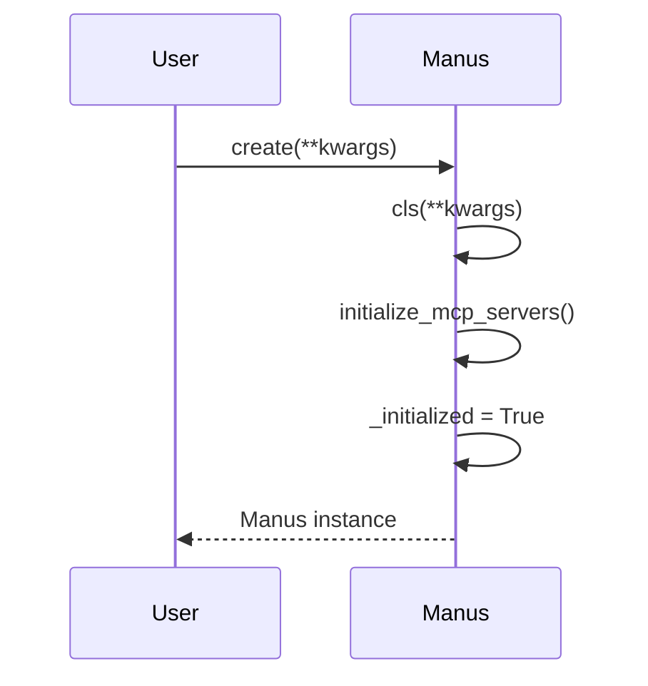
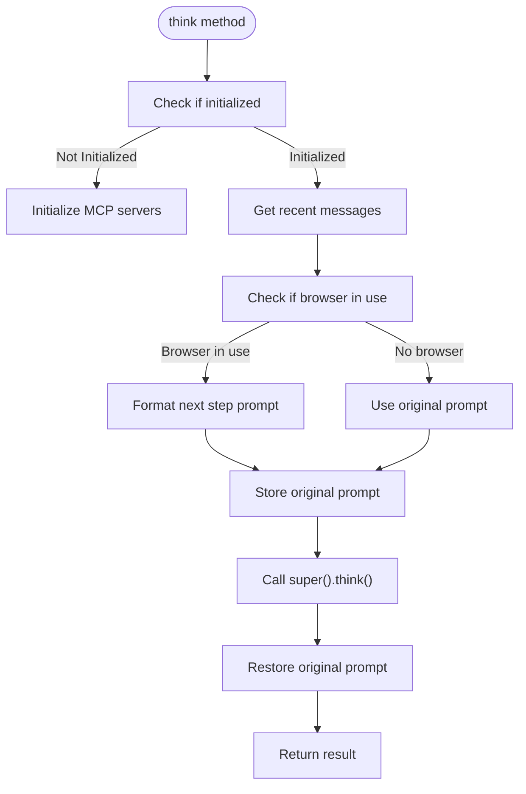
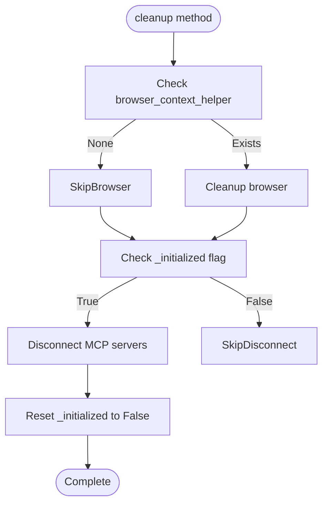
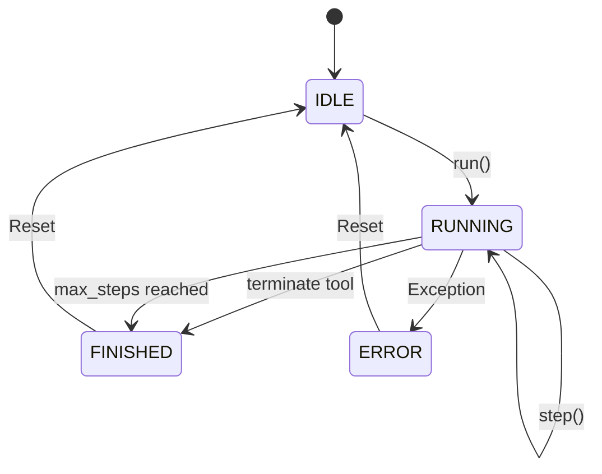
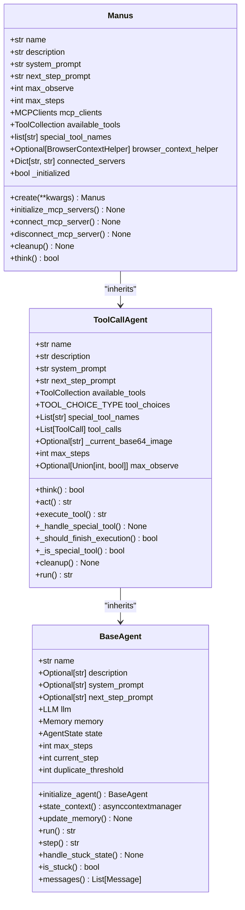
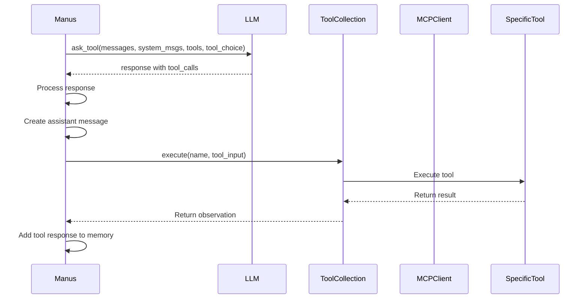
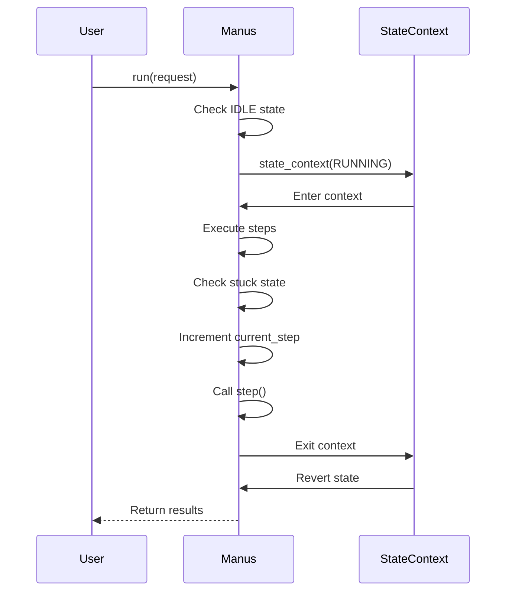
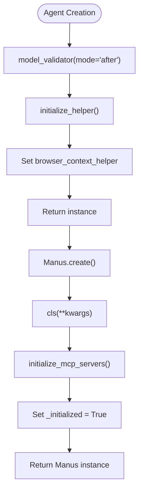

# Agent API

<cite>
**Referenced Files in This Document**   
- [manus.py](file://app/agent/manus.py)
- [toolcall.py](file://app/agent/toolcall.py)
- [base.py](file://app/agent/base.py)
- [prompt/manus.py](file://app/prompt/manus.py)
- [protocol/a2a/app/agent.py](file://protocol/a2a/app/agent.py)
</cite>

## Table of Contents
1. [Introduction](#introduction)
2. [Core Properties](#core-properties)
3. [Key Methods](#key-methods)
4. [Agent Lifecycle and State Management](#agent-lifecycle-and-state-management)
5. [Memory and Context Management](#memory-and-context-management)
6. [Integration with LLM and Tools](#integration-with-llm-and-tools)
7. [Usage Examples](#usage-examples)
8. [Asynchronous Patterns and Thread Safety](#asynchronous-patterns-and-thread-safety)
9. [Configuration and Initialization](#configuration-and-initialization)

## Introduction
The Agent API in OpenManus provides a robust framework for creating intelligent agents capable of executing complex tasks through tool integration and LLM orchestration. The Manus class serves as the primary agent implementation, extending the ToolCallAgent base class to provide enhanced functionality for general-purpose task solving. This documentation details the public interface of the Manus agent, including its properties, methods, lifecycle management, and integration points with external systems.

**Section sources**
- [manus.py](file://app/agent/manus.py#L17-L164)
- [toolcall.py](file://app/agent/toolcall.py#L17-L249)

## Core Properties
The Manus agent exposes several key properties that define its behavior and capabilities:

- **name**: A string identifier for the agent, set to "Manus" by default.
- **description**: A descriptive string explaining the agent's purpose and capabilities.
- **system_prompt**: The system-level instruction prompt used to guide the agent's behavior, dynamically formatted with the workspace root directory.
- **next_step_prompt**: The prompt used to determine the agent's next action during execution.
- **max_observe**: The maximum length of observation output to process, set to 10,000 characters.
- **max_steps**: The maximum number of execution steps before termination, set to 20.
- **available_tools**: A ToolCollection containing the agent's available tools, including PythonExecute, BrowserUseTool, StrReplaceEditor, AskHuman, and Terminate.
- **special_tool_names**: A list of tool names that trigger special handling, with Terminate being the default special tool.
- **mcp_clients**: An MCPClients instance for managing connections to MCP (Model Context Protocol) servers.
- **connected_servers**: A dictionary tracking connected MCP servers by server_id to URL/command.
- **browser_context_helper**: An optional BrowserContextHelper for managing browser interactions.

These properties are defined as Pydantic fields with appropriate default factories and type annotations, ensuring proper initialization and type safety.

**Section sources**
- [manus.py](file://app/agent/manus.py#L20-L50)
- [prompt/manus.py](file://app/prompt/manus.py#L1-L10)

## Key Methods
The Manus agent implements several key methods that define its behavior and interaction patterns.

### create()
The `create()` class method serves as a factory method for creating and properly initializing a Manus instance. It handles asynchronous initialization of MCP servers and sets the agent's initialized state.



**Diagram sources**
- [manus.py](file://app/agent/manus.py#L59-L64)

### think()
The `think()` method processes the current state and decides on next actions with appropriate context. It handles browser context detection and prompt management during execution.



**Diagram sources**
- [manus.py](file://app/agent/manus.py#L139-L164)
- [toolcall.py](file://app/agent/toolcall.py#L38-L128)

### step()
The `step()` method is an abstract method defined in the BaseAgent class that must be implemented by subclasses. It executes a single step in the agent's workflow and is called by the run() method in sequence.

**Section sources**
- [base.py](file://app/agent/base.py#L156-L160)

### cleanup()
The `cleanup()` method handles resource cleanup for the Manus agent, including browser cleanup and disconnection from MCP servers.



**Diagram sources**
- [manus.py](file://app/agent/manus.py#L130-L137)
- [toolcall.py](file://app/agent/toolcall.py#L228-L242)

## Agent Lifecycle and State Management
The Manus agent follows a well-defined lifecycle managed through state transitions and context management. The agent inherits state management capabilities from the BaseAgent class, which uses an async context manager for safe state transitions.

The agent state transitions follow this pattern:
- **IDLE**: Initial state before execution
- **RUNNING**: Active execution state
- **FINISHED**: Completed execution
- **ERROR**: Error state when exceptions occur

The state context manager ensures that state transitions are handled safely, automatically reverting to the previous state after execution or in case of errors. The agent's run() method orchestrates the execution loop, managing steps and checking for stuck states.



**Diagram sources**
- [base.py](file://app/agent/base.py#L58-L81)
- [base.py](file://app/agent/base.py#L115-L153)

**Section sources**
- [base.py](file://app/agent/base.py#L34-L36)

## Memory and Context Management
The Manus agent manages conversation history and context through its memory component. The agent inherits memory management capabilities from the BaseAgent class, which provides methods for updating memory with messages of different roles (user, system, assistant, tool).

The agent's memory system tracks messages and handles special cases like browser context. When a browser tool is in use, the agent dynamically updates its next_step_prompt to provide appropriate context for web interactions. The memory system also detects stuck states by identifying duplicate assistant responses and triggers appropriate recovery strategies.



**Diagram sources**
- [manus.py](file://app/agent/manus.py#L17-L164)
- [toolcall.py](file://app/agent/toolcall.py#L17-L249)
- [base.py](file://app/agent/base.py#L12-L195)

**Section sources**
- [manus.py](file://app/agent/manus.py#L44-L44)
- [base.py](file://app/agent/base.py#L33-L33)

## Integration with LLM and Tools
The Manus agent integrates with LLM systems and various tools through a well-defined architecture. The agent uses the LLM's ask_tool method to generate responses with tool options, processing the results to determine appropriate actions.

The tool integration system supports both local tools and remote MCP-based tools. The agent maintains a ToolCollection that can be dynamically updated with tools from connected MCP servers. When connecting to an MCP server, the agent adds only the new tools from that server to its available tools collection.



**Diagram sources**
- [toolcall.py](file://app/agent/toolcall.py#L38-L128)
- [manus.py](file://app/agent/manus.py#L90-L111)

**Section sources**
- [manus.py](file://app/agent/manus.py#L30-L30)
- [toolcall.py](file://app/agent/toolcall.py#L26-L28)

## Usage Examples
The following examples demonstrate how to instantiate and interact with the Manus agent programmatically.

### Basic Agent Creation
```python
# Create a Manus agent instance
agent = await Manus.create()
```

### Custom Configuration
```python
# Create a Manus agent with custom parameters
agent = await Manus.create(
    name="CustomManus",
    description="Custom agent for specific tasks"
)
```

### A2A Protocol Integration
```python
# Using Manus with A2A protocol
a2a_agent = A2AManus()
response = await a2a_agent.invoke("Hello", "session-123")
```

These examples illustrate the primary invocation patterns for the Manus agent, showing both direct usage and integration with higher-level protocols.

**Section sources**
- [manus.py](file://app/agent/manus.py#L59-L64)
- [protocol/a2a/app/agent.py](file://protocol/a2a/app/agent.py#L14-L31)

## Asynchronous Patterns and Thread Safety
The Manus agent is designed with asynchronous patterns throughout its implementation. All key methods are implemented as coroutines using async/await syntax, enabling non-blocking execution and efficient resource utilization.

The agent's architecture ensures thread safety through several mechanisms:
- Async context managers for state transitions
- Proper initialization sequencing with the _initialized flag
- Synchronized access to shared resources like memory and tool collections
- Proper cleanup of resources in finally blocks

The agent's run() method uses an async context manager to ensure safe state transitions, automatically handling exceptions and reverting to the previous state when necessary.



**Diagram sources**
- [base.py](file://app/agent/base.py#L115-L153)
- [base.py](file://app/agent/base.py#L58-L81)

**Section sources**
- [manus.py](file://app/agent/manus.py#L50-L50)
- [base.py](file://app/agent/base.py#L40-L40)

## Configuration and Initialization
The Manus agent handles configuration and initialization through several mechanisms. The agent uses Pydantic's model_validator to initialize basic components synchronously during object creation.

The initialization process includes:
- Setting up the browser context helper
- Connecting to configured MCP servers
- Initializing tool collections
- Setting up system prompts with dynamic configuration

The create() factory method ensures proper asynchronous initialization of MCP servers before returning the agent instance. The agent also handles re-initialization if needed, checking the _initialized flag before attempting to initialize MCP servers.



**Diagram sources**
- [manus.py](file://app/agent/manus.py#L43-L64)
- [manus.py](file://app/agent/manus.py#L66-L88)

**Section sources**
- [manus.py](file://app/agent/manus.py#L47-L49)
- [manus.py](file://app/agent/manus.py#L50-L50)