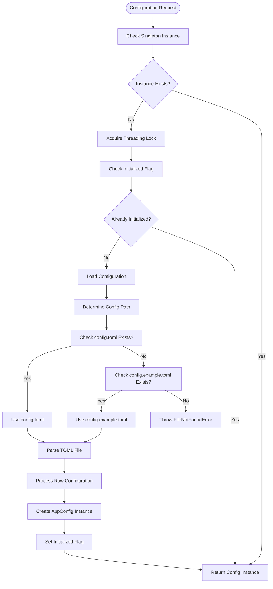
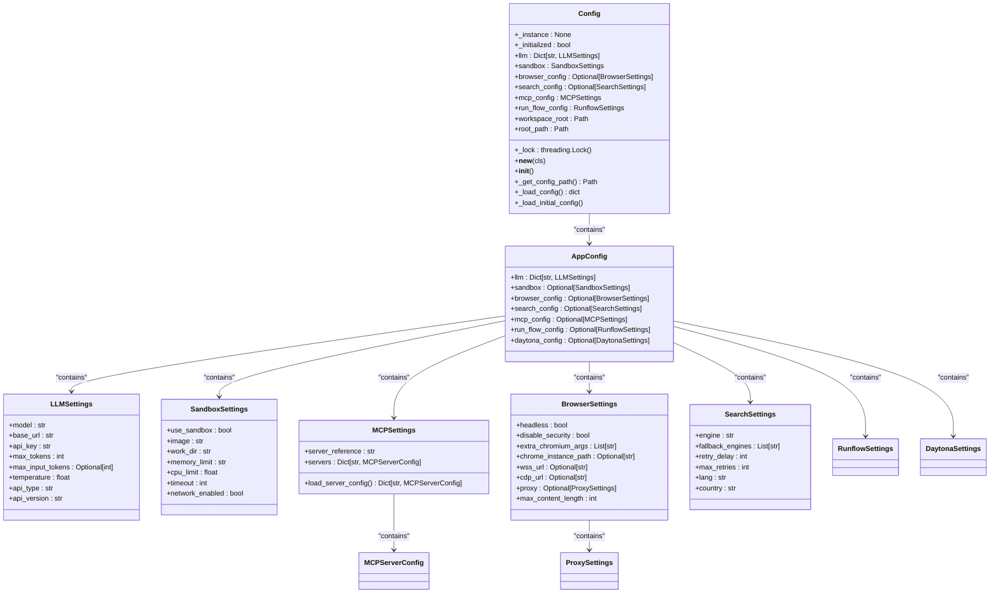
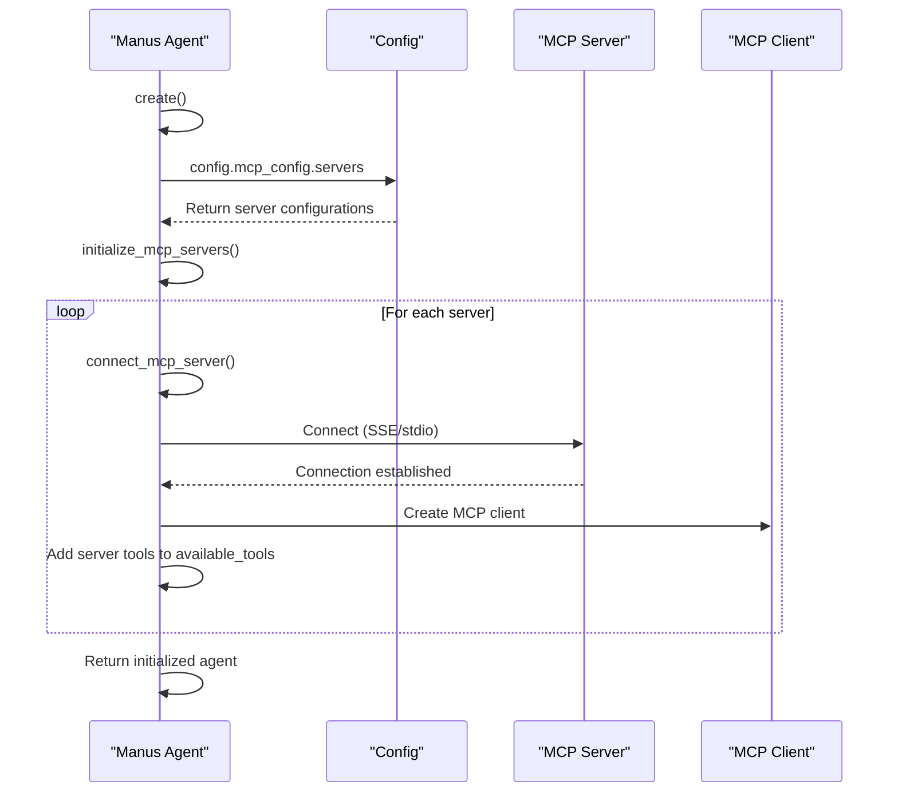

# Configuration API

<cite>
**Referenced Files in This Document**   
- [config.py](file://app/config.py)
- [config.example.toml](file://config/config.example.toml)
- [mcp.example.json](file://config/mcp.example.json)
- [config.example-model-azure.toml](file://config/config.example-model-azure.toml)
- [llm.py](file://app/llm.py)
- [manus.py](file://app/agent/manus.py)
</cite>

## Table of Contents
1. [Introduction](#introduction)
2. [Configuration Loading and Initialization](#configuration-loading-and-initialization)
3. [Config Class Architecture](#config-class-architecture)
4. [LLM Configuration](#llm-configuration)
5. [Sandbox Configuration](#sandbox-configuration)
6. [MCP Server Configuration](#mcp-server-configuration)
7. [Browser and Search Configuration](#browser-and-search-configuration)
8. [Programmatic Access and Consumption](#programmatic-access-and-consumption)
9. [Validation and Error Handling](#validation-and-error-handling)
10. [Configuration Merging and Overrides](#configuration-merging-and-overrides)

## Introduction

The Configuration API in OpenManus provides a centralized, type-safe mechanism for managing application settings through TOML configuration files and Pydantic models. The system implements a global singleton pattern through the `Config` class, ensuring consistent access to configuration data across all components. Configuration settings are loaded from TOML files, validated using Pydantic models, and made available through a clean property-based interface. The API supports multiple configuration sections including LLM providers, sandbox environments, MCP servers, and various tool configurations, with support for environment variable overrides and hierarchical configuration merging.

**Section sources**
- [config.py](file://app/config.py#L1-L372)

## Configuration Loading and Initialization

The configuration system follows a specific loading sequence to ensure settings are available when needed. The `Config` class implements a thread-safe singleton pattern using the `__new__` method and a threading lock to prevent race conditions during initialization. When the configuration is first accessed, the system searches for configuration files in a specific order: first looking for `config.toml` in the config directory, and if not found, falling back to `config.example.toml`. This allows developers to maintain private configuration files while providing example configurations in version control.



**Diagram sources**
- [config.py](file://app/config.py#L201-L214)
- [config.py](file://app/config.py#L217-L225)

**Section sources**
- [config.py](file://app/config.py#L201-L225)

## Config Class Architecture

The `Config` class serves as the central configuration manager, implementing a singleton pattern to ensure a single instance throughout the application lifecycle. The architecture consists of multiple Pydantic models that define the structure and validation rules for different configuration sections. The `AppConfig` model acts as the root configuration container, aggregating settings from various subsystems. Each configuration section has its own dedicated Pydantic model (e.g., `LLMSettings`, `SandboxSettings`) that defines the expected fields, default values, and validation constraints.



**Diagram sources**
- [config.py](file://app/config.py#L196-L368)
- [config.py](file://app/config.py#L18-L29)
- [config.py](file://app/config.py#L93-L104)
- [config.py](file://app/config.py#L137-L170)

**Section sources**
- [config.py](file://app/config.py#L196-L368)

## LLM Configuration

The LLM configuration system provides a flexible way to define settings for different language models and providers. The `LLMSettings` Pydantic model defines the required fields for LLM configuration, including model name, API endpoint, authentication key, and various operational parameters. The configuration supports both global defaults and model-specific overrides, allowing different parts of the application to use different LLM configurations. The system includes examples for various providers including Anthropic, Azure OpenAI, Google, Ollama, and AWS Bedrock, demonstrating the flexibility of the configuration schema.

```toml
# Global LLM configuration
[llm]
model = "claude-3-7-sonnet-20250219"
base_url = "https://api.anthropic.com/v1/"
api_key = "YOUR_API_KEY"
max_tokens = 8192
temperature = 0.0

# [llm] #AZURE OPENAI:
# api_type= 'azure'
# model = "gpt-4o-mini"
# base_url = "{YOUR_AZURE_ENDPOINT.rstrip('/')}/openai/deployments/{AZURE_DEPLOYMENT_ID}"
# api_key = "AZURE API KEY"
# max_tokens = 8096
# temperature = 0.0
# api_version="AZURE API VERSION"

# Optional configuration for specific LLM models
[llm.vision]
model = "claude-3-7-sonnet-20250219"
base_url = "https://api.anthropic.com/v1/"
api_key = "YOUR_API_KEY"
max_tokens = 8192
temperature = 0.0
```

The configuration also supports specialized models for specific capabilities, such as vision models defined under the `[llm.vision]` section. This allows the application to use different models for different types of tasks while maintaining a consistent configuration interface.

**Section sources**
- [config.example.toml](file://config/config.example.toml#L1-L60)
- [config.example-model-azure.toml](file://config/config.example-model-azure.toml#L1-L18)
- [config.py](file://app/config.py#L18-L29)

## Sandbox Configuration

The sandbox configuration enables secure execution of code in isolated environments. The `SandboxSettings` model defines parameters for containerized execution, including the base Docker image, resource limits, and network access controls. By default, the sandbox is disabled (`use_sandbox = false`), but can be enabled by setting this flag to true. The configuration allows fine-grained control over execution resources, including CPU and memory limits, command timeouts, and working directory settings.

```toml
## Sandbox configuration
#[sandbox]
#use_sandbox = false
#image = "python:3.12-slim"
#work_dir = "/workspace"
#memory_limit = "1g"
#cpu_limit = 2.0
#timeout = 300
#network_enabled = true
```

The sandbox settings are used by the application's sandbox components to create isolated execution environments for potentially unsafe code. The configuration supports both local Docker-based sandboxes and remote Daytona sandboxes, with separate configuration sections for each type of environment.

**Section sources**
- [config.example.toml](file://config/config.example.toml#L95-L102)
- [config.py](file://app/config.py#L93-L104)

## MCP Server Configuration

The MCP (Model Context Protocol) server configuration allows the application to connect to external tools and services through standardized interfaces. The configuration is split between TOML and JSON formats, with the main MCP settings in TOML and server-specific configurations in JSON. The `MCPSettings` model defines the module reference for the MCP server and contains a dictionary of server configurations. Server configurations are loaded from a separate `mcp.json` file, allowing dynamic addition of servers without modifying the main configuration.

```toml
# MCP (Model Context Protocol) configuration
[mcp]
server_reference = "app.mcp.server"
```

```json
{
    "mcpServers": {
      "server1": {
        "type": "sse",
        "url": "http://localhost:8000/sse"
      }
    }
}
```

The system supports two connection types: SSE (Server-Sent Events) for HTTP-based connections and stdio for local process communication. This flexibility allows integration with both remote services and local tools. The configuration is consumed by agents like the Manus agent, which automatically connects to configured MCP servers during initialization.



**Diagram sources**
- [config.example.toml](file://config/config.example.toml#L104-L105)
- [mcp.example.json](file://config/mcp.example.json#L1-L8)
- [config.py](file://app/config.py#L137-L170)
- [manus.py](file://app/agent/manus.py#L50-L70)

**Section sources**
- [config.example.toml](file://config/config.example.toml#L104-L105)
- [mcp.example.json](file://config/mcp.example.json#L1-L8)
- [config.py](file://app/config.py#L137-L170)
- [manus.py](file://app/agent/manus.py#L50-L70)

## Browser and Search Configuration

The configuration system includes specialized settings for browser automation and search functionality. The `BrowserSettings` model defines options for controlling browser behavior, including headless mode, security settings, and connection parameters for existing browser instances. Proxy settings can be configured to route browser traffic through intermediate servers. The `SearchSettings` model configures the search functionality, allowing selection of primary and fallback search engines, retry behavior, and regional settings.

```toml
# Optional configuration, Search settings.
# [search]
# engine = "Google"
# fallback_engines = ["DuckDuckGo", "Baidu", "Bing"]
# retry_delay = 60
# max_retries = 3
# lang = "en"
# country = "us"
```

These settings are used by the application's browser and search tools to customize their behavior according to the deployment environment and user preferences. The configuration supports both direct browser control and connection to existing browser instances through WebSocket or CDP URLs.

**Section sources**
- [config.example.toml](file://config/config.example.toml#L76-L94)
- [config.py](file://app/config.py#L61-L75)
- [config.py](file://app/config.py#L43-L59)

## Programmatic Access and Consumption

Configuration values are accessed programmatically through the global `config` instance, which provides property-based access to all configuration sections. Components import the `config` object and access settings through its properties, ensuring type safety and IDE support. The configuration is consumed throughout the application, from the LLM client initialization to agent behavior and tool availability.

```python
from app.config import config

# Access LLM settings
llm_settings = config.llm["default"]
model_name = llm_settings.model

# Access sandbox settings
sandbox_enabled = config.sandbox.use_sandbox

# Access MCP server configurations
for server_id, server_config in config.mcp_config.servers.items():
    print(f"Server {server_id}: {server_config.url}")
```

The LLM class demonstrates configuration consumption by using the `config` object to initialize its client with the appropriate settings based on the configured LLM provider. This pattern ensures that all components use consistent configuration values and can respond to configuration changes.

**Section sources**
- [llm.py](file://app/llm.py#L100-L120)
- [manus.py](file://app/agent/manus.py#L50-L70)
- [config.py](file://app/config.py#L331-L353)

## Validation and Error Handling

The configuration system implements robust validation through Pydantic models, which automatically validate field types, required fields, and custom validation rules. When a configuration file is loaded, the raw TOML data is validated against the Pydantic models, ensuring that all settings conform to the expected structure and constraints. Invalid configurations raise descriptive errors that help users identify and fix issues.

The system handles various error conditions gracefully, including missing configuration files, invalid TOML syntax, and missing required fields. When the primary configuration file is not found, the system falls back to the example configuration. If neither file exists, a `FileNotFoundError` is raised with a descriptive message. MCP server configuration loading includes error handling to return an empty configuration when the `mcp.json` file is not found, allowing the application to continue with only the core configuration.

```python
@classmethod
def load_server_config(cls) -> Dict[str, MCPServerConfig]:
    """Load MCP server configuration from JSON file"""
    config_path = PROJECT_ROOT / "config" / "mcp.json"
    
    try:
        config_file = config_path if config_path.exists() else None
        if not config_file:
            return {}
            
        with config_file.open() as f:
            data = json.load(f)
            servers = {}
            
            for server_id, server_config in data.get("mcpServers", {}).items():
                servers[server_id] = MCPServerConfig(
                    type=server_config["type"],
                    url=server_config.get("url"),
                    command=server_config.get("command"),
                    args=server_config.get("args", []),
                )
            return servers
    except Exception as e:
        raise ValueError(f"Failed to load MCP server config: {e}")
```

**Section sources**
- [config.py](file://app/config.py#L148-L170)
- [config.py](file://app/config.py#L217-L225)

## Configuration Merging and Overrides

The configuration system implements a sophisticated merging strategy that combines default values, global settings, and model-specific overrides. When loading LLM configuration, the system first extracts base settings from the global `[llm]` section, then applies model-specific overrides from sections like `[llm.vision]`. This allows shared settings (like API keys) to be defined once while enabling specialization for different models.

The merging process follows these steps:
1. Extract base LLM settings from the global `[llm]` section
2. Identify model-specific overrides (sections with dot notation like `llm.vision`)
3. Create a default settings dictionary with values from the base configuration
4. For each override section, create a new settings object that inherits from the defaults but applies the override values
5. Store all configurations in a dictionary accessible by name

This approach enables flexible configuration patterns where most settings are shared across models, but specific models can have customized parameters. The system also supports environment variables for sensitive data like API keys, though this functionality is not explicitly shown in the provided code.

**Section sources**
- [config.py](file://app/config.py#L232-L328)
- [config.example.toml](file://config/config.example.toml#L1-L60)