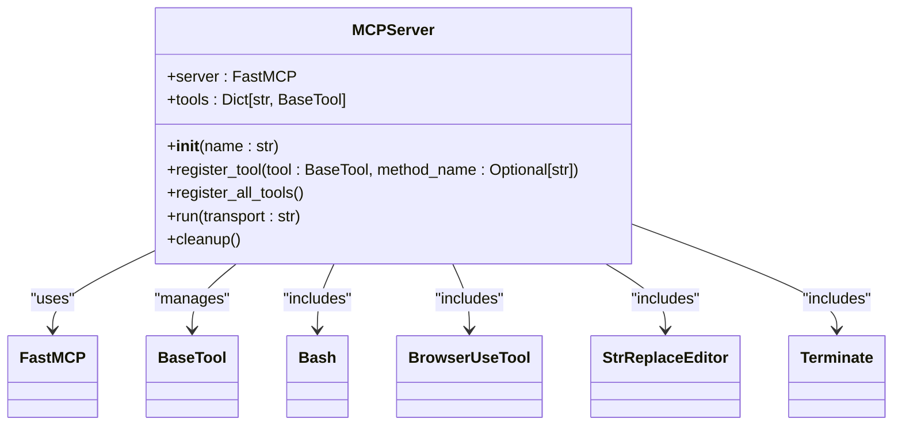
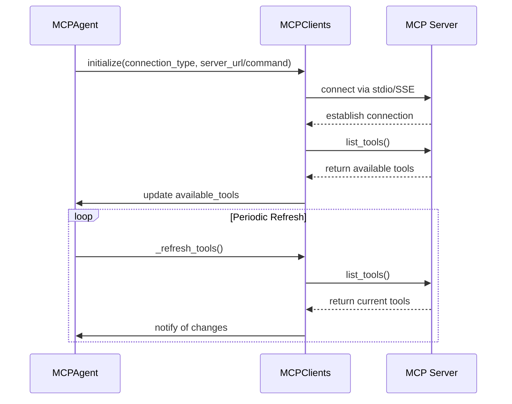
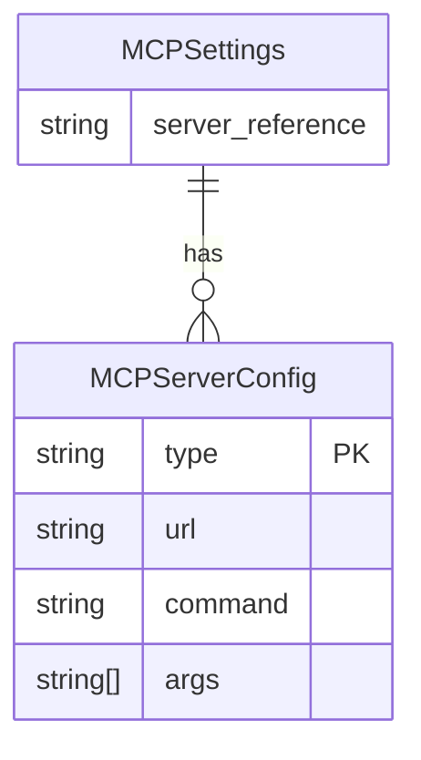
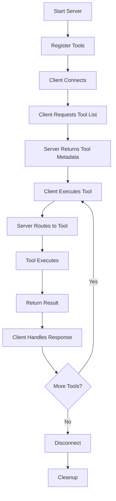
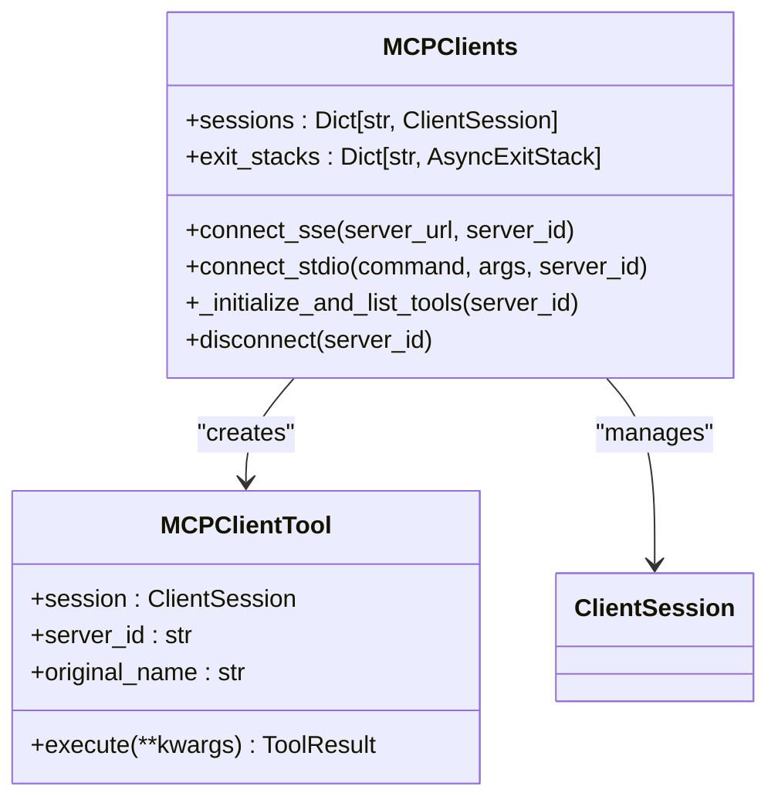
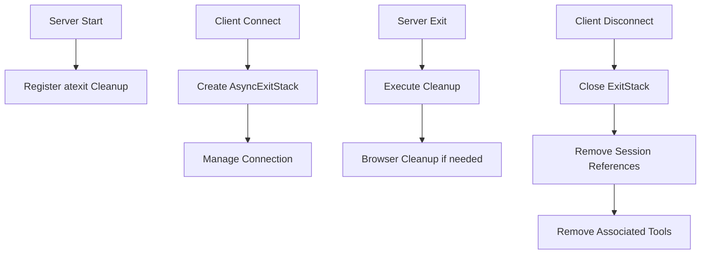

# MCP API

<cite>
**Referenced Files in This Document**   
- [server.py](file://app/mcp/server.py)
- [mcp.py](file://app/tool/mcp.py)
- [mcp.py](file://app/agent/mcp.py)
- [config.py](file://app/config.py)
- [mcp.example.json](file://config/mcp.example.json)
- [run_mcp_server.py](file://run_mcp_server.py)
</cite>

## Table of Contents
1. [Introduction](#introduction)
2. [Server Implementation](#server-implementation)
3. [Client Integration](#client-integration)
4. [Configuration](#configuration)
5. [Protocol Flow](#protocol-flow)
6. [Tool Management](#tool-management)
7. [Error Handling and Cleanup](#error-handling-and-cleanup)
8. [Examples](#examples)
9. [Security and Compatibility](#security-and-compatibility)

## Introduction
The Model Context Protocol (MCP) implementation in OpenManus provides a standardized interface for agents to interact with external tools through a server-client architecture. This documentation covers the MCP server endpoints, communication protocols, client integration patterns, and configuration options. The system supports both stdio and Server-Sent Events (SSE) transport methods for tool registration and execution.

The MCP architecture enables dynamic tool discovery, remote execution, and seamless integration between AI agents and various tool servers. The implementation follows a modular design where tools are registered with the server and made available to clients through standardized interfaces.

**Section sources**
- [server.py](file://app/mcp/server.py#L1-L20)
- [mcp.py](file://app/agent/mcp.py#L1-L20)

## Server Implementation
The MCP server is implemented in `server.py` as the `MCPServer` class, which manages tool registration and execution. The server uses the FastMCP framework to handle incoming requests and route them to appropriate tools. The server supports stdio transport for local communication between processes.

The server initialization creates instances of standard tools including bash, browser, editor, and terminate. These tools are automatically registered when the server starts. The server can be launched using the `run_mcp_server.py` script, which parses command-line arguments to determine the transport method.



**Diagram sources**
- [server.py](file://app/mcp/server.py#L23-L159)

**Section sources**
- [server.py](file://app/mcp/server.py#L23-L159)
- [run_mcp_server.py](file://run_mcp_server.py#L1-L10)

## Client Integration
The MCP client integration is handled through the `MCPAgent` class in `app/agent/mcp.py` and the `MCPClients` tool collection in `app/tool/mcp.py`. The client can connect to MCP servers using either stdio or SSE transport methods, allowing for both local process communication and remote server interaction.

The `MCPAgent` class extends `ToolCallAgent` and manages the connection lifecycle, tool discovery, and execution. It periodically refreshes the list of available tools from the server to detect changes in tool availability or schema. The agent automatically handles special tools like 'terminate' that can end the interaction.



**Diagram sources**
- [mcp.py](file://app/agent/mcp.py#L36-L67)
- [mcp.py](file://app/tool/mcp.py#L49-L94)

**Section sources**
- [mcp.py](file://app/agent/mcp.py#L36-L131)
- [mcp.py](file://app/tool/mcp.py#L36-L193)

## Configuration
MCP server configuration is managed through the `MCPSettings` class in `app/config.py` and JSON configuration files. The system supports multiple MCP servers with different connection types and parameters. The default configuration is loaded from `mcp.json` in the config directory, with an example provided in `mcp.example.json`.

The configuration supports both SSE and stdio connection types, with appropriate parameters for each. For SSE connections, the URL must be specified, while stdio connections require a command and optional arguments to launch the server process.



**Diagram sources**
- [config.py](file://app/config.py#L126-L159)
- [mcp.example.json](file://config/mcp.example.json#L1-L7)

**Section sources**
- [config.py](file://app/config.py#L126-L159)
- [mcp.example.json](file://config/mcp.example.json#L1-L7)

## Protocol Flow
The MCP protocol flow begins with server initialization and tool registration, followed by client connection and tool discovery. When a client connects, it establishes a communication channel and requests the list of available tools. The server responds with tool metadata including names, descriptions, and parameter schemas.

After initial discovery, the client can execute tools by sending function calls with parameters. The server routes these calls to the appropriate tool implementations and returns results. The client-side `MCPClientTool` acts as a proxy, forwarding calls to the server and handling the response.



**Diagram sources**
- [server.py](file://app/mcp/server.py#L36-L75)
- [mcp.py](file://app/tool/mcp.py#L20-L33)

**Section sources**
- [server.py](file://app/mcp/server.py#L36-L75)
- [mcp.py](file://app/tool/mcp.py#L20-L33)

## Tool Management
Tool management in the MCP system involves both server-side registration and client-side discovery. On the server side, tools are registered through the `register_tool` method, which creates an async wrapper function with proper metadata and parameter validation. The server automatically registers all standard tools when started.

On the client side, the `MCPClients` class manages connections to multiple servers and maintains a mapping of available tools. When connecting to a server, it retrieves the tool list and creates `MCPClientTool` instances for each available tool. Tool names are sanitized to ensure compatibility and avoid conflicts when multiple servers are connected.



**Diagram sources**
- [mcp.py](file://app/tool/mcp.py#L13-L33)
- [mcp.py](file://app/tool/mcp.py#L36-L193)

**Section sources**
- [mcp.py](file://app/tool/mcp.py#L13-L33)
- [mcp.py](file://app/tool/mcp.py#L36-L193)

## Error Handling and Cleanup
The MCP implementation includes comprehensive error handling and resource cleanup mechanisms. The server registers a cleanup function using `atexit` that ensures proper resource deallocation when the process terminates. Currently, cleanup is specifically implemented for the browser tool, which may have external resources like browser instances.

On the client side, the `MCPClients` class uses `AsyncExitStack` to manage connection lifecycles and ensure proper cleanup of resources when disconnecting from servers. The disconnect method handles both single-server and global disconnection, removing associated tools and cleaning up session references.



**Diagram sources**
- [server.py](file://app/mcp/server.py#L137-L142)
- [mcp.py](file://app/tool/mcp.py#L154-L193)

**Section sources**
- [server.py](file://app/mcp/server.py#L137-L142)
- [mcp.py](file://app/tool/mcp.py#L154-L193)

## Examples
### Server Setup
To start an MCP server with stdio transport:
```bash
python run_mcp_server.py --transport stdio
```

The server can also be instantiated programmatically:
```python
server = MCPServer()
server.run(transport="stdio")
```

### Client Consumption
To connect to an MCP server from a client:
```python
agent = MCPAgent()
await agent.initialize(
    connection_type="stdio",
    command=sys.executable,
    args=["-m", "app.mcp.server"]
)
```

For SSE connections:
```python
agent = MCPAgent()
await agent.initialize(
    connection_type="sse",
    server_url="http://localhost:8000/sse"
)
```

**Section sources**
- [run_mcp_server.py](file://run_mcp_server.py#L1-L10)
- [mcp.py](file://app/agent/mcp.py#L36-L67)

## Security and Compatibility
The MCP implementation in OpenManus prioritizes compatibility between clients and servers through standardized JSON schemas for tool definitions and function calling payloads. The system supports version compatibility by using the FastMCP framework, which handles protocol details and ensures consistent communication patterns.

Security considerations include proper resource cleanup to prevent resource leaks, especially for tools that manage external resources like browser instances. The stdio transport method provides secure local communication, while SSE connections should be protected with appropriate authentication and encryption when used over networks.

The system includes error recovery mechanisms such as automatic reconnection attempts and periodic tool discovery to handle server restarts or temporary unavailability. The client-side tool refresh mechanism ensures that agents are aware of changes in tool availability or schema modifications.

**Section sources**
- [server.py](file://app/mcp/server.py#L1-L180)
- [mcp.py](file://app/tool/mcp.py#L1-L194)
- [mcp.py](file://app/agent/mcp.py#L1-L185)