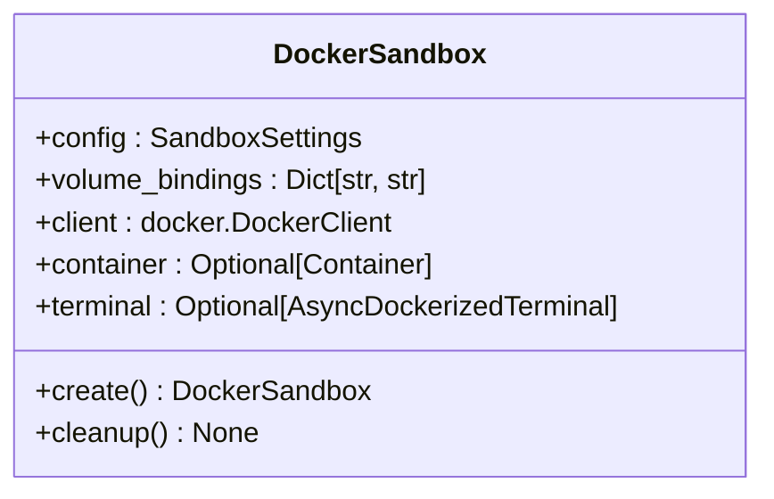
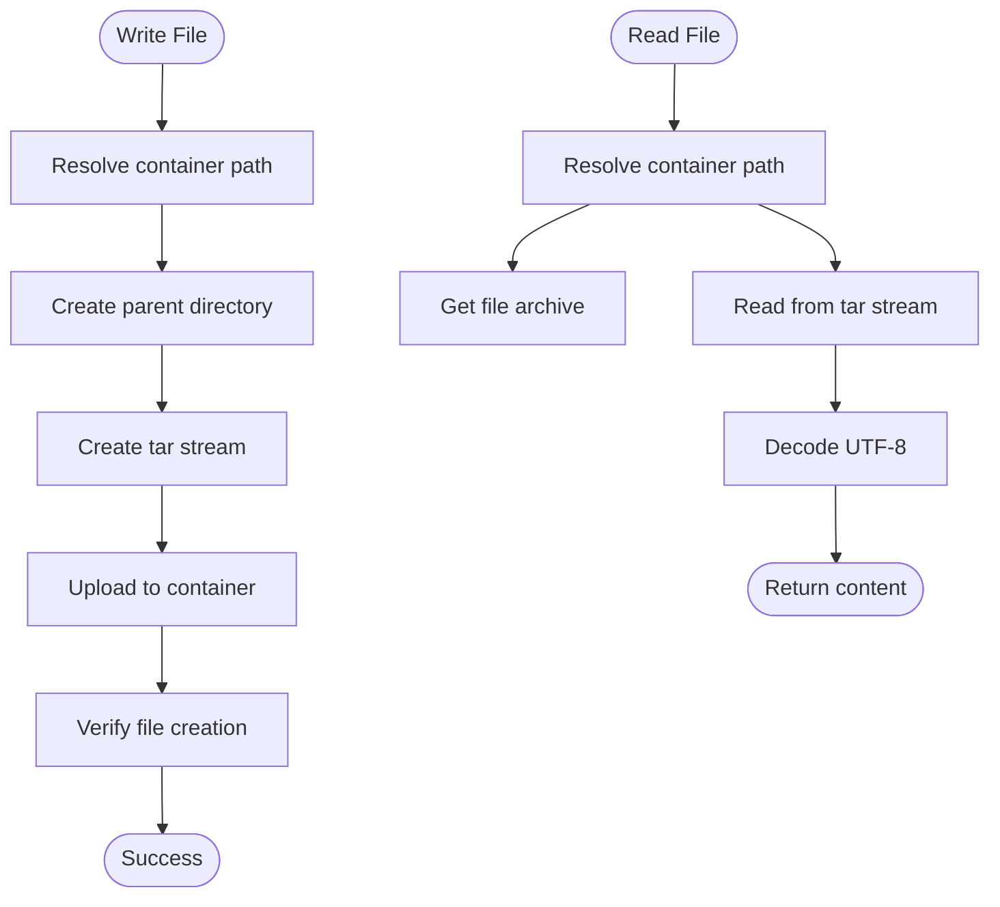
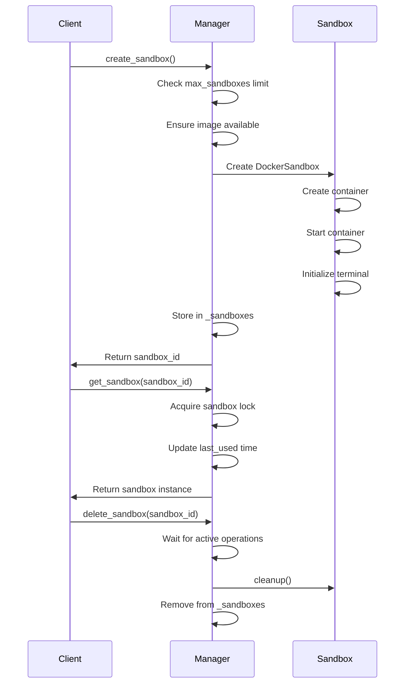
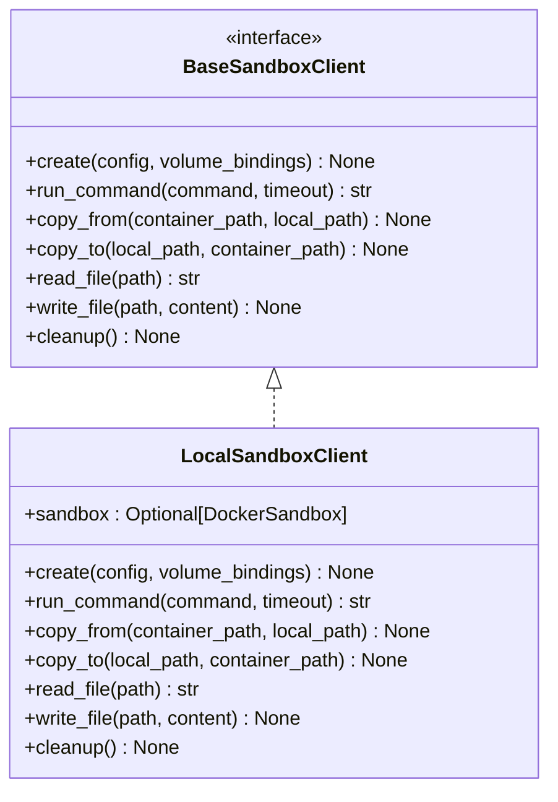
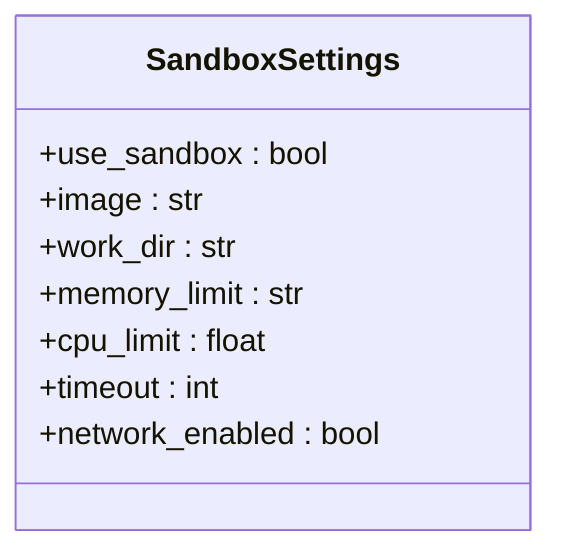
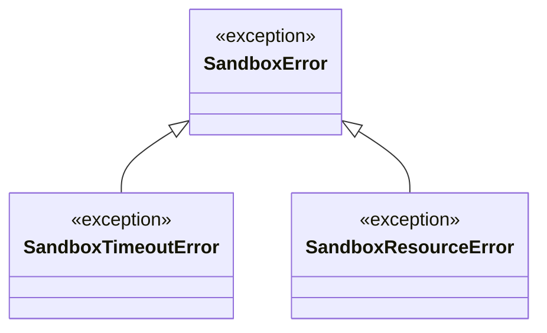

# Sandbox API

<cite>
**Referenced Files in This Document**   
- [sandbox.py](file://app/sandbox/core/sandbox.py)
- [manager.py](file://app/sandbox/core/manager.py)
- [client.py](file://app/sandbox/client.py)
- [config.py](file://app/config.py)
</cite>

## Table of Contents
1. [Introduction](#introduction)
2. [Sandbox Class Interface](#sandbox-class-interface)
3. [SandboxManager Class](#sandboxmanager-class)
4. [SandboxClient Interface](#sandboxclient-interface)
5. [Container Configuration](#container-configuration)
6. [Usage Examples](#usage-examples)
7. [Error Handling and Recovery](#error-handling-and-recovery)

## Introduction
The Sandbox API in OpenManus provides a secure, isolated environment for executing code and managing containerized workloads. This API enables safe execution of untrusted code through Docker containerization with configurable resource limits and network policies. The system consists of three main components: the DockerSandbox class for individual container management, the SandboxManager for coordinating multiple containers, and the SandboxClient for simplified interaction with the sandbox environment. This documentation details the interface, configuration options, and usage patterns for these components.

**Section sources**
- [sandbox.py](file://app/sandbox/core/sandbox.py#L17-L461)
- [manager.py](file://app/sandbox/core/manager.py#L13-L312)
- [client.py](file://app/sandbox/client.py#L49-L188)

## Sandbox Class Interface
The DockerSandbox class provides a comprehensive interface for managing individual container lifecycle operations, command execution, and file manipulation within an isolated environment.

### Container Lifecycle Management
The DockerSandbox class supports full container lifecycle management through its creation and cleanup methods. The `create()` method initializes a new container based on the specified configuration, starting it with a persistent process that allows for command execution. The method returns the current sandbox instance, enabling method chaining. The `cleanup()` method terminates the container and removes it from the Docker host, ensuring proper resource cleanup. Both methods are implemented as async context managers, allowing for automatic resource management using async with statements.



**Diagram sources**
- [sandbox.py](file://app/sandbox/core/sandbox.py#L17-L461)

**Section sources**
- [sandbox.py](file://app/sandbox/core/sandbox.py#L48-L102)
- [sandbox.py](file://app/sandbox/core/sandbox.py#L424-L453)

### Command Execution
Command execution within the sandbox is handled through the `run_command()` method, which executes shell commands in the container environment. The method accepts a command string and an optional timeout parameter, with the default timeout taken from the sandbox configuration. Commands are executed through an interactive terminal session that ensures proper output handling and error reporting. The method returns the command output as a string, capturing both stdout and stderr. If a command exceeds the specified timeout, a SandboxTimeoutError is raised, providing clear indication of execution failure due to time constraints.

**Section sources**
- [sandbox.py](file://app/sandbox/core/sandbox.py#L139-L163)
- [terminal.py](file://app/sandbox/core/terminal.py#L315-L331)

### File Operations
The sandbox provides comprehensive file operations for transferring data between the host and container environments. The `write_file()` method creates or updates files within the container by writing the specified content to the given path, automatically creating parent directories as needed. The `read_file()` method reads the contents of a file from the container and returns it as a string. For larger file transfers, the `copy_to()` and `copy_from()` methods enable copying files between the host filesystem and the container. These methods handle the Docker archive format transparently, allowing for seamless file transfer while preventing path traversal attacks through the `_safe_resolve_path()` method.



**Diagram sources**
- [sandbox.py](file://app/sandbox/core/sandbox.py#L197-L229)
- [sandbox.py](file://app/sandbox/core/sandbox.py#L165-L195)
- [sandbox.py](file://app/sandbox/core/sandbox.py#L314-L374)
- [sandbox.py](file://app/sandbox/core/sandbox.py#L254-L312)

**Section sources**
- [sandbox.py](file://app/sandbox/core/sandbox.py#L197-L229)
- [sandbox.py](file://app/sandbox/core/sandbox.py#L165-L195)
- [sandbox.py](file://app/sandbox/core/sandbox.py#L314-L374)
- [sandbox.py](file://app/sandbox/core/sandbox.py#L254-L312)

## SandboxManager Class
The SandboxManager class provides centralized control for managing multiple DockerSandbox instances, handling resource allocation, concurrency, and automatic cleanup.

### Multi-Container Coordination
The SandboxManager maintains a registry of active sandbox instances, tracking them by unique identifiers. It enforces resource limits through the `max_sandboxes` parameter, preventing system overload by limiting the number of concurrent containers. The manager uses asyncio locks to ensure thread-safe operations on individual sandboxes, preventing race conditions during concurrent access. The `_sandboxes` dictionary stores active DockerSandbox instances, while the `_last_used` dictionary tracks the last access time for each sandbox, enabling idle timeout functionality.

**Section sources**
- [manager.py](file://app/sandbox/core/manager.py#L49-L50)
- [manager.py](file://app/sandbox/core/manager.py#L53-L55)

### Lifecycle Control
The manager provides methods for creating, retrieving, and deleting sandbox instances. The `create_sandbox()` method instantiates a new DockerSandbox with the specified configuration, ensuring the required Docker image is available before creation. The `get_sandbox()` method retrieves an existing sandbox instance, wrapping the access in a concurrency control context manager. The `delete_sandbox()` method safely removes a sandbox, waiting for active operations to complete before cleanup. The manager also implements automatic cleanup through the `_cleanup_idle_sandboxes()` method, which periodically removes sandboxes that have exceeded their idle timeout.



**Diagram sources**
- [manager.py](file://app/sandbox/core/manager.py#L113-L156)
- [manager.py](file://app/sandbox/core/manager.py#L158-L171)
- [manager.py](file://app/sandbox/core/manager.py#L277-L289)

**Section sources**
- [manager.py](file://app/sandbox/core/manager.py#L113-L156)
- [manager.py](file://app/sandbox/core/manager.py#L158-L171)
- [manager.py](file://app/sandbox/core/manager.py#L277-L289)

### Automatic Cleanup
The SandboxManager implements automatic resource cleanup through two mechanisms: idle timeout and graceful shutdown. The `start_cleanup_task()` method initiates a background task that periodically checks for idle sandboxes, removing those that have exceeded the `idle_timeout` period. During application shutdown, the `cleanup()` method performs comprehensive cleanup of all resources, canceling the cleanup task and concurrently removing all active sandboxes. The `_safe_delete_sandbox()` method ensures that deletion waits for active operations to complete, preventing resource conflicts during cleanup.

**Section sources**
- [manager.py](file://app/sandbox/core/manager.py#L173-L184)
- [manager.py](file://app/sandbox/core/manager.py#L186-L203)
- [manager.py](file://app/sandbox/core/manager.py#L205-L241)
- [manager.py](file://app/sandbox/core/manager.py#L243-L275)

## SandboxClient Interface
The SandboxClient provides a simplified interface for interacting with the sandbox environment, abstracting away the underlying Docker implementation details.

### Client-Server Interaction Model
The SandboxClient follows a client-server interaction model where the client handles the connection and configuration while delegating actual operations to the underlying sandbox implementation. The `LocalSandboxClient` class implements the `BaseSandboxClient` interface, providing concrete implementations for all required methods. The client maintains a reference to a DockerSandbox instance, creating it on demand when the `create()` method is called. All operations check for sandbox initialization, raising RuntimeError if the sandbox has not been created.



**Diagram sources**
- [client.py](file://app/sandbox/client.py#L49-L82)
- [client.py](file://app/sandbox/client.py#L85-L188)

**Section sources**
- [client.py](file://app/sandbox/client.py#L49-L82)
- [client.py](file://app/sandbox/client.py#L85-L188)

### Method Implementation
Each method in the SandboxClient delegates to the corresponding method on the DockerSandbox instance. The `run_command()` method executes commands in the sandbox, propagating any errors that occur during execution. The file operations (`copy_from`, `copy_to`, `read_file`, `write_file`) provide convenient wrappers around the sandbox's file manipulation capabilities. The `cleanup()` method ensures proper resource cleanup by calling the sandbox's cleanup method and nullifying the reference to prevent reuse.

**Section sources**
- [client.py](file://app/sandbox/client.py#L109-L124)
- [client.py](file://app/sandbox/client.py#L126-L138)
- [client.py](file://app/sandbox/client.py#L140-L152)
- [client.py](file://app/sandbox/client.py#L154-L168)
- [client.py](file://app/sandbox/client.py#L170-L182)
- [client.py](file://app/sandbox/client.py#L184-L188)

## Container Configuration
Container configuration is managed through the SandboxSettings class, which defines the parameters for sandbox creation and operation.

### Configuration Parameters
The SandboxSettings class, defined in config.py, specifies various container parameters including the base Docker image, working directory, memory and CPU limits, default command timeout, and network access permissions. The configuration uses Pydantic models for validation, ensuring that settings are properly typed and within acceptable ranges. Default values are provided for all parameters, allowing for minimal configuration while supporting customization for specific use cases.



**Diagram sources**
- [config.py](file://app/config.py#L93-L104)

**Section sources**
- [config.py](file://app/config.py#L93-L104)

### Resource Limitation
Resource limitations are enforced at the Docker level through container configuration. Memory limits are specified as strings (e.g., "512m" for 512 megabytes) and applied using Docker's memory constraint mechanism. CPU limits are implemented as a fraction of available CPU time, with 1.0 representing one full CPU core. These limits prevent any single sandbox from consuming excessive resources, ensuring fair allocation across multiple containers. Network access can be disabled by setting `network_enabled` to false, which configures the container to use the "none" network mode, preventing all external connectivity.

**Section sources**
- [sandbox.py](file://app/sandbox/core/sandbox.py#L67-L70)
- [config.py](file://app/config.py#L99-L100)
- [config.py](file://app/config.py#L102-L104)

## Usage Examples
The following examples demonstrate common usage patterns for the Sandbox API.

### Secure Code Execution
For secure code execution, create a sandbox with network access disabled and appropriate resource limits:

```python
config = SandboxSettings(
    image="python:3.12-slim",
    memory_limit="512m",
    cpu_limit=0.5,
    timeout=300,
    network_enabled=False
)
manager = SandboxManager()
sandbox_id = await manager.create_sandbox(config)
sandbox = await manager.get_sandbox(sandbox_id)
result = await sandbox.run_command("python3 -c 'print(\"Hello from sandbox!\")'")
await manager.delete_sandbox(sandbox_id)
```

**Section sources**
- [manager.py](file://app/sandbox/core/manager.py#L113-L156)
- [sandbox.py](file://app/sandbox/core/sandbox.py#L139-L163)

### File Transfer Workflow
For file transfer operations, use the copy_to and copy_from methods to exchange files between host and container:

```python
# Write local file and copy to container
local_file.write_text("Input data")
await client.copy_to(str(local_file), "/workspace/input.txt")

# Process file in container
await client.run_command("python3 process.py")

# Copy results back to host
await client.copy_from("/workspace/output.txt", str(output_file))
```

**Section sources**
- [sandbox.py](file://app/sandbox/core/sandbox.py#L314-L374)
- [sandbox.py](file://app/sandbox/core/sandbox.py#L254-L312)

### Resource Limitation Scenario
To enforce strict resource limitations, configure the sandbox with constrained memory and CPU:

```python
config = SandboxSettings(
    image="python:3.12-slim",
    memory_limit="256m",
    cpu_limit=0.25,
    timeout=60
)
client = LocalSandboxClient()
await client.create(config)
# Execute memory-intensive operation
try:
    result = await client.run_command("python3 memory_test.py", timeout=60)
except SandboxTimeoutError:
    print("Operation exceeded time limit")
finally:
    await client.cleanup()
```

**Section sources**
- [config.py](file://app/config.py#L93-L104)
- [sandbox.py](file://app/sandbox/core/sandbox.py#L139-L163)
- [exceptions.py](file://app/sandbox/core/exceptions.py#L11-L13)

## Error Handling and Recovery
The Sandbox API implements comprehensive error handling to ensure robust operation and graceful recovery from failures.

### Exception Hierarchy
The API defines a custom exception hierarchy under SandboxError, with specific subclasses for different error conditions. SandboxTimeoutError is raised when operations exceed their time limits, while SandboxResourceError indicates resource-related issues. These exceptions inherit from the base SandboxError class, allowing for both specific and general error handling. The API methods raise appropriate exceptions with descriptive messages, enabling callers to understand and respond to different failure modes.



**Diagram sources**
- [exceptions.py](file://app/sandbox/core/exceptions.py#L7-L17)

**Section sources**
- [exceptions.py](file://app/sandbox/core/exceptions.py#L7-L17)

### Recovery Mechanisms
The API includes several recovery mechanisms to handle transient failures and ensure system stability. The SandboxManager automatically cleans up idle sandboxes, preventing resource leaks from abandoned containers. The `_safe_delete_sandbox()` method waits for active operations to complete before removal, avoiding race conditions during cleanup. When creating sandboxes, the API attempts to pull missing Docker images automatically, recovering from missing image errors. The client-server interaction model includes initialization checks that prevent operations on uninitialized sandboxes, providing clear error messages for common usage mistakes.

**Section sources**
- [manager.py](file://app/sandbox/core/manager.py#L243-L275)
- [manager.py](file://app/sandbox/core/manager.py#L64-L85)
- [client.py](file://app/sandbox/client.py#L109-L124)