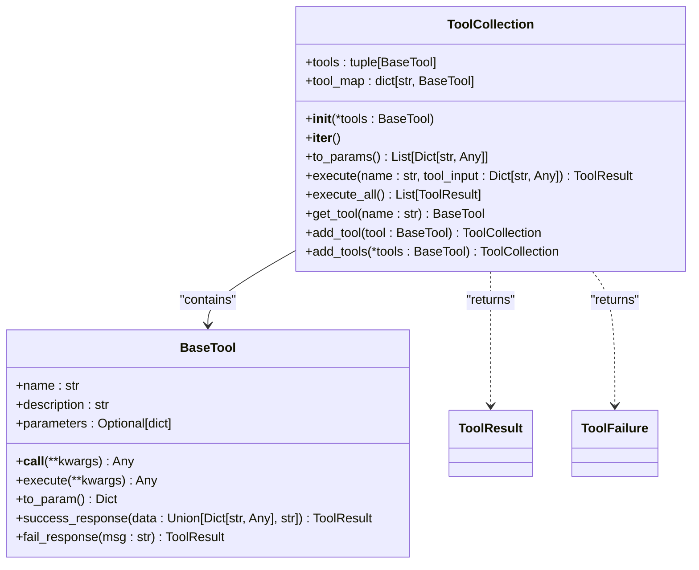
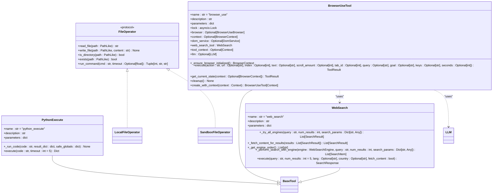
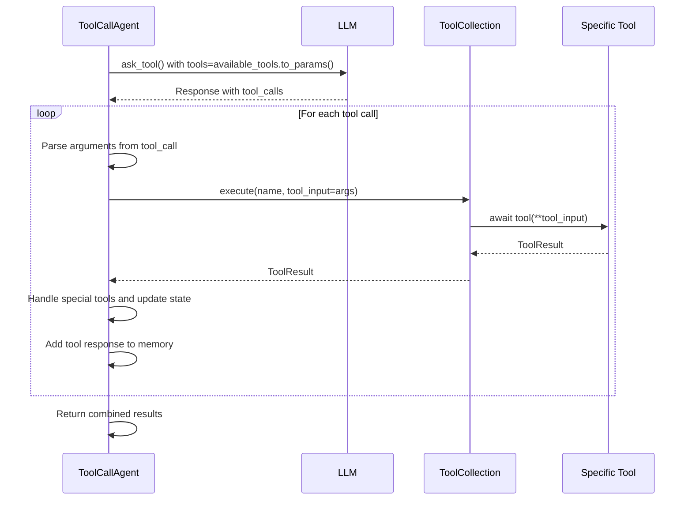
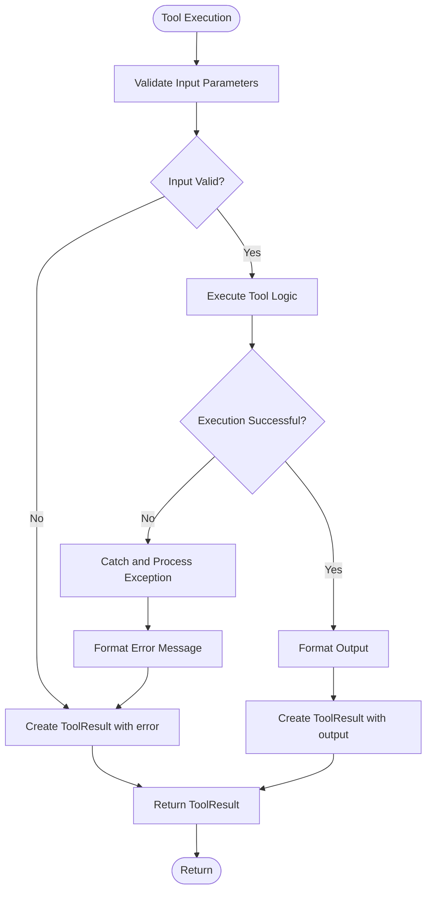

# Tool API

<cite>
**Referenced Files in This Document**   
- [base.py](file://app/tool/base.py)
- [tool_collection.py](file://app/tool/tool_collection.py)
- [python_execute.py](file://app/tool/python_execute.py)
- [web_search.py](file://app/tool/web_search.py)
- [file_operators.py](file://app/tool/file_operators.py)
- [browser_use_tool.py](file://app/tool/browser_use_tool.py)
- [toolcall.py](file://app/agent/toolcall.py)
- [planning.py](file://app/flow/planning.py)
</cite>

## Table of Contents
1. [Introduction](#introduction)
2. [BaseTool Abstract Class](#basetool-abstract-class)
3. [ToolCollection Class](#toolcollection-class)
4. [Specific Tool Implementations](#specific-tool-implementations)
5. [Agent Integration](#agent-integration)
6. [Error Handling](#error-handling)
7. [Conclusion](#conclusion)

## Introduction
The Tool API in OpenManus provides a comprehensive framework for executing various operations through a standardized interface. This documentation details the core components of the tool system, including the BaseTool abstract class, ToolCollection for tool management, specific tool implementations, and their integration with agent decision loops and LLM function calling. The system enables agents to perform complex tasks by orchestrating multiple tools with consistent result handling and error management.

## BaseTool Abstract Class

The BaseTool class serves as the foundation for all tool implementations in OpenManus, providing a standardized interface and functionality. Inherited from both ABC (Abstract Base Class) and BaseModel (Pydantic), it combines abstract method definitions with data validation capabilities.

The execute() method signature is defined as an abstract async method that accepts variable keyword arguments (**kwargs) and returns Any type. This flexible signature allows each tool implementation to define its specific parameters while maintaining a consistent execution interface. The method is designed to be overridden by concrete tool classes to implement their specific functionality.

The tool_input schema is defined through the parameters field, which is an optional dictionary containing the JSON schema for the tool's input parameters. This schema follows the OpenAI function calling format, specifying the type, properties, required fields, and descriptions for each parameter. For example, the PythonExecute tool defines a schema requiring a "code" string parameter, while the WebSearch tool includes parameters for query, number of results, language, country, and content fetching.

The expected return format is standardized through the ToolResult class, which provides a consistent structure for tool outputs. ToolResult contains fields for output (successful execution result), error (error message on failure), base64_image (for visual results), and system (system messages). Tools can create success responses using the success_response() method or failure responses using fail_response(), ensuring consistent result formatting across all tools.

**Section sources**
- [base.py](file://app/tool/base.py#L77-L181)

## ToolCollection Class

The ToolCollection class provides a centralized mechanism for tool registration, discovery, and execution orchestration. It acts as a container for multiple tools, enabling agents to access and execute them through a unified interface.

Tool registration is accomplished through the add_tool() and add_tools() methods, which add individual or multiple tools to the collection. The class maintains both a tuple of tools and a name-to-tool mapping dictionary (tool_map) for efficient lookup. When adding tools, the collection checks for name conflicts and logs warnings if duplicate tool names are detected, preventing accidental overwrites.

For tool discovery, the collection provides the get_tool() method that retrieves a tool by its name from the tool_map dictionary. This enables dynamic tool lookup during execution. The to_params() method converts all registered tools into their function call format by calling each tool's to_param() method, producing a list of tool parameter dictionaries that can be provided to LLMs for function calling.

Execution orchestration is handled by the execute() method, which takes a tool name and input parameters, looks up the corresponding tool, and executes it with the provided inputs. The method includes error handling for invalid tool names and ToolError exceptions, returning appropriate ToolFailure results. For scenarios requiring multiple tool executions, the execute_all() method runs all tools in the collection sequentially and returns a list of their results.

The ToolCollection class plays a crucial role in the agent workflow by serving as the bridge between the agent's decision-making process and the actual tool execution, ensuring that tools are properly managed and accessible.

**Diagram sources **
- [tool_collection.py](file://app/tool/tool_collection.py#L8-L71)
- [base.py](file://app/tool/base.py#L77-L181)

**Section sources**
- [tool_collection.py](file://app/tool/tool_collection.py#L8-L71)

## Specific Tool Implementations

### Python Execution Tool
The PythonExecute tool enables safe execution of Python code with timeout and safety restrictions. It uses multiprocessing to isolate code execution in a separate process, preventing potential security risks and ensuring that long-running code can be terminated. The tool captures stdout output, allowing users to see print statements from executed code. It accepts a "code" parameter containing the Python code to execute and an optional "timeout" parameter (default 5 seconds) to limit execution time. The implementation uses a safe_globals dictionary to restrict access to built-in functions, enhancing security. This tool is particularly useful for data analysis, mathematical computations, and testing code snippets.

### Web Search Tool
The WebSearch tool provides comprehensive web search capabilities using multiple search engines. It supports Google, Baidu, DuckDuckGo, and Bing, with automatic fallback between engines if the primary search fails. The tool returns structured SearchResponse objects containing search results with titles, URLs, descriptions, and metadata. It can optionally fetch and extract content from search result pages using the WebContentFetcher utility. The search parameters include query (required), number of results, language, country, and a fetch_content flag. The tool implements retry logic with exponential backoff to handle temporary failures and includes configurable search settings through the application configuration.

### File Operations Tools
File operations are implemented through a combination of LocalFileOperator and SandboxFileOperator classes that adhere to the FileOperator protocol. These classes provide methods for reading, writing, checking existence, and verifying directory status for files. The LocalFileOperator performs operations on the local filesystem, while the SandboxFileOperator interacts with files in a sandboxed environment through a client interface. Both implement the same interface, allowing for consistent file operations regardless of the execution environment. Additional file manipulation capabilities are provided by the StrReplaceEditor tool, which allows for string replacement in files with undo functionality.

### Browser Automation Tool
The BrowserUseTool provides extensive browser automation capabilities, allowing interaction with web pages through various actions. It supports navigation (go_to_url, go_back, web_search), element interaction (click_element, input_text), scrolling (scroll_down, scroll_up, scroll_to_text), form handling (select_dropdown_option), tab management (switch_tab, open_tab, close_tab), and content extraction. The tool maintains browser state across calls and can capture screenshots of the current page state. It integrates with the WebSearch tool to enable search-driven navigation and uses LLM-powered content extraction to retrieve specific information from web pages based on a goal. The tool handles asynchronous operations with proper locking to prevent race conditions.

**Diagram sources **
- [python_execute.py](file://app/tool/python_execute.py#L8-L74)
- [web_search.py](file://app/tool/web_search.py#L155-L407)
- [file_operators.py](file://app/tool/file_operators.py#L20-L158)
- [browser_use_tool.py](file://app/tool/browser_use_tool.py#L38-L566)

**Section sources**
- [python_execute.py](file://app/tool/python_execute.py#L8-L74)
- [web_search.py](file://app/tool/web_search.py#L155-L407)
- [file_operators.py](file://app/tool/file_operators.py#L20-L158)
- [browser_use_tool.py](file://app/tool/browser_use_tool.py#L38-L566)

## Agent Integration

Tools integrate with the agent decision loop through the ToolCallAgent class, which extends the ReActAgent to handle tool/function calls. The agent's think() method uses the LLM to generate tool calls based on the current context and available tools. The available_tools collection is converted to parameters using to_params() and passed to the LLM's ask_tool() method, enabling function calling capabilities.

The integration with LLM function calling is facilitated by the to_param() method in BaseTool, which converts each tool into the OpenAI function calling format. This allows the LLM to understand the available tools, their parameters, and when to use them. The ToolCallAgent processes the LLM's response, extracting tool calls and executing them through the ToolCollection's execute() method.

During execution, the agent follows a cycle of thinking and acting. In the think() phase, it determines which tools to use based on the current task. In the act() phase, it executes the selected tools through the execute_tool() method, which handles argument parsing, tool execution, and result processing. The execute_tool() method also handles special tools like Terminate, which can change the agent's state to FINISHED.

The PlanningFlow class demonstrates a more sophisticated integration pattern, where a planning agent creates a structured plan using the PlanningTool, and then executes each step with appropriate executor agents. This approach separates planning from execution, allowing for more complex task orchestration. The flow maintains state across steps, tracking progress and handling step completion through the planning tool.

**Diagram sources **
- [toolcall.py](file://app/agent/toolcall.py#L44-L250)
- [planning.py](file://app/flow/planning.py#L202-L303)

**Section sources**
- [toolcall.py](file://app/agent/toolcall.py#L44-L250)
- [planning.py](file://app/flow/planning.py#L202-L303)

## Error Handling

The Tool API implements a comprehensive error handling system that ensures robust operation and provides meaningful feedback. The foundation of this system is the ToolResult class, which standardizes the representation of both successful and failed tool executions. When a tool encounters an error, it returns a ToolResult with the error field populated with a descriptive message, while the output field remains empty.

Specific tools implement their own error handling mechanisms appropriate to their domain. The PythonExecute tool catches exceptions during code execution and returns them as error messages, while also handling timeout scenarios by terminating the execution process. The WebSearch tool implements retry logic with exponential backoff when search engines fail, attempting multiple engines before returning a failure result. File operation tools wrap filesystem exceptions in ToolError exceptions, providing consistent error reporting.

The ToolCollection class adds another layer of error handling by catching ToolError exceptions during execution and converting them to ToolFailure results. This ensures that tool execution failures are propagated consistently through the system. The execute() method validates tool names before execution, returning a ToolFailure for invalid tool names.

Agent-level error handling is implemented in the ToolCallAgent's execute_tool() method, which catches JSONDecodeError when parsing tool arguments and general exceptions during tool execution. These errors are formatted into user-friendly messages and returned as observation strings. The agent also handles token limit errors from the LLM, gracefully terminating execution when the token limit is reached.

**Diagram sources **
- [base.py](file://app/tool/base.py#L48-L84)
- [tool_collection.py](file://app/tool/tool_collection.py#L24-L34)
- [toolcall.py](file://app/agent/toolcall.py#L182-L212)

**Section sources**
- [base.py](file://app/tool/base.py#L48-L84)
- [tool_collection.py](file://app/tool/tool_collection.py#L24-L34)
- [toolcall.py](file://app/agent/toolcall.py#L182-L212)

## Conclusion
The Tool API in OpenManus provides a robust and extensible framework for executing various operations through a standardized interface. The BaseTool class establishes a consistent foundation for all tools, ensuring uniform execution patterns and result formatting. The ToolCollection class enables efficient tool management, discovery, and orchestration, serving as the bridge between agents and tool execution.

The diverse set of tool implementations—ranging from Python execution and web search to file operations and browser automation—demonstrates the flexibility of the framework in handling different types of tasks. These tools integrate seamlessly with agent decision loops and LLM function calling, enabling sophisticated AI workflows that can interact with both digital and physical environments.

The comprehensive error handling system ensures reliable operation by standardizing error representation and providing meaningful feedback for troubleshooting. This, combined with the modular design, makes the Tool API a powerful component of the OpenManus system, capable of supporting complex agent behaviors and task automation.