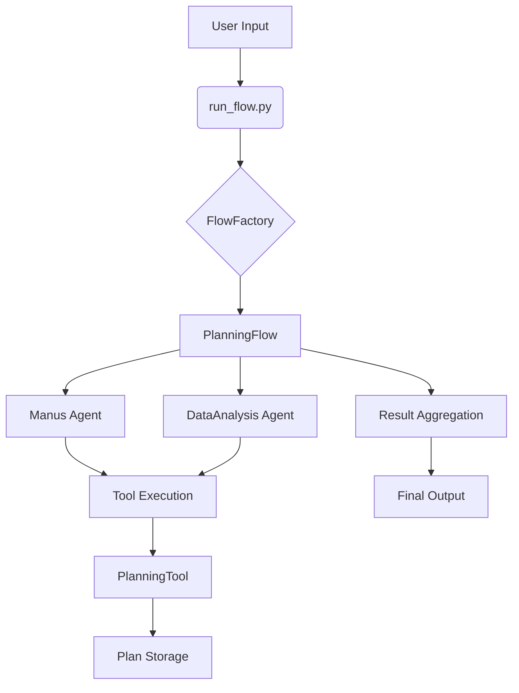
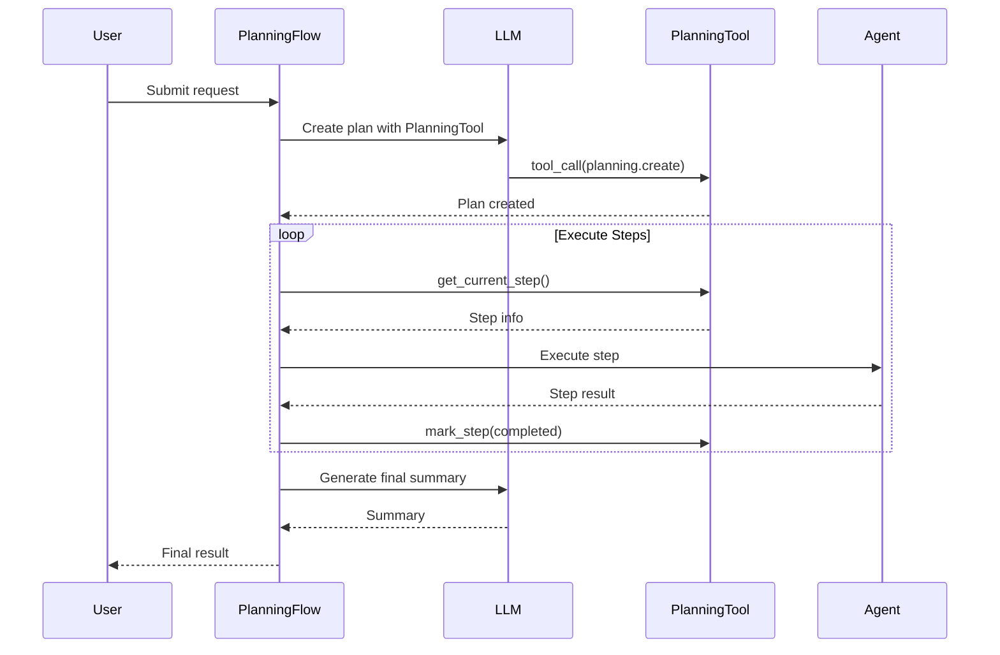
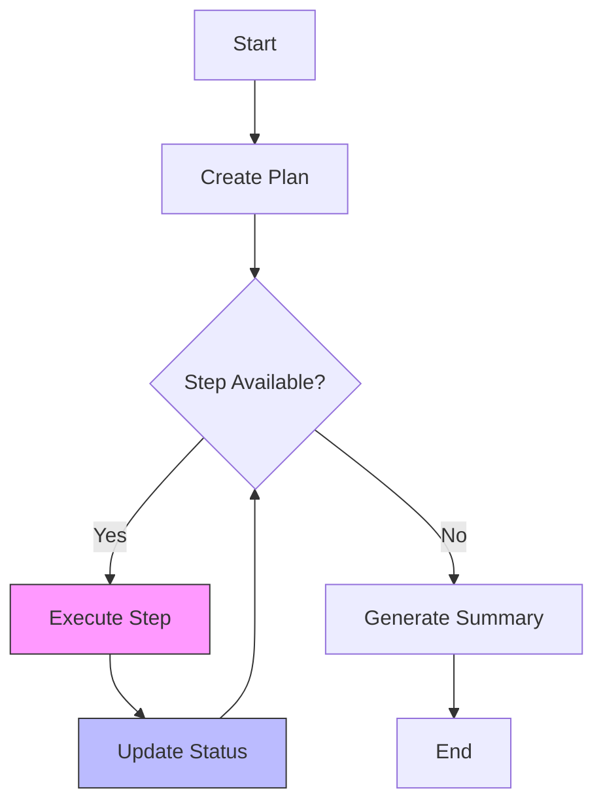

# Advanced Features

<cite>
**Referenced Files in This Document**   
- [run_flow.py](file://run_flow.py)
- [flow_factory.py](file://app/flow/flow_factory.py)
- [planning.py](file://app/flow/planning.py)
- [planning.py](file://app/tool/planning.py)
- [manus.py](file://app/agent/manus.py)
- [config.example.toml](file://config/config.example.toml)
</cite>

## Table of Contents
1. [Introduction](#introduction)
2. [Multi-Agent Workflows](#multi-agent-workflows)
3. [Planning System and Task Breakdown](#planning-system-and-task-breakdown)
4. [Custom Prompt Engineering](#custom-prompt-engineering)
5. [Performance Optimization Techniques](#performance-optimization-techniques)
6. [Error Handling Strategies](#error-handling-strategies)
7. [Configuration Options](#configuration-options)
8. [Best Practices for Complex Workflows](#best-practices-for-complex-workflows)

## Introduction
OpenManus provides advanced capabilities for orchestrating complex workflows through multi-agent coordination, intelligent planning, and customizable execution patterns. This document details the core advanced features that enable robust automation of sophisticated tasks, focusing on the architecture and implementation patterns that support scalable agent-based problem solving.

## Multi-Agent Workflows

The multi-agent workflow system in OpenManus is centered around the `run_flow.py` entry point and the `FlowFactory` class, which coordinate multiple specialized agents to solve complex tasks collaboratively. The system enables dynamic agent composition and coordinated execution through a centralized flow management architecture.

**Diagram sources**
- [run_flow.py](file://run_flow.py#L0-L52)
- [flow_factory.py](file://app/flow/flow_factory.py#L12-L29)
- [planning.py](file://app/flow/planning.py#L44-L441)

**Section sources**
- [run_flow.py](file://run_flow.py#L0-L52)
- [flow_factory.py](file://app/flow/flow_factory.py#L12-L29)

## Planning System and Task Breakdown

The planning system in OpenManus uses a structured reasoning approach to break down complex tasks into executable steps. The `PlanningFlow` class implements a step-by-step execution model that tracks progress and coordinates agent activities through the `PlanningTool`.

The system follows a specific reasoning pattern:
1. Create an initial plan based on the user request
2. Execute steps sequentially using appropriate agents
3. Track progress and update plan status
4. Finalize with a comprehensive summary

**Diagram sources**
- [planning.py](file://app/flow/planning.py#L44-L441)
- [planning.py](file://app/tool/planning.py#L13-L362)

**Section sources**
- [planning.py](file://app/flow/planning.py#L44-L441)
- [planning.py](file://app/tool/planning.py#L13-L362)

## Custom Prompt Engineering

OpenManus supports custom prompt engineering to influence agent behavior and optimize task execution. The system uses specialized prompt templates that guide agents through the planning and execution process.

The planning system employs two key prompts:
- **PLANNING_SYSTEM_PROMPT**: Defines the agent's role and responsibilities in the planning process
- **NEXT_STEP_PROMPT**: Guides the agent's decision-making for subsequent actions

These prompts enable agents to:
- Analyze requests and understand task scope
- Create actionable plans using the planning tool
- Execute steps with appropriate tools
- Track progress and adapt plans as needed
- Conclude tasks efficiently when objectives are met

**Section sources**
- [planning.py](file://app/prompt/planning.py#L0-L27)
- [manus.py](file://app/agent/manus.py#L0-L165)

## Performance Optimization Techniques

OpenManus implements several performance optimization techniques to ensure efficient execution of complex workflows:

### Caching Strategy
The `PlanningTool` maintains an in-memory cache of plans, allowing quick access to plan status and progress without repeated database queries. Plan data is stored in a dictionary structure indexed by plan ID, enabling O(1) lookup times.

### Parallel Execution
While the current implementation follows a sequential execution model, the architecture supports potential parallelization through:
- Independent agent execution for non-dependent steps
- Concurrent tool calls within agent workflows
- Asynchronous I/O operations throughout the system

### Resource Management
The system implements resource management through:
- Configurable timeout limits (3600 seconds default)
- Memory-efficient data structures for plan storage
- Proper cleanup of agent resources

**Diagram sources**
- [planning.py](file://app/flow/planning.py#L44-L441)
- [run_flow.py](file://run_flow.py#L0-L52)

**Section sources**
- [planning.py](file://app/flow/planning.py#L44-L441)
- [run_flow.py](file://run_flow.py#L0-L52)

## Error Handling Strategies

OpenManus implements comprehensive error handling to ensure robust agent operation:

### Timeout Management
The system uses asyncio timeout handling to prevent indefinite execution:
- 3600-second (1 hour) timeout for entire workflow execution
- Graceful termination with user notification on timeout
- Prevention of resource exhaustion from long-running tasks

### Exception Handling
Multi-layered exception handling is implemented:
- Top-level exception handling in `run_flow.py`
- Flow-level error handling in `PlanningFlow.execute()`
- Tool-specific error handling in `PlanningTool` methods

### Fallback Mechanisms
The system includes several fallback strategies:
- Default plan creation when LLM-based planning fails
- Direct status updates when tool execution fails
- Agent-based summary generation when LLM summarization fails

**Section sources**
- [run_flow.py](file://run_flow.py#L0-L52)
- [planning.py](file://app/flow/planning.py#L44-L441)
- [planning.py](file://app/tool/planning.py#L13-L362)

## Configuration Options

OpenManus provides flexible configuration options for advanced scenarios:

### Agent Configuration
The `config.example.toml` file supports configuration of multiple agents:
- **use_data_analysis_agent**: Enables/disables the DataAnalysis agent
- Multiple agent types can be combined based on task requirements

### LLM Configuration
Comprehensive LLM configuration options:
- Model selection (Claude, GPT, Llama, etc.)
- API endpoint customization
- Token limits and temperature settings
- Vision model configuration

### Specialized Configurations
Additional configuration sections for specific capabilities:
- Browser settings (headless mode, security features)
- Search engine preferences (Google, Baidu, DuckDuckGo)
- Sandbox parameters for secure execution
- MCP (Model Context Protocol) server integration

**Section sources**
- [config.example.toml](file://config/config.example.toml#L0-L105)
- [run_flow.py](file://run_flow.py#L0-L52)

## Best Practices for Complex Workflows

### Multi-Agent Coordination Patterns
When implementing complex workflows, consider these best practices:

1. **Clear Role Definition**: Assign specific responsibilities to each agent type
2. **Progressive Complexity**: Start with simple workflows and gradually increase complexity
3. **Status Tracking**: Use the planning system to monitor progress and identify bottlenecks

### Optimization Recommendations
- **Plan Granularity**: Balance between too many small steps and too few broad steps
- **Agent Selection**: Choose the most appropriate agent for each task type
- **Error Prevention**: Implement validation checks before executing critical operations

### Implementation Guidelines
- Use the FlowFactory pattern for consistent workflow creation
- Leverage the built-in planning tool for task management
- Follow the established prompt engineering patterns for consistent agent behavior
- Implement proper resource cleanup in agent lifecycle management

**Section sources**
- [flow_factory.py](file://app/flow/flow_factory.py#L12-L29)
- [planning.py](file://app/flow/planning.py#L44-L441)
- [manus.py](file://app/agent/manus.py#L0-L165)
- [planning.py](file://app/tool/planning.py#L13-L362)