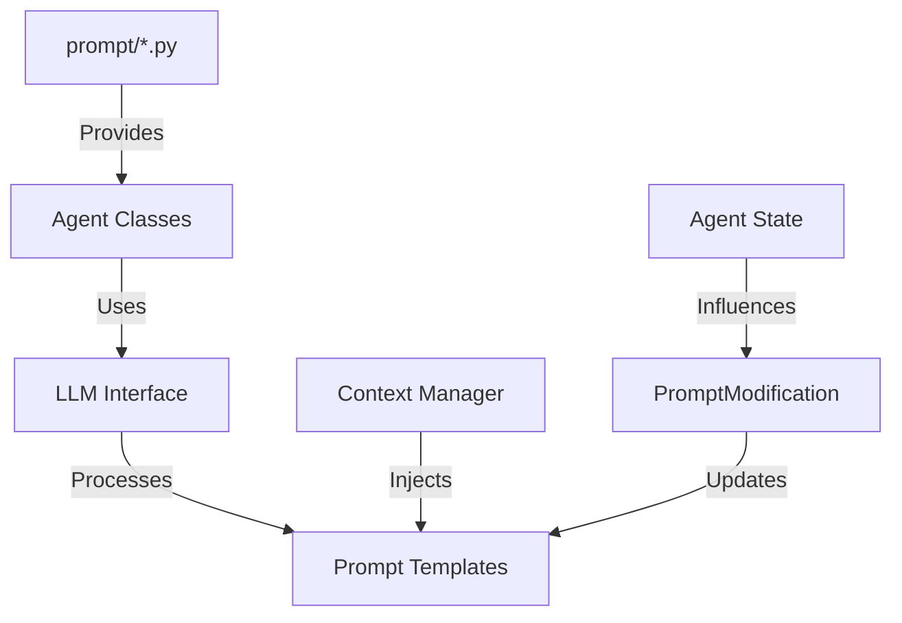
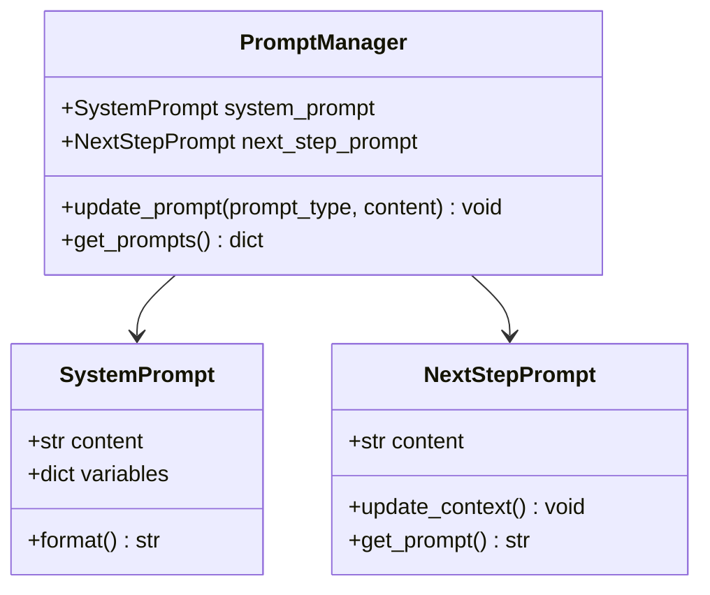
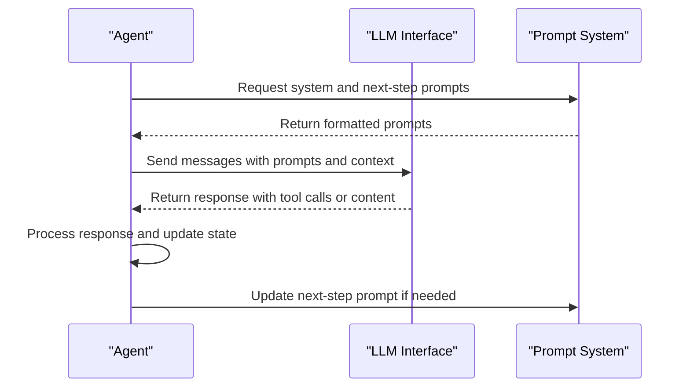
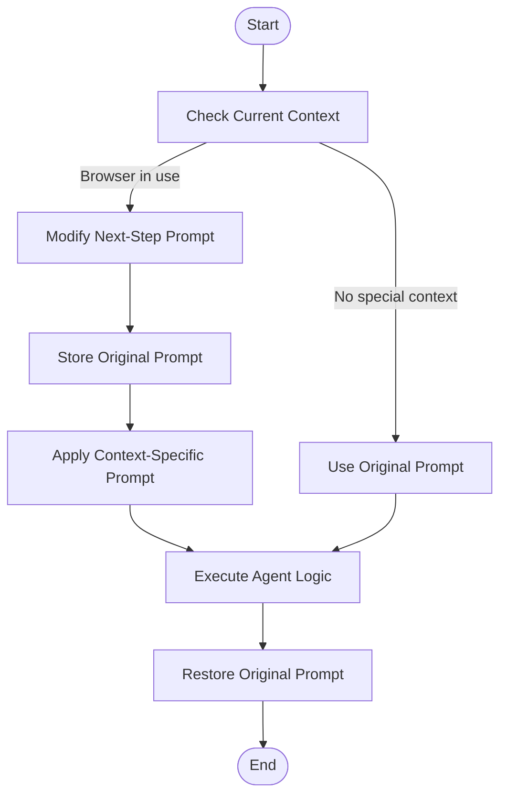
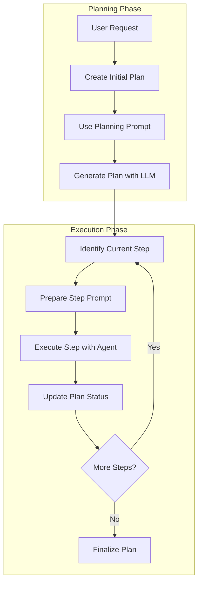

# Custom Prompts

<cite>
**Referenced Files in This Document**   
- [manus.py](file://app/agent/manus.py)
- [toolcall.py](file://app/agent/toolcall.py)
- [planning.py](file://app/flow/planning.py)
- [manus.py](file://app/prompt/manus.py)
- [planning.py](file://app/prompt/planning.py)
- [toolcall.py](file://app/prompt/toolcall.py)
- [llm.py](file://app/llm.py)
- [base.py](file://app/agent/base.py)
</cite>

## Table of Contents
1. [Introduction](#introduction)
2. [Prompt System Architecture](#prompt-system-architecture)
3. [Core Prompt Components](#core-prompt-components)
4. [Prompt Integration with Agent Workflows](#prompt-integration-with-agent-workflows)
5. [Dynamic Prompt Modification](#dynamic-prompt-modification)
6. [Planning and Execution Flow](#planning-and-execution-flow)
7. [Best Practices for Prompt Engineering](#best-practices-for-prompt-engineering)
8. [Security Considerations](#security-considerations)
9. [Conclusion](#conclusion)

## Introduction
OpenManus implements a sophisticated prompt engineering system that enables the Manus agent to effectively guide its behavior and decision-making processes. The prompt system is designed to provide structured guidance to the LLM while allowing for dynamic adaptation based on context and execution state. This documentation details the implementation of the prompt system, including system message construction, dynamic agent descriptions, and context injection patterns that influence how the agent creates and executes actionable plans.

The prompt system plays a critical role in shaping the agent's capabilities, ensuring it can handle complex tasks through appropriate tool selection and step-by-step problem solving. By carefully crafting prompts, developers can customize agent behavior for specific use cases while maintaining consistency across interactions.

**Section sources**
- [manus.py](file://app/agent/manus.py#L17-L164)
- [manus.py](file://app/prompt/manus.py#L0-L10)

## Prompt System Architecture

The prompt system in OpenManus follows a modular architecture where prompts are defined in dedicated modules and integrated with agent classes. The system separates prompt templates from agent logic, allowing for easy customization and maintenance. Each agent type has corresponding prompt files that define the system and next-step prompts used during execution.

**Diagram sources **
- [manus.py](file://app/agent/manus.py#L17-L164)
- [manus.py](file://app/prompt/manus.py#L0-L10)

**Section sources**
- [manus.py](file://app/agent/manus.py#L17-L164)
- [planning.py](file://app/flow/planning.py#L44-L441)
- [toolcall.py](file://app/agent/toolcall.py#L17-L249)

## Core Prompt Components

The prompt system consists of two primary components: system prompts and next-step prompts. System prompts establish the agent's identity, capabilities, and general behavior guidelines, while next-step prompts guide the agent's immediate actions based on the current context.

The Manus agent's system prompt defines its role as an all-capable AI assistant with access to various tools for completing complex requests. It includes dynamic elements such as the workspace directory, which is injected at runtime. The next-step prompt encourages proactive tool selection and step-by-step problem solving for complex tasks.

**Diagram sources **
- [manus.py](file://app/prompt/manus.py#L0-L10)
- [planning.py](file://app/prompt/planning.py#L0-L27)
- [toolcall.py](file://app/prompt/toolcall.py#L0-L5)

**Section sources**
- [manus.py](file://app/prompt/manus.py#L0-L10)
- [planning.py](file://app/prompt/planning.py#L0-L27)
- [toolcall.py](file://app/prompt/toolcall.py#L0-L5)

## Prompt Integration with Agent Workflows

Prompts are tightly integrated with the agent's workflow through the think() method, which processes the current state and determines next actions. The system prompt is used to establish the agent's context, while the next-step prompt guides immediate decision-making. When the agent needs to interact with the LLM, these prompts are combined with the conversation history to generate appropriate responses.

The integration follows a consistent pattern across different agent types, with the base agent class providing the foundation for prompt usage. The ToolCallAgent class extends this functionality to handle tool selection and execution, using prompts to guide the LLM in choosing appropriate tools for the current task.

**Diagram sources **
- [manus.py](file://app/agent/manus.py#L139-L164)
- [toolcall.py](file://app/agent/toolcall.py#L38-L128)
- [llm.py](file://app/llm.py#L500-L766)

**Section sources**
- [manus.py](file://app/agent/manus.py#L139-L164)
- [toolcall.py](file://app/agent/toolcall.py#L38-L128)
- [llm.py](file://app/llm.py#L500-L766)

## Dynamic Prompt Modification

The prompt system supports dynamic modification based on the agent's context and execution state. For example, when the browser tool is in use, the next-step prompt is temporarily modified to provide context-specific guidance. This dynamic adaptation ensures that the agent receives appropriate instructions based on the current task and tools being used.

The system preserves the original prompt and restores it after context-specific modifications, maintaining consistency across interactions. This approach allows for specialized guidance when needed while preserving the agent's overall behavior patterns.

**Diagram sources **
- [manus.py](file://app/agent/manus.py#L139-L164)

**Section sources**
- [manus.py](file://app/agent/manus.py#L139-L164)

## Planning and Execution Flow

The planning system uses specialized prompts to guide the creation and execution of structured plans. The planning agent receives a system prompt that defines its role as an expert planning agent, with specific instructions for analyzing requests, creating actionable plans, and tracking progress. This prompt encourages breaking tasks into logical steps while avoiding excessive detail.

During execution, the planning flow integrates with the prompt system to provide agents with context about the current plan status and their specific tasks. Each step execution includes a prompt that shows the current plan status and focuses the agent on completing the current step using appropriate tools.

**Diagram sources **
- [planning.py](file://app/flow/planning.py#L93-L133)
- [planning.py](file://app/prompt/planning.py#L0-L27)

**Section sources**
- [planning.py](file://app/flow/planning.py#L93-L133)
- [planning.py](file://app/flow/planning.py#L212-L274)
- [planning.py](file://app/flow/planning.py#L276-L303)

## Best Practices for Prompt Engineering

Effective prompt engineering in OpenManus requires balancing specificity with flexibility. Well-crafted prompts should clearly define the agent's role and capabilities while allowing for adaptive behavior based on context. Key considerations include:

- **Clarity of Instructions**: Prompts should provide unambiguous guidance about expected behavior and constraints.
- **Context Awareness**: Prompts should account for the agent's current state and available tools.
- **Consistency**: Prompts should maintain consistent behavior patterns across interactions.
- **Extensibility**: Prompts should be designed to accommodate future enhancements and use cases.

When modifying prompts, developers should consider the impact on the agent's decision-making process and ensure that changes align with the overall system architecture. Testing prompt modifications with various scenarios helps identify potential issues before deployment.

**Section sources**
- [manus.py](file://app/prompt/manus.py#L0-L10)
- [planning.py](file://app/prompt/planning.py#L0-L27)
- [toolcall.py](file://app/prompt/toolcall.py#L0-L5)

## Security Considerations

The prompt system must address potential security risks, particularly prompt injection attacks that could compromise agent behavior. The system should validate and sanitize prompt inputs, especially when incorporating user-provided content. Additionally, sensitive information should not be exposed through prompts, and access controls should be implemented for prompt modifications.

The current implementation mitigates some risks by using structured prompt templates and limiting dynamic content injection. However, developers should remain vigilant about potential vulnerabilities when extending the prompt system for new use cases.

**Section sources**
- [manus.py](file://app/agent/manus.py#L17-L164)
- [toolcall.py](file://app/agent/toolcall.py#L17-L249)

## Conclusion

The custom prompt system in OpenManus provides a robust framework for guiding agent behavior and decision-making. By carefully structuring system and next-step prompts, developers can effectively influence how the Manus agent approaches complex tasks and utilizes available tools. The system's modular design allows for easy customization while maintaining consistency across interactions.

Understanding the prompt system's architecture and integration points enables developers to extend and modify agent behavior for specific use cases. Following best practices in prompt engineering ensures that modifications enhance functionality without compromising security or consistency.