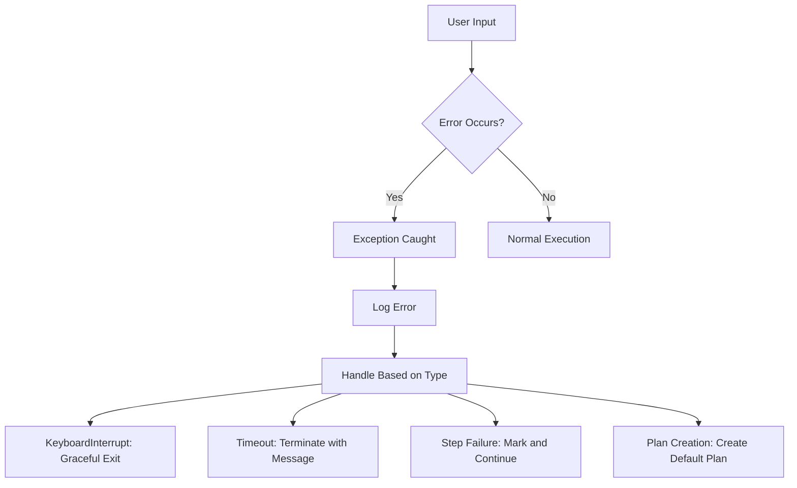
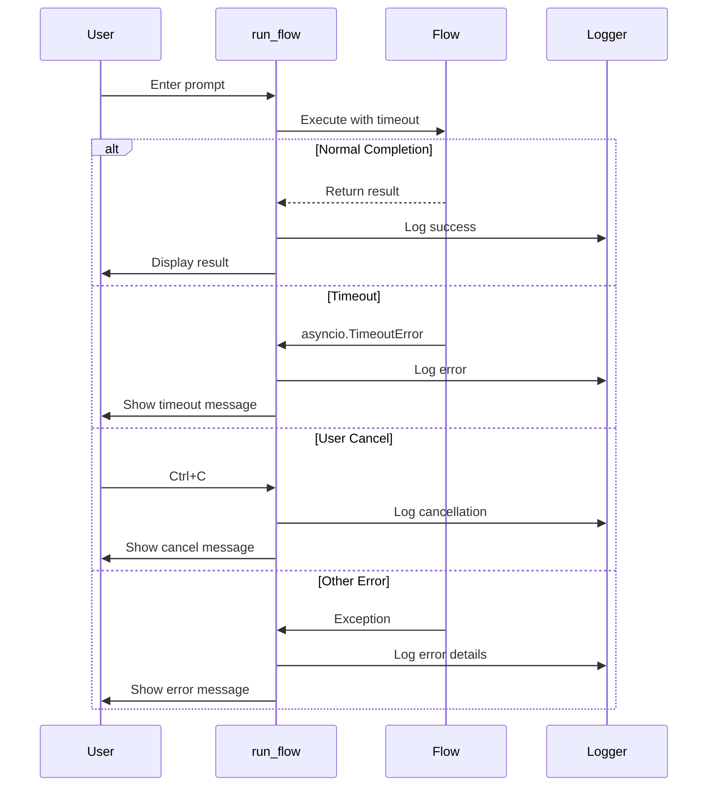
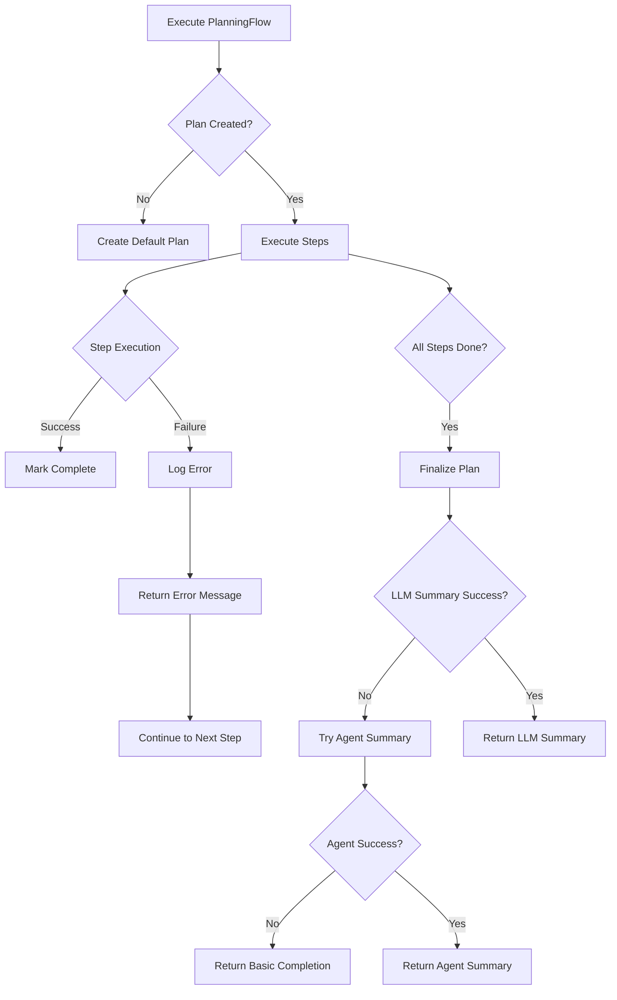
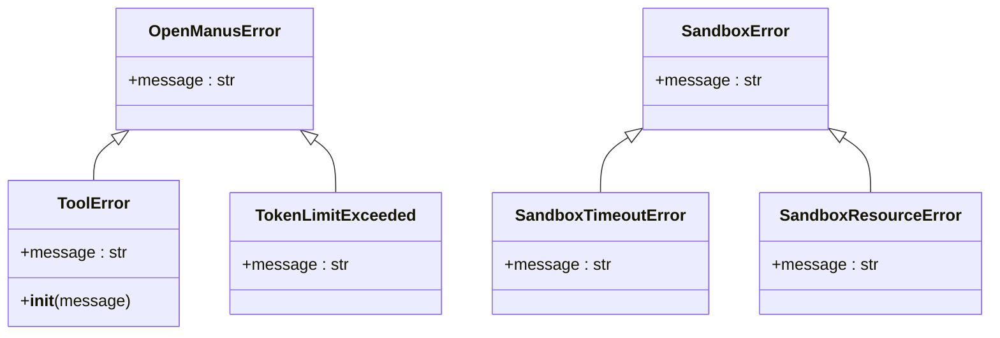

# Error Handling

<cite>
**Referenced Files in This Document**   
- [run_flow.py](file://run_flow.py)
- [planning.py](file://app/flow/planning.py)
- [exceptions.py](file://app/exceptions.py)
- [logger.py](file://app/utils/logger.py)
- [exceptions.py](file://app/sandbox/core/exceptions.py)
- [logger.py](file://app/logger.py)
</cite>

## Table of Contents
1. [Introduction](#introduction)
2. [Core Error Handling Architecture](#core-error-handling-architecture)
3. [Exception Handling in run_flow.py](#exception-handling-in-run_flowpy)
4. [Error Recovery in PlanningFlow](#error-recovery-in-planningflow)
5. [Custom Exception Classes](#custom-exception-classes)
6. [Logging Strategy](#logging-strategy)
7. [Common Failure Points in Multi-Agent Workflows](#common-failure-points-in-multi-agent-workflows)
8. [Best Practices for Robust Error Handling](#best-practices-for-robust-error-handling)
9. [Conclusion](#conclusion)

## Introduction
OpenManus implements a comprehensive error handling system designed to ensure reliability and resilience in complex multi-agent workflows. The system addresses various failure scenarios including user interruptions, execution timeouts, plan creation failures, and step execution errors. This document details the exception handling patterns, recovery mechanisms, and logging practices that enable graceful degradation and maintain system state consistency across distributed agent coordination.

**Section sources**
- [run_flow.py](file://run_flow.py#L0-L52)
- [planning.py](file://app/flow/planning.py#L44-L441)

## Core Error Handling Architecture
The error handling architecture in OpenManus is built around structured exception classes, comprehensive try-except blocks, and systematic logging. The system employs a layered approach where errors are caught at appropriate levels and handled according to their severity and context. The architecture supports both immediate error responses and recovery mechanisms that allow the system to continue operation when possible.

**Diagram sources**
- [run_flow.py](file://run_flow.py#L0-L52)
- [planning.py](file://app/flow/planning.py#L44-L441)

## Exception Handling in run_flow.py
The main execution loop in run_flow.py implements robust exception handling to manage various error conditions. The primary try-except block captures three distinct types of exceptions: KeyboardInterrupt for user-initiated cancellation, asyncio.TimeoutError for long-running operations, and general exceptions for unexpected errors.

The timeout mechanism uses asyncio.wait_for with a 60-minute limit, ensuring that requests don't hang indefinitely. When a timeout occurs, the system logs an error message and provides user-friendly feedback suggesting simpler requests. For user interruptions, the system gracefully exits with a clear message indicating the operation was cancelled.

**Diagram sources**
- [run_flow.py](file://run_flow.py#L0-L52)

**Section sources**
- [run_flow.py](file://run_flow.py#L0-L52)

## Error Recovery in PlanningFlow
The PlanningFlow class implements sophisticated error recovery mechanisms to handle failures in multi-agent workflows. When LLM tool calls fail during plan creation, the system creates a default fallback plan with generic steps, ensuring that execution can continue even when the ideal planning process fails.

For step execution errors, the system maintains plan status integrity by directly updating step statuses in storage when the planning tool fails. The _execute_step method catches exceptions during agent execution and returns descriptive error messages while marking the step as failed, allowing subsequent steps to potentially proceed.

The system also implements fallback strategies for finalization. If the LLM fails to generate a completion summary, the system attempts to use the primary agent as a backup, and if that also fails, returns a basic completion message.

**Diagram sources**
- [planning.py](file://app/flow/planning.py#L44-L441)

**Section sources**
- [planning.py](file://app/flow/planning.py#L44-L441)

## Custom Exception Classes
OpenManus defines a hierarchy of custom exception classes to handle different error conditions with appropriate specificity. The base OpenManusError class serves as the parent for all application-specific exceptions, enabling targeted exception handling.

The ToolError exception is raised when tool operations encounter issues, providing a mechanism to distinguish tool-related failures from other error types. The TokenLimitExceeded exception specifically handles cases where LLM token limits are reached, allowing for specialized recovery strategies.

In the sandbox subsystem, SandboxError serves as the base class for sandbox-related exceptions, with derived classes including SandboxTimeoutError for operation timeouts and SandboxResourceError for resource constraints, enabling precise error handling based on the failure type.

**Diagram sources**
- [exceptions.py](file://app/exceptions.py#L0-L13)
- [exceptions.py](file://app/sandbox/core/exceptions.py#L0-L17)

**Section sources**
- [exceptions.py](file://app/exceptions.py#L0-L13)
- [exceptions.py](file://app/sandbox/core/exceptions.py#L0-L17)

## Logging Strategy
OpenManus employs a comprehensive logging strategy using structlog for structured logging with contextual information. The logger configuration includes timestamps, caller information (filename, function name, line number), and log levels, providing detailed context for debugging.

In local environment mode, the system uses console rendering for human-readable output, while production environments use JSON formatting for log processing. The logging system captures error details, including full tracebacks, which aids in diagnosing issues.

Log messages are strategically placed to track the flow of execution, including plan creation, step execution, and error conditions. This enables monitoring of system behavior and facilitates post-mortem analysis of failures.

**Section sources**
- [logger.py](file://app/utils/logger.py#L0-L32)
- [logger.py](file://app/logger.py#L0-L42)

## Common Failure Points in Multi-Agent Workflows
Multi-agent coordination in OpenManus faces several common failure points that the error handling system addresses. Plan creation failures occur when the LLM fails to generate a valid plan, which is mitigated by creating default fallback plans.

Step execution errors happen when agents encounter issues during task execution, which are handled by catching exceptions and returning descriptive error messages while maintaining overall workflow progress. Timeout scenarios are managed through the 60-minute execution limit in run_flow.py, preventing indefinite hangs.

Agent stuck states, where agents repeat ineffective patterns, are detected through content duplication analysis and addressed by injecting prompts that encourage strategy changes. These failure points are particularly critical in multi-agent workflows where coordination dependencies can amplify individual agent failures.

**Section sources**
- [planning.py](file://app/flow/planning.py#L44-L441)
- [base.py](file://app/agent/base.py#L115-L195)

## Best Practices for Robust Error Handling
OpenManus exemplifies several best practices for implementing robust error handling in complex systems. The system provides meaningful error messages that help users understand what went wrong and suggest potential solutions, such as simplifying requests after timeouts.

State consistency is maintained through careful exception handling that ensures plan data remains coherent even when individual operations fail. The system updates step statuses directly in storage when tool execution fails, preserving the integrity of the planning state.

Graceful degradation is implemented through fallback mechanisms at multiple levels: default plans when planning fails, alternative summary generation when LLM calls fail, and continued execution after step failures. This approach ensures the system remains functional even when components fail.

Comprehensive logging with contextual information enables effective monitoring and debugging, while structured exception classes allow for precise error handling tailored to specific failure types.

**Section sources**
- [run_flow.py](file://run_flow.py#L0-L52)
- [planning.py](file://app/flow/planning.py#L44-L441)
- [base.py](file://app/agent/base.py#L115-L195)

## Conclusion
OpenManus implements a sophisticated error handling system that ensures reliability in complex multi-agent workflows. Through a combination of structured exception classes, comprehensive try-except blocks, and systematic logging, the system handles various failure scenarios while maintaining state consistency and enabling graceful degradation.

The error recovery mechanisms in PlanningFlow, including fallback plan creation and direct status updates, ensure that the system can continue operation even when individual components fail. The logging strategy provides detailed contextual information for debugging and monitoring.

These error handling practices contribute to a robust system that can handle the inherent uncertainties of LLM-driven agent coordination while providing clear feedback to users and maintaining system stability.