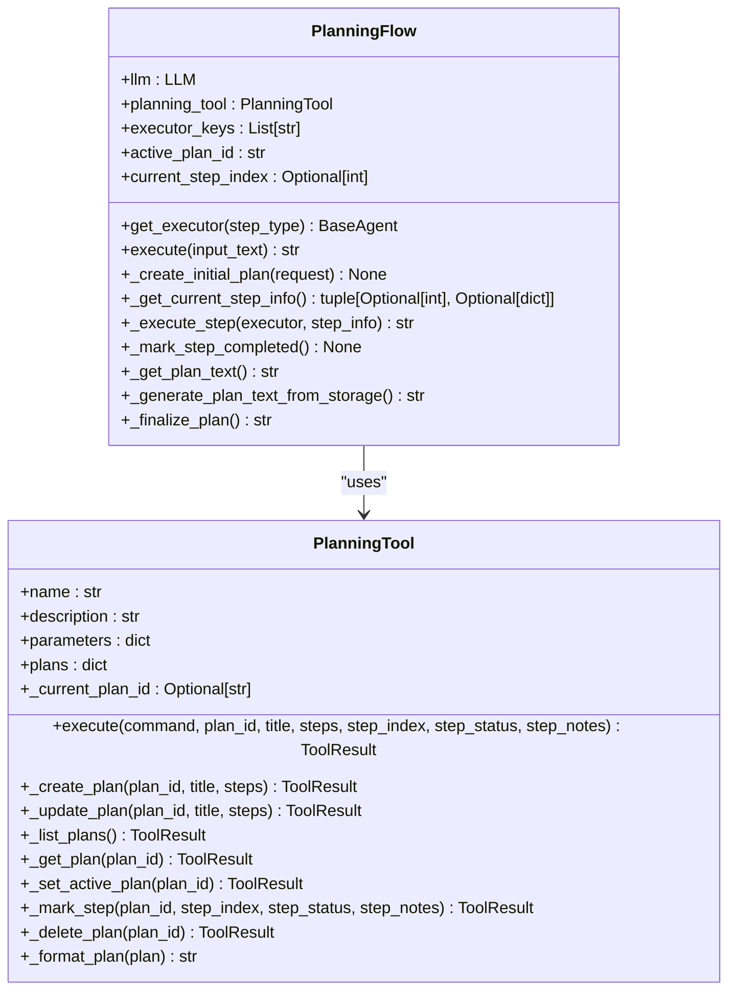
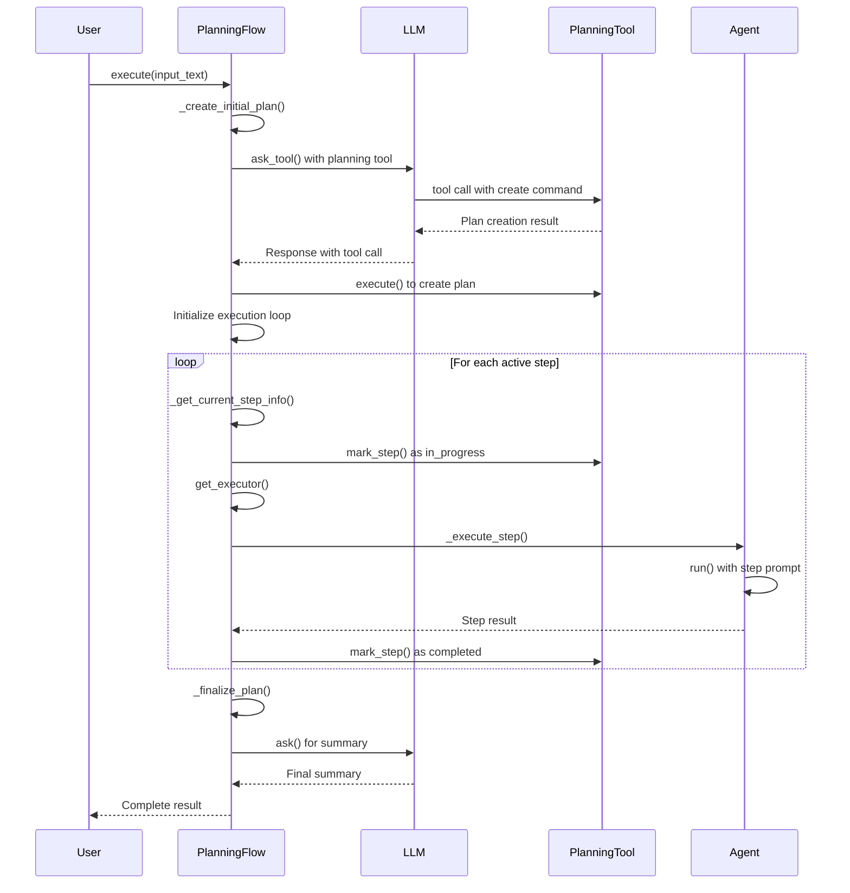
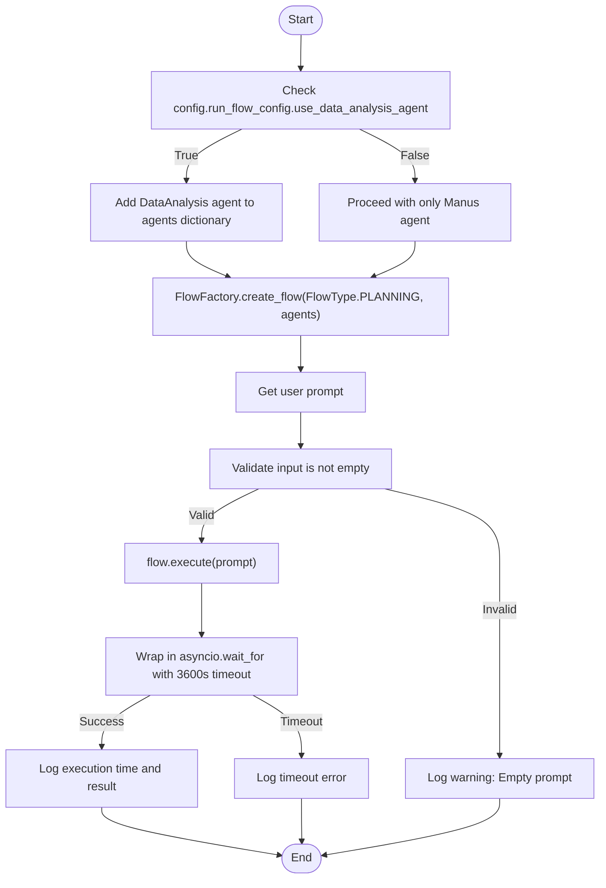

# Multi-agent Workflows

<cite>
**Referenced Files in This Document**   
- [app/flow/planning.py](file://app/flow/planning.py)
- [app/flow/flow_factory.py](file://app/flow/flow_factory.py)
- [run_flow.py](file://run_flow.py)
- [app/tool/planning.py](file://app/tool/planning.py)
- [app/agent/manus.py](file://app/agent/manus.py)
- [app/agent/data_analysis.py](file://app/agent/data_analysis.py)
- [app/config.py](file://app/config.py)
</cite>

## Table of Contents
1. [Introduction](#introduction)
2. [FlowFactory and PlanningFlow Architecture](#flowfactory-and-planningflow-architecture)
3. [Task Decomposition and Planning System](#task-decomposition-and-planning-system)
4. [Agent Orchestration and Executor Selection](#agent-orchestration-and-executor-selection)
5. [Workflow Lifecycle Execution](#workflow-lifecycle-execution)
6. [run_flow.py Integration and Configuration](#run_flowpy-integration-and-configuration)
7. [Multi-agent Coordination Patterns](#multi-agent-coordination-patterns)
8. [Error Handling and Common Issues](#error-handling-and-common-issues)
9. [Performance Considerations](#performance-considerations)
10. [Conclusion](#conclusion)

## Introduction
OpenManus implements a sophisticated multi-agent workflow system that enables coordinated task execution through intelligent planning and agent orchestration. The system leverages the FlowFactory class to create specialized workflows, with the PlanningFlow implementation serving as the core mechanism for managing complex tasks. This documentation details how OpenManus decomposes tasks into actionable steps using LLM-driven reasoning and the PlanningTool, orchestrates multiple agents based on step requirements, and manages the complete workflow lifecycle from plan creation to finalization. The architecture supports flexible agent coordination patterns, allowing specialized agents like Manus and DataAnalysis to collaborate on complex problem-solving tasks while providing robust error handling and performance optimization capabilities.

## FlowFactory and PlanningFlow Architecture
The FlowFactory class serves as the central factory pattern implementation for creating different types of agent flows in OpenManus. It provides a standardized interface for instantiating workflow orchestrators, with current support for the PlanningFlow type. The factory pattern enables flexible workflow creation by abstracting the instantiation logic and allowing for easy extension to support additional flow types in the future. When creating a PlanningFlow, the FlowFactory accepts a collection of agents and configuration parameters, then returns a properly initialized flow instance ready for execution.

The PlanningFlow class extends BaseFlow to implement a comprehensive planning and execution system that manages the complete lifecycle of agent workflows. It maintains critical state information including the current LLM instance, planning tool, executor agent keys, active plan identifier, and current step index. The flow's architecture is designed to coordinate multiple agents through a structured planning process, where tasks are decomposed into discrete steps that are executed sequentially by appropriate agents. This architecture enables sophisticated multi-agent collaboration while maintaining clear separation of concerns between planning, execution, and state management components.

**Section sources**
- [app/flow/flow_factory.py](file://app/flow/flow_factory.py#L12-L29)
- [app/flow/planning.py](file://app/flow/planning.py#L44-L74)

## Task Decomposition and Planning System
The planning system in OpenManus utilizes the PlanningTool to decompose complex tasks into actionable steps through LLM-driven reasoning. When a new task is received, the _create_initial_plan method generates a structured plan by leveraging the LLM's capabilities to break down the request into key milestones. The system crafts a specialized system message that instructs the LLM to create concise, actionable plans while focusing on clarity and efficiency. This message includes information about available agents when multiple executors are present, enabling the LLM to assign steps to specific agents using the '[agent_name]' format.

The PlanningTool serves as the central component for plan management, providing a comprehensive set of operations including plan creation, step updates, status tracking, and progress monitoring. It maintains an in-memory dictionary of plans indexed by unique plan IDs, with each plan containing structured data such as title, steps, step statuses, and notes. The tool supports seven core commands: create, update, list, get, set_active, mark_step, and delete, which enable complete lifecycle management of planning workflows. When creating a plan, the tool initializes each step with a "not_started" status and provides methods to update step status to "in_progress", "completed", or "blocked" as execution progresses.

**Diagram sources**
- [app/tool/planning.py](file://app/tool/planning.py#L19-L362)
- [app/flow/planning.py](file://app/flow/planning.py#L44-L441)

**Section sources**
- [app/tool/planning.py](file://app/tool/planning.py#L13-L362)
- [app/flow/planning.py](file://app/flow/planning.py#L135-L210)

## Agent Orchestration and Executor Selection
The agent orchestration system in OpenManus implements a sophisticated executor selection mechanism that determines which agent should execute each step in the workflow. The get_executor method in PlanningFlow serves as the core of this system, implementing a hierarchical selection strategy. When a step contains a type designation (e.g., "[data_analysis]" or "[manus]"), the system first attempts to match this type to an available agent key. This allows the planning process to explicitly assign steps to specialized agents based on their capabilities.

When no specific step type is provided, the system falls back to using the first available agent from the executor_keys list, with a final fallback to the primary agent if necessary. This selection hierarchy ensures that specialized agents are utilized when appropriate while maintaining robustness through fallback mechanisms. The executor_keys are initialized during flow creation to include all agent keys unless specifically overridden, enabling comprehensive agent availability for step execution. This orchestration system allows for dynamic agent selection based on both explicit planning decisions and availability considerations.

**Section sources**
- [app/flow/planning.py](file://app/flow/planning.py#L76-L91)

## Workflow Lifecycle Execution
The workflow lifecycle in OpenManus follows a structured execution pattern that begins with plan creation and proceeds through step-by-step execution until completion. The execute method in PlanningFlow implements this lifecycle as a continuous loop that processes steps until no active steps remain. The process begins by creating an initial plan through LLM-driven reasoning, with validation to ensure successful plan creation before proceeding to execution. If plan creation fails, the system provides appropriate error feedback and terminates the workflow.

During execution, the system iteratively identifies the next non-completed step using the _get_current_step_info method, which parses the current plan to find the first step with "not_started" or "in_progress" status. Before executing each step, the system marks it as "in_progress" to track execution status accurately. The _execute_step method then prepares a context-rich prompt containing the current plan status and step information, which is passed to the selected agent's run method. After successful execution, the system marks the step as "completed" and continues to the next step until all steps are finished, at which point it generates a final summary through the _finalize_plan method.

**Diagram sources**
- [app/flow/planning.py](file://app/flow/planning.py#L93-L133)
- [app/flow/planning.py](file://app/flow/planning.py#L212-L274)
- [app/flow/planning.py](file://app/flow/planning.py#L276-L303)

**Section sources**
- [app/flow/planning.py](file://app/flow/planning.py#L93-L133)
- [app/flow/planning.py](file://app/flow/planning.py#L212-L274)
- [app/flow/planning.py](file://app/flow/planning.py#L276-L303)

## run_flow.py Integration and Configuration
The run_flow.py script serves as the primary entry point for executing multi-agent workflows in OpenManus, integrating the FlowFactory with configurable agent setups. The script initializes a dictionary of agents that always includes the Manus agent as the primary executor, with conditional inclusion of the DataAnalysis agent based on configuration settings. This configuration is controlled through the use_data_analysis_agent flag in the run_flow_config section of the application configuration, allowing users to enable or disable specialized data analysis capabilities as needed.

The integration between run_flow.py and the FlowFactory follows a straightforward pattern: after collecting user input, the script creates a PlanningFlow instance through the factory method, passing the configured agents and flow type. The execution is wrapped in timeout handling to prevent indefinite processing, with a default 60-minute timeout for the entire workflow. This integration demonstrates how external scripts can leverage the FlowFactory to create and execute complex multi-agent workflows while maintaining flexibility through configuration options that control agent availability and behavior.

**Diagram sources**
- [run_flow.py](file://run_flow.py#L0-L52)
- [app/config.py](file://app/config.py#L350-L371)

**Section sources**
- [run_flow.py](file://run_flow.py#L0-L52)
- [app/config.py](file://app/config.py#L350-L371)

## Multi-agent Coordination Patterns
OpenManus supports sophisticated multi-agent coordination patterns that enable specialized agents to collaborate on complex problem-solving tasks. The primary pattern involves combining the general-purpose Manus agent with the specialized DataAnalysis agent for tasks requiring both broad reasoning capabilities and deep data processing expertise. This combination allows the system to handle workflows where initial analysis and planning are performed by Manus, while data-intensive operations like statistical analysis, visualization, and report generation are delegated to the DataAnalysis agent.

The coordination is facilitated through the planning system, which can explicitly assign steps to specific agents using the '[agent_name]' syntax in step descriptions. For example, a planning workflow might include steps like "[manus] Research market trends" followed by "[data_analysis] Generate sales forecast visualization" and "[manus] Interpret results and recommend strategy". This pattern enables optimal resource utilization by matching agent capabilities to task requirements, while the centralized planning system maintains overall workflow coherence and progress tracking. The system's flexibility allows for dynamic coordination patterns based on task requirements and agent availability.

**Section sources**
- [app/agent/manus.py](file://app/agent/manus.py#L0-L165)
- [app/agent/data_analysis.py](file://app/agent/data_analysis.py#L0-L37)

## Error Handling and Common Issues
The OpenManus workflow system implements comprehensive error handling to address common issues that may arise during multi-agent execution. Plan creation failures are detected by verifying the existence of the active plan ID in the planning tool's storage after the creation attempt, with appropriate error logging and user feedback when creation fails. Step execution errors are caught and handled within the _execute_step method, which returns descriptive error messages while allowing the workflow to continue with subsequent steps when possible.

Timeout handling is implemented at the run_flow.py level, with a 60-minute timeout for the entire execution process to prevent indefinite processing. The system also includes fallback mechanisms for critical operations, such as the _finalize_plan method which attempts to generate a completion summary using the flow's LLM directly, with a fallback to using the primary agent if the LLM call fails. Additionally, the system handles planning tool failures by providing alternative methods like _generate_plan_text_from_storage that can retrieve plan information directly from storage when the tool's get command fails, ensuring robustness in the face of component failures.

**Section sources**
- [app/flow/planning.py](file://app/flow/planning.py#L93-L133)
- [app/flow/planning.py](file://app/flow/planning.py#L405-L441)
- [run_flow.py](file://run_flow.py#L0-L52)

## Performance Considerations
Managing multiple agents in OpenManus requires careful consideration of performance factors to optimize task throughput and resource utilization. The system implements several performance optimizations, including efficient state management through in-memory plan storage and minimal serialization overhead. The PlanningTool maintains plans in a dictionary structure for O(1) access by plan ID, enabling rapid retrieval and updates during workflow execution. The system also minimizes LLM calls by using the planning tool for step management rather than requiring LLM intervention for each status update.

Resource utilization is optimized through selective agent activation, where the DataAnalysis agent is only instantiated when the use_data_analysis_agent configuration flag is enabled. This prevents unnecessary memory consumption and initialization overhead when specialized data analysis capabilities are not required. The timeout mechanism in run_flow.py prevents individual workflows from consuming excessive resources, while the step-by-step execution model allows for incremental progress tracking and resource monitoring. For high-throughput scenarios, the system could be extended with queuing mechanisms and parallel workflow execution, though the current implementation focuses on robust single-workflow performance.

**Section sources**
- [app/tool/planning.py](file://app/tool/planning.py#L68-L69)
- [run_flow.py](file://run_flow.py#L0-L52)
- [app/flow/planning.py](file://app/flow/planning.py#L48-L48)

## Conclusion
OpenManus provides a robust framework for multi-agent workflows through its FlowFactory and PlanningFlow architecture, enabling sophisticated task decomposition and agent orchestration. The system effectively combines LLM-driven planning with specialized agent capabilities to solve complex problems through coordinated workflows. By leveraging the PlanningTool for task management and implementing intelligent executor selection, OpenManus creates an extensible platform for multi-agent collaboration. The integration with run_flow.py demonstrates practical application of these concepts, while comprehensive error handling and performance considerations ensure reliability in real-world usage. This architecture provides a solid foundation for building increasingly sophisticated multi-agent systems that can adapt to diverse problem domains through flexible agent coordination patterns.