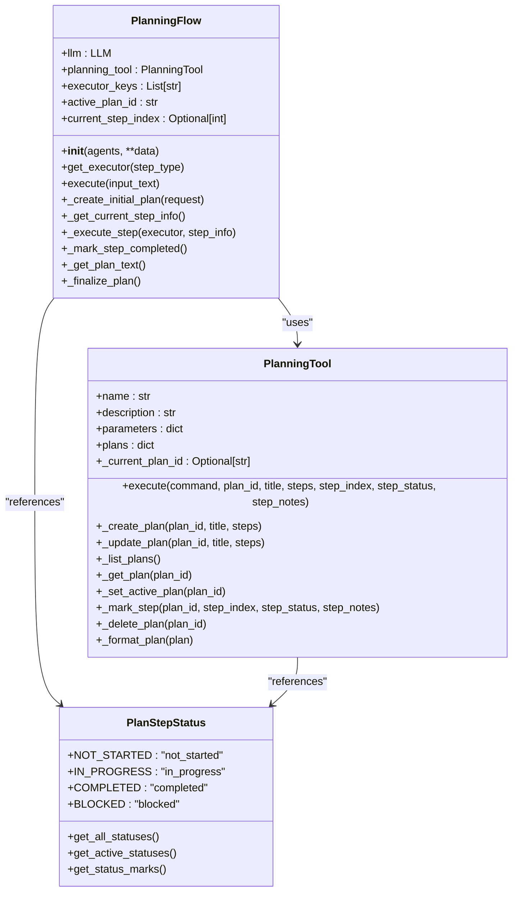

# Planning System

<cite>
**Referenced Files in This Document**   
- [PlanningFlow](file://app/flow/planning.py)
- [PlanningTool](file://app/tool/planning.py)
- [PLANNING_SYSTEM_PROMPT](file://app/prompt/planning.py)
- [BaseFlow](file://app/flow/base.py)
- [BaseTool](file://app/tool/base.py)
</cite>

## Table of Contents
1. [Introduction](#introduction)
2. [Planning Architecture Overview](#planning-architecture-overview)
3. [Plan Creation Process](#plan-creation-process)
4. [Step Execution Model](#step-execution-model)
5. [Data Flow and Integration](#data-flow-and-integration)
6. [Plan Management and Status Tracking](#plan-management-and-status-tracking)
7. [Error Handling and Fallback Mechanisms](#error-handling-and-fallback-mechanisms)
8. [Optimization Techniques](#optimization-techniques)
9. [Practical Examples](#practical-examples)
10. [Conclusion](#conclusion)

## Introduction
The Planning System in OpenManus is a sophisticated framework designed to decompose complex user requests into executable steps through LLM-driven reasoning. This system enables intelligent task orchestration by leveraging specialized agents and tools to accomplish multi-step objectives. The core of this system revolves around the PlanningFlow class, which coordinates the entire planning and execution lifecycle, from initial plan creation to final task completion. By combining LLM capabilities with structured planning tools, OpenManus can handle complex workflows that require sequential reasoning, tool integration, and adaptive execution strategies.

**Section sources**
- [PlanningFlow](file://app/flow/planning.py#L44-L441)
- [PlanningTool](file://app/tool/planning.py#L13-L362)

## Planning Architecture Overview
The planning system architecture in OpenManus follows a modular design pattern where the PlanningFlow class orchestrates the planning process while delegating specific operations to the PlanningTool. This separation of concerns allows for clear responsibility boundaries: PlanningFlow manages the overall execution flow and agent coordination, while PlanningTool handles the data storage and manipulation of plan structures. The system integrates with various specialized agents through the executor_keys mechanism, enabling dynamic selection of appropriate agents based on step requirements. This architecture supports both simple linear workflows and complex branching processes, adapting to the specific needs of different task types.



**Diagram sources**
- [PlanningFlow](file://app/flow/planning.py#L44-L441)
- [PlanningTool](file://app/tool/planning.py#L13-L362)
- [PlanStepStatus](file://app/flow/planning.py#L15-L41)

## Plan Creation Process
The plan creation process in OpenManus begins with the _create_initial_plan method of the PlanningFlow class, which constructs a system message containing instructions for the LLM to generate a structured plan. This system message includes information about available agents and their capabilities, enabling the LLM to make informed decisions about task delegation. The process involves several key steps: first, constructing appropriate system and user messages; second, invoking the LLM with the PlanningTool available for function calling; and third, processing the LLM's response to create or update the plan structure. If the LLM fails to generate a valid plan, the system implements a fallback mechanism by creating a default plan with generic steps.

**Section sources**
- [PlanningFlow._create_initial_plan](file://app/flow/planning.py#L135-L210)
- [PlanningTool.execute](file://app/tool/planning.py#L71-L117)
- [PLANNING_SYSTEM_PROMPT](file://app/prompt/planning.py#L1-L27)

## Step Execution Model
The step execution model in OpenManus follows a sequential processing approach where each step in the plan is executed in order until completion. The _get_current_step_info method identifies the next non-completed step by examining the plan's step statuses, marking it as "in_progress" before execution begins. The system then selects an appropriate executor agent based on the step type, with the get_executor method providing flexible agent selection logic. During execution, the _execute_step method provides contextual information about the current plan status to the executing agent, ensuring that each step is performed with awareness of the overall task progress. After successful execution, the _mark_step_completed method updates the step status to "completed", advancing the plan toward completion.

```mermaid
sequenceDiagram
participant PlanningFlow
participant PlanningTool
participant Agent
PlanningFlow->>PlanningFlow : execute(input_text)
PlanningFlow->>PlanningFlow : _create_initial_plan()
PlanningFlow->>PlanningTool : ask_tool() with planning tool
PlanningTool-->>PlanningFlow : tool_call with plan data
PlanningFlow->>PlanningTool : execute(create) with plan_id
loop Execute Steps
PlanningFlow->>PlanningFlow : _get_current_step_info()
alt Step Found
PlanningFlow->>PlanningTool : mark_step(in_progress)
PlanningFlow->>Agent : run(step_prompt)
Agent-->>PlanningFlow : step_result
PlanningFlow->>PlanningTool : mark_step(completed)
else No Active Steps
PlanningFlow->>PlanningFlow : _finalize_plan()
break
end
end
PlanningFlow-->>User : Final result
```

**Diagram sources**
- [PlanningFlow.execute](file://app/flow/planning.py#L93-L133)
- [PlanningFlow._get_current_step_info](file://app/flow/planning.py#L212-L274)
- [PlanningFlow._execute_step](file://app/flow/planning.py#L276-L303)

## Data Flow and Integration
The data flow in OpenManus's planning system follows a well-defined pattern from user input to plan execution. When a user request is received, the PlanningFlow class initiates the planning process by creating appropriate messages for the LLM, incorporating both the user request and system instructions. The LLM, through function calling capabilities, interacts with the PlanningTool to create or modify plans. Once the plan is established, the system iterates through each step, using the planning tool to track progress and maintain state. The integration between local planning tools and LLM decision-making is seamless, with the PlanningTool serving as the authoritative source of truth for plan data while allowing the LLM to make high-level strategic decisions about plan structure and content.

**Section sources**
- [PlanningFlow.execute](file://app/flow/planning.py#L93-L133)
- [PlanningFlow._create_initial_plan](file://app/flow/planning.py#L135-L210)
- [LLM.ask_tool](file://app/llm.py#L500-L600)

## Plan Management and Status Tracking
OpenManus implements comprehensive plan management and status tracking through the PlanningTool class, which maintains a dictionary of plans indexed by plan_id. Each plan contains detailed information including title, steps, step statuses, and step notes, enabling rich progress tracking and reporting. The system supports multiple status states including "not_started", "in_progress", "completed", and "blocked", allowing for nuanced representation of task progress. The _format_plan method generates human-readable representations of plans, including progress percentages and visual status indicators. This status tracking system enables both the LLM and executing agents to make informed decisions based on the current state of the plan, facilitating adaptive execution strategies and intelligent error recovery.

**Section sources**
- [PlanningTool](file://app/tool/planning.py#L13-L362)
- [PlanStepStatus](file://app/flow/planning.py#L15-L41)
- [PlanningFlow._generate_plan_text_from_storage](file://app/flow/planning.py#L347-L403)

## Error Handling and Fallback Mechanisms
The planning system in OpenManus incorporates robust error handling and fallback mechanisms to ensure reliable operation even in challenging conditions. When plan creation fails due to LLM limitations or invalid responses, the system creates a default plan with generic steps as a fallback. During step execution, the system implements defensive programming practices, such as directly updating step statuses in memory if the PlanningTool fails to persist changes. The _finalize_plan method includes a two-tiered approach to summary generation, first attempting to use the LLM directly and falling back to using an agent if the LLM call fails. These mechanisms ensure that the system can complete tasks even when individual components encounter issues, maintaining overall reliability and user satisfaction.

**Section sources**
- [PlanningFlow._create_initial_plan](file://app/flow/planning.py#L135-L210)
- [PlanningFlow._mark_step_completed](file://app/flow/planning.py#L305-L334)
- [PlanningFlow._finalize_plan](file://app/flow/planning.py#L405-L441)

## Optimization Techniques
OpenManus employs several optimization techniques to improve plan quality and reduce LLM call overhead. The system uses prompt engineering to guide the LLM toward creating concise, actionable plans that focus on key milestones rather than excessive detail. By providing information about available agents and their capabilities in the system message, the LLM can make more informed decisions about task delegation, reducing the need for plan revisions. The architecture separates planning from execution, allowing for efficient processing of each step without requiring continuous LLM involvement. Additionally, the system could be extended with caching mechanisms to store successful plans for similar tasks, further reducing LLM call frequency and improving response times for recurring request patterns.

**Section sources**
- [PlanningFlow._create_initial_plan](file://app/flow/planning.py#L135-L210)
- [PLANNING_SYSTEM_PROMPT](file://app/prompt/planning.py#L1-L27)
- [PlanningFlow.execute](file://app/flow/planning.py#L93-L133)

## Practical Examples
The planning system in OpenManus can handle various task types through its flexible architecture. For research workflows, the system might create a plan with steps like "[SEARCH] Find recent studies on climate change" followed by "[ANALYZE] Summarize key findings from retrieved papers". For data analysis pipelines, a plan might include steps such as "[DOWNLOAD] Retrieve sales data from API", "[PROCESS] Clean and transform the dataset", and "[VISUALIZE] Create monthly trend charts". The system's ability to specify agent names in square brackets (e.g., "[DATA_ANALYSIS]") enables precise task delegation to specialized agents. These examples demonstrate how complex tasks are broken down into atomic actions that can be handled by the appropriate specialized agents, ensuring efficient and accurate execution of diverse workflows.

**Section sources**
- [PlanningFlow._create_initial_plan](file://app/flow/planning.py#L135-L210)
- [PlanningFlow._get_current_step_info](file://app/flow/planning.py#L212-L274)
- [PlanningTool._create_plan](file://app/tool/planning.py#L119-L157)

## Conclusion
The Planning System in OpenManus represents a sophisticated approach to task automation through LLM-driven reasoning and structured planning. By combining the cognitive capabilities of large language models with the precision of specialized tools and agents, the system can effectively decompose complex tasks into executable steps and manage their execution to completion. The architecture balances flexibility with reliability, allowing for adaptive planning while maintaining robust error handling and fallback mechanisms. As demonstrated, this system can handle diverse task types, from research workflows to data analysis pipelines, by breaking them down into atomic actions that leverage the strengths of specialized agents. Future enhancements could include plan caching, more sophisticated agent selection algorithms, and enhanced visualization of plan progress, further improving the system's efficiency and usability.