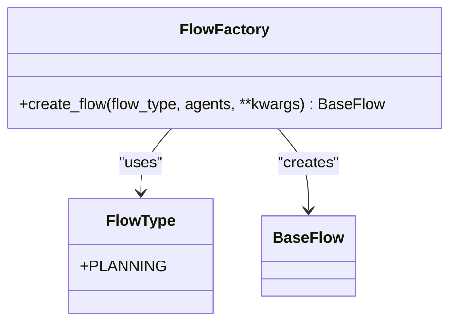
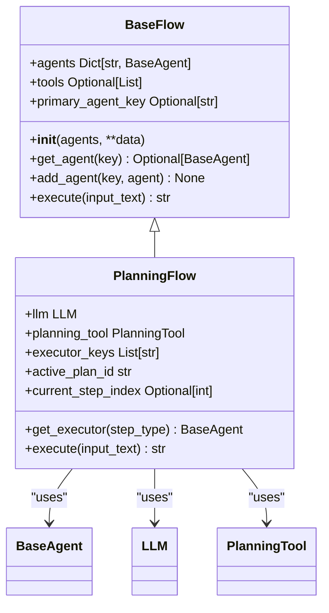
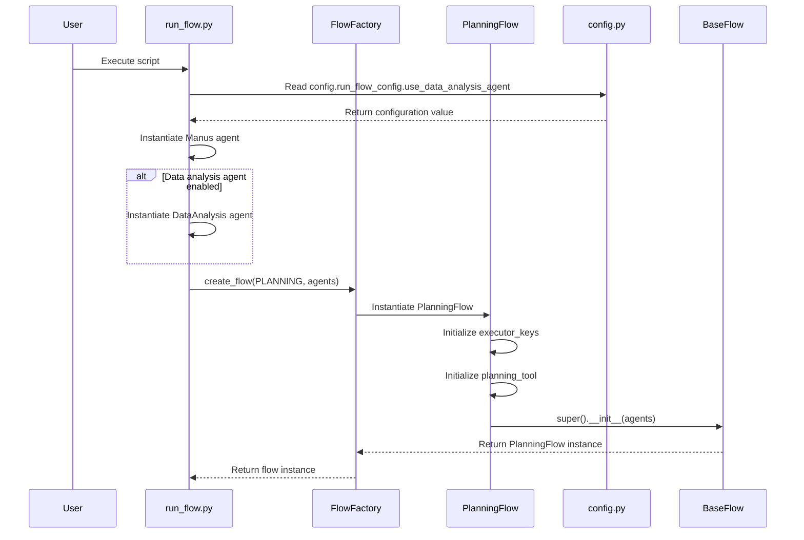
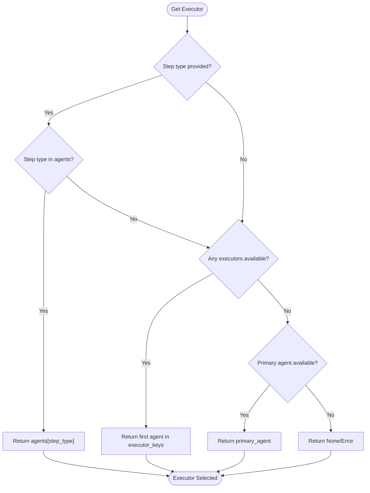
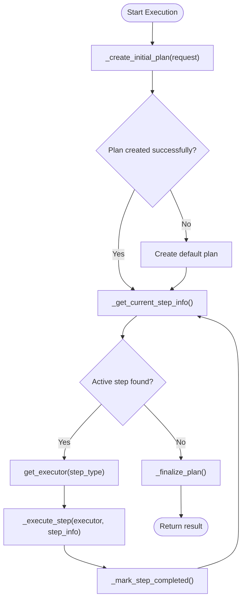
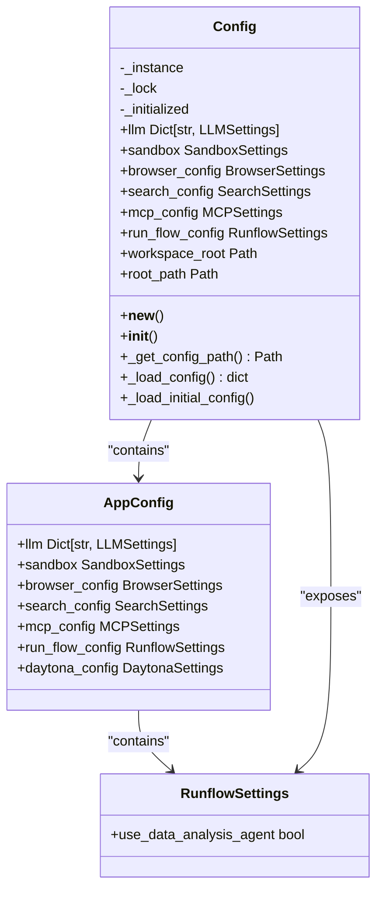

# Workflow Orchestration

<cite>
**Referenced Files in This Document**   
- [run_flow.py](file://run_flow.py)
- [app/flow/flow_factory.py](file://app/flow/flow_factory.py)
- [app/flow/planning.py](file://app/flow/planning.py)
- [app/flow/base.py](file://app/flow/base.py)
- [app/agent/base.py](file://app/agent/base.py)
- [app/agent/manus.py](file://app/agent/manus.py)
- [app/agent/data_analysis.py](file://app/agent/data_analysis.py)
- [app/config.py](file://app/config.py)
</cite>

## Table of Contents
1. [Introduction](#introduction)
2. [FlowFactory Architecture](#flowfactory-architecture)
3. [Agent Registration and Configuration](#agent-registration-and-configuration)
4. [Flow Initialization Process](#flow-initialization-process)
5. [Executor Selection Logic](#executor-selection-logic)
6. [Orchestration Workflow](#orchestration-workflow)
7. [Error Handling and Resilience](#error-handling-and-resilience)
8. [Performance Considerations](#performance-considerations)
9. [Configuration Management](#configuration-management)

## Introduction
The OpenManus workflow orchestration system provides a robust framework for managing multi-agent workflows through the FlowFactory class. This central coordinator enables dynamic creation of agent flows based on configuration parameters, managing agent instantiation, lifecycle, and inter-agent communication. The system implements a factory pattern that allows for flexible workflow creation, with integration between run_flow.py and FlowFactory handling command-line arguments and flow initialization. The orchestration mechanism supports various agent types including Manus and DataAnalysis agents, with executor selection logic that routes tasks to appropriate agents based on step requirements and capabilities.

**Section sources**
- [run_flow.py](file://run_flow.py#L1-L52)
- [app/flow/flow_factory.py](file://app/flow/flow_factory.py#L1-L29)

## FlowFactory Architecture
The FlowFactory class serves as the central coordinator for multi-agent workflows in OpenManus, implementing a factory pattern for dynamic flow creation. This class provides a static method `create_flow` that instantiates different types of flows based on the specified FlowType parameter. The factory maintains a registry of flow types mapped to their corresponding implementation classes, currently supporting the PLANNING flow type which maps to the PlanningFlow class. When a flow is created, the factory validates the flow type and returns an instance of the appropriate flow class with the provided agents and configuration parameters.

**Diagram sources**
- [app/flow/flow_factory.py](file://app/flow/flow_factory.py#L12-L29)

**Section sources**
- [app/flow/flow_factory.py](file://app/flow/flow_factory.py#L12-L29)

## Agent Registration and Configuration
Agents are registered and configured through the FlowFactory system by passing them as parameters during flow creation. The system supports multiple agent specification formats including single agents, lists of agents, and dictionaries with named agents. When agents are provided in non-dictionary formats, the system automatically assigns keys ("default" for single agents, "agent_0", "agent_1", etc. for lists). The PlanningFlow class extends this functionality by allowing specific executor agents to be designated through the "executors" parameter in the kwargs, which maps to the executor_keys field. This enables fine-grained control over which agents can execute specific steps in the workflow.

**Diagram sources**
- [app/flow/base.py](file://app/flow/base.py#L8-L56)
- [app/flow/planning.py](file://app/flow/planning.py#L44-L441)

**Section sources**
- [app/flow/base.py](file://app/flow/base.py#L8-L56)
- [app/flow/planning.py](file://app/flow/planning.py#L44-L441)

## Flow Initialization Process
The flow initialization process begins in run_flow.py where command-line arguments are processed and agents are instantiated based on configuration settings. The main execution starts with the run_flow function, which creates a dictionary of agents including the primary Manus agent and optionally the DataAnalysis agent based on the use_data_analysis_agent configuration flag. This agent dictionary is then passed to the FlowFactory.create_flow method along with the FlowType.PLANNING parameter to create a PlanningFlow instance. The PlanningFlow constructor processes the agent dictionary, sets up executor keys, and initializes the planning tool before calling the parent BaseFlow constructor to complete the initialization.

**Diagram sources**
- [run_flow.py](file://run_flow.py#L1-L52)
- [app/flow/flow_factory.py](file://app/flow/flow_factory.py#L12-L29)
- [app/flow/planning.py](file://app/flow/planning.py#L53-L74)
- [app/config.py](file://app/config.py#L1-L372)

**Section sources**
- [run_flow.py](file://run_flow.py#L1-L52)
- [app/flow/flow_factory.py](file://app/flow/flow_factory.py#L12-L29)
- [app/flow/planning.py](file://app/flow/planning.py#L53-L74)
- [app/config.py](file://app/config.py#L1-L372)

## Executor Selection Logic
The executor selection logic in OpenManus is implemented through the get_executor method in the PlanningFlow class, which determines the appropriate agent for executing each step in the workflow. The selection process follows a hierarchical approach: first checking if a specific step type matches an agent key, then using the first available executor from the executor_keys list, and finally falling back to the primary agent. This logic allows for dynamic routing of tasks to specialized agents based on step requirements. For example, steps marked with [python] or [browser] can be automatically routed to agents with those capabilities, while general steps are handled by the primary agent.

**Diagram sources**
- [app/flow/planning.py](file://app/flow/planning.py#L76-L91)

**Section sources**
- [app/flow/planning.py](file://app/flow/planning.py#L76-L91)

## Orchestration Workflow
The orchestration workflow in OpenManus follows a structured process from plan creation to execution and finalization. The workflow begins with the creation of an initial plan through the _create_initial_plan method, which uses the LLM and PlanningTool to generate a structured plan based on the user request. The system then enters a loop where it identifies the current step to execute, selects the appropriate executor agent, and executes the step with proper context. Each step execution includes updating the plan status to "in_progress" and then "completed" upon successful execution. The workflow continues until all steps are completed, at which point the _finalize_plan method generates a summary of the completed work.

**Diagram sources**
- [app/flow/planning.py](file://app/flow/planning.py#L93-L133)

**Section sources**
- [app/flow/planning.py](file://app/flow/planning.py#L93-L133)

## Error Handling and Resilience
The workflow orchestration system implements comprehensive error handling and resilience mechanisms to address common orchestration issues. The system handles agent initialization failures through try-catch blocks in the run_flow function and proper initialization checks in agent classes. Resource contention is managed through the cleanup methods in both agent and flow classes, which ensure proper release of resources like browser instances and MCP server connections. Execution sequencing errors are mitigated through the step status tracking system, which maintains the state of each step (not_started, in_progress, completed, blocked) and prevents race conditions. The system also includes timeout handling with a 60-minute limit for the entire execution process.

**Section sources**
- [run_flow.py](file://run_flow.py#L1-L52)
- [app/agent/base.py](file://app/agent/base.py#L1-L196)
- [app/agent/manus.py](file://app/agent/manus.py#L1-L165)

## Performance Considerations
The workflow orchestration system incorporates several performance optimizations for managing concurrent agent instances and optimizing memory usage during long-running workflows. The system limits the maximum number of steps for each agent (10-20 steps) to prevent infinite loops and excessive resource consumption. Memory usage is controlled through the max_observe parameter which limits the length of tool execution results stored in memory. The system also implements proper cleanup mechanisms that release resources when agents are no longer needed, including browser instances and MCP server connections. For long-running workflows, the system uses asynchronous execution with proper timeout handling to prevent hanging processes.

**Section sources**
- [app/agent/base.py](file://app/agent/base.py#L1-L196)
- [app/agent/manus.py](file://app/agent/manus.py#L1-L165)
- [app/agent/data_analysis.py](file://app/agent/data_analysis.py#L1-L37)

## Configuration Management
Configuration management in OpenManus is handled through the Config class and config.toml files, which control various aspects of the workflow orchestration system. The RunflowSettings class specifically manages the use_data_analysis_agent flag that determines whether the DataAnalysis agent is included in the workflow. The singleton Config class ensures consistent configuration access throughout the application, with lazy loading and thread-safe initialization. Configuration values are loaded from TOML files with support for example configurations, and the system provides default values for optional settings to ensure robust operation even with minimal configuration.

**Diagram sources**
- [app/config.py](file://app/config.py#L1-L372)

**Section sources**
- [app/config.py](file://app/config.py#L1-L372)