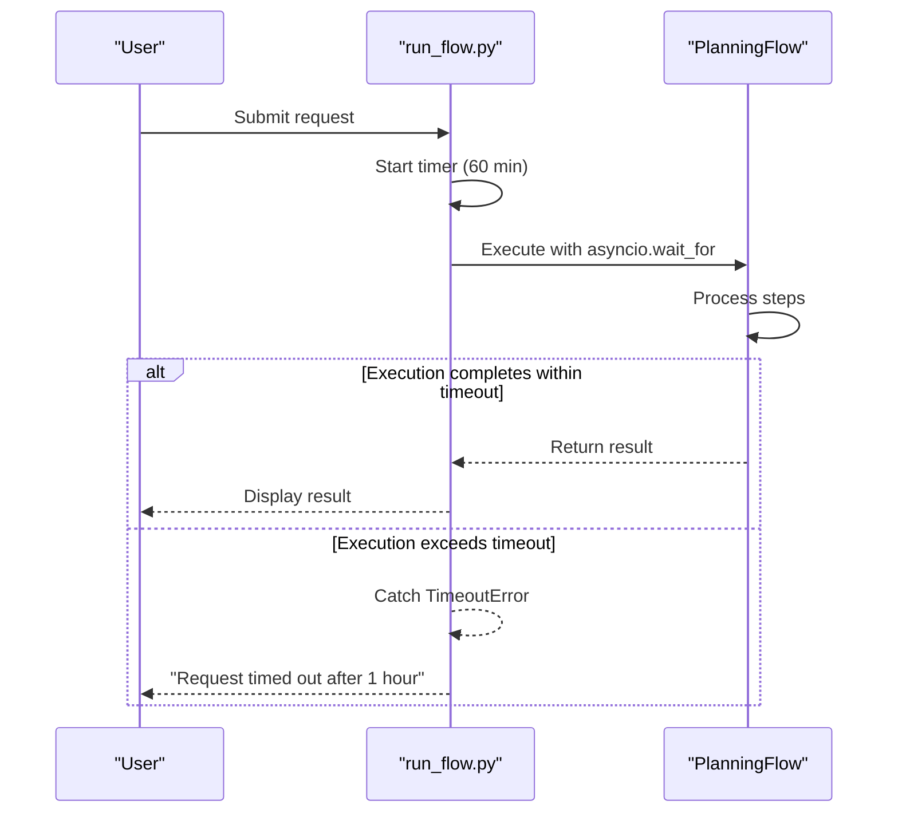
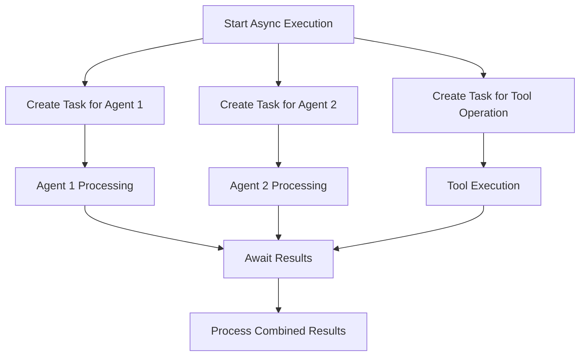
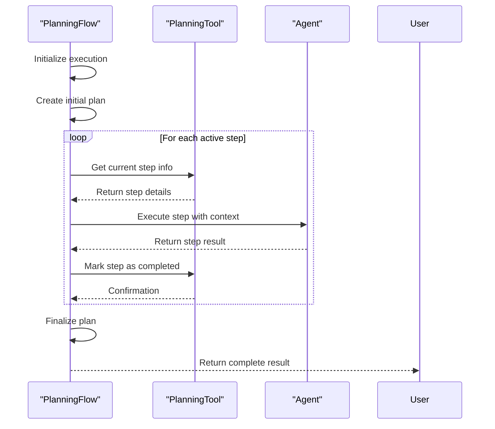
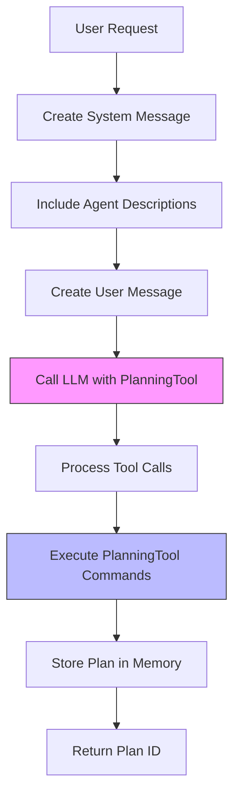
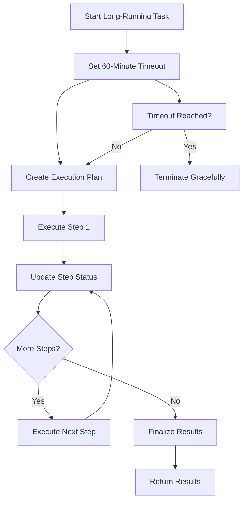
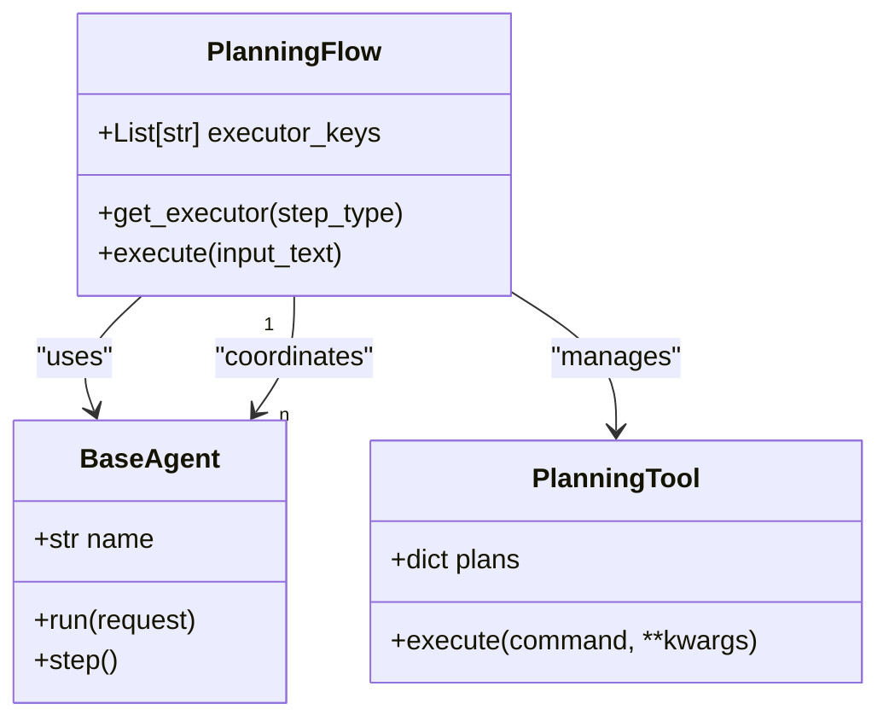
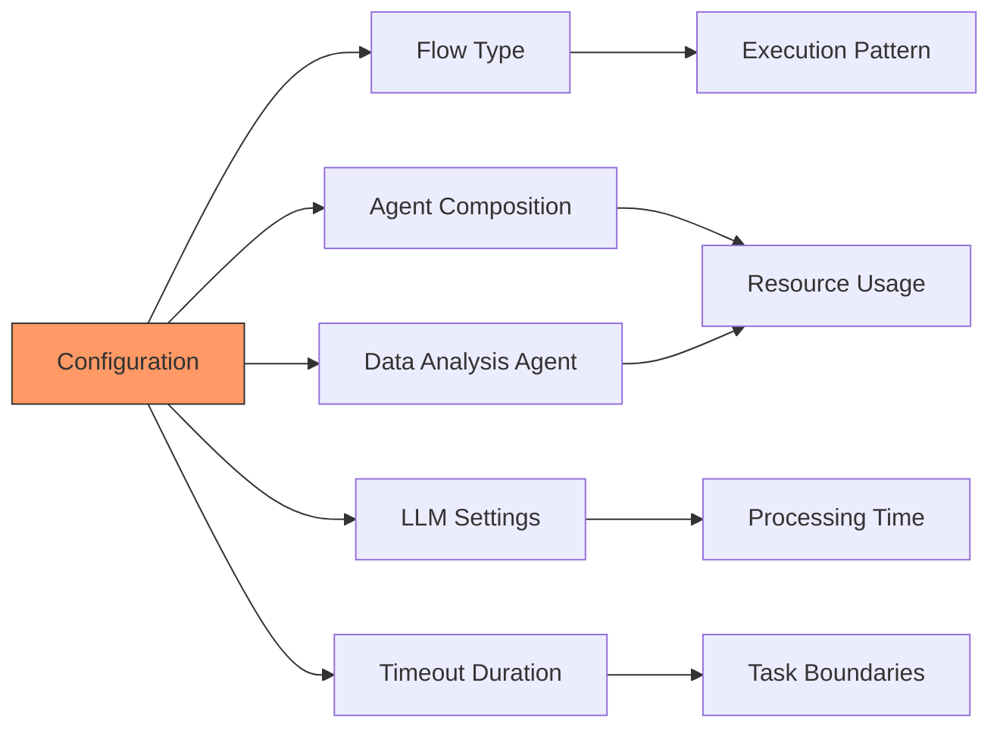

# Performance Optimization

<cite>
**Referenced Files in This Document**   
- [run_flow.py](file://run_flow.py)
- [planning.py](file://app/flow/planning.py)
- [base.py](file://app/agent/base.py)
- [tool/planning.py](file://app/tool/planning.py)
- [llm.py](file://app/llm.py)
</cite>

## Table of Contents
1. [Introduction](#introduction)
2. [Timeout Mechanism](#timeout-mechanism)
3. [Resource Management with Asyncio](#resource-management-with-asyncio)
4. [PlanningFlow Execution Workflow](#planningflow-execution-workflow)
5. [Performance Considerations in Plan Creation](#performance-considerations-in-plan-creation)
6. [Long-Running Task Management](#long-running-task-management)
7. [Multi-Agent Coordination](#multi-agent-coordination)
8. [Configuration Impact on Performance](#configuration-impact-on-performance)
9. [Best Practices for Agent Workflows](#best-practices-for-agent-workflows)
10. [Conclusion](#conclusion)

## Introduction
OpenManus implements a comprehensive performance optimization framework designed to handle complex, long-running tasks while maintaining system stability and responsiveness. The system employs multiple strategies to optimize performance, including execution timeouts, asynchronous processing, efficient agent coordination, and intelligent resource management. This document details the key performance optimization techniques implemented in OpenManus, focusing on the timeout mechanism, resource management strategies, planning system optimizations, and best practices for agent workflow design.

## Timeout Mechanism
OpenManus implements a robust 60-minute execution timeout mechanism in the `run_flow.py` file to prevent runaway processes and ensure system stability. This timeout is enforced using Python's `asyncio.wait_for` function, which wraps the entire flow execution process and terminates it if it exceeds the specified duration.

The timeout mechanism serves several critical purposes:
- Prevents infinite loops or excessively long-running processes from consuming system resources
- Provides a predictable execution boundary for user requests
- Enables graceful error handling when tasks exceed reasonable time limits
- Maintains system responsiveness by preventing single requests from monopolizing resources

When the 3600-second timeout is reached, the system raises an `asyncio.TimeoutError` exception, which is caught and handled by logging an appropriate error message and providing user feedback to simplify their request. This approach ensures that even if a task encounters unexpected delays or enters an infinite loop, it will not compromise the overall system stability.

**Diagram sources**
- [run_flow.py](file://run_flow.py#L30-L40)

**Section sources**
- [run_flow.py](file://run_flow.py#L30-L40)

## Resource Management with Asyncio
OpenManus leverages Python's asyncio framework for efficient resource management and concurrent execution of tasks. The system uses asynchronous programming patterns throughout its architecture to maximize resource utilization while minimizing blocking operations.

Key asyncio implementations include:
- Asynchronous agent execution through the `run()` method in `BaseAgent`
- Non-blocking I/O operations for tool execution and external service calls
- Concurrent processing of multiple steps in the planning workflow
- Efficient handling of LLM interactions without blocking the event loop

The use of asyncio enables OpenManus to handle multiple operations concurrently within a single thread, reducing memory overhead compared to multi-threaded approaches. This is particularly important when coordinating multiple agents and managing complex planning workflows, as it allows the system to make progress on multiple fronts simultaneously without the complexity and resource overhead of thread management.

**Diagram sources**
- [base.py](file://app/agent/base.py#L115-L153)
- [planning.py](file://app/flow/planning.py#L110-L137)

**Section sources**
- [base.py](file://app/agent/base.py#L115-L153)
- [planning.py](file://app/flow/planning.py#L110-L137)

## PlanningFlow Execution Workflow
The PlanningFlow class implements an optimized execution workflow that efficiently manages the step-by-step processing of complex tasks. The workflow follows a structured approach to ensure reliable and performant execution.

The execution process begins with plan creation, where the system generates a structured plan based on the user request. This is followed by iterative step execution, where each step is processed in sequence with proper state management. The workflow includes several performance optimizations:

- Efficient step status tracking using the PlanningTool
- Minimal LLM calls during execution by leveraging cached plan information
- Direct access to plan data from storage when possible
- Optimized error handling to prevent workflow interruption

The PlanningFlow executes steps in a loop, retrieving the current step information, executing it with the appropriate agent, and updating the step status upon completion. This structured approach ensures that resources are used efficiently and that the system maintains a clear understanding of the current execution state.

**Diagram sources**
- [planning.py](file://app/flow/planning.py#L93-L133)
- [planning.py](file://app/flow/planning.py#L276-L303)

**Section sources**
- [planning.py](file://app/flow/planning.py#L93-L133)
- [planning.py](file://app/flow/planning.py#L276-L303)

## Performance Considerations in Plan Creation
The plan creation process in OpenManus incorporates several performance optimizations to minimize LLM calls and ensure efficient plan generation. When creating an initial plan, the system uses the LLM with the PlanningTool to generate a structured plan based on the user request.

Key performance considerations in plan creation include:
- Optimizing system messages to focus on clarity and efficiency
- Providing agent descriptions to enable appropriate step assignment
- Using tool calls to structure the planning process
- Implementing fallback mechanisms for robustness

The system creates a system message that instructs the LLM to create concise, actionable plans with clear steps, focusing on key milestones rather than detailed sub-steps. This guidance helps minimize the complexity of the generated plans and reduces the number of steps that need to be executed.

When multiple agents are available, their descriptions are included in the system message to help the LLM assign steps appropriately. This agent-aware planning enables more efficient task distribution and execution.

**Diagram sources**
- [planning.py](file://app/flow/planning.py#L135-L210)
- [tool/planning.py](file://app/tool/planning.py#L50-L100)

**Section sources**
- [planning.py](file://app/flow/planning.py#L135-L210)
- [tool/planning.py](file://app/tool/planning.py#L50-L100)

## Long-Running Task Management
OpenManus implements sophisticated long-running task management through its PlanningFlow architecture and timeout mechanisms. The system is designed to handle extended operations while maintaining responsiveness and preventing resource exhaustion.

The primary mechanism for managing long-running tasks is the 60-minute timeout implemented in `run_flow.py`. This timeout ensures that no single request can consume resources indefinitely. Additionally, the PlanningFlow's step-by-step execution model allows for natural breakpoints in processing, enabling the system to track progress and manage execution state effectively.

Each step in the planning workflow is executed independently, with status updates recorded through the PlanningTool. This approach provides several benefits:
- Progress can be monitored and reported to users
- Execution state is preserved even if individual steps fail
- The system can resume from the last completed step if needed
- Resource usage can be tracked per step

The combination of timeout enforcement and step-based execution creates a robust framework for managing long-running tasks while maintaining system stability and providing a good user experience.

**Diagram sources**
- [run_flow.py](file://run_flow.py#L30-L40)
- [planning.py](file://app/flow/planning.py#L93-L133)

**Section sources**
- [run_flow.py](file://run_flow.py#L30-L40)
- [planning.py](file://app/flow/planning.py#L93-L133)

## Multi-Agent Coordination
OpenManus employs an efficient multi-agent coordination strategy through the PlanningFlow's executor management system. The coordination mechanism ensures that multiple agents can work together effectively on complex tasks while optimizing resource utilization.

The PlanningFlow class manages agent coordination through several key mechanisms:
- Executor key management for agent selection
- Step-type based agent assignment
- Fallback strategies for agent availability
- Shared planning context across agents

The `get_executor` method in PlanningFlow determines which agent should execute each step based on the step type and available executors. If a step type matches an agent key, that agent is selected. Otherwise, the system uses the first available executor from the executor keys list, with a fallback to the primary agent if needed.

This coordination strategy enables specialized agents to handle tasks they are designed for while ensuring that all steps can be executed even if specific agents are unavailable. The shared planning context, provided through the current plan status in the step prompt, ensures that all agents have the necessary information to execute their steps effectively.

**Diagram sources**
- [planning.py](file://app/flow/planning.py#L76-L91)
- [base.py](file://app/agent/base.py#L115-L153)

**Section sources**
- [planning.py](file://app/flow/planning.py#L76-L91)
- [base.py](file://app/agent/base.py#L115-L153)

## Configuration Impact on Performance
Various configuration options in OpenManus significantly impact system performance and execution characteristics. These configurations allow users and administrators to tailor the system's behavior to their specific needs and resource constraints.

Key configuration options affecting performance include:
- Flow type selection through FlowFactory
- Agent composition and availability
- Data analysis agent usage
- LLM settings and token limits
- Timeout duration

The `run_flow.py` file demonstrates how configuration affects performance through the conditional inclusion of the data analysis agent based on `config.run_flow_config.use_data_analysis_agent`. This allows users to enable or disable resource-intensive agents based on their specific requirements.

The FlowFactory pattern enables selection of different flow types, potentially with different performance characteristics. Currently implementing the PLANNING flow type, this architecture supports future expansion with alternative flow implementations optimized for different use cases.

LLM configuration, managed through the LLM class, also significantly impacts performance. Settings such as model choice, token limits, and temperature affect both the quality of results and the computational resources required for execution.

**Section sources**
- [run_flow.py](file://run_flow.py#L10-L15)
- [flow_factory.py](file://app/flow/flow_factory.py#L20-L30)
- [llm.py](file://app/llm.py#L150-L200)

## Best Practices for Agent Workflows
To optimize agent workflows in OpenManus, several best practices should be followed to ensure efficient execution and optimal performance.

### Task Decomposition
Proper task decomposition is critical for effective planning and execution. Tasks should be broken down into discrete, actionable steps that can be executed independently. The PlanningFlow system encourages this through its step-based execution model, where each step is processed separately with clear status tracking.

When creating plans, focus on key milestones rather than detailed sub-steps to maintain clarity and efficiency. This approach reduces the cognitive load on the LLM during plan creation and minimizes the number of execution steps required.

### Efficient Use of Planning Tools
The PlanningTool should be used strategically to manage plan state and coordinate execution. Key practices include:
- Creating concise plans with clear, actionable steps
- Using step types to guide agent selection
- Regularly updating step status to maintain accurate progress tracking
- Leveraging plan notes for important execution context

### Agent Specialization
Design agents with specific capabilities and responsibilities to enable effective task distribution. The executor key system in PlanningFlow allows for step-type based agent selection, making it beneficial to create specialized agents for different types of tasks (e.g., data analysis, web browsing, code execution).

### Resource Awareness
Be mindful of resource constraints when designing agent workflows. Consider the following:
- Set appropriate timeouts for different types of operations
- Monitor token usage when interacting with LLMs
- Implement fallback mechanisms for robustness
- Use asynchronous execution to maximize resource utilization

These best practices ensure that agent workflows are efficient, reliable, and scalable, maximizing the performance benefits of the OpenManus architecture.

**Section sources**
- [planning.py](file://app/flow/planning.py#L44-L441)
- [tool/planning.py](file://app/tool/planning.py#L50-L100)
- [base.py](file://app/agent/base.py#L115-L153)

## Conclusion
OpenManus implements a comprehensive set of performance optimization techniques designed to handle complex, long-running tasks efficiently while maintaining system stability. The 60-minute timeout mechanism in `run_flow.py` prevents runaway processes and ensures predictable execution boundaries. Asynchronous execution with asyncio enables efficient resource management and concurrent processing of multiple operations.

The PlanningFlow architecture optimizes performance through step-by-step execution, efficient agent coordination, and minimal LLM calls during plan creation. The system handles long-running tasks through its structured workflow and timeout enforcement, while multi-agent scenarios are managed through intelligent executor selection and shared planning context.

Configuration options provide flexibility in balancing performance and capabilities, allowing users to tailor the system to their specific needs. By following best practices for task decomposition, planning tool usage, agent specialization, and resource awareness, users can maximize the performance and effectiveness of their agent workflows in OpenManus.