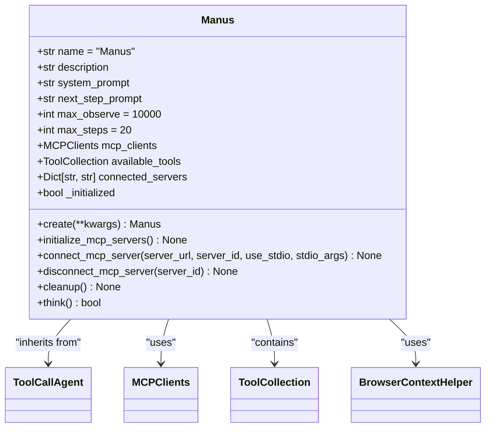
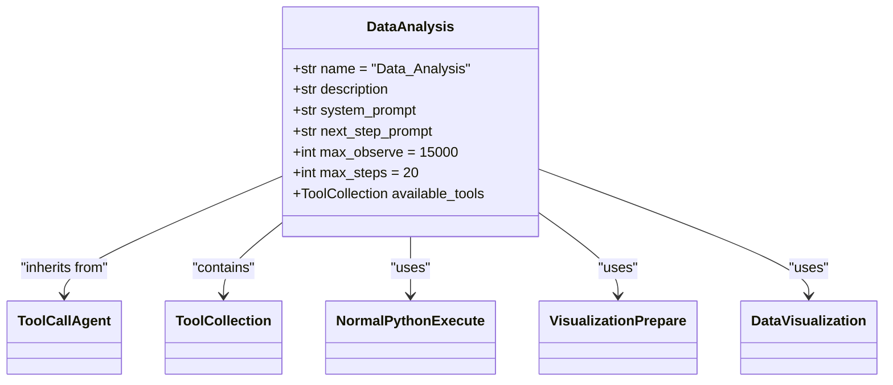
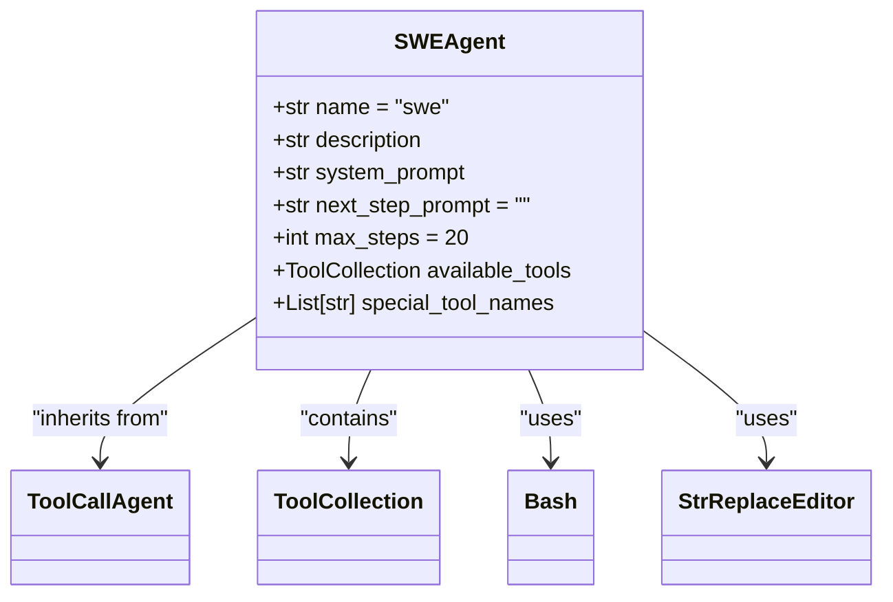
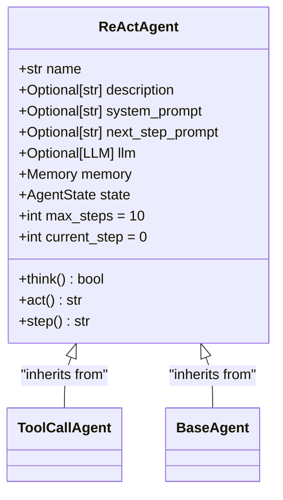
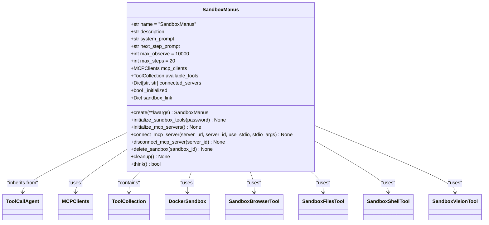

# Agent Types

<cite>
**Referenced Files in This Document**   
- [manus.py](file://app/agent/manus.py)
- [data_analysis.py](file://app/agent/data_analysis.py)
- [swe.py](file://app/agent/swe.py)
- [react.py](file://app/agent/react.py)
- [sandbox_agent.py](file://app/agent/sandbox_agent.py)
- [toolcall.py](file://app/agent/toolcall.py)
- [base.py](file://app/agent/base.py)
- [mcp.py](file://app/tool/mcp.py)
- [python_execute.py](file://app/tool/python_execute.py)
- [data_visualization.py](file://app/tool/chart_visualization/data_visualization.py)
- [sandbox.py](file://app/sandbox/core/sandbox.py)
- [manus.py](file://app/prompt/manus.py)
- [swe.py](file://app/prompt/swe.py)
- [visualization.py](file://app/prompt/visualization.py)
</cite>

## Table of Contents
1. [Manus Agent](#manus-agent)
2. [Data Analysis Agent](#data-analysis-agent)
3. [SWE Agent](#swe-agent)
4. [React Agent](#react-agent)
5. [Sandbox Agent](#sandbox-agent)
6. [Agent Comparison and Usage Guidelines](#agent-comparison-and-usage-guidelines)

## Manus Agent

The Manus agent serves as the primary general-purpose agent in OpenManus, designed to handle a wide variety of tasks through its extensive toolset and MCP (Model Context Protocol) integration. As a subclass of ToolCallAgent, Manus inherits robust tool execution capabilities while extending them with additional functionality for versatile task solving.

The agent is initialized through the `create()` factory method, which ensures proper asynchronous initialization of MCP servers before the agent becomes operational. This initialization process connects to configured MCP servers of type "sse" (Server-Sent Events) or "stdio" (Standard Input/Output), establishing connections to remote tool providers and integrating their capabilities into the agent's available tools collection.

Manus comes equipped with a comprehensive set of local tools including PythonExecute for code execution, BrowserUseTool for web browsing, StrReplaceEditor for text manipulation, AskHuman for user interaction, and Terminate for ending sessions. These tools are combined with MCP-provided tools, creating a hybrid capability set that can address both local and remote task requirements. The agent maintains a connection registry (`connected_servers`) to track active MCP server connections and can dynamically add or remove tools as connections are established or terminated.

The agent's behavior is guided by system and next-step prompts defined in `app/prompt/manus.py`, which instruct it to proactively select appropriate tools and break down complex tasks into manageable steps. With configurable limits on observation size (max_observe=10000) and execution steps (max_steps=20), Manus balances thoroughness with efficiency in task execution.

**Diagram sources**
- [manus.py](file://app/agent/manus.py#L17-L164)

**Section sources**
- [manus.py](file://app/agent/manus.py#L17-L164)
- [manus.py](file://app/prompt/manus.py#L1-L10)

## Data Analysis Agent

The Data Analysis Agent is a specialized agent designed specifically for data processing, visualization, and reporting tasks. Built on the same ToolCallAgent foundation as the Manus agent, it focuses its capabilities on data-centric operations through a curated set of tools optimized for analytical workflows.

This agent is configured with a higher observation limit (max_observe=15000) compared to other agents, accommodating the typically larger outputs generated by data analysis operations. Its toolset includes NormalPythonExecute for running data processing scripts, VisualizationPrepare for preparing visualization data, and DataVisualization for generating charts and insights. The agent also includes the Terminate tool for session management.

The Data Analysis Agent operates with prompts defined in `app/prompt/visualization.py` that guide it through a structured analytical process: breaking down problems, selecting appropriate tools step by step, explaining execution results, and suggesting next steps. When errors occur during observation, the agent is instructed to review and fix issues, promoting resilience in the analysis process.

A key component of this agent's functionality is the DataVisualization tool, which can generate charts in multiple formats (PNG for static images, HTML for interactive visualizations) and optionally add analytical insights to the visualizations. The tool supports both English and Chinese output, making it accessible to a broader user base. The agent is particularly effective for tasks involving CSV data analysis, statistical visualization, and automated report generation.

**Diagram sources**
- [data_analysis.py](file://app/agent/data_analysis.py#L1-L37)

**Section sources**
- [data_analysis.py](file://app/agent/data_analysis.py#L1-L37)
- [visualization.py](file://app/prompt/visualization.py#L1-L10)
- [data_visualization.py](file://app/tool/chart_visualization/data_visualization.py#L1-L263)

## SWE Agent

The SWE (Software Engineering) Agent is purpose-built for code generation and modification tasks, implementing a specialized paradigm for direct computer interaction to solve programming challenges. Unlike more general agents, the SWE Agent operates with a distinct workflow optimized for software development tasks.

This agent is configured with prompts in `app/prompt/swe.py` that establish a specific operating environment: a command-line interface with a file editor showing a limited window of code. The prompts emphasize the importance of proper indentation in code, warning that incorrectly indented code will fail. The agent is instructed to include exactly one tool call per response, preventing the execution of multiple commands simultaneously and ensuring clear, traceable execution steps.

The SWE Agent's toolset is deliberately focused on core development operations: Bash for command-line operations, StrReplaceEditor for precise code modifications, and Terminate for ending sessions. Notably absent are tools like PythonExecute that might encourage interactive coding sessions; instead, the agent is designed to work through file-based editing and command execution, mirroring professional software development workflows.

The agent's system prompt explicitly prohibits the use of interactive session commands like python or vim, ensuring that all code execution follows a non-interactive, scriptable pattern. This design choice enhances reproducibility and reduces the risk of getting stuck in interactive sessions that cannot be automated.

**Diagram sources**
- [swe.py](file://app/agent/swe.py#L1-L24)

**Section sources**
- [swe.py](file://app/agent/swe.py#L1-L24)
- [swe.py](file://app/prompt/swe.py#L1-L22)

## React Agent

The React Agent represents a foundational agent type in OpenManus, implementing the ReAct (Reason + Act) paradigm for step-by-step problem solving. Rather than being a concrete agent itself, ReActAgent serves as an abstract base class that defines the core thinking and acting pattern used by many specialized agents in the system.

This agent type follows a structured execution loop where each step consists of two phases: thinking and acting. The `think()` method processes the current state and decides on the next actions, while the `act()` method executes those actions. This separation enables a deliberate, reflective approach to problem solving, where the agent can consider its options before taking action.

The ReActAgent class defines essential attributes for state management including name, description, system and next-step prompts, an LLM instance, memory for conversation history, and execution controls like max_steps and current_step. It also maintains the agent's state (IDLE, RUNNING, FINISHED, ERROR) throughout its lifecycle.

Subclasses must implement the abstract `think()` and `act()` methods, ensuring that all derived agents follow the same fundamental pattern while customizing the specific reasoning and action logic. The `step()` method orchestrates the thinking and acting process, providing a consistent interface for single-step execution across all ReAct-based agents.

**Diagram sources**
- [react.py](file://app/agent/react.py#L1-L38)

**Section sources**
- [react.py](file://app/agent/react.py#L1-L38)

## Sandbox Agent

The Sandbox Agent (SandboxManus) provides isolated code execution capabilities, allowing potentially unsafe operations to be performed in a controlled environment. This agent extends the general-purpose Manus agent with specialized sandbox tools while removing direct access to potentially risky local tools like PythonExecute.

Initialized through the `create()` factory method, the SandboxManus agent first establishes connections to MCP servers (like its parent Manus agent) and then initializes sandbox tools by creating a new sandbox environment. The sandbox creation process involves setting up a Docker container with specific resource limits (CPU, memory), network configuration, and volume bindings to enable secure file operations.

The agent's toolset includes sandbox-specific tools: SandboxBrowserTool for web browsing within the sandbox, SandboxFilesTool for file operations, SandboxShellTool for command execution, and SandboxVisionTool for visual processing. These tools operate within the isolated environment, preventing direct access to the host system while still providing comprehensive functionality.

A key feature of the Sandbox Agent is its ability to provide access to the sandbox environment through VNC and web interfaces, allowing users to visually monitor the execution environment. The agent maintains a registry of sandbox links (`sandbox_link`) to track these access points for each created sandbox.

The agent implements proper cleanup procedures through its `cleanup()` method, which terminates the sandbox container and disconnects from MCP servers, ensuring that resources are properly released when the agent session ends.

**Diagram sources**
- [sandbox_agent.py](file://app/agent/sandbox_agent.py#L1-L223)
- [sandbox.py](file://app/sandbox/core/sandbox.py#L1-L462)

**Section sources**
- [sandbox_agent.py](file://app/agent/sandbox_agent.py#L1-L223)
- [sandbox.py](file://app/sandbox/core/sandbox.py#L1-L462)

## Agent Comparison and Usage Guidelines

OpenManus provides a diverse set of agent types, each optimized for specific categories of tasks. Understanding the strengths and appropriate use cases for each agent enables effective workflow design and optimal task execution.

The Manus agent serves as the default choice for general-purpose tasks, combining local tool execution with MCP integration. It's ideal for multi-step workflows that require web browsing, file manipulation, and access to remote services. When a task's requirements are unclear or span multiple domains, starting with the Manus agent provides the broadest capability set.

For data-intensive tasks involving statistical analysis, visualization, or report generation, the Data Analysis Agent is the preferred choice. Its specialized tools and higher observation limits make it particularly effective for processing large datasets and generating visual insights. This agent excels when the primary goal is to transform raw data into meaningful visual representations and analytical conclusions.

The SWE Agent is specifically designed for software engineering tasks, particularly those involving code modification in existing codebases. Its strict adherence to single-command execution and focus on file-based editing makes it ideal for precise code changes, refactoring, and debugging tasks where control and reproducibility are paramount.

The React Agent pattern underlies many agents in the system, providing the foundational reasoning framework. While not used directly, understanding this pattern helps in designing custom agents that follow the same deliberate, step-by-step problem-solving approach.

The Sandbox Agent addresses security and isolation requirements, making it essential for executing untrusted code or performing operations that should be contained within a controlled environment. It's particularly valuable when testing potentially harmful code, working with sensitive data, or when the execution environment needs to be preserved for auditing purposes.

Agents can be combined in workflows to leverage their complementary strengths. For example, a workflow might begin with a Manus agent for initial analysis and planning, then delegate specific data visualization tasks to the Data Analysis Agent, and finally use the Sandbox Agent to safely execute any generated code. The MCP integration allows tools to be shared across agents, enabling seamless handoffs between specialized agents while maintaining access to a common set of capabilities.