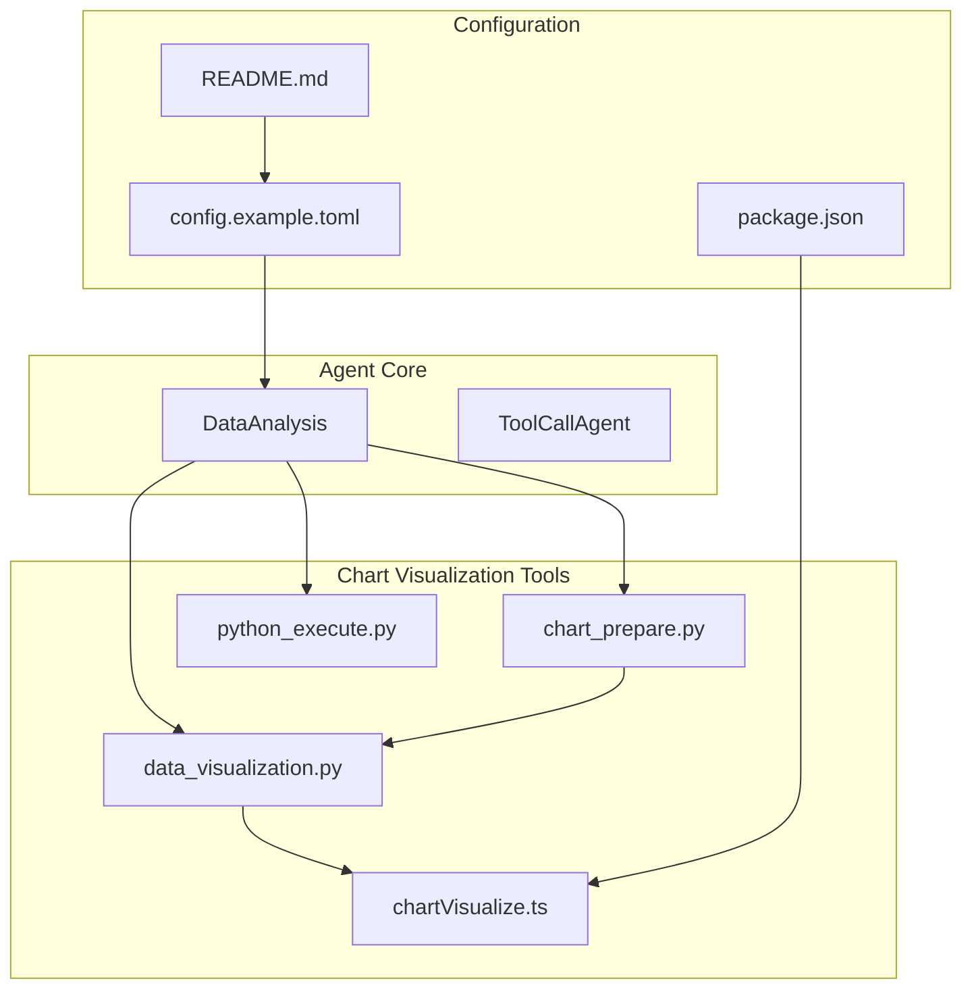
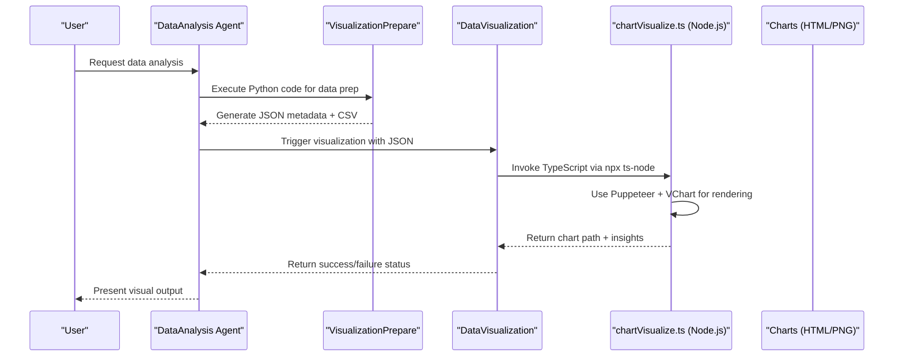
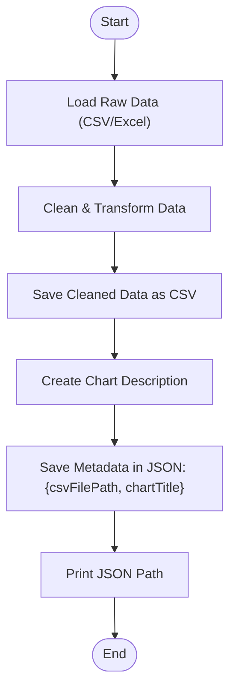
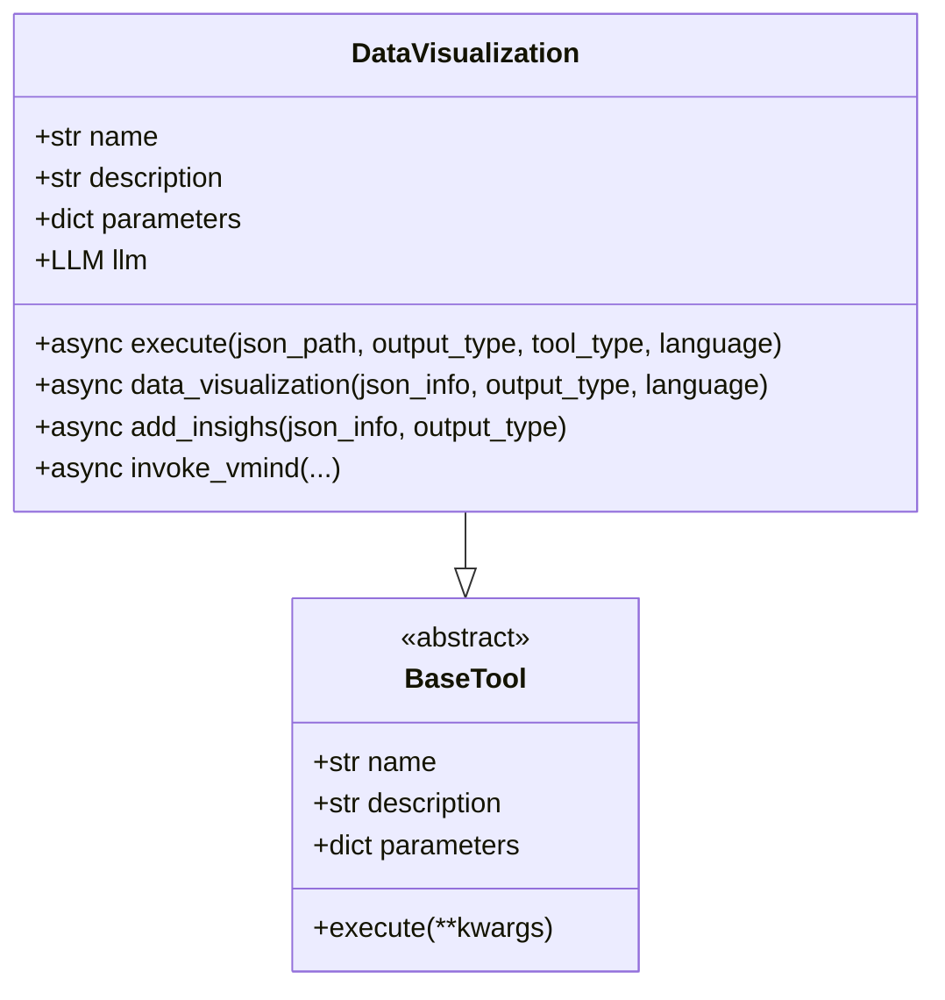
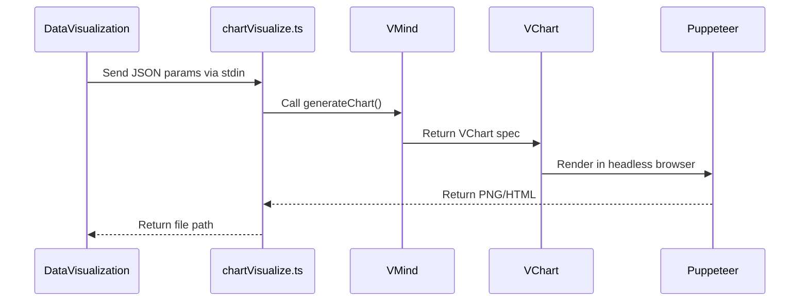

# Data Analysis Agent

<cite>
**Referenced Files in This Document**   
- [data_analysis.py](file://app/agent/data_analysis.py)
- [chart_prepare.py](file://app/tool/chart_visualization/chart_prepare.py)
- [data_visualization.py](file://app/tool/chart_visualization/data_visualization.py)
- [python_execute.py](file://app/tool/chart_visualization/python_execute.py)
- [chartVisualize.ts](file://app/tool/chart_visualization/src/chartVisualize.ts)
- [README.md](file://README.md)
- [config.example.toml](file://config/config.example.toml)
- [package.json](file://app/tool/chart_visualization/package.json)
</cite>

## Table of Contents
1. [Introduction](#introduction)
2. [Project Structure](#project-structure)
3. [Core Components](#core-components)
4. [Architecture Overview](#architecture-overview)
5. [Detailed Component Analysis](#detailed-component-analysis)
6. [Dependency Analysis](#dependency-analysis)
7. [Performance Considerations](#performance-considerations)
8. [Troubleshooting Guide](#troubleshooting-guide)
9. [Conclusion](#conclusion)

## Introduction
The Data Analysis Agent in OpenManus is a specialized component designed to process, analyze, and visualize structured data. It enables users to extract meaningful insights from datasets through automated workflows that combine Python-based data processing with advanced visualization capabilities. The agent operates within a sandboxed environment to ensure safe execution of code and leverages a suite of tools for data transformation, chart generation, and insight extraction. This document details its integration with the chart_visualization tool suite, configuration requirements, dependencies, and best practices for effective usage.

## Project Structure
The Data Analysis Agent is organized within the OpenManus repository under the `app/agent/` directory, with supporting tools located in `app/tool/chart_visualization/`. The agent utilizes a modular architecture where each component handles specific aspects of data analysis and visualization.



**Diagram sources**
- [data_analysis.py](file://app/agent/data_analysis.py#L11-L36)
- [chart_prepare.py](file://app/tool/chart_visualization/chart_prepare.py#L3-L37)
- [data_visualization.py](file://app/tool/chart_visualization/data_visualization.py#L14-L262)
- [python_execute.py](file://app/tool/chart_visualization/python_execute.py#L4-L35)
- [chartVisualize.ts](file://app/tool/chart_visualization/src/chartVisualize.ts#L0-L372)
- [README.md](file://README.md#L0-L195)
- [config.example.toml](file://config/config.example.toml#L0-L105)
- [package.json](file://app/tool/chart_visualization/package.json#L0-L22)

**Section sources**
- [data_analysis.py](file://app/agent/data_analysis.py#L1-L38)
- [chart_prepare.py](file://app/tool/chart_visualization/chart_prepare.py#L1-L39)
- [data_visualization.py](file://app/tool/chart_visualization/data_visualization.py#L1-L264)
- [python_execute.py](file://app/tool/chart_visualization/python_execute.py#L1-L36)
- [chartVisualize.ts](file://app/tool/chart_visualization/src/chartVisualize.ts#L1-L373)
- [README.md](file://README.md#L1-L196)
- [config.example.toml](file://config/config.example.toml#L1-L106)
- [package.json](file://app/tool/chart_visualization/package.json#L1-L23)

## Core Components
The Data Analysis Agent integrates several core components to enable end-to-end data analysis workflows. These include the `DataAnalysis` class, which orchestrates tool execution, and three primary tools: `VisualizationPrepare`, `DataVisualization`, and `NormalPythonExecute`. Together, they support data loading, transformation, visualization preparation, and rendering. The agent also relies on external dependencies such as Node.js and TypeScript for frontend chart rendering via the `chartVisualize.ts` script.

**Section sources**
- [data_analysis.py](file://app/agent/data_analysis.py#L11-L36)
- [chart_prepare.py](file://app/tool/chart_visualization/chart_prepare.py#L3-L37)
- [data_visualization.py](file://app/tool/chart_visualization/data_visualization.py#L14-L262)
- [python_execute.py](file://app/tool/chart_visualization/python_execute.py#L4-L35)

## Architecture Overview
The Data Analysis Agent follows a layered architecture where high-level planning is handled by the agent itself, while specific tasks are delegated to specialized tools. Data flows from raw input through preprocessing, visualization metadata generation, and finally to chart rendering using external libraries.



**Diagram sources**
- [data_analysis.py](file://app/agent/data_analysis.py#L11-L36)
- [chart_prepare.py](file://app/tool/chart_visualization/chart_prepare.py#L3-L37)
- [data_visualization.py](file://app/tool/chart_visualization/data_visualization.py#L14-L262)
- [chartVisualize.ts](file://app/tool/chart_visualization/src/chartVisualize.ts#L0-L372)

## Detailed Component Analysis

### Data Analysis Agent Workflow
The agent processes data analysis requests by coordinating between Python execution and visualization tools. It begins with data loading and cleaning using `VisualizationPrepare`, then generates charts via `DataVisualization`.

#### Data Preparation Phase


**Diagram sources**
- [chart_prepare.py](file://app/tool/chart_visualization/chart_prepare.py#L3-L37)

#### Visualization Execution Flow


**Diagram sources**
- [data_visualization.py](file://app/tool/chart_visualization/data_visualization.py#L14-L262)

### Frontend Visualization Pipeline
The final rendering occurs in Node.js using `chartVisualize.ts`, which receives configuration from Python and uses Puppeteer to generate charts.



**Diagram sources**
- [data_visualization.py](file://app/tool/chart_visualization/data_visualization.py#L200-L262)
- [chartVisualize.ts](file://app/tool/chart_visualization/src/chartVisualize.ts#L0-L372)

## Dependency Analysis
The Data Analysis Agent depends on both Python and Node.js ecosystems. Key dependencies include pandas for data manipulation, asyncio for asynchronous operations, and external npm packages for visualization.

```mermaid
erDiagram
PYTHON_DEPENDENCIES {
string pandas
string asyncio
string pydantic
string openai
}
NODEJS_DEPENDENCIES {
string "ts-node"
string "puppeteer"
string "@visactor/vchart"
string "@visactor/vmind"
}
CONFIG_FILES {
string config.toml
string package.json
}
PYTHON_DEPENDENCIES ||--o{ DATA_ANALYSIS_AGENT : "used by"
NODEJS_DEPENDENCIES ||--o{ CHART_VISUALIZE_TS : "used by"
CONFIG_FILES ||--o{ DATA_ANALYSIS_AGENT : "configured via"
```

**Diagram sources**
- [package.json](file://app/tool/chart_visualization/package.json#L1-L23)
- [config.example.toml](file://config/config.example.toml#L1-L106)
- [data_analysis.py](file://app/agent/data_analysis.py#L1-L38)

**Section sources**
- [package.json](file://app/tool/chart_visualization/package.json#L1-L23)
- [config.example.toml](file://config/config.example.toml#L1-L106)

## Performance Considerations
When handling large datasets, the agent may experience increased memory usage and longer processing times due to data serialization between Python and Node.js environments. To optimize performance:
- Limit dataset size before visualization
- Use efficient data types in pandas
- Avoid redundant data transformations
- Prefer HTML output for interactive exploration over static PNGs
- Enable sandbox resource limits to prevent system overload

For very large datasets, consider preprocessing steps to aggregate or sample data before visualization.

## Troubleshooting Guide
Common issues include missing dependencies, incorrect file paths, and rendering timeouts.

**Section sources**
- [README.md](file://README.md#L0-L195)
- [data_visualization.py](file://app/tool/chart_visualization/data_visualization.py#L200-L262)
- [chartVisualize.ts](file://app/tool/chart_visualization/src/chartVisualize.ts#L0-L372)

### Common Issues and Solutions
| Issue | Cause | Solution |
|------|-------|----------|
| Missing Node.js modules | `npm install` not run | Run `npm install` in `app/tool/chart_visualization/` |
| Chart generation fails | Invalid JSON input | Validate JSON structure from `visualization_preparation` |
| Timeout during rendering | Large dataset or complex chart | Simplify data or reduce output resolution |
| File not found errors | Incorrect path resolution | Ensure absolute paths or correct workspace root |
| Language not supported | Invalid `language` parameter | Use only "en" or "zh" in `data_visualization` calls |

## Conclusion
The Data Analysis Agent in OpenManus provides a robust framework for automated data analysis and visualization. By integrating Python-based data processing with Node.js-powered chart rendering, it enables rich, interactive outputs from structured data inputs. Proper configuration via `config.toml` and installation of required dependencies are essential for successful operation. With appropriate handling of data size and format, the agent can effectively support a wide range of analytical tasks.