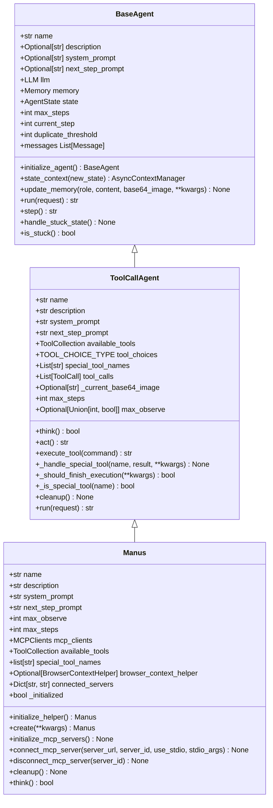
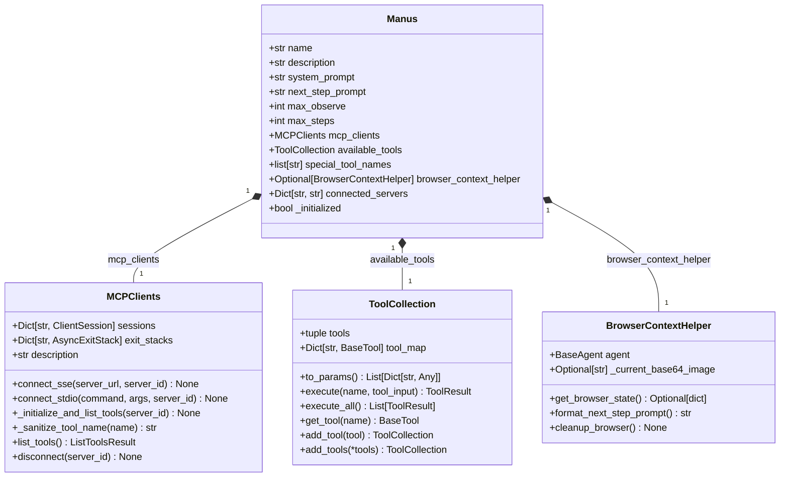
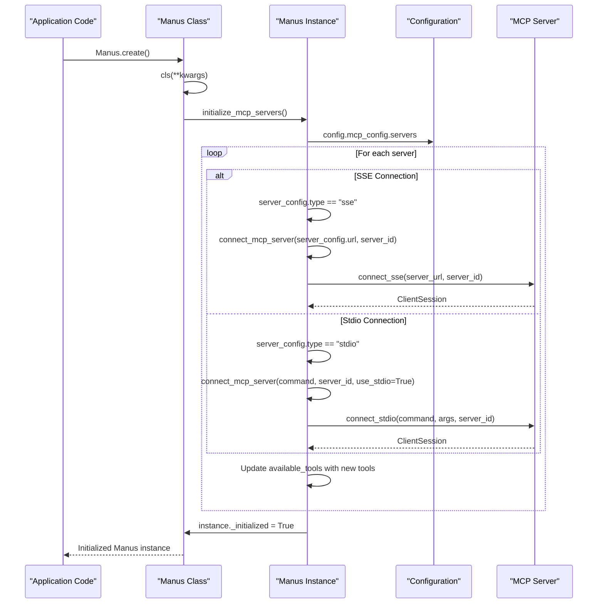
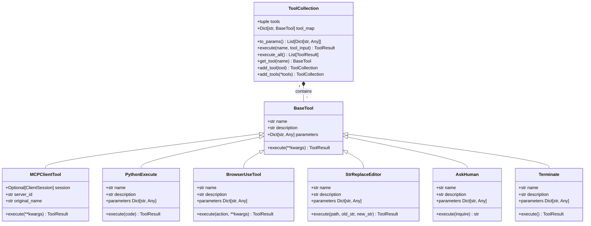
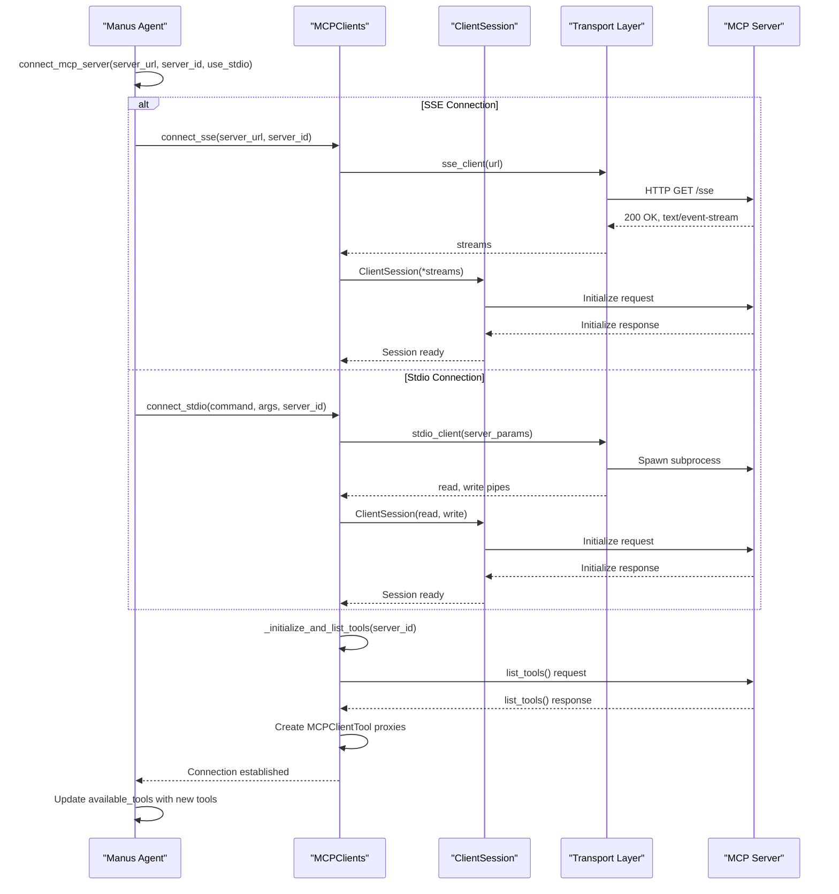

# Manus Agent

<cite>
**Referenced Files in This Document**   
- [manus.py](file://app/agent/manus.py)
- [toolcall.py](file://app/agent/toolcall.py)
- [mcp.py](file://app/tool/mcp.py)
- [browser.py](file://app/agent/browser.py)
- [tool_collection.py](file://app/tool/tool_collection.py)
- [manus.py](file://app/prompt/manus.py)
- [main.py](file://main.py)
- [config.example.toml](file://config/config.example.toml)
- [mcp.example.json](file://config/mcp.example.json)
</cite>

## Table of Contents
1. [Introduction](#introduction)
2. [Core Architecture](#core-architecture)
3. [Key Attributes and State Management](#key-attributes-and-state-management)
4. [Factory Method and Initialization Process](#factory-method-and-initialization-process)
5. [Dynamic Prompt Adjustment with think()](#dynamic-prompt-adjustment-with-think)
6. [Tool Integration and Management](#tool-integration-and-management)
7. [MCP Server Integration](#mcp-server-integration)
8. [Practical Usage Examples](#practical-usage-examples)
9. [Common Use Cases](#common-use-cases)
10. [Agent Selection Guidance](#agent-selection-guidance)
11. [Conclusion](#conclusion)

## Introduction
The Manus agent serves as the primary general-purpose AI agent within the OpenManus framework, designed to solve diverse tasks through a comprehensive toolkit that includes both local capabilities and MCP-integrated tools. As the default agent implementation, Manus provides a versatile foundation for executing complex workflows across various domains including web automation, code execution, file manipulation, and human-in-the-loop interactions. The agent's architecture emphasizes flexibility and extensibility, allowing seamless integration with external MCP servers while maintaining robust local tool capabilities. Manus operates as the central coordination point in multi-agent systems and serves as the reference implementation for specialized agents within the OpenManus ecosystem.

## Core Architecture
The Manus agent is built upon a hierarchical class structure that extends from the foundational BaseAgent through the ToolCallAgent to provide specialized functionality. This inheritance chain enables Manus to leverage the core agent capabilities while adding domain-specific enhancements for tool orchestration and state management. The agent's architecture is designed around a reactive loop where observations from tool executions inform subsequent decision-making, creating an iterative problem-solving approach. Central to this architecture is the integration of memory management, tool orchestration, and state tracking components that work in concert to maintain context across multiple steps of execution. The agent's design follows a modular pattern where distinct components handle specific responsibilities such as browser context management, MCP client coordination, and tool execution, ensuring separation of concerns and maintainability.



**Diagram sources**
- [base.py](file://app/agent/base.py#L14-L197)
- [toolcall.py](file://app/agent/toolcall.py#L17-L249)
- [manus.py](file://app/agent/manus.py#L17-L164)

**Section sources**
- [manus.py](file://app/agent/manus.py#L17-L164)
- [toolcall.py](file://app/agent/toolcall.py#L17-L249)
- [base.py](file://app/agent/base.py#L14-L197)

## Key Attributes and State Management
The Manus agent maintains several critical attributes that define its behavior and capabilities. The `available_tools` attribute serves as the central registry for all accessible tools, combining both local tools and those provided by connected MCP servers. This collection is dynamically updated as MCP servers connect and disconnect, ensuring the agent always has an accurate view of available capabilities. The `mcp_clients` attribute manages connections to external MCP servers, handling the lifecycle of these connections and providing access to remote tools. The `connected_servers` dictionary tracks active MCP server connections by their identifiers, mapping server IDs to their connection URLs or commands for reference and management purposes.

State management in Manus is handled through several mechanisms, with the `_initialized` flag playing a crucial role in ensuring proper initialization sequencing. This boolean flag prevents reinitialization of MCP servers and ensures cleanup operations are only performed when appropriate. The agent also inherits memory management capabilities from its parent classes, maintaining a history of interactions that inform decision-making. The `browser_context_helper` attribute provides specialized state management for browser-related operations, tracking the current browser state and managing associated resources.



**Diagram sources**
- [manus.py](file://app/agent/manus.py#L17-L164)
- [mcp.py](file://app/tool/mcp.py#L50-L194)
- [tool_collection.py](file://app/tool/tool_collection.py#L10-L71)
- [browser.py](file://app/agent/browser.py#L23-L129)

**Section sources**
- [manus.py](file://app/agent/manus.py#L17-L164)
- [mcp.py](file://app/tool/mcp.py#L50-L194)
- [tool_collection.py](file://app/tool/tool_collection.py#L10-L71)
- [browser.py](file://app/agent/browser.py#L23-L129)

## Factory Method and Initialization Process
The Manus agent employs a factory method pattern through its `create()` class method, which provides a standardized way to instantiate and properly initialize agent instances. This asynchronous factory method ensures that all necessary setup operations are completed before the agent becomes operational, addressing the limitations of traditional constructors in asynchronous contexts. The method first creates a new instance using the class constructor, then invokes the `initialize_mcp_servers()` method to establish connections to configured MCP servers, and finally marks the instance as initialized before returning it to the caller.

The initialization process for MCP servers is comprehensive and fault-tolerant, iterating through all server configurations defined in the application settings. For each server, the agent attempts to establish a connection using either SSE (Server-Sent Events) or stdio (standard input/output) transport based on the server configuration. The process includes error handling to log connection failures without preventing the initialization of other servers, ensuring graceful degradation when some servers are unavailable. This initialization occurs only once per agent instance, with the `_initialized` flag preventing redundant operations during the agent's lifecycle.



**Diagram sources**
- [manus.py](file://app/agent/manus.py#L59-L88)
- [mcp.py](file://app/tool/mcp.py#L78-L105)
- [config.example.toml](file://config/config.example.toml)

**Section sources**
- [manus.py](file://app/agent/manus.py#L59-L88)
- [mcp.py](file://app/tool/mcp.py#L78-L105)

## Dynamic Prompt Adjustment with think()
The `think()` method in the Manus agent has been overridden to provide dynamic context adaptation based on the current execution state, particularly when browser interactions are involved. This method extends the base `think()` functionality from the ToolCallAgent class by incorporating conditional logic that modifies the agent's prompting strategy when browser tools are in use. Before executing the parent class's thinking process, the method checks the recent message history to determine if browser-related tool calls have occurred in the last few steps.

When browser usage is detected, the agent temporarily modifies its `next_step_prompt` by incorporating detailed browser context information obtained through the `browser_context_helper`. This context includes the current URL, page title, tab information, and details about visible content above and below the fold, providing the LLM with comprehensive situational awareness for making informed decisions about subsequent browser actions. After the thinking process completes, the original prompt is restored to maintain consistency for non-browser tasks. This dynamic adjustment enables more effective web automation by providing the agent with up-to-date contextual information about the browser state.

```mermaid
flowchart TD
Start([think() method]) --> CheckInitialized["Check if initialized"]
CheckInitialized --> |Not initialized| Initialize["await initialize_mcp_servers()"]
Initialize --> SetInitialized["self._initialized = True"]
CheckInitialized --> |Initialized| Continue
SetInitialized --> Continue
Continue --> GetRecentMessages["Get last 3 messages from memory"]
GetRecentMessages --> CheckBrowserUse["Check for BrowserUseTool calls"]
CheckBrowserUse --> |Browser in use| GetBrowserContext["await browser_context_helper.format_next_step_prompt()"]
GetBrowserContext --> UpdatePrompt["Update next_step_prompt with browser context"]
CheckBrowserUse --> |No browser use| SkipUpdate
UpdatePrompt --> CallSuper["await super().think()"]
SkipUpdate --> CallSuper
CallSuper --> RestorePrompt["Restore original next_step_prompt"]
RestorePrompt --> ReturnResult["Return result"]
ReturnResult --> End([Method complete])
```

**Diagram sources**
- [manus.py](file://app/agent/manus.py#L139-L164)
- [browser.py](file://app/agent/browser.py#L49-L75)

**Section sources**
- [manus.py](file://app/agent/manus.py#L139-L164)
- [browser.py](file://app/agent/browser.py#L49-L75)

## Tool Integration and Management
The Manus agent integrates with the ToolCollection system to manage its available tools, providing a unified interface for both local and remote capabilities. The agent's `available_tools` attribute is initialized with a set of core local tools including PythonExecute, BrowserUseTool, StrReplaceEditor, AskHuman, and Terminate, which provide fundamental capabilities for code execution, web browsing, file editing, human interaction, and task termination. These tools are combined in a ToolCollection instance that serves as the primary interface for tool discovery and execution.

When connecting to MCP servers, the agent dynamically updates its available tools by adding the remote tools provided by each server. The `connect_mcp_server()` method handles this integration by first establishing the connection through the mcp_clients, then retrieving the list of available tools from the server, and finally adding these tools to the available_tools collection. Each MCP tool is wrapped in an MCPClientTool proxy that handles the remote communication, translating local tool calls into MCP protocol messages and returning the results in a format compatible with the local tool execution framework. This seamless integration allows the agent to treat remote tools as if they were local, abstracting away the complexity of distributed execution.



**Diagram sources**
- [manus.py](file://app/agent/manus.py#L33-L41)
- [tool_collection.py](file://app/tool/tool_collection.py#L10-L71)
- [mcp.py](file://app/tool/mcp.py#L50-L194)
- [tool_collection.py](file://app/tool/tool_collection.py#L10-L71)

**Section sources**
- [manus.py](file://app/agent/manus.py#L33-L41)
- [tool_collection.py](file://app/tool/tool_collection.py#L10-L71)
- [mcp.py](file://app/tool/mcp.py#L50-L194)

## MCP Server Integration
The Manus agent supports integration with MCP (Model Context Protocol) servers through both SSE (Server-Sent Events) and stdio (standard input/output) transport mechanisms, providing flexibility in deployment scenarios. The integration process begins with the agent reading server configurations from the application settings, which specify the connection type, URL or command, and any required arguments. For SSE connections, the agent establishes a persistent HTTP connection to the specified URL, while for stdio connections, it launches a subprocess and communicates through its standard input and output streams.

The connection process is managed by the `connect_mcp_server()` method, which handles both transport types through a unified interface. When establishing a connection, the agent creates an AsyncExitStack to manage the lifecycle of the connection resources, ensuring proper cleanup when the connection is terminated. After establishing the transport layer, the agent initializes the MCP session and retrieves the list of available tools from the server. Each remote tool is then wrapped in an MCPClientTool proxy that maintains a reference to the session and handles the translation between local tool calls and MCP protocol messages.



**Diagram sources**
- [manus.py](file://app/agent/manus.py#L90-L111)
- [mcp.py](file://app/tool/mcp.py#L78-L105)
- [mcp.example.json](file://config/mcp.example.json)

**Section sources**
- [manus.py](file://app/agent/manus.py#L90-L111)
- [mcp.py](file://app/tool/mcp.py#L78-L105)
- [mcp.example.json](file://config/mcp.example.json)

## Practical Usage Examples
The Manus agent can be instantiated and used in various contexts, with the most common approach being through the command-line interface provided by the main.py script. This script demonstrates the standard usage pattern of creating an agent instance using the factory method, running it with a user-provided prompt, and ensuring proper cleanup of resources. The agent can also be used programmatically within custom applications, allowing for integration into larger systems and workflows.

Configuration of MCP servers is accomplished through the configuration files, where server details are specified including the connection type, URL or command, and any required arguments. This configuration-driven approach allows for flexible deployment scenarios without requiring code changes. The agent's integration with the A2A (Agent-to-Agent) protocol also enables it to operate as a service that can be discovered and invoked by other agents, expanding its utility in multi-agent systems.

```mermaid
flowchart TD
subgraph Configuration
A["config.toml"] --> |MCP server settings| B["mcp_config.servers"]
C["mcp.example.json"] --> |Example configuration| B
end
subgraph Instantiation
D["main.py"] --> |Manus.create()| E["Manus Agent"]
F["run_flow.py"] --> |Manus() in agents dict| E
G["run_mcp.py"] --> |MCPRunner with Manus| E
end
subgraph Execution
E --> |await agent.run(prompt)| H["Tool Execution Loop"]
H --> I["PythonExecute"]
H --> J["BrowserUseTool"]
H --> K["StrReplaceEditor"]
H --> L["AskHuman"]
H --> M["MCPClientTool"]
end
subgraph Integration
N["A2A Protocol"] --> |A2AManus wrapper| E
O["Multi-agent System"] --> |Primary agent| E
P["Custom Applications"] --> |Programmatic use| E
end
Configuration --> Instantiation
Instantiation --> Execution
Instantiation --> Integration
```

**Diagram sources**
- [main.py](file://main.py#L15-L35)
- [run_flow.py](file://run_flow.py#L20-L25)
- [run_mcp.py](file://run_mcp.py#L15-L25)
- [config.example.toml](file://config/config.example.toml)
- [mcp.example.json](file://config/mcp.example.json)
- [protocol/a2a/app/agent.py](file://protocol/a2a/app/agent.py#L14-L31)

**Section sources**
- [main.py](file://main.py#L15-L35)
- [run_flow.py](file://run_flow.py#L20-L25)
- [run_mcp.py](file://run_mcp.py#L15-L25)
- [config.example.toml](file://config/config.example.toml)
- [mcp.example.json](file://config/mcp.example.json)
- [protocol/a2a/app/agent.py](file://protocol/a2a/app/agent.py#L14-L31)

## Common Use Cases
The Manus agent excels in several common use cases that leverage its diverse toolset and flexible architecture. Web automation is a primary use case, where the agent can navigate websites, fill forms, extract data, and interact with web elements through the BrowserUseTool. This capability is enhanced by the dynamic prompt adjustment when browser usage is detected, providing the agent with detailed context about the current page state to make informed decisions about subsequent actions.

Code execution represents another key use case, enabled by the PythonExecute tool which allows the agent to run Python code in a sandboxed environment. This capability supports tasks such as data analysis, mathematical computations, and script execution, with the results being incorporated into the agent's reasoning process. Human-in-the-loop workflows are facilitated by the AskHuman tool, which allows the agent to request clarification or additional information when faced with ambiguous requests or complex decisions that benefit from human judgment.

```mermaid
graph TD
A[Common Use Cases] --> B[Web Automation]
A --> C[Code Execution]
A --> D[Human-in-the-loop]
A --> E[File Operations]
A --> F[Multi-step Workflows]
B --> B1["Navigate websites"]
B --> B2["Fill forms"]
B --> B3["Extract data"]
B --> B4["Interact with elements"]
B --> B5["Web searches"]
C --> C1["Run Python code"]
C --> C2["Data analysis"]
C --> C3["Mathematical computations"]
C --> C4["Script execution"]
C --> C5["Algorithm implementation"]
D --> D1["Request clarification"]
D --> D2["Seek expert knowledge"]
D --> D3["Confirm decisions"]
D --> D4["Handle ambiguity"]
D --> D5["Obtain preferences"]
E --> E1["View files"]
E --> E2["Create files"]
E --> E3["Edit files"]
E --> E4["Replace text"]
E --> E5["Manage directories"]
F --> F1["Break down complex tasks"]
F --> F2["Coordinate multiple tools"]
F --> F3["Handle dependencies"]
F --> F4["Manage state"]
F --> F5["Adapt to feedback"]
```



**Diagram sources**
- [manus.py](file://app/agent/manus.py#L33-L41)
- [tool_collection.py](file://app/tool/tool_collection.py#L10-L71)
- [protocol/a2a/app/README.md](file://protocol/a2a/app/README.md#L44-L144)

**Section sources**
- [manus.py](file://app/agent/manus.py#L33-L41)
- [tool_collection.py](file://app/tool/tool_collection.py#L10-L71)
- [protocol/a2a/app/README.md](file://protocol/a2a/app/README.md#L44-L144)

## Agent Selection Guidance
When deciding between Manus and other specialized agents within the OpenManus framework, several factors should be considered. Manus is the default choice for general-purpose tasks that require a broad range of capabilities across multiple domains. Its comprehensive toolset makes it well-suited for complex, multi-step workflows that involve web browsing, code execution, file manipulation, and potential human interaction. As the foundation for multi-agent coordination, Manus also serves as the primary agent in systems where task decomposition and orchestration are required.

Specialized agents like DataAnalysis should be selected when the task domain is narrow and requires specific expertise or tools not included in the default Manus configuration. These agents may offer optimized performance or additional capabilities tailored to particular use cases. However, for most scenarios, especially those involving diverse requirements or uncertain task specifications, Manus provides the most flexible and capable solution. Its ability to integrate with MCP servers dynamically extends its capabilities beyond the built-in tools, making it adaptable to evolving requirements and new tool availability.

**Section sources**
- [manus.py](file://app/agent/manus.py#L17-L164)
- [run_flow.py](file://run_flow.py#L20-L25)
- [config.example.toml](file://config/config.example.toml)

## Conclusion
The Manus agent represents the cornerstone of the OpenManus framework, providing a versatile and extensible foundation for building intelligent systems capable of solving diverse tasks. Through its sophisticated architecture that combines local tool execution with remote MCP server integration, Manus offers a comprehensive solution for complex problem-solving across multiple domains. The agent's design emphasizes flexibility, with dynamic prompt adjustment, comprehensive tool management, and robust state handling enabling effective performance in various scenarios.

Key strengths of the Manus agent include its factory-based initialization process that ensures proper setup, its adaptive thinking mechanism that incorporates contextual awareness, and its seamless integration of local and remote tools through the ToolCollection system. These features, combined with support for multiple transport protocols and integration with the A2A protocol, position Manus as a powerful general-purpose agent suitable for both standalone applications and multi-agent systems. As the primary agent in the OpenManus ecosystem, Manus serves not only as a capable problem-solver but also as a reference implementation that guides the development of specialized agents and extensions.