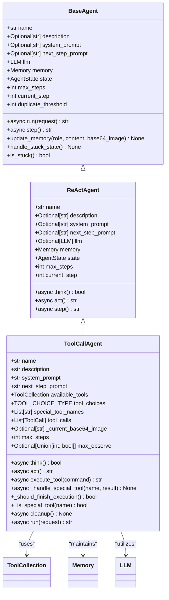
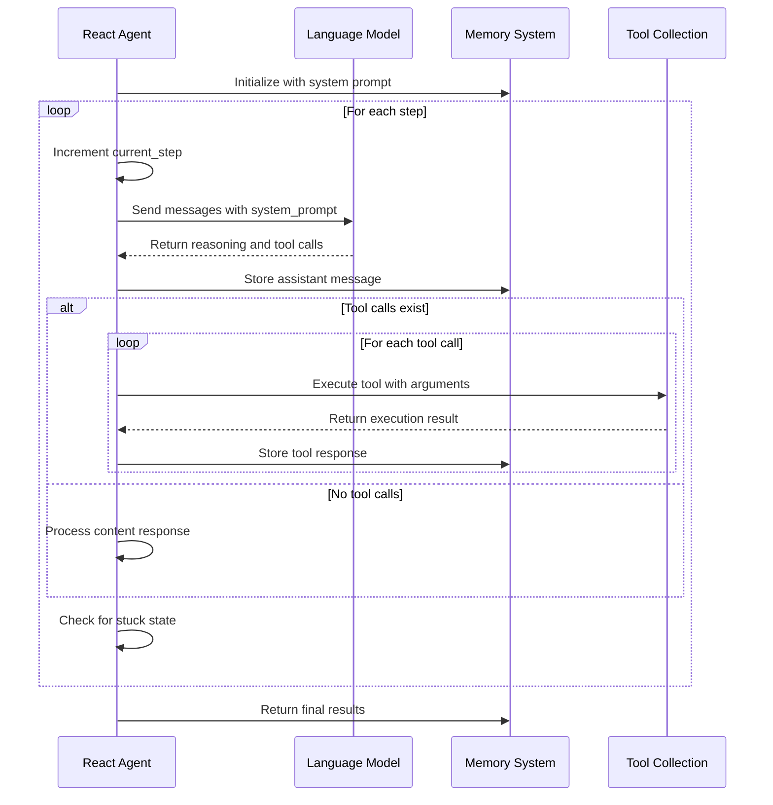
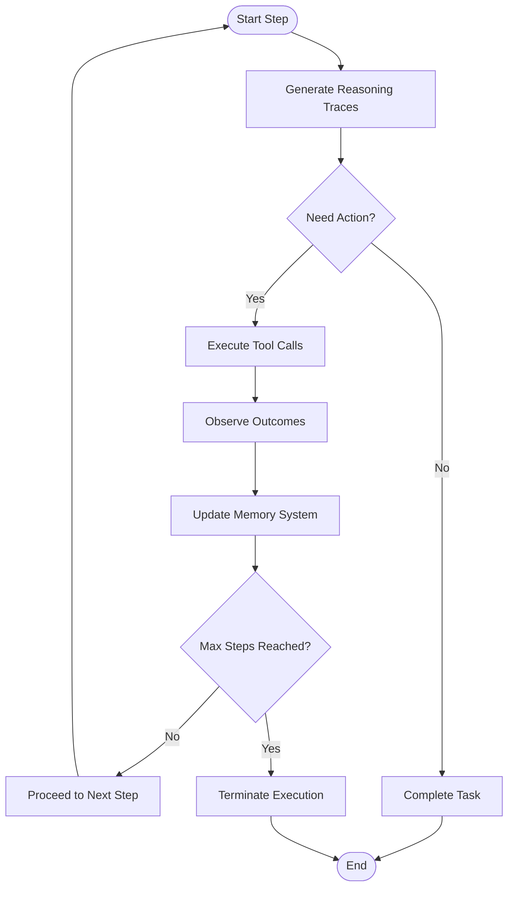
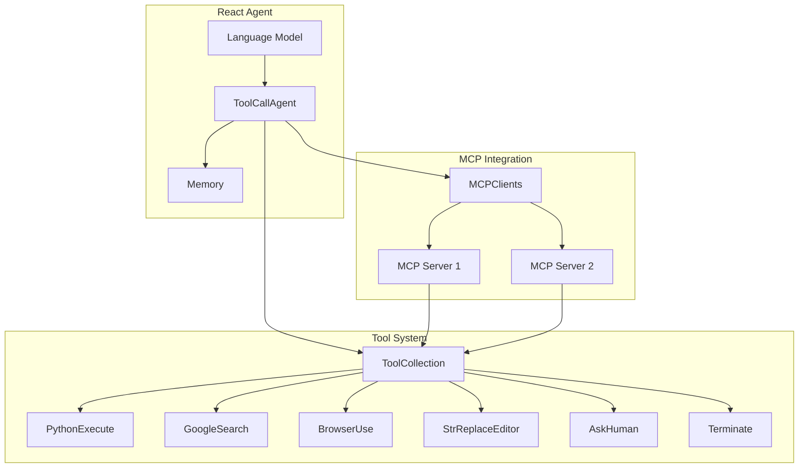

# React Agent

<cite>
**Referenced Files in This Document**   
- [app/agent/react.py](file://app/agent/react.py)
- [app/agent/toolcall.py](file://app/agent/toolcall.py)
- [app/agent/base.py](file://app/agent/base.py)
- [app/llm.py](file://app/llm.py)
- [app/schema.py](file://app/schema.py)
- [app/tool/tool_collection.py](file://app/tool/tool_collection.py)
- [app/prompt/manus.py](file://app/prompt/manus.py)
- [app/tool/python_execute.py](file://app/tool/python_execute.py)
- [app/tool/search/google_search.py](file://app/tool/search/google_search.py)
</cite>

## Table of Contents
1. [Introduction](#introduction)
2. [Cognitive Architecture](#cognitive-architecture)
3. [Implementation Details](#implementation-details)
4. [Prompt Engineering Strategy](#prompt-engineering-strategy)
5. [Thought-Action-Observation Loop](#thought-action-observation-loop)
6. [Integration with Tool System](#integration-with-tool-system)
7. [Memory Management](#memory-management)
8. [Performance Characteristics](#performance-characteristics)
9. [Configuration and Invocation](#configuration-and-invocation)
10. [Use Cases and Examples](#use-cases-and-examples)
11. [Conclusion](#conclusion)

## Introduction
The React Agent is a sophisticated implementation of the ReAct (Reasoning + Acting) paradigm within OpenManus, designed for step-by-step problem solving through explicit reasoning traces and tool usage. This agent architecture enables transparent and interpretable decision-making by interleaving cognitive processes with actionable steps, making it particularly valuable for complex task decomposition, debugging, and explainable AI applications. The React Agent serves as a foundational component in the OpenManus framework, providing a structured approach to agent-based problem solving that emphasizes auditability and systematic exploration of solution paths.

**Section sources**
- [app/agent/react.py](file://app/agent/react.py#L10-L37)
- [app/agent/toolcall.py](file://app/agent/toolcall.py#L17-L249)

## Cognitive Architecture
The React Agent implements a cognitive architecture that systematically interleaves reasoning and action phases to solve complex problems. At its core, the agent follows a cyclic process where it first analyzes the current state and available information to generate explicit reasoning traces, then decides on appropriate actions to take, executes those actions through available tools, and finally observes and interprets the outcomes before repeating the cycle. This architecture is built upon the ReActAgent base class which defines the fundamental structure of the reasoning loop through abstract methods for `think()` and `act()` operations.

The agent maintains several key components that support its cognitive functions: a language model (LLM) for generating reasoning traces, a memory system for storing conversation history and intermediate results, and a state management system that tracks the agent's current execution status. The reasoning process is guided by system prompts and step-specific prompts that direct the LLM to produce structured thought processes before taking actions. This explicit separation of thinking and acting phases ensures that decisions are transparent and can be audited, providing clear insight into the agent's decision-making process at each step of execution.

**Diagram sources**
- [app/agent/react.py](file://app/agent/react.py#L10-L37)
- [app/agent/toolcall.py](file://app/agent/toolcall.py#L17-L249)
- [app/agent/base.py](file://app/agent/base.py#L12-L195)

**Section sources**
- [app/agent/react.py](file://app/agent/react.py#L10-L37)
- [app/agent/toolcall.py](file://app/agent/toolcall.py#L17-L249)
- [app/agent/base.py](file://app/agent/base.py#L12-L195)

## Implementation Details
The React Agent is implemented as an abstract base class that defines the fundamental structure of the ReAct paradigm, with concrete implementations provided by subclasses like ToolCallAgent. The core implementation revolves around the `think()` and `act()` abstract methods that must be implemented by subclasses, creating a clear separation between cognitive processing and action execution. The agent's step execution is managed by the `step()` method which orchestrates the reasoning-action cycle by first calling `think()` to determine if an action is needed, and then invoking `act()` to execute the decided actions.

The agent maintains state through several key attributes: a memory system that stores the conversation history as a sequence of messages, a language model instance for generating responses, and execution control parameters like `max_steps` and `current_step` that govern the agent's runtime behavior. The memory system, implemented through the Memory class, stores messages with roles (system, user, assistant, tool) and content, providing a complete record of the agent's interactions and observations throughout its execution.

Error handling and state management are integral to the implementation, with the agent tracking its state through the AgentState enum (IDLE, RUNNING, FINISHED, ERROR) and using context managers to ensure safe state transitions. The implementation also includes mechanisms to detect and handle stuck states, where the agent might be repeating ineffective patterns, by monitoring for duplicate responses and adjusting the next step prompt accordingly to encourage new strategies.

**Diagram sources**
- [app/agent/react.py](file://app/agent/react.py#L10-L37)
- [app/agent/toolcall.py](file://app/agent/toolcall.py#L17-L249)
- [app/llm.py](file://app/llm.py#L173-L765)
- [app/schema.py](file://app/schema.py#L158-L186)

**Section sources**
- [app/agent/react.py](file://app/agent/react.py#L10-L37)
- [app/agent/toolcall.py](file://app/agent/toolcall.py#L17-L249)
- [app/llm.py](file://app/llm.py#L173-L765)
- [app/schema.py](file://app/schema.py#L158-L186)

## Prompt Engineering Strategy
The React Agent employs a sophisticated prompt engineering strategy that guides the language model to generate explicit reasoning steps before taking actions, ensuring transparent and interpretable decision-making. This strategy is implemented through a combination of system-level prompts and step-specific prompts that shape the LLM's behavior throughout the reasoning-action cycle. The system prompt establishes the agent's role and capabilities, while the next step prompt provides specific guidance for the current decision point.

The system prompt defines the agent's identity and tool access, establishing its role as an all-capable AI assistant with various tools at its disposal for solving complex requests. This prompt sets the foundational context for the agent's behavior, emphasizing its ability to handle programming, information retrieval, file processing, web browsing, and human interaction tasks. The next step prompt specifically instructs the agent to proactively select appropriate tools based on user needs, break down complex tasks, and clearly explain execution results while suggesting next steps.

This dual-prompt approach creates a structured reasoning framework that encourages the LLM to first analyze the problem, consider available tools and strategies, and articulate its reasoning before committing to specific actions. The prompts are designed to promote systematic problem solving by encouraging the agent to decompose complex tasks into manageable steps and use tools in sequence when appropriate. This engineering approach ensures that the agent's thought process is visible and auditable, making it easier to understand, debug, and verify the agent's decisions and actions.

**Section sources**
- [app/prompt/manus.py](file://app/prompt/manus.py#L0-L10)
- [app/agent/toolcall.py](file://app/agent/toolcall.py#L17-L249)
- [app/agent/manus.py](file://app/agent/manus.py#L0-L165)

## Thought-Action-Observation Loop
The React Agent operates through a systematic thought-action-observation loop that forms the core of its problem-solving methodology. This cyclic process begins with the agent analyzing the current state and available information to generate explicit reasoning traces (thought phase), then deciding on and executing appropriate actions through available tools (action phase), and finally observing and interpreting the outcomes of those actions (observation phase) before repeating the cycle.

During the thought phase, the agent uses its language model to process the current state and decide on the next actions. This involves analyzing the conversation history, previous observations, and current goals to determine whether tool usage is required and which tools would be most appropriate. The agent generates explicit reasoning that explains its decision-making process, making the cognitive steps transparent and auditable.

In the action phase, the agent executes the decided actions by calling appropriate tools with specific parameters. Each tool call is structured as a function call with a name and arguments, allowing for precise control over the actions taken. The agent can execute multiple tool calls in sequence within a single step, enabling complex operations that require coordination between different capabilities.

The observation phase captures the results of tool executions and incorporates them into the agent's memory system. These observations are formatted to clearly indicate which tool was executed and what output was produced, creating a complete record of the agent's interactions with its environment. This comprehensive logging enables detailed analysis of the agent's behavior and facilitates debugging by providing a clear audit trail of all actions and their outcomes.

**Diagram sources**
- [app/agent/react.py](file://app/agent/react.py#L10-L37)
- [app/agent/toolcall.py](file://app/agent/toolcall.py#L17-L249)
- [app/llm.py](file://app/llm.py#L173-L765)

**Section sources**
- [app/agent/react.py](file://app/agent/react.py#L10-L37)
- [app/agent/toolcall.py](file://app/agent/toolcall.py#L17-L249)

## Integration with Tool System
The React Agent integrates with OpenManus's tool system through the ToolCollection class, which manages a registry of available tools that the agent can invoke during its execution. This integration enables the agent to leverage various capabilities such as web search, code execution, file operations, and browser interaction to accomplish complex tasks. The ToolCollection serves as a central repository that organizes tools by name and provides methods for executing them with appropriate parameters.

Each tool in the collection is implemented as a subclass of BaseTool, defining its name, description, parameter schema, and execution logic. The agent can dynamically access these tools through their names and execute them with specific arguments. When the agent decides to use a tool, it creates a ToolCall object that specifies the tool name and arguments, which is then processed by the ToolCollection's execute method to invoke the appropriate tool.

The integration supports both local tools and remote MCP (Modular Cognitive Processing) tools, allowing the agent to extend its capabilities through external services. MCP tools are connected to the agent through the MCPClients system, which manages connections to remote servers and registers their tools with the agent's available_tools collection. This modular architecture enables the agent to dynamically incorporate new capabilities without requiring changes to its core implementation.

The tool execution process includes comprehensive error handling and result formatting. Each tool returns a ToolResult object that can contain output, error messages, base64-encoded images, or system messages. This standardized result format ensures consistent handling of tool outputs across different tool types and enables the agent to interpret and respond to various kinds of results in a uniform manner.

**Diagram sources**
- [app/agent/toolcall.py](file://app/agent/toolcall.py#L17-L249)
- [app/tool/tool_collection.py](file://app/tool/tool_collection.py#L8-L70)
- [app/tool/python_execute.py](file://app/tool/python_execute.py#L0-L75)
- [app/tool/search/google_search.py](file://app/tool/search/google_search.py#L0-L33)
- [app/agent/manus.py](file://app/agent/manus.py#L0-L165)

**Section sources**
- [app/agent/toolcall.py](file://app/agent/toolcall.py#L17-L249)
- [app/tool/tool_collection.py](file://app/tool/tool_collection.py#L8-L70)
- [app/tool/python_execute.py](file://app/tool/python_execute.py#L0-L75)
- [app/tool/search/google_search.py](file://app/tool/search/google_search.py#L0-L33)

## Memory Management
The React Agent employs a sophisticated memory management system that maintains a complete record of its interactions, reasoning traces, and observations throughout the execution process. This memory system, implemented through the Memory class, stores messages as a chronological sequence that captures the entire history of the agent's operation, including user requests, system prompts, assistant responses, tool calls, and tool results.

Each message in the memory system includes metadata such as role (user, system, assistant, tool), content, and optional fields like tool_call_id and base64_image. The memory is structured to support the agent's reasoning process by providing access to previous interactions and outcomes, enabling the agent to build upon prior knowledge and avoid repeating ineffective strategies. The messages are stored in a list that preserves the temporal order of events, creating a comprehensive audit trail of the agent's decision-making process.

The memory system includes mechanisms to manage its size and prevent unbounded growth. While the current implementation does not enforce a strict message limit, the Memory class provides the infrastructure for implementing message retention policies, such as keeping only the most recent N messages. This capability is essential for maintaining performance and preventing memory exhaustion during extended execution sessions.

The agent interacts with its memory through the update_memory method, which adds new messages with appropriate roles and content. During the reasoning process, the agent accesses its memory to review previous steps and observations, using this information to inform its current decisions. The comprehensive logging of tool executions and their results enables detailed analysis of the agent's behavior and facilitates debugging by providing a complete record of all actions and their outcomes.

**Section sources**
- [app/schema.py](file://app/schema.py#L158-L186)
- [app/agent/base.py](file://app/agent/base.py#L12-L195)
- [app/agent/toolcall.py](file://app/agent/toolcall.py#L17-L249)

## Performance Characteristics
The React Agent exhibits specific performance characteristics that reflect the trade-offs inherent in its design philosophy of transparency and interpretability. The most significant performance consideration is the increased token usage resulting from the agent's verbose reasoning process, where each step generates explicit thought traces before taking actions. This approach, while enhancing auditability and explainability, consumes more tokens than more direct approaches, potentially leading to higher costs and longer processing times.

The agent's performance is also influenced by its step-based execution model, which limits the number of steps through the max_steps parameter. This constraint prevents infinite loops but may require careful tuning for complex tasks that need more steps to complete. The agent includes mechanisms to detect and handle stuck states, where it might be repeating ineffective patterns, by monitoring for duplicate responses and adjusting its strategy accordingly.

Tool execution introduces additional performance considerations, as each tool call involves serialization of arguments, execution of potentially complex operations, and processing of results. The agent implements timeout mechanisms for tool execution, particularly for operations like code execution, to prevent hanging on long-running or problematic tasks. The PythonExecute tool, for example, uses multiprocessing with a configurable timeout to ensure that code execution does not exceed specified limits.

The agent's integration with external services through MCP tools adds network latency to the execution process, as requests must be transmitted to remote servers and responses received. This distributed architecture enables access to specialized capabilities but introduces dependencies on network connectivity and the performance of external systems. The agent's token counting and limit checking mechanisms help prevent exceeding model-specific token limits, which could otherwise lead to failed requests and interrupted execution.

**Section sources**
- [app/llm.py](file://app/llm.py#L173-L765)
- [app/agent/toolcall.py](file://app/agent/toolcall.py#L17-L249)
- [app/tool/python_execute.py](file://app/tool/python_execute.py#L0-L75)

## Configuration and Invocation
Configuring and invoking the React Agent effectively requires understanding its key parameters and integration points within the OpenManus framework. The agent can be customized through several configuration options that control its behavior, including the system_prompt and next_step_prompt that guide its reasoning process, the max_steps parameter that limits execution length, and the available_tools collection that defines its capabilities.

To invoke the agent, users typically create an instance of a specific agent class like Manus or ToolCallAgent, which inherit from the ReactAgent base class. These instances can be configured with specific LLM settings, tool collections, and prompt templates to suit particular use cases. The agent is then executed by calling its run method with an initial request, which initiates the thought-action-observation loop.

For optimal performance in exploratory tasks, it is recommended to configure the agent with a comprehensive set of tools relevant to the task domain, set appropriate step limits based on task complexity, and provide clear system and step prompts that guide the agent's behavior. The agent's modular design allows for easy extension by adding new tools to the available_tools collection, enabling customization for specific application scenarios.

When integrating the React Agent into applications, developers should consider implementing proper error handling around the agent's execution, monitoring token usage to avoid exceeding limits, and providing mechanisms to interrupt or terminate long-running executions if necessary. The agent's structured output and comprehensive logging make it well-suited for applications requiring auditability and explainability, such as research assistance, data analysis, and complex problem solving.

**Section sources**
- [app/agent/toolcall.py](file://app/agent/toolcall.py#L17-L249)
- [app/agent/manus.py](file://app/agent/manus.py#L0-L165)
- [app/llm.py](file://app/llm.py#L173-L765)

## Use Cases and Examples
The React Agent excels in scenarios that require systematic problem solving, transparency, and the ability to handle complex, multi-step tasks. One prominent use case is web research, where the agent can formulate search queries, analyze results, extract relevant information, and synthesize findings into coherent responses. For example, when asked to research a topic, the agent might first generate a reasoning trace outlining its approach, then use a web search tool to find relevant sources, analyze the content of those sources, and finally compile a comprehensive summary with citations.

Another valuable application is multi-step data retrieval and analysis. The agent can break down complex data queries into manageable steps, using appropriate tools for each phase of the process. For instance, it might first retrieve data from various sources using specialized tools, then execute Python code to process and analyze the data, visualize the results using charting tools, and present the findings with appropriate explanations of its methodology.

The agent is also well-suited for exploratory programming tasks, where it can write, execute, and debug code iteratively. When faced with a programming challenge, the agent can reason about potential solutions, write code to implement a specific approach, execute the code to observe its behavior, analyze any errors or unexpected results, and refine its solution accordingly. This iterative process, with explicit reasoning at each step, makes the agent's problem-solving approach transparent and auditable.

Other applications include document processing and transformation, where the agent can read files, extract information, modify content using text editing tools, and save the results, all while maintaining a clear record of its actions. The agent's ability to integrate human feedback through the AskHuman tool also enables hybrid human-AI workflows, where the agent can request clarification or approval at critical decision points, combining automated processing with human oversight.

**Section sources**
- [app/agent/toolcall.py](file://app/agent/toolcall.py#L17-L249)
- [app/tool/python_execute.py](file://app/tool/python_execute.py#L0-L75)
- [app/tool/search/google_search.py](file://app/tool/search/google_search.py#L0-L33)
- [app/agent/manus.py](file://app/agent/manus.py#L0-L165)

## Conclusion
The React Agent represents a powerful implementation of the ReAct paradigm within OpenManus, providing a structured approach to agent-based problem solving that emphasizes transparency, interpretability, and systematic exploration of solution paths. By interleaving explicit reasoning traces with tool usage, the agent creates a transparent decision-making process that is both auditable and explainable, making it particularly valuable for complex task decomposition, debugging, and applications where accountability is crucial.

The agent's architecture, built upon a clear separation of thinking and acting phases, enables sophisticated problem solving through a cyclic thought-action-observation loop. Its integration with a comprehensive tool system allows it to leverage various capabilities for accomplishing diverse tasks, while its memory management system maintains a complete record of its interactions and decisions. The prompt engineering strategy guides the language model to generate structured reasoning before taking actions, ensuring that the agent's cognitive processes are visible and can be analyzed.

While the agent's verbose reasoning approach incurs higher token usage and associated costs, this trade-off is often justified by the benefits of enhanced auditability and the ability to debug and verify the agent's decisions. The modular design allows for easy extension and customization, making the React Agent adaptable to a wide range of applications, from web research and data analysis to exploratory programming and document processing.

For maximum effectiveness, the React Agent should be configured with appropriate tools and prompts for the specific task domain, with careful consideration given to step limits and error handling. Its structured output and comprehensive logging make it an excellent choice for applications requiring transparency and accountability in AI decision-making processes.