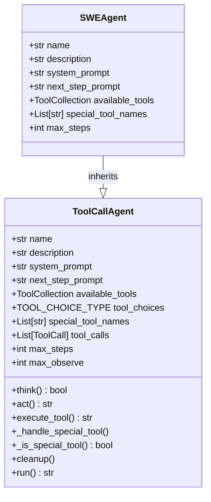
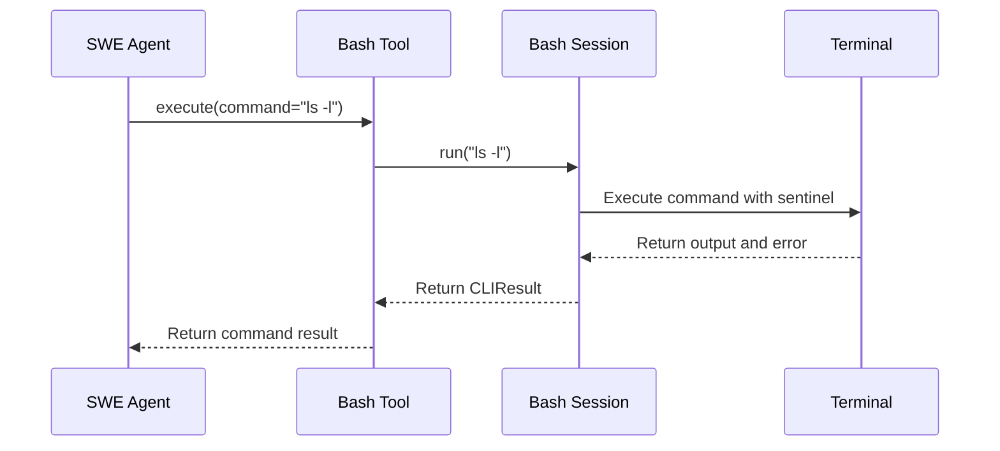
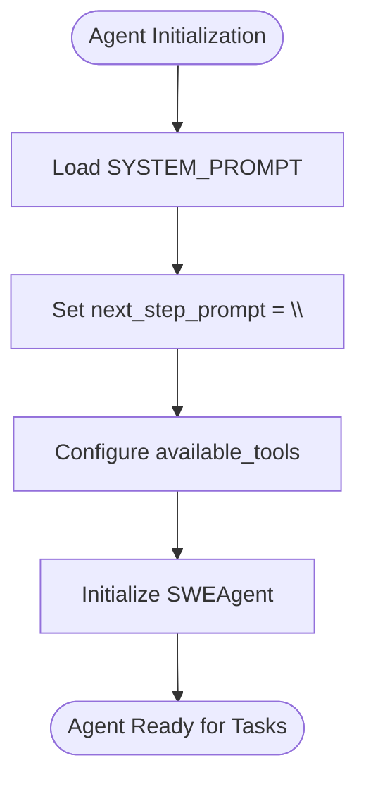
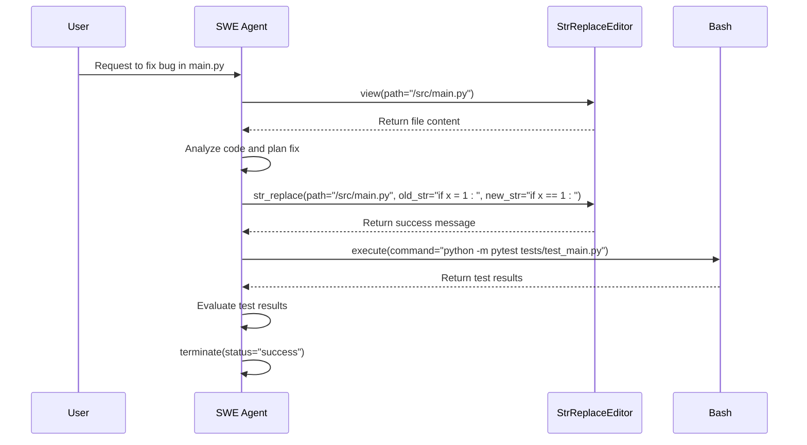

# SWE Agent

<cite>
**Referenced Files in This Document**   
- [swe.py](file://app/agent/swe.py)
- [swe.py](file://app/prompt/swe.py)
- [bash.py](file://app/tool/bash.py)
- [str_replace_editor.py](file://app/tool/str_replace_editor.py)
- [terminate.py](file://app/tool/terminate.py)
- [tool_collection.py](file://app/tool/tool_collection.py)
- [toolcall.py](file://app/agent/toolcall.py)
</cite>

## Table of Contents
1. [Introduction](#introduction)
2. [Design Philosophy](#design-philosophy)
3. [Available Tools](#available-tools)
4. [Prompt Structure](#prompt-structure)
5. [Use Cases and Execution Flow](#use-cases-and-execution-flow)
6. [Configuration Requirements](#configuration-requirements)
7. [Limitations and Agent Selection](#limitations-and-agent-selection)
8. [Conclusion](#conclusion)

## Introduction
The SWE (Software Engineering) Agent is a specialized agent designed for code-centric tasks such as software development, debugging, and direct system interaction. It operates on the SWEAgent paradigm, which emphasizes autonomous execution of programming tasks through direct computer interaction. This agent is optimized for pure software engineering workflows, providing a focused toolset for modifying source code, running tests, and navigating project directories.

**Section sources**
- [swe.py](file://app/agent/swe.py#L9-L23)

## Design Philosophy
The SWE Agent is built on the principle of direct computer interaction to solve programming challenges autonomously. It inherits from the `ToolCallAgent` class, which provides a foundation for handling tool/function calls with enhanced abstraction. The agent's design prioritizes precise, step-by-step execution of commands in a shell environment, using a specialized interface that includes a file editor with line-limited views of files.

The agent operates under a strict response format requirement: it must include exactly one tool call per response, ensuring sequential and controlled execution. This prevents the agent from issuing multiple commands simultaneously, which could lead to unpredictable behavior in the execution environment. The design also explicitly prohibits the use of interactive session commands like `python` or `vim`, maintaining a non-interactive, scriptable workflow.

**Diagram sources**
- [swe.py](file://app/agent/swe.py#L9-L23)
- [toolcall.py](file://app/agent/toolcall.py#L17-L249)

**Section sources**
- [swe.py](file://app/agent/swe.py#L9-L23)
- [toolcall.py](file://app/agent/toolcall.py#L17-L249)
- [swe.py](file://app/prompt/swe.py#L1-L22)

## Available Tools
The SWE Agent has access to a curated set of tools specifically designed for software engineering tasks. These tools enable the agent to interact with the file system, execute shell commands, and manage its execution lifecycle.

### Bash Tool
The Bash tool allows the SWE Agent to execute bash commands in the terminal. It supports long-running commands by running them in the background with output redirection. The tool handles interactive processes by maintaining a session state, allowing the agent to send additional input to running processes or interrupt them with `ctrl+c`. Commands that exceed the timeout period (120 seconds) are automatically terminated, requiring the agent to restart the command in the background.

**Diagram sources**
- [bash.py](file://app/tool/bash.py#L0-L158)

### StrReplaceEditor Tool
The StrReplaceEditor tool provides comprehensive file manipulation capabilities, including viewing, creating, and editing files. It supports viewing files with line numbers, creating new files, replacing text strings, inserting text at specific lines, and undoing edits. The tool maintains a history of file changes, allowing for rollback of the most recent edit. When viewing files, it can display specific line ranges and automatically truncates long outputs to conserve context space.

### Terminate Tool
The Terminate tool is used to end the agent's interaction when a task is completed or cannot be continued. It requires a status parameter indicating whether the interaction was successful or failed. This tool is considered a "special tool" that triggers the agent to transition to a finished state upon execution.

**Section sources**
- [bash.py](file://app/tool/bash.py#L0-L158)
- [str_replace_editor.py](file://app/tool/str_replace_editor.py#L0-L432)
- [terminate.py](file://app/tool/terminate.py#L0-L25)

## Prompt Structure
The SWE Agent uses a simplified prompt structure that relies heavily on system-level instructions and dynamic context. The `next_step_prompt` is empty, indicating that the agent does not use step-by-step guidance but instead operates based on the initial system prompt and the current state of the environment.

The system prompt establishes the agent's role as an autonomous programmer working directly in the command line with a special interface. It emphasizes the importance of proper indentation in code edits and mandates that exactly one tool call be included in each response. The prompt also specifies the shell prompt format, which includes information about the currently open file and the current working directory.

**Diagram sources**
- [swe.py](file://app/agent/swe.py#L15-L16)
- [swe.py](file://app/prompt/swe.py#L1-L22)

**Section sources**
- [swe.py](file://app/agent/swe.py#L15-L16)
- [swe.py](file://app/prompt/swe.py#L1-L22)

## Use Cases and Execution Flow
The SWE Agent is designed to automate various software development workflows, including modifying source code, running tests, and navigating project directories. Its execution flow follows a strict pattern of thought, tool selection, and action.

### Code Modification Workflow
When modifying code, the agent typically follows a sequence: view the file to understand its current state, make the necessary edits using the str_replace or insert commands, and verify the changes. The agent must ensure that the `old_str` parameter in a str_replace operation exactly matches the text in the file, including whitespace and indentation.

### Testing Workflow
For running tests, the agent uses the Bash tool to execute test commands. Long-running test processes can be executed in the background with output redirected to log files. The agent can then use the Bash tool with an empty command to retrieve additional logs from ongoing processes.

### Tool Composition Example
The agent demonstrates tool composition by combining file operations with command execution. For example, it might first use the StrReplaceEditor to modify a configuration file, then use the Bash tool to restart a service that reads that configuration.

**Diagram sources**
- [swe.py](file://app/agent/swe.py#L18-L20)
- [str_replace_editor.py](file://app/tool/str_replace_editor.py#L0-L432)
- [bash.py](file://app/tool/bash.py#L0-L158)
- [terminate.py](file://app/tool/terminate.py#L0-L25)

**Section sources**
- [swe.py](file://app/agent/swe.py#L18-L20)
- [str_replace_editor.py](file://app/tool/str_replace_editor.py#L0-L432)
- [bash.py](file://app/tool/bash.py#L0-L158)
- [terminate.py](file://app/tool/terminate.py#L0-L25)

## Configuration Requirements
To function properly, the SWE Agent requires specific configuration and environment setup. The workspace must be properly configured with appropriate file access permissions, allowing the agent to read, write, and execute files as needed.

The agent's behavior is influenced by configuration settings in the system, particularly regarding the use of a sandbox environment. When `config.sandbox.use_sandbox` is enabled, file operations are routed through a sandbox operator rather than the local file operator, providing isolation and security.

The agent also requires sufficient permissions to execute shell commands, including the ability to start background processes and redirect output to files. Network access may be required for certain operations, depending on the specific tasks being performed.

**Section sources**
- [str_replace_editor.py](file://app/tool/str_replace_editor.py#L0-L432)
- [config.py](file://app/config.py)

## Limitations and Agent Selection
The SWE Agent has several limitations that define its scope and appropriate use cases. It lacks tools for browser interaction or Python code execution, making it unsuitable for tasks that require web scraping or interactive Python sessions.

Compared to the more general Manus agent, the SWE Agent is preferred for pure software engineering tasks that involve direct code modification and system interaction. The Manus agent, with its broader toolset, is better suited for tasks that require web browsing, data analysis, or other non-code-centric activities.

The SWE Agent's restriction to exactly one tool call per response, while ensuring controlled execution, can make certain workflows more verbose and step-intensive compared to agents that can execute multiple commands in sequence.

**Section sources**
- [swe.py](file://app/agent/swe.py#L9-L23)
- [manus.py](file://app/agent/manus.py)
- [browser.py](file://app/agent/browser.py)

## Conclusion
The SWE Agent is a specialized tool for software engineering tasks, designed to operate autonomously in a code-centric environment. Its focused toolset of Bash, StrReplaceEditor, and Terminate enables it to perform a wide range of development workflows, from code modification to testing and debugging. The agent's design philosophy emphasizes direct computer interaction and sequential, controlled execution, making it well-suited for automating software development tasks. While it has limitations in terms of available tools, its specialization makes it a powerful choice for pure programming challenges, particularly when compared to more general-purpose agents like the Manus agent.