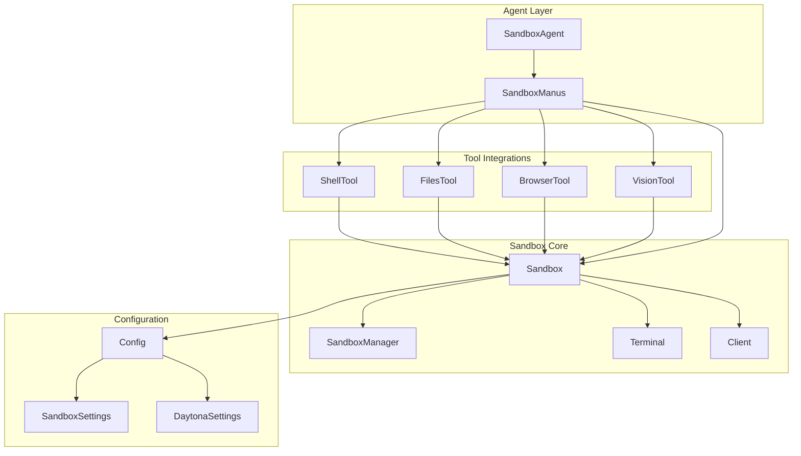
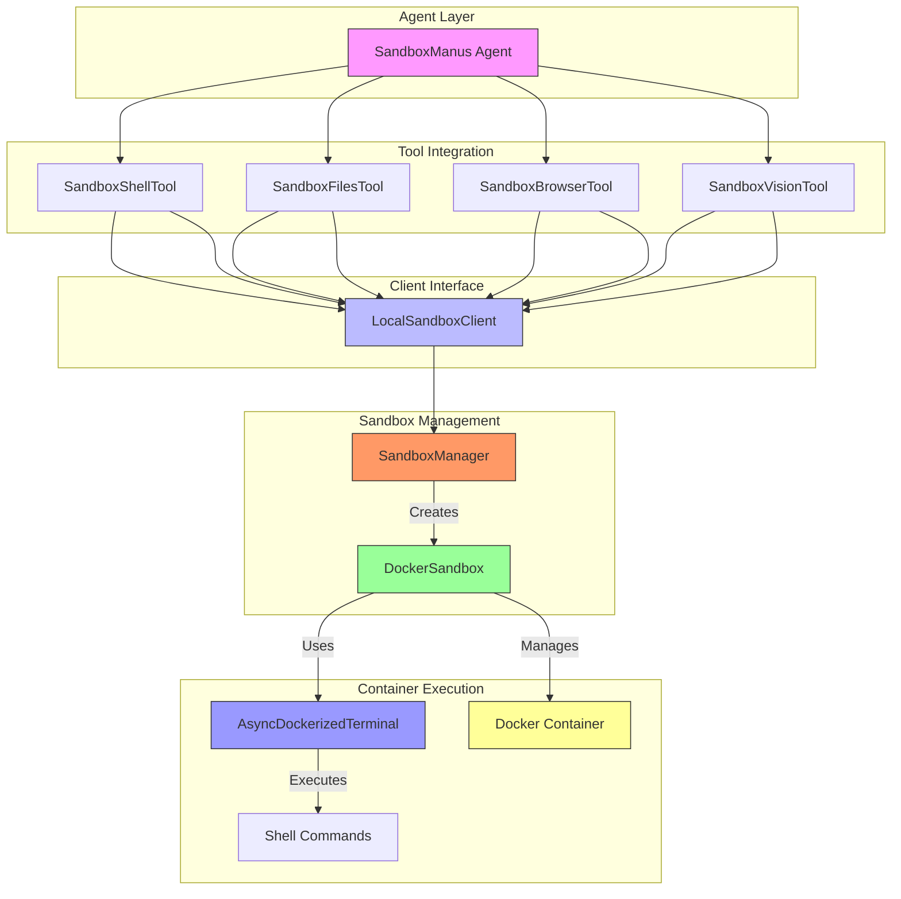
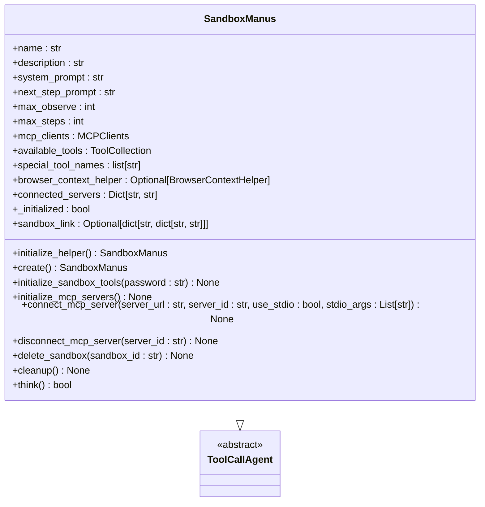
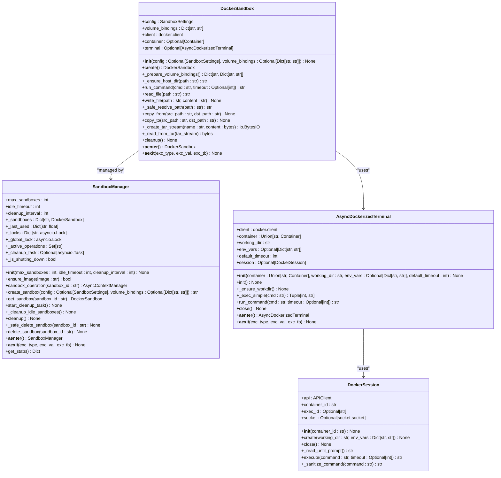
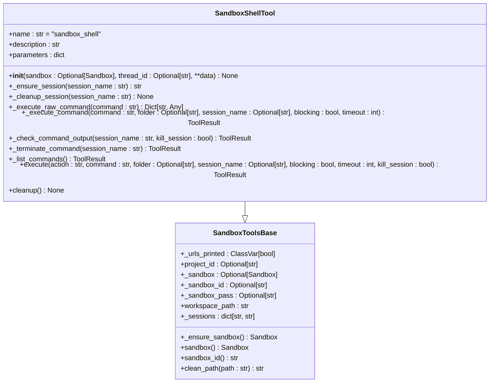
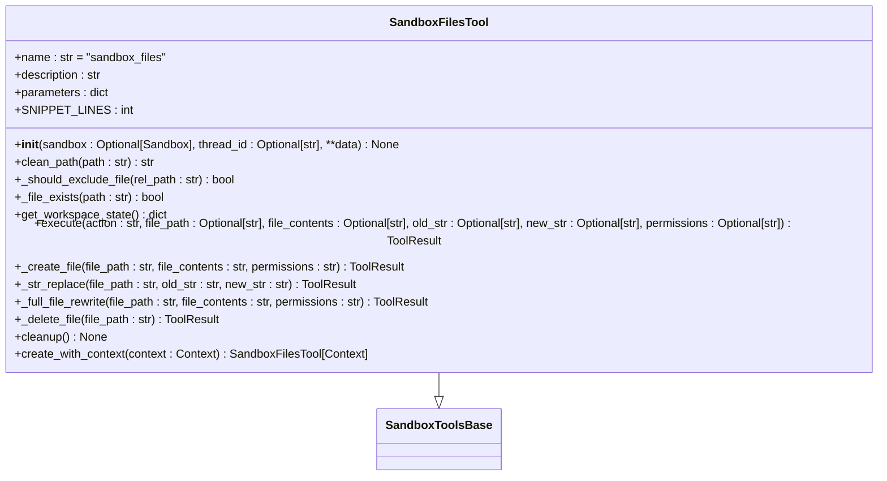
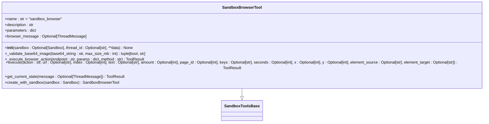
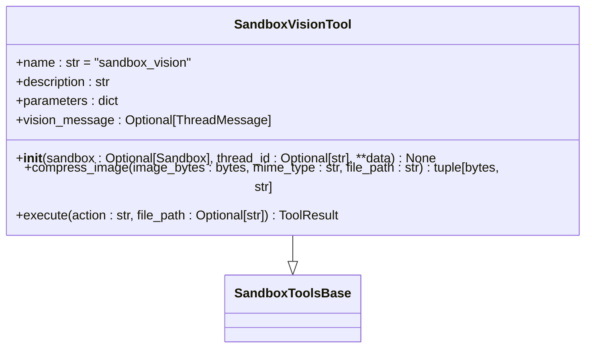
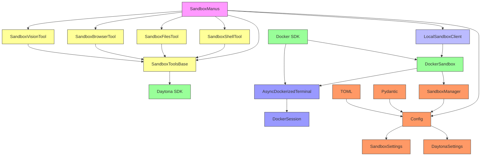

# Sandbox Agent

<cite>
**Referenced Files in This Document**   
- [sandbox_agent.py](file://app/agent/sandbox_agent.py)
- [sandbox.py](file://app/sandbox/core/sandbox.py)
- [manager.py](file://app/sandbox/core/manager.py)
- [terminal.py](file://app/sandbox/core/terminal.py)
- [client.py](file://app/sandbox/client.py)
- [config.py](file://app/config.py)
- [sandbox.py](file://app/daytona/sandbox.py)
- [tool_base.py](file://app/daytona/tool_base.py)
- [sb_shell_tool.py](file://app/tool/sandbox/sb_shell_tool.py)
- [sb_files_tool.py](file://app/tool/sandbox/sb_files_tool.py)
- [sb_browser_tool.py](file://app/tool/sandbox/sb_browser_tool.py)
- [sb_vision_tool.py](file://app/tool/sandbox/sb_vision_tool.py)
</cite>

## Table of Contents
1. [Introduction](#introduction)
2. [Project Structure](#project-structure)
3. [Core Components](#core-components)
4. [Architecture Overview](#architecture-overview)
5. [Detailed Component Analysis](#detailed-component-analysis)
6. [Dependency Analysis](#dependency-analysis)
7. [Performance Considerations](#performance-considerations)
8. [Troubleshooting Guide](#troubleshooting-guide)
9. [Conclusion](#conclusion)

## Introduction
The Sandbox Agent is a specialized component designed to execute untrusted code within isolated Docker container environments. It provides a secure execution environment for evaluating third-party code, running potentially unsafe scripts, and testing software in clean, controlled conditions. The agent operates through a sophisticated sandbox system that manages container lifecycle, enforces resource limits, and handles command execution securely. This documentation details the agent's integration with core sandbox components, its communication mechanisms with the sandbox client, configuration options for security and performance, and practical use cases for isolated code execution.

## Project Structure
The project structure reveals a well-organized system with clear separation of concerns. The sandbox functionality is primarily contained within the `app/sandbox` directory, which houses the core execution logic, while agent-specific implementations reside in `app/agent`. The tool integrations that enable specific sandbox capabilities are located in `app/tool/sandbox`. Configuration management is centralized in the `config` directory, and comprehensive testing is provided in the `tests/sandbox` directory.

**Diagram sources**
- [sandbox_agent.py](file://app/agent/sandbox_agent.py)
- [sandbox.py](file://app/sandbox/core/sandbox.py)
- [manager.py](file://app/sandbox/core/manager.py)
- [client.py](file://app/sandbox/client.py)

**Section sources**
- [app/agent/sandbox_agent.py](file://app/agent/sandbox_agent.py)
- [app/sandbox/core/sandbox.py](file://app/sandbox/core/sandbox.py)
- [app/sandbox/core/manager.py](file://app/sandbox/core/manager.py)
- [app/sandbox/core/terminal.py](file://app/sandbox/core/terminal.py)
- [app/sandbox/client.py](file://app/sandbox/client.py)

## Core Components
The Sandbox Agent system comprises several interconnected components that work together to provide secure code execution. At its core, the `SandboxManus` class serves as the primary agent implementation, coordinating the creation and management of sandbox environments. The `DockerSandbox` class provides the containerized execution environment with resource limits and command execution capabilities. The `SandboxManager` handles multiple sandbox instances, enforcing limits on concurrent sandboxes and automatically cleaning up idle environments. The `AsyncDockerizedTerminal` enables interactive command execution within containers, while various tool classes (`SandboxShellTool`, `SandboxFilesTool`, etc.) provide specific functionality for shell commands, file operations, browser automation, and vision capabilities.

**Section sources**
- [sandbox_agent.py](file://app/agent/sandbox_agent.py#L1-L223)
- [sandbox.py](file://app/sandbox/core/sandbox.py#L1-L463)
- [manager.py](file://app/sandbox/core/manager.py#L1-L314)
- [terminal.py](file://app/sandbox/core/terminal.py#L1-L347)

## Architecture Overview
The Sandbox Agent architecture follows a layered approach with clear separation between the agent interface, sandbox management, and container execution. The agent interacts with the sandbox system through a client interface, which abstracts the underlying container management. The sandbox manager maintains a pool of available sandbox instances, enforcing resource limits and handling lifecycle management. Each sandbox instance runs in an isolated Docker container with restricted network access and controlled resource allocation. Tools are dynamically added to the agent's available tool collection, enabling specific capabilities like shell command execution, file manipulation, and browser automation.

**Diagram sources**
- [sandbox_agent.py](file://app/agent/sandbox_agent.py#L1-L223)
- [client.py](file://app/sandbox/client.py#L1-L202)
- [manager.py](file://app/sandbox/core/manager.py#L1-L314)
- [sandbox.py](file://app/sandbox/core/sandbox.py#L1-L463)
- [terminal.py](file://app/sandbox/core/terminal.py#L1-L347)

## Detailed Component Analysis

### Sandbox Agent Implementation
The `SandboxManus` class extends `ToolCallAgent` to provide a versatile agent capable of executing tasks using sandboxed tools. It manages the initialization of sandbox tools, connection to MCP servers, and cleanup of resources. The agent creates a sandbox environment during initialization and adds various sandbox tools to its available tools collection, enabling shell commands, file operations, browser automation, and vision capabilities.

**Diagram sources**
- [sandbox_agent.py](file://app/agent/sandbox_agent.py#L1-L223)

**Section sources**
- [sandbox_agent.py](file://app/agent/sandbox_agent.py#L1-L223)

### Sandbox Core Components
The core sandbox components provide the foundation for isolated code execution. The `DockerSandbox` class manages a single container instance, handling creation, command execution, file operations, and cleanup. The `SandboxManager` oversees multiple sandbox instances, enforcing limits on concurrent sandboxes and automatically cleaning up idle environments. The `AsyncDockerizedTerminal` enables interactive command execution within containers through a persistent terminal session.

**Diagram sources**
- [sandbox.py](file://app/sandbox/core/sandbox.py#L1-L463)
- [manager.py](file://app/sandbox/core/manager.py#L1-L314)
- [terminal.py](file://app/sandbox/core/terminal.py#L1-L347)

**Section sources**
- [sandbox.py](file://app/sandbox/core/sandbox.py#L1-L463)
- [manager.py](file://app/sandbox/core/manager.py#L1-L314)
- [terminal.py](file://app/sandbox/core/terminal.py#L1-L347)

### Sandbox Tool Integration
The sandbox system provides several specialized tools that enable specific capabilities within the isolated environment. These tools follow a common base class pattern and integrate with the Daytona sandbox system to provide shell command execution, file operations, browser automation, and vision capabilities.

#### Shell Tool
The `SandboxShellTool` enables execution of shell commands within the sandbox environment using tmux sessions to maintain state between commands. It supports both blocking and non-blocking execution, allowing for long-running processes like servers or build operations.

**Diagram sources**
- [sb_shell_tool.py](file://app/tool/sandbox/sb_shell_tool.py#L1-L420)

#### Files Tool
The `SandboxFilesTool` provides comprehensive file operations within the sandbox environment, including creating, reading, updating, and deleting files. It ensures all operations are performed relative to the workspace directory for security.

**Diagram sources**
- [sb_files_tool.py](file://app/tool/sandbox/sb_files_tool.py#L1-L362)

#### Browser Tool
The `SandboxBrowserTool` enables browser automation within the sandbox environment, supporting navigation, interaction with elements, scrolling, tab management, and content extraction. It maintains state across calls, keeping the browser session alive until explicitly closed.

**Diagram sources**
- [sb_browser_tool.py](file://app/tool/sandbox/sb_browser_tool.py#L1-L451)

#### Vision Tool
The `SandboxVisionTool` allows the agent to read image files within the sandbox, compressing them and converting to base64 for use in subsequent context. It supports common image formats and enforces size limits for performance and security.

**Diagram sources**
- [sb_vision_tool.py](file://app/tool/sandbox/sb_vision_tool.py#L1-L179)

**Section sources**
- [sb_shell_tool.py](file://app/tool/sandbox/sb_shell_tool.py#L1-L420)
- [sb_files_tool.py](file://app/tool/sandbox/sb_files_tool.py#L1-L362)
- [sb_browser_tool.py](file://app/tool/sandbox/sb_browser_tool.py#L1-L451)
- [sb_vision_tool.py](file://app/tool/sandbox/sb_vision_tool.py#L1-L179)

## Dependency Analysis
The Sandbox Agent system has a well-defined dependency structure that ensures proper initialization and resource management. The agent depends on the sandbox core components for container management, which in turn depend on Docker SDK for Python. The tool integrations depend on the Daytona SDK for sandbox operations, while configuration management is handled through Pydantic models and TOML configuration files.

**Diagram sources**
- [sandbox_agent.py](file://app/agent/sandbox_agent.py#L1-L223)
- [tool_base.py](file://app/daytona/tool_base.py#L1-L139)
- [client.py](file://app/sandbox/client.py#L1-L202)
- [sandbox.py](file://app/sandbox/core/sandbox.py#L1-L463)
- [manager.py](file://app/sandbox/core/manager.py#L1-L314)
- [terminal.py](file://app/sandbox/core/terminal.py#L1-L347)
- [config.py](file://app/config.py#L1-L373)

**Section sources**
- [sandbox_agent.py](file://app/agent/sandbox_agent.py#L1-L223)
- [tool_base.py](file://app/daytona/tool_base.py#L1-L139)
- [client.py](file://app/sandbox/client.py#L1-L202)
- [sandbox.py](file://app/sandbox/core/sandbox.py#L1-L463)
- [manager.py](file://app/sandbox/core/manager.py#L1-L314)
- [terminal.py](file://app/sandbox/core/terminal.py#L1-L347)
- [config.py](file://app/config.py#L1-L373)

## Performance Considerations
The Sandbox Agent system is designed with performance in mind, balancing security requirements with execution efficiency. Container creation and startup times are optimized through the use of pre-pulled images and efficient initialization sequences. The sandbox manager implements automatic cleanup of idle sandboxes to conserve system resources. Command execution is handled asynchronously to prevent blocking operations, and file operations are optimized through direct Docker API calls rather than intermediate file transfers. The system also implements connection pooling and session reuse to minimize overhead for repeated operations. Resource limits are enforced at the container level to prevent any single sandbox from consuming excessive CPU or memory, ensuring fair resource allocation across multiple concurrent sandboxes.

## Troubleshooting Guide
When working with the Sandbox Agent, several common issues may arise. Container startup failures can occur due to missing Docker images, insufficient system resources, or network connectivity issues. These can typically be resolved by ensuring the required Docker image is available, verifying system resource availability, and checking network connectivity to the Docker daemon. Resource exhaustion issues may manifest as slow command execution or failed operations, which can be addressed by adjusting the sandbox configuration to reduce resource limits or by optimizing the code being executed. Network restrictions can prevent access to external services, which may require enabling network access in the sandbox configuration or using alternative approaches for external service integration. If encountering persistent issues, checking the system logs for detailed error messages can provide valuable diagnostic information.

**Section sources**
- [sandbox.py](file://app/sandbox/core/sandbox.py#L1-L463)
- [manager.py](file://app/sandbox/core/manager.py#L1-L314)
- [terminal.py](file://app/sandbox/core/terminal.py#L1-L347)
- [client.py](file://app/sandbox/client.py#L1-L202)

## Conclusion
The Sandbox Agent provides a robust and secure environment for executing untrusted code within isolated Docker containers. Its architecture combines a flexible agent interface with comprehensive sandbox management and specialized tool integrations to support a wide range of use cases, from evaluating third-party code to testing software in clean environments. The system's design emphasizes security through container isolation, resource limits, and network restrictions, while maintaining performance through efficient initialization and asynchronous operations. With its extensible tool framework and comprehensive configuration options, the Sandbox Agent offers a powerful solution for secure code execution in diverse scenarios.