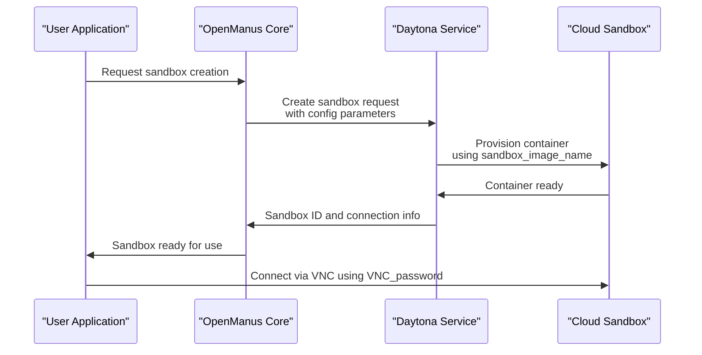
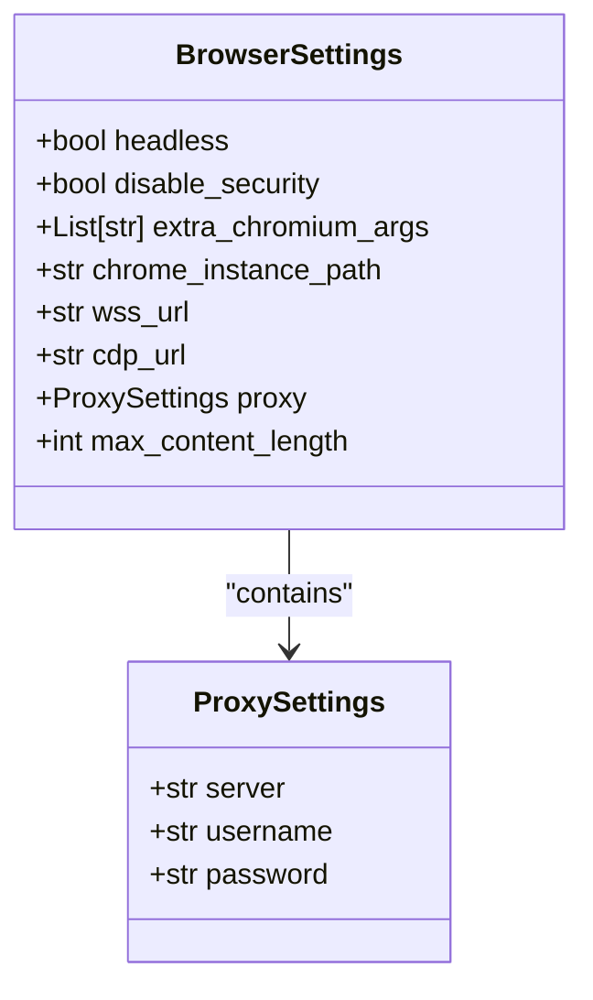
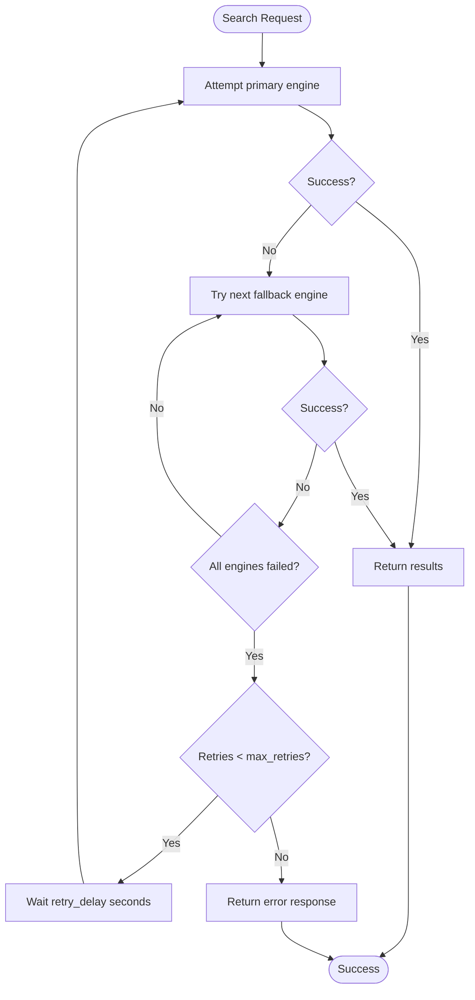
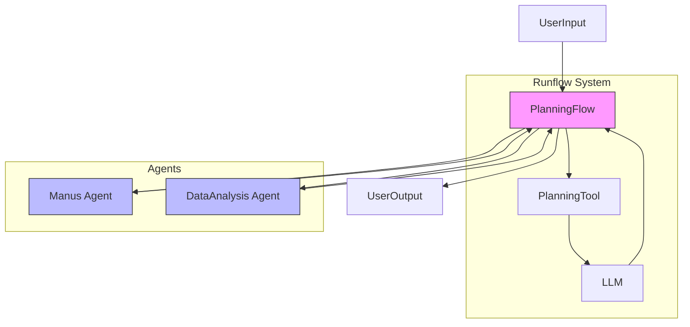

# Advanced Configuration

<cite>
**Referenced Files in This Document**   
- [app/config.py](file://app/config.py)
- [config/config.example-daytona.toml](file://config/config.example-daytona.toml)
- [app/daytona/sandbox.py](file://app/daytona/sandbox.py)
- [app/tool/web_search.py](file://app/tool/web_search.py)
- [run_flow.py](file://run_flow.py)
- [app/flow/planning.py](file://app/flow/planning.py)
</cite>

## Table of Contents
1. [Introduction](#introduction)
2. [Daytona Integration Settings](#daytona-integration-settings)
3. [Browser Configuration Options](#browser-configuration-options)
4. [Search Settings](#search-settings)
5. [Runflow Settings](#runflow-settings)
6. [Complex Configuration Examples](#complex-configuration-examples)
7. [Best Practices](#best-practices)
8. [Troubleshooting](#troubleshooting)
9. [Conclusion](#conclusion)

## Introduction
This document provides comprehensive guidance on advanced configuration options in OpenManus, focusing on cloud-based sandbox management, browser settings, search engine configurations, and multi-agent workflow controls. The configuration system is built around a hierarchical TOML-based structure that enables flexible customization of various components.

**Section sources**
- [app/config.py](file://app/config.py#L0-L373)

## Daytona Integration Settings

### Configuration Parameters
The Daytona integration enables cloud-based sandbox management and remote development environments through the following configuration options:

- **daytona_api_key**: Authentication token for accessing Daytona services
- **daytona_server_url**: API endpoint for Daytona server (default: https://app.daytona.io/api)
- **daytona_target**: Target region for sandbox deployment (options: 'us', 'eu'; default: 'us')
- **sandbox_image_name**: Docker image name for sandbox environment (default: 'whitezxj/sandbox:0.1.0')
- **VNC_password**: Password for VNC access to sandbox GUI (default: '123456')

These settings are defined in the `[daytona]` section of the configuration file and are used to establish connections with Daytona's cloud infrastructure for managing isolated development environments.

### Cloud Sandbox Management
The Daytona configuration enables remote development environments by creating cloud-hosted sandboxes with pre-configured services. When a sandbox is created, the system uses the specified image and environment variables to initialize a container with browser automation capabilities, VNC access for GUI interaction, and supervisord for service management.

The integration automatically handles sandbox lifecycle operations including creation, starting, stopping, and deletion. The VNC password allows secure access to the graphical interface of the sandbox, enabling visual debugging and monitoring of automated browser tasks.



**Diagram sources**
- [app/daytona/sandbox.py](file://app/daytona/sandbox.py#L0-L165)
- [app/config.py](file://app/config.py#L93-L127)

**Section sources**
- [config/config.example-daytona.toml](file://config/config.example-daytona.toml#L97-L113)
- [app/daytona/sandbox.py](file://app/daytona/sandbox.py#L0-L165)

## Browser Configuration Options

### Headless Mode and Security Settings
Browser behavior can be customized through several configuration options:

- **headless**: Controls whether the browser runs in headless mode (default: false)
- **disable_security**: Disables browser security features (default: true)
- **extra_chromium_args**: Additional command-line arguments for Chromium

These settings allow fine-tuning of browser behavior for automation tasks, balancing between security and functionality requirements.

### Chrome Instance Integration
OpenManus supports integration with existing Chrome instances through multiple connection methods:

- **chrome_instance_path**: Path to a local Chrome executable for direct launching
- **wss_url**: WebSocket URL for connecting to a remote browser instance
- **cdp_url**: Chrome DevTools Protocol URL for browser connection

This flexibility enables both local browser automation and remote browser control scenarios.

### Proxy Configuration
Proxy settings are configured through a nested structure within the browser configuration:

```toml
[browser.proxy]
server = "http://proxy-server:port"
username = "proxy-username"
password = "proxy-password"
```

The proxy configuration allows routing browser traffic through intermediary servers, which is essential for network isolation, content filtering, or accessing region-restricted content.



**Diagram sources**
- [app/config.py](file://app/config.py#L68-L94)
- [app/tool/browser_use_tool.py](file://app/tool/browser_use_tool.py#L145-L174)

**Section sources**
- [app/config.py](file://app/config.py#L68-L94)
- [app/tool/browser_use_tool.py](file://app/tool/browser_use_tool.py#L145-L174)

## Search Settings

### Engine Selection and Fallback
The search functionality supports multiple search engines with configurable primary and fallback options:

- **engine**: Primary search engine (default: "Google")
- **fallback_engines**: Ordered list of fallback engines (default: ["DuckDuckGo", "Baidu", "Bing"])

This configuration enables robust search capabilities by automatically switching to alternative engines when the primary engine fails or returns no results.

### Retry Policies and Localization
Search operations include configurable retry mechanisms and localization options:

- **retry_delay**: Wait time between retry attempts (default: 60 seconds)
- **max_retries**: Maximum number of retry cycles (default: 3)
- **lang**: Language code for search results (default: "en")
- **country**: Country code for localized results (default: "us")

These settings ensure reliable search operations even under rate limiting or temporary service disruptions.



**Diagram sources**
- [app/tool/web_search.py](file://app/tool/web_search.py#L200-L304)
- [app/config.py](file://app/config.py#L38-L65)

**Section sources**
- [app/tool/web_search.py](file://app/tool/web_search.py#L200-L304)
- [app/config.py](file://app/config.py#L38-L65)

## Runflow Settings

### Multi-Agent Workflow Control
The Runflow configuration manages multi-agent workflows through the following setting:

- **use_data_analysis_agent**: Enables the data analysis agent in the workflow (default: false)

When enabled, this setting adds a specialized data analysis agent to the planning flow, allowing the system to handle data-intensive tasks such as statistical analysis, data visualization, and numerical computation.

### Workflow Architecture
The Runflow system implements a planning-based execution model where tasks are broken down into steps and executed by appropriate agents. The PlanningFlow class manages the execution lifecycle, creating plans, executing steps, and coordinating between different agents.

The system supports dynamic agent selection based on step requirements, allowing specialized agents to handle specific task types while maintaining a coherent overall workflow.



**Diagram sources**
- [run_flow.py](file://run_flow.py#L0-L52)
- [app/flow/planning.py](file://app/flow/planning.py#L0-L442)

**Section sources**
- [run_flow.py](file://run_flow.py#L0-L52)
- [app/flow/planning.py](file://app/flow/planning.py#L0-L442)

## Complex Configuration Examples

### Integrated Cloud Development Environment
A comprehensive configuration combining Daytona, browser, and search settings:

```toml
[daytona]
daytona_api_key = "your-api-key"
daytona_server_url = "https://app.daytona.io/api"
daytona_target = "us"
sandbox_image_name = "whitezxj/sandbox:0.1.0"
VNC_password = "securepassword123"

[browser]
headless = false
disable_security = true
chrome_instance_path = "/usr/bin/google-chrome"

[search]
engine = "Google"
fallback_engines = ["Bing", "DuckDuckGo"]
lang = "en"
country = "us"
```

### Data Analysis Workflow Configuration
A configuration optimized for data analysis tasks with proxy and retry settings:

```toml
[runflow]
use_data_analysis_agent = true

[browser.proxy]
server = "http://corporate-proxy:8080"
username = "user"
password = "pass"

[search]
engine = "Google"
max_retries = 5
retry_delay = 120
lang = "en"
country = "us"

[llm]
model = "claude-3-7-sonnet-20250219"
base_url = "https://api.anthropic.com/v1/"
api_key = "your-llm-key"
```

**Section sources**
- [config/config.example-daytona.toml](file://config/config.example-daytona.toml#L0-L114)

## Best Practices

### Environment Variable Usage
Store sensitive credentials like API keys in environment variables rather than configuration files. Use the configuration files for non-sensitive settings and defaults, allowing environment variables to override them when needed.

### Configuration Inheritance
Leverage the configuration hierarchy to create base configurations with environment-specific overrides. Use the `config.example.toml` as a template for creating environment-specific configurations without exposing sensitive information.

### Secure Credential Management
Never commit API keys or passwords to version control. Use configuration files with placeholder values and rely on environment variables or secure credential stores for production deployments.

**Section sources**
- [app/config.py](file://app/config.py#L275-L305)

## Troubleshooting

### Configuration Conflict Resolution
When configuration conflicts occur, verify the loading order and precedence rules. The system loads configurations from `config.toml` if it exists, otherwise falling back to `config.example.toml`. Ensure that nested configuration objects are properly structured and that type expectations are met.

### Configuration Validation
Validate configuration integrity by checking the application logs during startup. The system logs initialization messages for each configuration component, indicating successful configuration or warning about missing required settings.

Common issues include:
- Missing required Daytona API key
- Invalid search engine names in fallback list
- Incorrect proxy server format
- Conflicting browser connection methods

**Section sources**
- [app/config.py](file://app/config.py#L157-L199)

## Conclusion
The advanced configuration options in OpenManus provide extensive control over cloud-based sandbox management, browser automation, search operations, and multi-agent workflows. By understanding and properly configuring these options, users can create powerful, customized automation systems tailored to their specific requirements. The modular configuration system allows for flexible combinations of features while maintaining security and reliability.