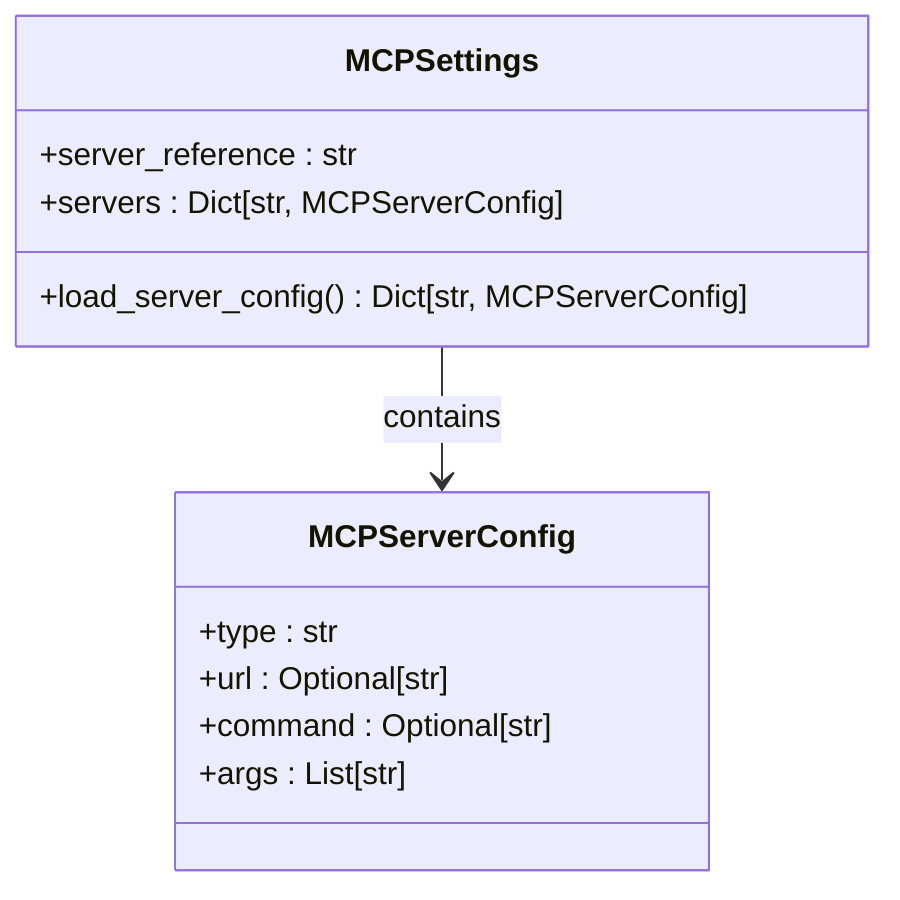
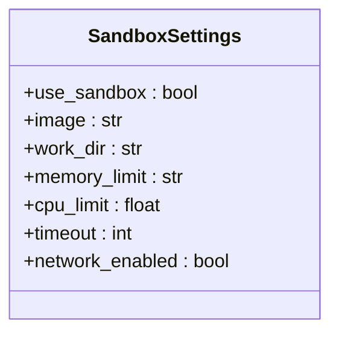
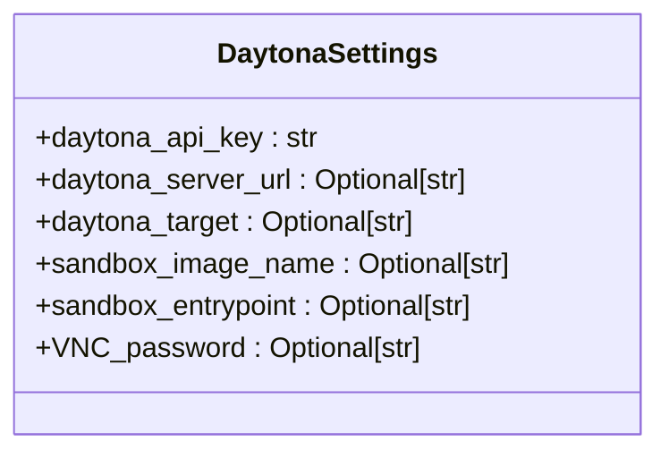
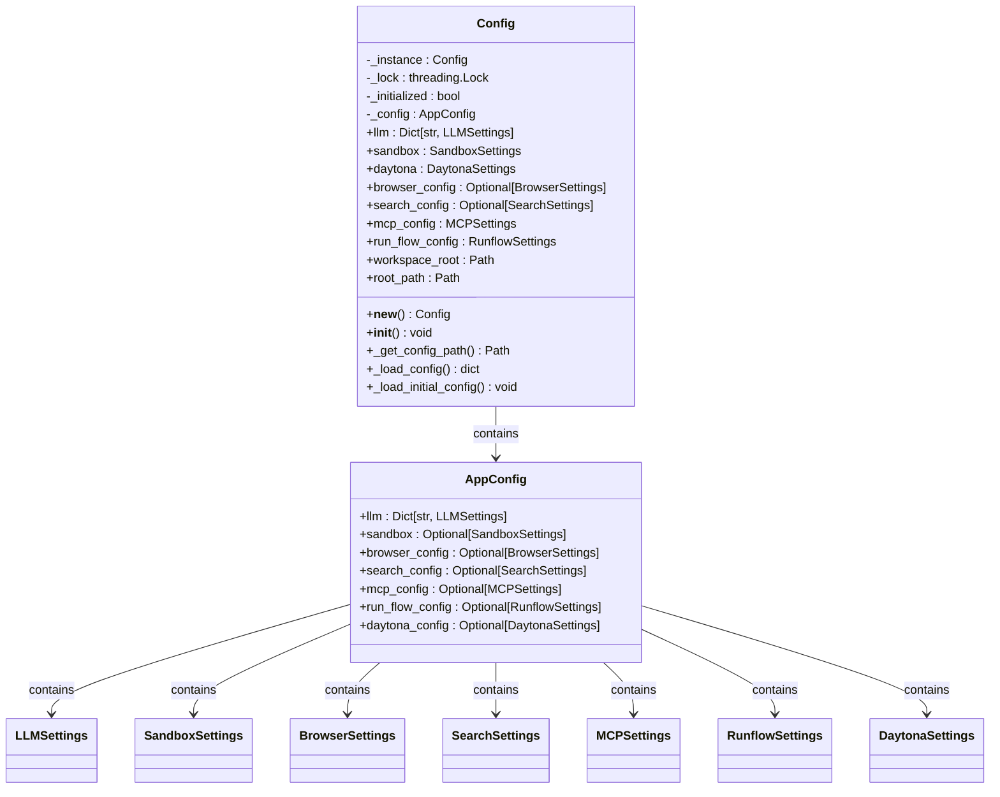

# Configuration

<cite>
**Referenced Files in This Document**   
- [app/config.py](file://app/config.py)
- [config/config.example.toml](file://config/config.example.toml)
- [config/config.example-model-azure.toml](file://config/config.example-model-azure.toml)
- [config/config.example-model-anthropic.toml](file://config/config.example-model-anthropic.toml)
- [config/config.example-model-google.toml](file://config/config.example-model-google.toml)
- [config/config.example-model-ollama.toml](file://config/config.example-model-ollama.toml)
- [config/config.example-model-ppio.toml](file://config/config.example-model-ppio.toml)
- [config/config.example-daytona.toml](file://config/config.example-daytona.toml)
- [config/mcp.example.json](file://config/mcp.example.json)
</cite>

## Table of Contents
1. [Introduction](#introduction)
2. [Configuration Structure](#configuration-structure)
3. [LLM Configuration](#llm-configuration)
4. [MCP Configuration](#mcp-configuration)
5. [Sandbox Configuration](#sandbox-configuration)
6. [Daytona Integration](#daytona-integration)
7. [Configuration Loading and Validation](#configuration-loading-and-validation)
8. [Best Practices and Security](#best-practices-and-security)
9. [Example Configurations](#example-configurations)

## Introduction
OpenManus provides a flexible and extensible configuration system based on TOML format, enabling users to customize various components including LLM providers, MCP servers, sandbox environments, and Daytona integration. The configuration system is designed to support multiple environments and deployment scenarios while maintaining simplicity and clarity. This document details the complete configuration structure, explains how settings are loaded and validated, and provides guidance on best practices for managing configurations securely.

## Configuration Structure
The OpenManus configuration system is organized into distinct sections, each governing a specific aspect of the application's behavior. The primary configuration file, `config.toml`, resides in the `config/` directory and follows the TOML format for readability and ease of editing. The system supports configuration inheritance and overrides, allowing for both global defaults and provider-specific settings.

The main configuration sections include:
- **LLM**: Controls language model settings including provider, model, and API parameters
- **MCP**: Manages Model Context Protocol server connections
- **Sandbox**: Configures execution environment for code execution
- **Daytona**: Handles integration with Daytona cloud development environments
- **Browser**: Controls browser automation settings
- **Search**: Configures search engine preferences
- **Runflow**: Manages workflow execution settings

When no `config.toml` is found, the system automatically falls back to `config.example.toml`, providing a working default configuration that can be customized.

**Section sources**
- [app/config.py](file://app/config.py#L0-L372)
- [config/config.example.toml](file://config/config.example.toml#L0-L105)

## LLM Configuration
The LLM configuration section defines the language model providers and their respective settings. OpenManus supports multiple LLM providers through a unified interface, allowing users to configure different models for different tasks or to provide fallback options.

### Global LLM Settings
The `[llm]` section contains global settings that apply to all LLM operations unless overridden by provider-specific configurations:

```toml
[llm]
model = "claude-3-7-sonnet-20250219"
base_url = "https://api.anthropic.com/v1/"
api_key = "YOUR_API_KEY"
max_tokens = 8192
temperature = 0.0
```

Key parameters include:
- **model**: The specific model identifier to use
- **base_url**: The API endpoint URL for the LLM provider
- **api_key**: Authentication key for accessing the LLM service
- **max_tokens**: Maximum number of tokens in the response
- **temperature**: Controls randomness in model output (0.0 = deterministic, higher = more creative)
- **api_type**: Specifies the provider type (e.g., 'azure', 'ollama', 'aws')
- **api_version**: API version for services that require it (e.g., Azure OpenAI)

### Provider-Specific Configurations
OpenManus supports configuration for various LLM providers through commented examples in the configuration file. Users can uncomment and modify these sections to configure specific providers:

#### Azure OpenAI
```toml
[llm] #AZURE OPENAI:
api_type= 'azure'
model = "gpt-4o-mini"
base_url = "{YOUR_AZURE_ENDPOINT.rstrip('/')}/openai/deployments/{AZURE_DEPLOYMENT_ID}"
api_key = "AZURE API KEY"
max_tokens = 8096
temperature = 0.0
api_version="2024-08-01-preview"
```

#### Anthropic
```toml
[llm]
model = "claude-3-7-sonnet-latest"
base_url = "https://api.anthropic.com/v1/"
api_key = "YOUR_API_KEY"
max_tokens = 8192
temperature = 0.0
```

#### Google Gemini
```toml
[llm]
model = "gemini-2.0-flash"
base_url = "https://generativelanguage.googleapis.com/v1beta/openai/"
api_key = "YOUR_API_KEY"
temperature = 0.0
max_tokens = 8096
```

#### Ollama
```toml
[llm] #OLLAMA:
api_type = 'ollama'
model = "llama3.2"
base_url = "http://localhost:11434/v1"
api_key = "ollama"
max_tokens = 4096
temperature = 0.0
```

#### PPIO
```toml
[llm] #PPIO:
api_type = 'ppio'
model = "deepseek/deepseek-v3-0324"
base_url = "https://api.ppinfra.com/v3/openai"
api_key = "your ppio api key"
max_tokens = 16000
temperature = 0.0
```

### Vision Model Configuration
For multimodal capabilities, OpenManus supports separate configuration for vision models through the `[llm.vision]` section:

```toml
[llm.vision]
model = "claude-3-7-sonnet-20250219"
base_url = "https://api.anthropic.com/v1/"
api_key = "YOUR_API_KEY"
max_tokens = 8192
temperature = 0.0
```

This allows different models to be used for text and vision tasks, optimizing performance and cost based on the specific requirements of each modality.

**Section sources**
- [app/config.py](file://app/config.py#L18-L29)
- [config/config.example.toml](file://config/config.example.toml#L1-L85)
- [config/config.example-model-azure.toml](file://config/config.example-model-azure.toml#L1-L18)
- [config/config.example-model-anthropic.toml](file://config/config.example-model-anthropic.toml#L1-L16)
- [config/config.example-model-google.toml](file://config/config.example-model-google.toml#L1-L16)
- [config/config.example-model-ollama.toml](file://config/config.example-model-ollama.toml#L1-L17)
- [config/config.example-model-ppio.toml](file://config/config.example-model-ppio.toml#L1-L17)

## MCP Configuration
The MCP (Model Context Protocol) configuration enables integration with external MCP servers, supporting both SSE (Server-Sent Events) and stdio connection types. This allows OpenManus to communicate with various tools and services that implement the MCP specification.

### MCP Server Configuration
The main MCP settings are defined in the `[mcp]` section of the TOML configuration:

```toml
[mcp]
server_reference = "app.mcp.server" # default server module reference
```

The `server_reference` parameter specifies the Python module path for the default MCP server implementation.

### External Server Configuration
Additional MCP servers are configured through a separate JSON file (`mcp.json`) that defines multiple server endpoints:

```json
{
    "mcpServers": {
      "server1": {
        "type": "sse",
        "url": "http://localhost:8000/sse"
      }
    }
}
```

Each server configuration includes:
- **type**: Connection type (`sse` or `stdio`)
- **url**: For SSE connections, the endpoint URL
- **command**: For stdio connections, the executable command
- **args**: Command-line arguments for stdio connections

The system loads these configurations through the `MCPSettings.load_server_config()` method, which reads from `mcp.json` or falls back to an empty configuration if the file doesn't exist.



**Diagram sources**
- [app/config.py](file://app/config.py#L126-L134)
- [app/config.py](file://app/config.py#L137-L170)
- [config/mcp.example.json](file://config/mcp.example.json#L1-L8)

**Section sources**
- [app/config.py](file://app/config.py#L126-L170)
- [config/mcp.example.json](file://config/mcp.example.json#L1-L8)

## Sandbox Configuration
The sandbox configuration controls the execution environment for code execution, providing isolation and resource management for potentially unsafe operations.

### Sandbox Settings
The `[sandbox]` section in the configuration file defines the sandbox parameters:

```toml
[sandbox]
use_sandbox = false
image = "python:3.12-slim"
work_dir = "/workspace"
memory_limit = "1g"
cpu_limit = 2.0
timeout = 300
network_enabled = true
```

Key parameters include:
- **use_sandbox**: Enables or disables sandboxed execution
- **image**: Docker image to use for the sandbox environment
- **work_dir**: Working directory path within the container
- **memory_limit**: Memory allocation limit (e.g., "512m", "1g")
- **cpu_limit**: CPU allocation limit as a fraction of available cores
- **timeout**: Maximum execution time in seconds before termination
- **network_enabled**: Whether to allow network access from the sandbox

The default configuration provides reasonable defaults for most use cases, with a Python 3.12 slim image and moderate resource limits to prevent excessive resource consumption.



**Diagram sources**
- [app/config.py](file://app/config.py#L93-L104)

**Section sources**
- [app/config.py](file://app/config.py#L93-L104)
- [config/config.example.toml](file://config/config.example.toml#L87-L94)

## Daytona Integration
The Daytona integration allows OpenManus to connect with Daytona cloud development environments, enabling remote development and execution capabilities.

### Daytona Settings
The `[daytona]` section configures the connection to Daytona services:

```toml
[daytona]
daytona_api_key = ""
daytona_server_url = "https://app.daytona.io/api"
daytona_target = "us"
sandbox_image_name = "whitezxj/sandbox:0.1.0"
sandbox_entrypoint = "/usr/bin/supervisord -n -c /etc/supervisor/conf.d/supervisord.conf"
VNC_password = "123456"
```

Configuration parameters include:
- **daytona_api_key**: Authentication key for Daytona API access
- **daytona_server_url**: Base URL for the Daytona API server
- **daytona_target**: Target region for deployment (options: 'us', 'eu')
- **sandbox_image_name**: Docker image to use for Daytona sandboxes
- **sandbox_entrypoint**: Command to run when starting the sandbox container
- **VNC_password**: Password for VNC access to the sandbox environment

The configuration provides sensible defaults for most parameters, with the exception of the API key which must be provided by the user.



**Diagram sources**
- [app/config.py](file://app/config.py#L107-L123)

**Section sources**
- [app/config.py](file://app/config.py#L107-L123)
- [config/config.example-daytona.toml](file://config/config.example-daytona.toml#L96-L114)

## Configuration Loading and Validation
OpenManus uses a robust configuration loading and validation system based on Pydantic, ensuring type safety and data integrity throughout the application.

### Configuration Class Architecture
The configuration system is implemented as a singleton class `Config` that ensures only one instance exists throughout the application lifecycle. This prevents configuration inconsistencies and provides a centralized access point.



**Diagram sources**
- [app/config.py](file://app/config.py#L196-L368)
- [app/config.py](file://app/config.py#L173-L193)

### Loading Process
The configuration loading process follows these steps:
1. Determine the configuration file path by checking for `config.toml`, falling back to `config.example.toml` if not found
2. Parse the TOML file using `tomllib`
3. Extract and process configuration sections
4. Apply default values and handle overrides
5. Validate all settings using Pydantic models
6. Store the validated configuration in the singleton instance

The system uses Pydantic's BaseModel for automatic type validation and data parsing, ensuring that all configuration values meet their specified requirements before being used by the application.

### Configuration Hierarchy
The configuration system supports a hierarchical structure where:
- Global `[llm]` settings provide defaults
- Provider-specific sections (e.g., `[llm.vision]`) override global settings
- Individual model configurations can inherit from and extend the base configuration

This allows for flexible configuration management across different use cases and environments.

**Section sources**
- [app/config.py](file://app/config.py#L196-L368)
- [app/config.py](file://app/config.py#L173-L193)

## Best Practices and Security
Proper configuration management is critical for both security and operational efficiency in OpenManus deployments.

### Environment Management
For different deployment environments (development, staging, production), use the following strategy:
1. Keep `config.example.toml` in version control with placeholder values
2. Create environment-specific `config.toml` files that are excluded from version control
3. Use symbolic links or deployment scripts to manage environment-specific configurations
4. For containerized deployments, mount configuration files as volumes

### API Key Security
Handle API keys and other sensitive credentials securely:
- Never commit API keys to version control
- Use environment variables for sensitive values when possible
- Set appropriate file permissions on configuration files (600)
- Rotate API keys regularly
- Use the principle of least privilege when creating API keys

### Configuration Validation
Always validate configuration changes:
- Test configurations in a non-production environment first
- Use the example configurations as templates
- Verify that all required fields are populated
- Check that URLs and endpoints are accessible
- Validate that Docker images exist and are accessible

### Backup and Versioning
Maintain configuration backups and versioning:
- Keep backups of working configurations
- Document changes to configuration files
- Use configuration management tools for large deployments
- Implement rollback procedures for configuration changes

**Section sources**
- [app/config.py](file://app/config.py#L0-L372)
- [config/config.example.toml](file://config/config.example.toml#L0-L105)

## Example Configurations
The OpenManus repository includes several example configuration files for different use cases:

### Basic Configuration
The default `config.example.toml` provides a working configuration for Anthropic's Claude model with basic settings for all components.

### Provider-Specific Examples
Specialized example files are provided for different LLM providers:
- `config.example-model-azure.toml`: Configured for Azure OpenAI
- `config.example-model-anthropic.toml`: Optimized for Anthropic models
- `config.example-model-google.toml`: Set up for Google Gemini
- `config.example-model-ollama.toml`: Configured for local Ollama instance
- `config.example-model-ppio.toml`: Set up for PPIO infrastructure

### Integrated Environment
The `config.example-daytona.toml` file demonstrates a complete configuration with Daytona integration, showing how to connect OpenManus to cloud development environments.

To use any of these examples:
1. Copy the example file to `config.toml`
2. Modify the API keys and other sensitive values
3. Adjust settings as needed for your specific use case
4. Test the configuration thoroughly before production use

**Section sources**
- [config/config.example.toml](file://config/config.example.toml#L0-L105)
- [config/config.example-model-azure.toml](file://config/config.example-model-azure.toml#L0-L18)
- [config/config.example-model-anthropic.toml](file://config/config.example-model-anthropic.toml#L0-L16)
- [config/config.example-model-google.toml](file://config/config.example-model-google.toml#L0-L16)
- [config/config.example-model-ollama.toml](file://config/config.example-model-ollama.toml#L0-L17)
- [config/config.example-model-ppio.toml](file://config/config.example-model-ppio.toml#L0-L17)
- [config/config.example-daytona.toml](file://config/config.example-daytona.toml#L0-L114)