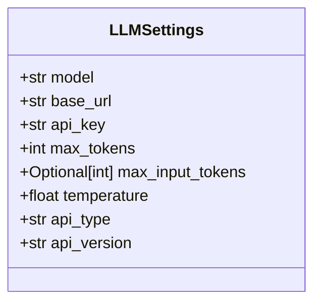
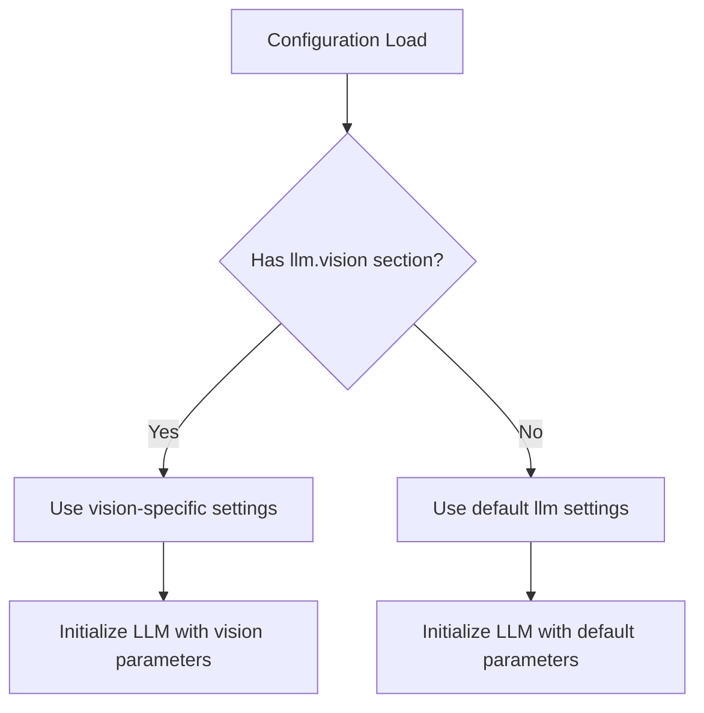
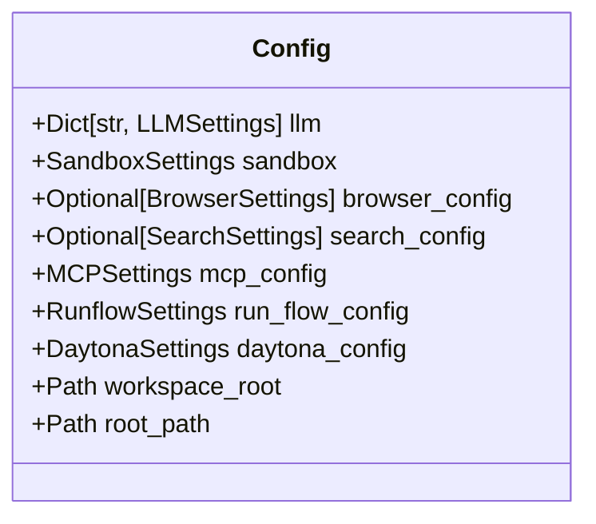
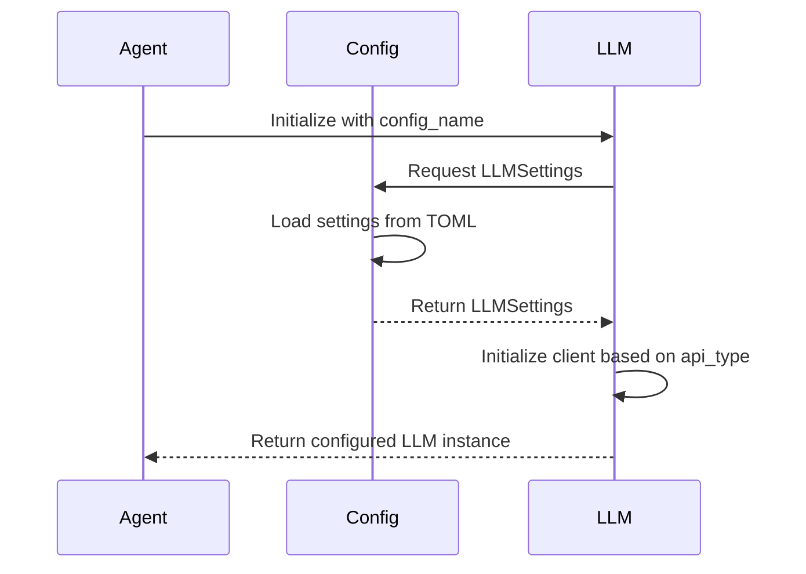

# LLM Configuration

<cite>
**Referenced Files in This Document**   
- [config.py](file://app/config.py)
- [llm.py](file://app/llm.py)
- [schema.py](file://app/schema.py)
- [config.example-model-anthropic.toml](file://config/config.example-model-anthropic.toml)
- [config.example-model-azure.toml](file://config/config.example-model-azure.toml)
- [config.example-model-google.toml](file://config/config.example-model-google.toml)
- [config.example-model-ollama.toml](file://config/config.example-model-ollama.toml)
</cite>

## Table of Contents
1. [Introduction](#introduction)
2. [LLMSettings Model](#llmsettings-model)
3. [Configuration Templates](#configuration-templates)
4. [Default vs Override Settings](#default-vs-override-settings)
5. [Config Class Integration](#config-class-integration)
6. [Security Best Practices](#security-best-practices)
7. [Provider Switching](#provider-switching)
8. [Common Configuration Errors](#common-configuration-errors)
9. [LLM Configuration in Agent Decision-Making](#llm-configuration-in-agent-decision-making)
10. [Conclusion](#conclusion)

## Introduction
This document provides comprehensive documentation for LLM integration in OpenManus, focusing on the configuration system that enables seamless interaction with multiple LLM providers. The configuration framework supports Anthropic, Azure OpenAI, Ollama, and Google services through standardized settings that can be customized for specific use cases. The system is designed to provide flexibility while maintaining security and ease of use for developers integrating different LLM providers into their agent workflows.

## LLMSettings Model
The LLMSettings model defines the core configuration parameters for LLM integration in OpenManus. This Pydantic model ensures type safety and validation for all LLM-related settings.



**Diagram sources**
- [config.py](file://app/config.py#L18-L29)

The LLMSettings model contains the following parameters:

- **model**: Specifies the LLM model name to be used for inference
- **base_url**: Defines the API endpoint URL for the LLM service
- **api_key**: Contains the authentication key for accessing the LLM API
- **max_tokens**: Sets the maximum number of tokens for each response (default: 4096)
- **max_input_tokens**: Optional limit on input tokens across requests (None for unlimited)
- **temperature**: Controls the randomness of the model's output (default: 1.0)
- **api_type**: Identifies the provider type (Azure, Openai, or Ollama)
- **api_version**: Specifies the API version for Azure OpenAI services

These parameters work together to configure the LLM client appropriately for each provider, ensuring proper authentication, endpoint routing, and response handling.

**Section sources**
- [config.py](file://app/config.py#L18-L29)

## Configuration Templates
OpenManus provides example configuration templates for various LLM providers, enabling quick setup and integration. These TOML configuration files serve as templates that users can customize with their specific credentials and preferences.

### Anthropic Configuration
The Anthropic configuration template sets up access to Claude models with appropriate endpoints and parameters:

```toml
[llm]
model = "claude-3-7-sonnet-latest"
base_url = "https://api.anthropic.com/v1/"
api_key = "YOUR_API_KEY"
max_tokens = 8192
temperature = 0.0

[llm.vision]
model = "claude-3-7-sonnet-20250219"
base_url = "https://api.anthropic.com/v1/"
api_key = "YOUR_API_KEY"
max_tokens = 8192
temperature = 0.0
```

**Section sources**
- [config.example-model-anthropic.toml](file://config/config.example-model-anthropic.toml)

### Azure OpenAI Configuration
The Azure OpenAI template includes provider-specific parameters such as deployment IDs and API versions:

```toml
[llm]
api_type= 'azure'
model = "gpt-4o-mini"
base_url = "{YOUR_AZURE_ENDPOINT.rstrip('/')}/openai/deployments/{AZURE_DEPLOYMENT_ID}"
api_key = "YOUR_API_KEY"
max_tokens = 8096
temperature = 0.0
api_version="AZURE API VERSION"

[llm.vision]
model = "gpt-4o"
base_url = "{YOUR_AZURE_ENDPOINT.rstrip('/')}/openai/deployments/{AZURE_DEPLOYMENT_ID}"
api_key = "YOUR_API_KEY"
max_tokens = 8192
temperature = 0.0
```

**Section sources**
- [config.example-model-azure.toml](file://config/config.example-model-azure.toml)

### Google Configuration
The Google configuration template supports Gemini models with the appropriate API endpoints:

```toml
[llm]
model = "gemini-2.0-flash"
base_url = "https://generativelanguage.googleapis.com/v1beta/openai/"
api_key = "YOUR_API_KEY"
temperature = 0.0
max_tokens = 8096

[llm.vision]
model = "gemini-2.0-flash-exp"
base_url = "https://generativelanguage.googleapis.com/v1beta/openai/"
api_key = "YOUR_API_KEY"
max_tokens = 8192
temperature = 0.0
```

**Section sources**
- [config.example-model-google.toml](file://config/config.example-model-google.toml)

### Ollama Configuration
The Ollama template enables local model hosting with default localhost endpoints:

```toml
[llm]
api_type = 'ollama'
model = "llama3.2"
base_url = "http://localhost:11434/v1"
api_key = "ollama"
max_tokens = 4096
temperature = 0.0

[llm.vision]
api_type = 'ollama'
model = "llama3.2-vision"
base_url = "http://localhost:11434/v1"
api_key = "ollama"
max_tokens = 4096
temperature = 0.0
```

**Section sources**
- [config.example-model-ollama.toml](file://config/config.example-model-ollama.toml)

## Default vs Override Settings
OpenManus implements a hierarchical configuration system that distinguishes between default LLM settings and specialized overrides for specific models.

### Default Configuration
The default configuration provides baseline settings that apply to all LLM interactions unless overridden. These settings are loaded from the primary `[llm]` section in the configuration file and serve as fallback values for all providers.

### Vision Model Overrides
Specialized configurations for vision-capable LLMs are implemented through override settings in the `[llm.vision]` section. This allows different models to be used for text-only versus vision-capable tasks while maintaining consistent configuration patterns.



**Diagram sources**
- [config.py](file://app/config.py#L232-L328)

The override system enables agents to automatically switch between standard and vision-capable models based on task requirements, ensuring optimal performance and cost efficiency.

**Section sources**
- [config.py](file://app/config.py#L232-L328)

## Config Class Integration
The Config class serves as the central configuration manager in OpenManus, exposing LLM settings to the agent system through a singleton pattern.



**Diagram sources**
- [config.py](file://app/config.py#L331-L368)

The Config class provides the following key methods for accessing LLM settings:

- **llm**: Returns a dictionary of LLMSettings objects keyed by configuration name
- **_load_initial_config**: Processes the TOML configuration file and creates the AppConfig object
- **_get_config_path**: Determines the appropriate configuration file path
- **_load_config**: Loads and parses the TOML configuration file

Agents access LLM settings through the global `config` instance, which ensures consistent configuration across all components of the system.

**Section sources**
- [config.py](file://app/config.py#L331-L368)

## Security Best Practices
OpenManus implements several security best practices for API key management to protect sensitive credentials.

### Environment Variables
API keys should be stored in environment variables rather than hard-coded in configuration files. The system supports loading API keys from environment variables to prevent accidental exposure in version control systems.

### Configuration File Permissions
Configuration files containing API keys should have restricted file permissions (600) to prevent unauthorized access from other users on the system.

### Key Rotation
Regular rotation of API keys is recommended to minimize the impact of potential key compromise. The configuration system supports easy key updates without requiring code changes.

### Secure Storage
For production deployments, consider using secure secret management services (e.g., Hashicorp Vault, AWS Secrets Manager) instead of file-based storage for API keys.

## Provider Switching
OpenManus supports programmatic switching between LLM providers through the LLM class initialization system.



**Diagram sources**
- [llm.py](file://app/llm.py#L185-L226)

The switching mechanism works as follows:

1. Agents specify a configuration name when initializing the LLM instance
2. The LLM class retrieves the corresponding LLMSettings from the Config singleton
3. Based on the `api_type` parameter, the appropriate client (AsyncAzureOpenAI, AsyncOpenAI, or BedrockClient) is instantiated
4. The configured LLM instance is returned for use in agent workflows

This design enables seamless switching between providers without requiring changes to agent logic.

**Section sources**
- [llm.py](file://app/llm.py#L185-L226)

## Common Configuration Errors
Several common configuration errors can occur when setting up LLM integration in OpenManus. Understanding these issues helps ensure smooth deployment.

### Incorrect Base URLs
Using incorrect base URLs is a frequent source of connection failures. Each provider has specific endpoint requirements:

- **Anthropic**: Must use `https://api.anthropic.com/v1/`
- **Azure OpenAI**: Must include deployment ID in the path
- **Google**: Must use `https://generativelanguage.googleapis.com/v1beta/openai/`
- **Ollama**: Typically `http://localhost:11434/v1` for local instances

### Unsupported Models
Specifying models that are not available from the provider will result in API errors. Always verify model availability with the provider's documentation before configuration.

### Authentication Issues
Common authentication problems include:
- Missing or incorrect API keys
- Expired keys
- Insufficient permissions for the specified model
- Region restrictions on API access

### Version Mismatch
For Azure OpenAI, using an incorrect `api_version` can cause compatibility issues. Always use the latest stable API version supported by your deployment.

## LLM Configuration in Agent Decision-Making
LLM configuration plays a critical role in agent decision-making and tool usage patterns.

### Temperature Impact
The temperature setting directly influences agent behavior:
- **Low temperature (0.0-0.5)**: Produces deterministic, focused responses suitable for analytical tasks
- **Medium temperature (0.5-0.8)**: Balances creativity and consistency for general problem-solving
- **High temperature (0.8-1.0)**: Generates more creative, exploratory responses for brainstorming

### Token Management
The `max_tokens` and `max_input_tokens` parameters affect how agents structure their responses and manage conversation history. Agents may need to summarize or truncate content when approaching token limits.

### Model Capabilities
The configured model determines which tools agents can effectively use:
- **Vision-capable models**: Can process image inputs and use vision-related tools
- **Large context models**: Can maintain longer conversation histories
- **Specialized models**: May have optimized performance for specific domains

Agents adapt their decision-making strategies based on the capabilities of the configured LLM, selecting appropriate tools and response patterns.

**Section sources**
- [llm.py](file://app/llm.py#L360-L765)
- [agent/base.py](file://app/agent/base.py#L144-L196)

## Conclusion
The LLM configuration system in OpenManus provides a flexible, secure framework for integrating multiple language model providers. By standardizing configuration through the LLMSettings model and Config class, the system enables seamless switching between providers while maintaining consistent interfaces for agents. The support for override configurations allows specialized models to be used for specific tasks like vision processing, while security best practices help protect sensitive API credentials. Understanding the relationship between configuration parameters and agent behavior is essential for optimizing performance and achieving desired outcomes in agent workflows.