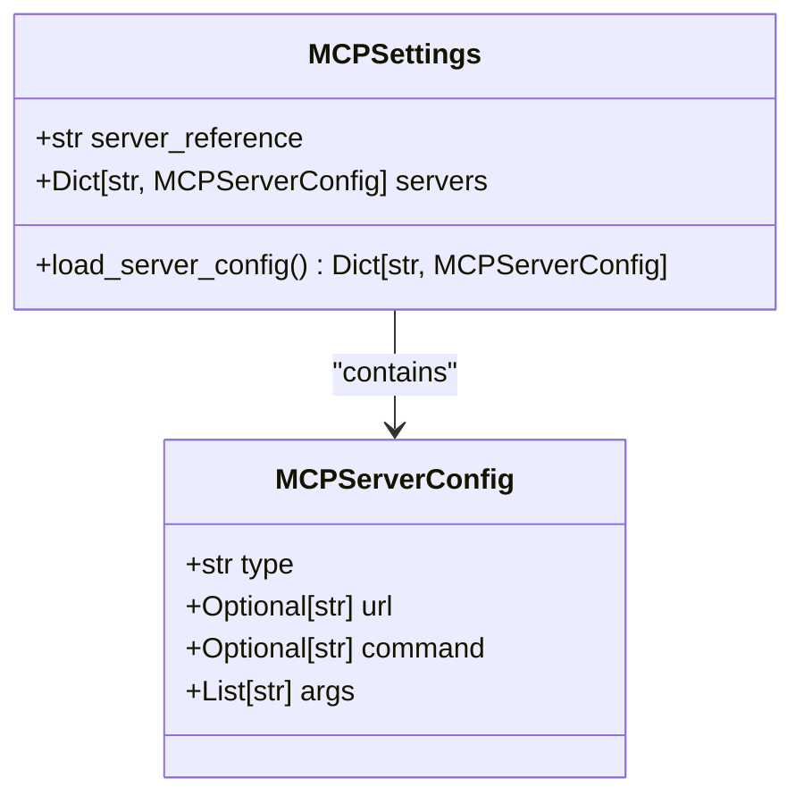
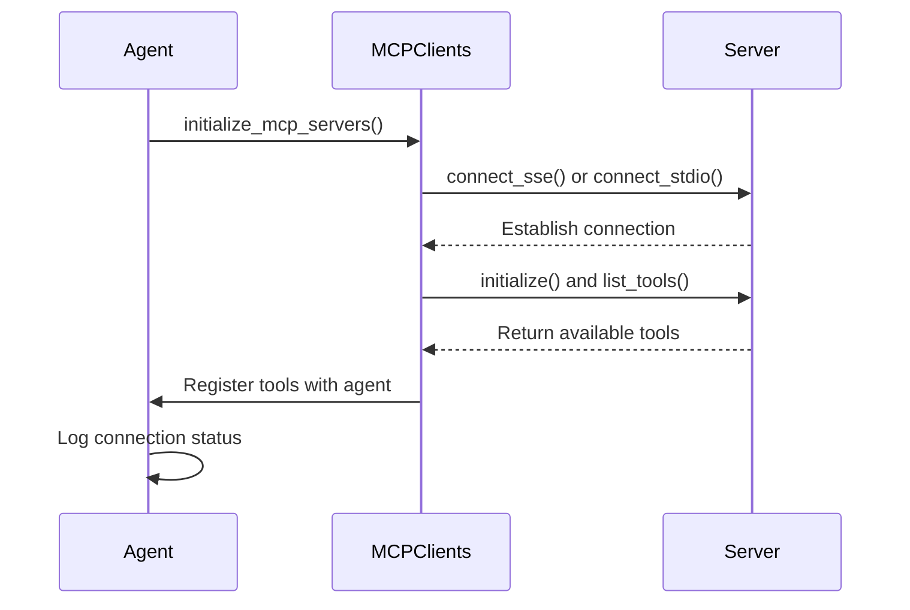

# MCP Server Configuration

<cite>
**Referenced Files in This Document**   
- [app/config.py](file://app/config.py#L126-L170)
- [config/mcp.example.json](file://config/mcp.example.json#L0-L8)
- [config/config.example.toml](file://config/config.example.toml#L95-L105)
- [app/agent/manus.py](file://app/agent/manus.py#L66-L88)
- [app/tool/mcp.py](file://app/tool/mcp.py#L36-L193)
- [app/mcp/server.py](file://app/mcp/server.py#L1-L180)
- [run_mcp_server.py](file://run_mcp_server.py#L1-L10)
</cite>

## Table of Contents
1. [Introduction](#introduction)
2. [MCP Server Configuration in mcp.json](#mcp-server-configuration-in-mcpjson)
3. [Integration with TOML Configuration](#integration-with-toml-configuration)
4. [Server Configuration Classes](#server-configuration-classes)
5. [Security Considerations](#security-considerations)
6. [Troubleshooting Common Issues](#troubleshooting-common-issues)
7. [Testing MCP Server Connectivity](#testing-mcp-server-connectivity)
8. [Real-World Examples from Codebase](#real-world-examples-from-codebase)

## Introduction
The Model Context Protocol (MCP) enables agents to discover and invoke tools from remote servers. This document details how to configure MCP servers through JSON and TOML files, explaining the structure, integration, and implementation of server configurations within the OpenManus framework. It covers both SSE-based and stdio-based server types, their security implications, and practical usage patterns observed in the codebase.

## MCP Server Configuration in mcp.json
MCP server definitions are stored in a JSON file named `mcp.json`, located in the `config/` directory. The configuration defines one or more servers under the `mcpServers` key, each identified by a unique `server_id`.

Each server configuration includes:
- **type**: Specifies the communication protocol (`sse` for server-sent events, `stdio` for standard input/output)
- **url**: Required for `sse` type; specifies the endpoint URL
- **command**: Required for `stdio` type; specifies the executable command
- **args**: Optional list of arguments passed to the command for `stdio` servers

Example configuration:
```json
{
    "mcpServers": {
        "local_server": {
            "type": "stdio",
            "command": "python",
            "args": ["-m", "app.mcp.server"]
        },
        "remote_server": {
            "type": "sse",
            "url": "http://localhost:8000/sse"
        }
    }
}
```

This structure allows flexible definition of both local processes and remote services accessible via HTTP endpoints.

**Section sources**
- [config/mcp.example.json](file://config/mcp.example.json#L0-L8)
- [app/config.py](file://app/config.py#L157-L170)

## Integration with TOML Configuration
The MCP configuration integrates with the main TOML configuration file through the `[mcp]` section. This section supports a `server_reference` field that specifies the Python module path used to launch stdio-based servers.

In `config.example.toml`, the MCP section appears as:
```toml
[mcp]
server_reference = "app.mcp.server" # default server module reference
```

During application startup, the system reads this value and uses it to construct the command line arguments for stdio servers when no explicit command is provided in `mcp.json`. For example, if `server_reference` is set to `"app.mcp.server"`, the launcher will execute `python -m app.mcp.server` to start the MCP server process.

This integration enables centralized management of server references while allowing per-server overrides in the JSON configuration.

**Section sources**
- [config/config.example.toml](file://config/config.example.toml#L95-L105)
- [app/config.py](file://app/config.py#L275-L305)

## Server Configuration Classes
The configuration system uses two Pydantic models to represent MCP settings: `MCPServerConfig` and `MCPSettings`.

### MCPServerConfig
Represents a single MCP server's configuration with fields:
- `type`: Connection type (`sse` or `stdio`)
- `url`: Server URL for SSE connections
- `command`: Executable command for stdio connections
- `args`: List of command-line arguments for stdio servers

### MCPSettings
Encapsulates global MCP configuration:
- `server_reference`: Default module reference for launching servers
- `servers`: Dictionary of `MCPServerConfig` objects keyed by `server_id`

The `MCPSettings.load_server_config()` class method handles loading and parsing the `mcp.json` file, validating the structure and instantiating the appropriate configuration objects. It returns an empty dictionary if the file doesn't exist, enabling graceful fallback behavior.



**Diagram sources**
- [app/config.py](file://app/config.py#L126-L134)
- [app/config.py](file://app/config.py#L137-L170)

**Section sources**
- [app/config.py](file://app/config.py#L126-L170)

## Security Considerations
When exposing MCP servers, several security aspects must be considered:

1. **Network Exposure**: SSE servers should not be exposed to public networks without proper authentication and encryption (HTTPS). The example configuration uses `http://localhost:8000/sse`, indicating it's intended for local use only.

2. **Command Injection**: For stdio servers, ensure that the `command` and `args` fields contain trusted values, as they directly execute system commands.

3. **Tool Access Control**: MCP servers expose tools that may have system-level access (e.g., file operations, shell execution). Access should be restricted based on trust levels.

4. **Input Validation**: All incoming tool calls should be validated, especially when servers are exposed externally.

Best practices include:
- Using stdio for local, trusted servers
- Securing SSE endpoints with authentication when exposed externally
- Regularly auditing the tools exposed by MCP servers
- Running servers with minimal required privileges

**Section sources**
- [app/mcp/server.py](file://app/mcp/server.py#L1-L180)
- [app/tool/mcp.py](file://app/tool/mcp.py#L36-L193)

## Troubleshooting Common Issues
Common connection issues and their solutions:

### Connection Failures
- **SSE Connection Refused**: Verify the server is running and the URL is correct. Check firewall settings and network connectivity.
- **Stdio Process Failure**: Ensure the command is available in the system PATH and has execute permissions. Validate argument syntax.

### Configuration Errors
- **Missing Required Fields**: Ensure `type` is specified and either `url` (for `sse`) or `command` (for `stdio`) is provided.
- **Invalid JSON**: Validate the `mcp.json` structure using a JSON validator.
- **File Not Found**: Confirm `mcp.json` exists in the `config/` directory.

### Runtime Issues
- **Tool Discovery Failure**: Check server logs for initialization errors. Verify the server properly registers tools.
- **Authentication Problems**: For secured endpoints, ensure credentials are properly configured.

The system logs connection attempts and errors, which can be reviewed for diagnostic information.

**Section sources**
- [app/agent/manus.py](file://app/agent/manus.py#L66-L88)
- [app/tool/mcp.py](file://app/tool/mcp.py#L49-L68)

## Testing MCP Server Connectivity
To test MCP server connectivity:

1. **Start the Server**: Use `python run_mcp_server.py` to launch a local MCP server.
2. **Verify Configuration**: Ensure `mcp.json` correctly references the server.
3. **Initialize Connection**: Agents automatically attempt to connect during initialization via `initialize_mcp_servers()`.
4. **Check Logs**: Successful connections are logged with messages like "Connected to MCP server server1 at http://localhost:8000/sse".

For manual testing, the `run_mcp.py` script can be used with different connection types:
```bash
# Test stdio connection
python run_mcp.py --connection stdio

# Test SSE connection
python run_mcp.py --connection sse --server-url http://localhost:8000/sse
```

The system validates connections by attempting to list available tools from each server during initialization.



**Diagram sources**
- [run_mcp_server.py](file://run_mcp_server.py#L1-L10)
- [app/agent/manus.py](file://app/agent/manus.py#L66-L88)
- [app/tool/mcp.py](file://app/tool/mcp.py#L36-L193)

## Real-World Examples from Codebase
The codebase demonstrates several patterns for MCP server usage:

### Manus Agent Initialization
The `Manus` agent loads MCP server configurations and establishes connections during initialization:
```python
async def initialize_mcp_servers(self) -> None:
    for server_id, server_config in config.mcp_config.servers.items():
        if server_config.type == "sse":
            await self.connect_mcp_server(server_config.url, server_id)
        elif server_config.type == "stdio":
            await self.connect_mcp_server(
                server_config.command,
                server_id,
                use_stdio=True,
                stdio_args=server_config.args,
            )
```

### Tool Registration Pattern
The `MCPServer` class registers standard tools like `bash`, `browser`, and `editor`, making them available through the protocol. These tools are automatically discovered by connecting clients.

### Dynamic Tool Discovery
The `MCPClients` class dynamically creates tool wrappers (`MCPClientTool`) for each remote tool, prefixing them with `mcp_{server_id}_` to avoid naming conflicts.

These patterns illustrate a robust system for distributed tool discovery and execution, enabling modular extension of agent capabilities through external services.

**Section sources**
- [app/agent/manus.py](file://app/agent/manus.py#L66-L88)
- [app/tool/mcp.py](file://app/tool/mcp.py#L102-L144)
- [app/mcp/server.py](file://app/mcp/server.py#L1-L180)