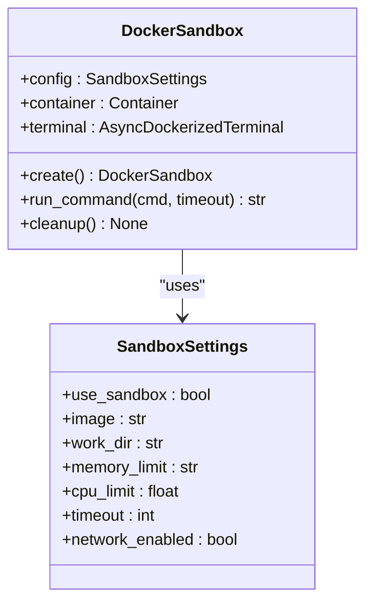
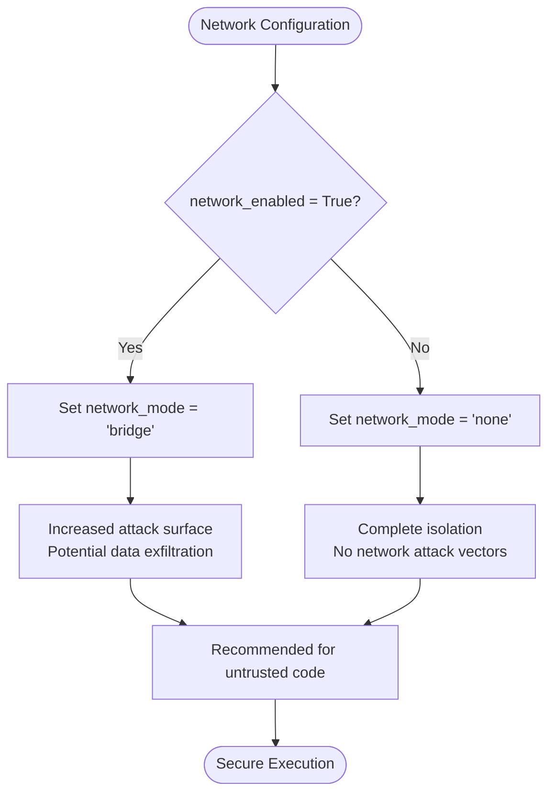
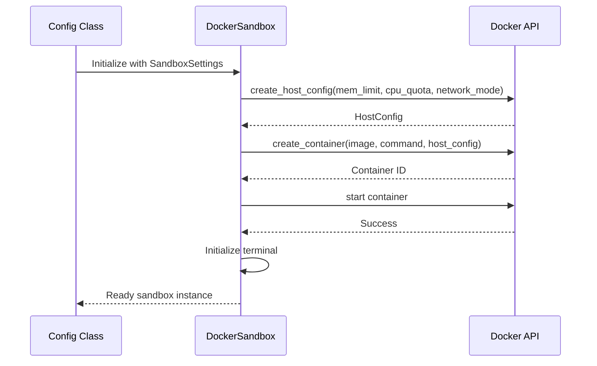

# Sandbox Configuration

<cite>
**Referenced Files in This Document**   
- [SandboxSettings](file://app/config.py#L93-L104)
- [DockerSandbox](file://app/sandbox/core/sandbox.py#L17-L461)
- [Config](file://app/config.py#L196-L368)
- [config.example.toml](file://config/config.example.toml#L88-L95)
</cite>

## Table of Contents
1. [SandboxSettings Model Overview](#sandboxsettings-model-overview)
2. [Parameter Configuration and Container Behavior](#parameter-configuration-and-container-behavior)
3. [Resource Limit Configuration Examples](#resource-limit-configuration-examples)
4. [Network Security and Isolation](#network-security-and-isolation)
5. [Configuration Integration with Sandbox Class](#configuration-integration-with-sandbox-class)
6. [Container Image Selection and Performance Optimization](#container-image-selection-and-performance-optimization)
7. [Common Issues and Troubleshooting](#common-issues-and-troubleshooting)
8. [Development vs Production Environment Configuration](#development-vs-production-environment-configuration)

## SandboxSettings Model Overview

The `SandboxSettings` model in OpenManus provides comprehensive configuration for Docker container execution environments. This Pydantic model defines the parameters that control sandbox behavior, ensuring secure and isolated code execution. The model serves as the foundation for container creation, with each parameter directly mapping to Docker container configuration options. These settings enable fine-grained control over resource allocation, security boundaries, and operational constraints, allowing users to balance performance requirements with security considerations.

**Section sources**
- [SandboxSettings](file://app/config.py#L93-L104)

## Parameter Configuration and Container Behavior

The `SandboxSettings` model contains several key parameters that directly control Docker container behavior during code execution. The `use_sandbox` parameter acts as a master switch, enabling or disabling sandboxed execution. When enabled, the `image` parameter specifies the base Docker image (default: "python:3.12-slim") that provides the execution environment. The `work_dir` parameter sets the container's working directory (default: "/workspace"), establishing the root path for file operations within the sandbox.

Resource constraints are managed through the `memory_limit` (default: "512m") and `cpu_limit` (default: 1.0) parameters, which enforce hard limits on container resource consumption. The `timeout` parameter (default: 300 seconds) prevents infinite execution by terminating commands that exceed the specified duration. The `network_enabled` parameter (default: False) controls network access, with disabled networking providing enhanced security through complete isolation. These parameters work together to create a predictable and secure execution environment that prevents resource exhaustion and limits potential attack surfaces.

**Diagram sources**
- [SandboxSettings](file://app/config.py#L93-L104)
- [DockerSandbox](file://app/sandbox/core/sandbox.py#L17-L461)

**Section sources**
- [SandboxSettings](file://app/config.py#L93-L104)
- [DockerSandbox](file://app/sandbox/core/sandbox.py#L17-L461)

## Resource Limit Configuration Examples

OpenManus supports flexible resource configuration for different use cases through the `memory_limit` and `cpu_limit` parameters. For lightweight scripts and simple operations, the default configuration of 512MB memory and 1.0 CPU core provides an optimal balance of performance and resource efficiency. This configuration is suitable for basic Python scripts, file operations, and simple data processing tasks that don't require significant computational resources.

For memory-intensive data analysis workloads, these limits can be increased substantially. A configuration with 4GB of memory ("4g") and 2.0 CPU cores enables the processing of large datasets, complex machine learning models, and memory-heavy operations. This higher-resource configuration allows for in-memory data processing, large-scale numerical computations, and visualization of extensive datasets. The ability to adjust these limits dynamically enables users to optimize resource allocation based on specific task requirements, preventing both under-provisioning that could cause failures and over-provisioning that would waste system resources.

**Section sources**
- [SandboxSettings](file://app/config.py#L93-L104)
- [DockerSandbox](file://app/sandbox/core/sandbox.py#L48-L102)

## Network Security and Isolation

The `network_enabled` parameter plays a critical role in balancing functionality with security isolation. When set to `False` (the default), the sandbox operates in complete network isolation with `network_mode="none"`, preventing any external communication. This configuration provides maximum security by eliminating network-based attack vectors and preventing data exfiltration, making it ideal for executing untrusted code or handling sensitive data.

When set to `True`, the container uses `bridge` network mode, enabling controlled network access. This configuration is necessary for tasks requiring external resources, such as downloading packages, accessing APIs, or retrieving remote data. However, it introduces potential security risks that must be carefully managed. The security implications include potential exposure to malicious network content, unauthorized data transmission, and increased attack surface. Users should enable network access only when absolutely necessary and consider implementing additional security measures, such as firewall rules or network monitoring, when working with untrusted code in network-enabled sandboxes.

**Diagram sources**
- [DockerSandbox](file://app/sandbox/core/sandbox.py#L48-L102)

**Section sources**
- [SandboxSettings](file://app/config.py#L93-L104)
- [DockerSandbox](file://app/sandbox/core/sandbox.py#L48-L102)

## Configuration Integration with Sandbox Class

The integration between the `Config` class and `DockerSandbox` ensures that sandbox settings are properly enforced during container creation and execution. The `Config` class loads settings from configuration files and provides access to the `SandboxSettings` instance through its `sandbox` property. During sandbox initialization, these settings are passed to the `DockerSandbox` constructor, which uses them to configure the container's resource limits, network settings, and working directory.

The `create` method in `DockerSandbox` translates the `SandboxSettings` parameters into Docker API calls, applying memory limits through `mem_limit`, CPU constraints via `cpu_period` and `cpu_quota`, and network configuration with `network_mode`. The `run_command` method enforces the `timeout` parameter by applying it to command execution, raising a `SandboxTimeoutError` if exceeded. This tight integration ensures that all configured limits and security settings are consistently applied, providing a reliable and predictable execution environment that adheres to the specified configuration.

**Diagram sources**
- [Config](file://app/config.py#L196-L368)
- [DockerSandbox](file://app/sandbox/core/sandbox.py#L17-L461)

**Section sources**
- [Config](file://app/config.py#L196-L368)
- [DockerSandbox](file://app/sandbox/core/sandbox.py#L17-L461)

## Container Image Selection and Performance Optimization

Choosing appropriate container images is crucial for both functionality and performance optimization in OpenManus. The default "python:3.12-slim" image provides a minimal Python environment that balances size and functionality, making it suitable for most use cases. This slim image reduces startup time and disk usage while providing essential Python packages. For specialized workloads, users can specify alternative images containing pre-installed packages or specific toolchains, such as data science images with NumPy, Pandas, and Matplotlib pre-installed.

Performance optimization involves selecting images that minimize container startup time while providing necessary dependencies. Using images with cached dependencies reduces the need for package installation during execution, significantly improving performance for repetitive tasks. Additionally, keeping images updated ensures access to the latest security patches and performance improvements. Users should avoid overly large images that increase startup time and resource consumption unless specific packages are required. The `image` parameter allows complete flexibility in image selection, enabling users to optimize for their specific use cases while maintaining security through the sandbox's isolation features.

**Section sources**
- [SandboxSettings](file://app/config.py#L93-L104)
- [DockerSandbox](file://app/sandbox/core/sandbox.py#L48-L102)

## Common Issues and Troubleshooting

Several common issues may arise when configuring and using sandboxes in OpenManus, each with specific troubleshooting approaches. Container startup failures often occur due to missing Docker images or insufficient system resources. These can be resolved by ensuring the specified image is available (the system will attempt to pull it automatically) and verifying that the host system has adequate memory and CPU resources available.

Resource exhaustion issues typically manifest as out-of-memory errors or CPU throttling. These can be addressed by adjusting the `memory_limit` and `cpu_limit` parameters to better match the workload requirements. For memory-intensive tasks, increasing the memory limit or optimizing the code to use less memory may be necessary. Timeout configurations may need adjustment for long-running processes; increasing the `timeout` value or implementing checkpointing in the code can prevent premature termination. Monitoring container resource usage and adjusting limits accordingly helps maintain optimal performance while preventing system instability.

**Section sources**
- [SandboxSettings](file://app/config.py#L93-L104)
- [DockerSandbox](file://app/sandbox/core/sandbox.py#L48-L102)
- [DockerSandbox](file://app/sandbox/core/sandbox.py#L139-L163)

## Development vs Production Environment Configuration

Configuring sandbox settings appropriately for development versus production environments is essential for balancing convenience and security. In development environments, users may enable `network_enabled` to facilitate package installation and external resource access, use higher resource limits to accommodate debugging and testing, and potentially disable sandboxing entirely (`use_sandbox=False`) for rapid iteration and troubleshooting. These settings prioritize developer convenience and flexibility during the development process.

In production environments, security should be prioritized by disabling network access (`network_enabled=False`), using minimal resource limits to prevent abuse, and ensuring sandboxing is enabled (`use_sandbox=True`). The container image should be locked to a specific version for reproducibility, and timeouts should be set to appropriate values to prevent denial-of-service conditions. Configuration files like `config.example.toml` provide templates for these different environments, allowing users to maintain separate configurations that can be easily switched between development and production use cases.

**Section sources**
- [SandboxSettings](file://app/config.py#L93-L104)
- [config.example.toml](file://config/config.example.toml#L88-L95)