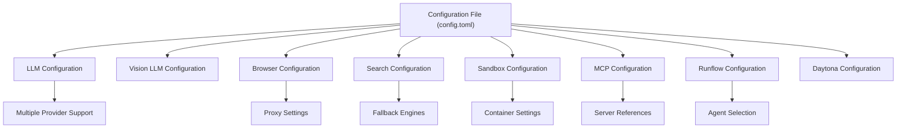
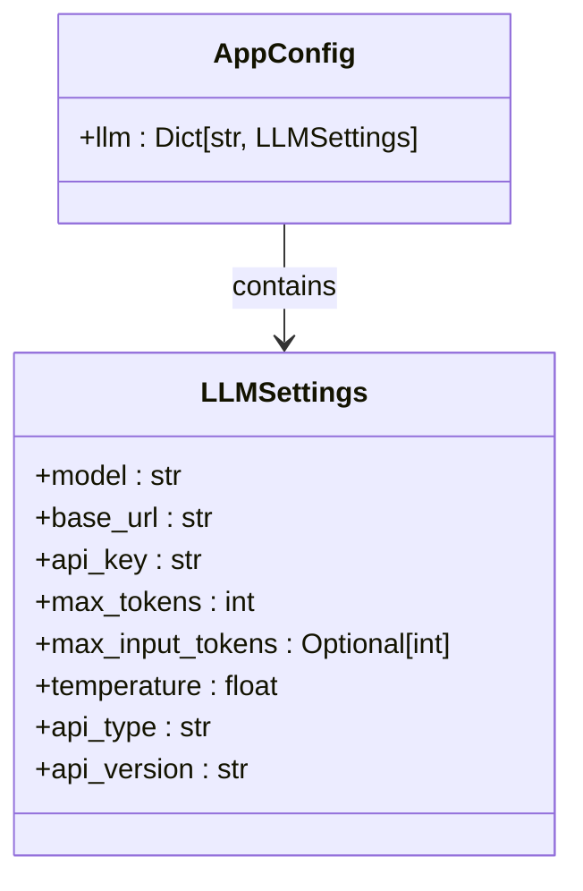
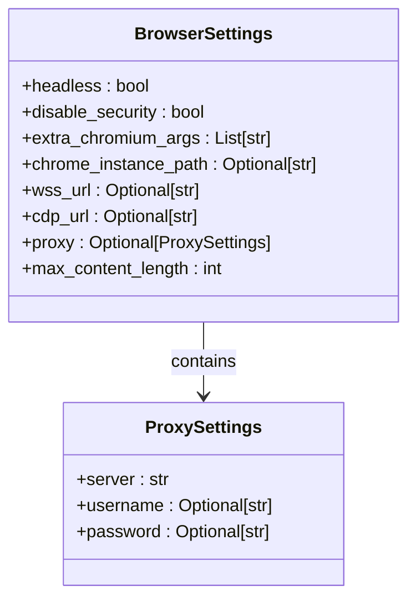
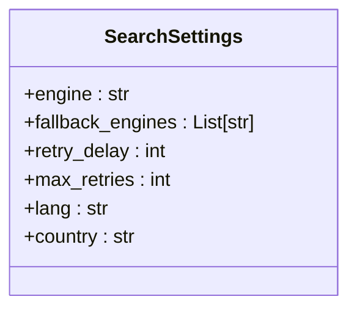
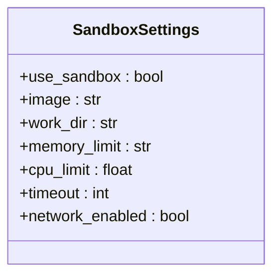
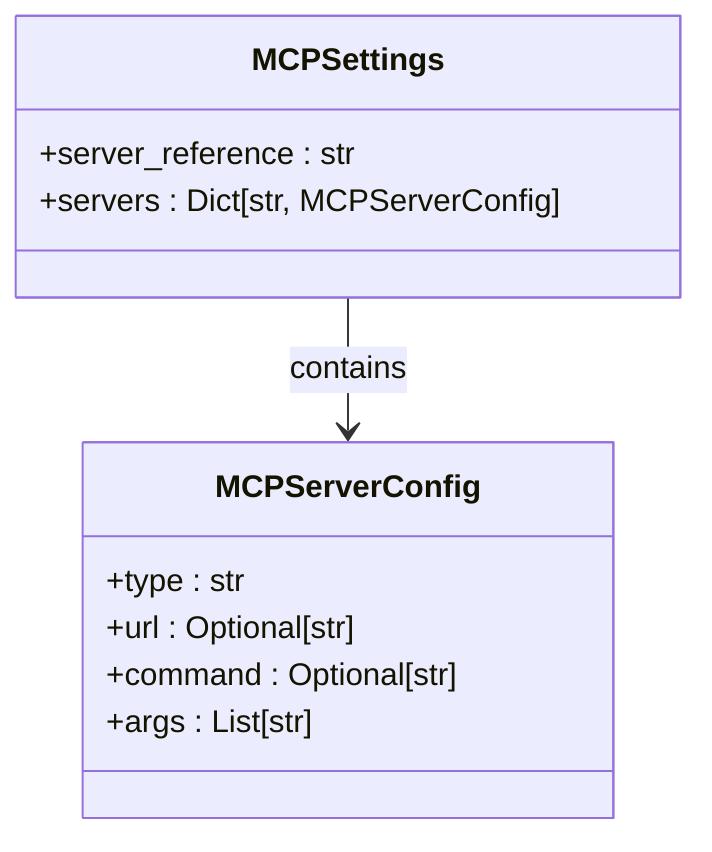
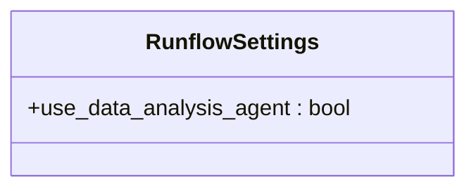
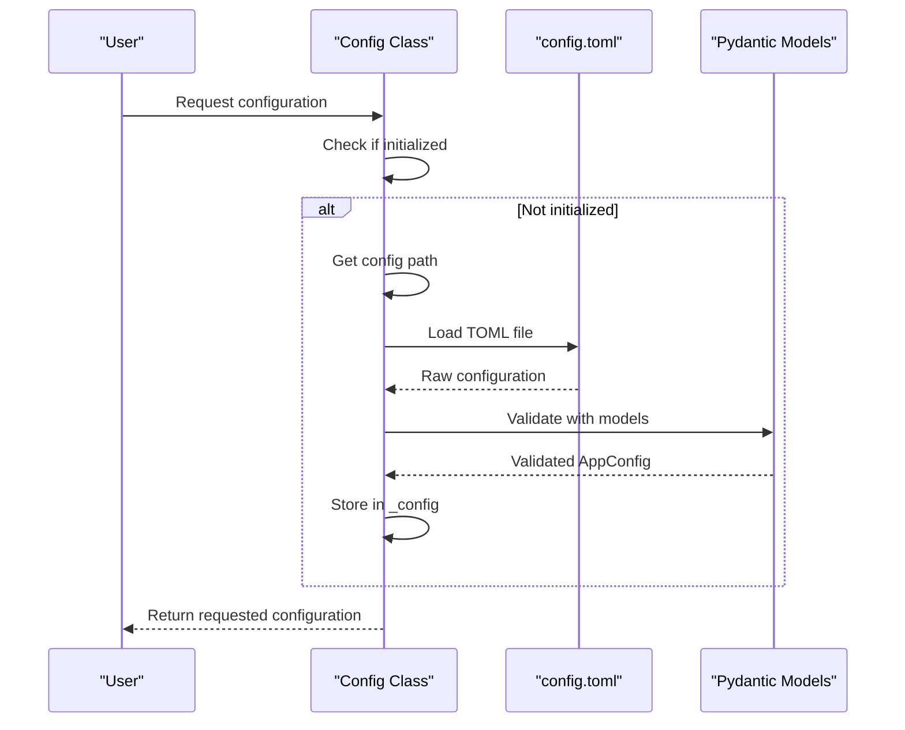

# TOML Configuration

<cite>
**Referenced Files in This Document**   
- [config.example.toml](file://config/config.example.toml)
- [config.example-model-ollama.toml](file://config/config.example-model-ollama.toml)
- [config.example-model-azure.toml](file://config/config.example-model-azure.toml)
- [config.example-model-anthropic.toml](file://config/config.example-model-anthropic.toml)
- [config.example-model-google.toml](file://config/config.example-model-google.toml)
- [config.example-model-ppio.toml](file://config/config.example-model-ppio.toml)
- [config.example-daytona.toml](file://config/config.example-daytona.toml)
- [app/config.py](file://app/config.py)
</cite>

## Table of Contents
1. [Introduction](#introduction)
2. [Configuration File Structure](#configuration-file-structure)
3. [LLM Configuration](#llm-configuration)
4. [Browser Configuration](#browser-configuration)
5. [Search Configuration](#search-configuration)
6. [Sandbox Configuration](#sandbox-configuration)
7. [MCP Configuration](#mcp-configuration)
8. [Runflow Configuration](#runflow-configuration)
9. [Configuration Loading and Validation](#configuration-loading-and-validation)
10. [Practical Configuration Examples](#practical-configuration-examples)
11. [Best Practices](#best-practices)

## Introduction
The TOML configuration system in OpenManus serves as the central mechanism for customizing the behavior of the AI agent framework. The configuration file, typically named `config.toml`, allows users to define various settings that control how the system interacts with different services, including LLM providers, browser automation, search engines, and sandbox environments. This document provides a comprehensive guide to understanding and utilizing the configuration system effectively.

**Section sources**
- [config.example.toml](file://config/config.example.toml#L1-L105)

## Configuration File Structure
The OpenManus configuration system is built around the TOML (Tom's Obvious, Minimal Language) format, which provides a clear and readable structure for configuration settings. The system supports multiple example configuration files that demonstrate different provider setups, including Ollama, Azure, Anthropic, Google, PPIO, and Daytona-specific configurations.

The primary configuration file `config.toml` is loaded from the `config` directory, with the system falling back to `config.example.toml` if the main configuration file is not present. The configuration is organized into distinct sections, each controlling a specific aspect of the system's behavior.



**Diagram sources**
- [config.example.toml](file://config/config.example.toml#L1-L105)
- [config.example-model-ollama.toml](file://config/config.example-model-ollama.toml#L1-L17)

**Section sources**
- [config.example.toml](file://config/config.example.toml#L1-L105)
- [app/config.py](file://app/config.py#L196-L368)

## LLM Configuration
The `[llm]` section is the core configuration block that defines the Large Language Model provider settings. This section supports multiple providers through conditional configuration blocks, allowing users to easily switch between different LLM services.

The basic LLM configuration includes:
- **model**: Specifies the model identifier to use
- **base_url**: The API endpoint URL for the LLM service
- **api_key**: Authentication key for accessing the LLM API
- **max_tokens**: Maximum number of tokens in the response
- **temperature**: Controls the randomness of the output
- **api_type**: Specifies the provider type (e.g., 'azure', 'ollama', 'ppio')
- **api_version**: API version for services that require it (e.g., Azure)

The system supports multiple LLM providers, with example configurations provided for:
- Anthropic (via API or Amazon Bedrock)
- Azure OpenAI
- Ollama (local models)
- Google Gemini
- PPIO (custom provider)



**Diagram sources**
- [app/config.py](file://app/config.py#L18-L29)
- [config.example.toml](file://config/config.example.toml#L2-L10)

**Section sources**
- [config.example.toml](file://config/config.example.toml#L2-L16)
- [config.example-model-ollama.toml](file://config/config.example-model-ollama.toml#L2-L9)
- [config.example-model-azure.toml](file://config/config.example-model-azure.toml#L2-L9)
- [app/config.py](file://app/config.py#L18-L29)

## Browser Configuration
The optional `[browser]` section controls the browser automation capabilities of the system. This configuration allows for fine-tuning of browser behavior, including headless operation, security settings, and connection parameters.

Key browser configuration options include:
- **headless**: Whether to run the browser in headless mode (default: false)
- **disable_security**: Whether to disable browser security features (default: true)
- **extra_chromium_args**: Additional arguments to pass to the browser
- **chrome_instance_path**: Path to connect to an existing Chrome instance
- **wss_url**: WebSocket URL for browser connection
- **cdp_url**: Chrome DevTools Protocol URL for browser connection
- **max_content_length**: Maximum length for content retrieval operations

The browser configuration also supports proxy settings through the nested `[browser.proxy]` section, which includes:
- **server**: Proxy server address
- **username**: Proxy authentication username
- **password**: Proxy authentication password



**Diagram sources**
- [app/config.py](file://app/config.py#L68-L90)
- [config.example.toml](file://config/config.example.toml#L45-L65)

**Section sources**
- [config.example.toml](file://config/config.example.toml#L45-L65)
- [app/config.py](file://app/config.py#L68-L90)

## Search Configuration
The optional `[search]` section defines the search engine preferences and behavior for the agent system. This configuration allows customization of search functionality, including primary and fallback engines.

Search configuration options include:
- **engine**: Primary search engine to use (default: "Google", options: "Google", "Baidu", "DuckDuckGo", "Bing")
- **fallback_engines**: Ordered list of fallback engines to try when the primary engine fails (default: ["DuckDuckGo", "Baidu", "Bing"])
- **retry_delay**: Seconds to wait before retrying all engines after they all fail due to rate limits (default: 60)
- **max_retries**: Maximum number of times to retry all engines when all fail (default: 3)
- **lang**: Language code for search results (e.g., "en" for English, "zh" for Chinese)
- **country**: Country code for search results (e.g., "us" for United States, "cn" for China)



**Diagram sources**
- [app/config.py](file://app/config.py#L38-L59)
- [config.example.toml](file://config/config.example.toml#L67-L77)

**Section sources**
- [config.example.toml](file://config/config.example.toml#L67-L77)
- [app/config.py](file://app/config.py#L38-L59)

## Sandbox Configuration
The optional `[sandbox]` section controls the execution environment for code and command execution. This configuration defines the container settings for the sandbox environment.

Sandbox configuration options include:
- **use_sandbox**: Whether to use the sandbox environment (default: false)
- **image**: Base Docker image to use (default: "python:3.12-slim")
- **work_dir**: Container working directory (default: "/workspace")
- **memory_limit**: Memory limit for the container (default: "512m")
- **cpu_limit**: CPU limit for the container (default: 1.0)
- **timeout**: Default command timeout in seconds (default: 300)
- **network_enabled**: Whether network access is allowed (default: false)



**Diagram sources**
- [app/config.py](file://app/config.py#L93-L104)
- [config.example.toml](file://config/config.example.toml#L79-L87)

**Section sources**
- [config.example.toml](file://config/config.example.toml#L79-L87)
- [app/config.py](file://app/config.py#L93-L104)

## MCP Configuration
The `[mcp]` section configures the Model Context Protocol settings, which enable communication between the agent and external services.

MCP configuration options include:
- **server_reference**: Module reference for the MCP server (default: "app.mcp.server")
- **servers**: Dictionary of MCP server configurations loaded from `mcp.json`

The MCP system supports loading server configurations from a separate JSON file (`mcp.json`), allowing for more complex server setups without cluttering the main TOML configuration.



**Diagram sources**
- [app/config.py](file://app/config.py#L137-L170)
- [config.example.toml](file://config/config.example.toml#L89-L91)

**Section sources**
- [config.example.toml](file://config/config.example.toml#L89-L91)
- [app/config.py](file://app/config.py#L137-L170)

## Runflow Configuration
The optional `[runflow]` section controls the workflow configuration for the agent system, allowing for the inclusion of specialized agents in the execution flow.

The current runflow configuration option is:
- **use_data_analysis_agent**: Whether to enable the Data Analysis Agent in the run flow (default: false)

This configuration allows the system to incorporate specialized agents for specific task types, such as data analysis and visualization tasks.



**Diagram sources**
- [app/config.py](file://app/config.py#L62-L65)
- [config.example.toml](file://config/config.example.toml#L93-L95)

**Section sources**
- [config.example.toml](file://config/config.example.toml#L93-L95)
- [app/config.py](file://app/config.py#L62-L65)

## Configuration Loading and Validation
The configuration system in OpenManus is implemented through a robust loading and validation process using Pydantic models. The `Config` class in `app/config.py` serves as a singleton that manages the configuration lifecycle.

The configuration loading process follows these steps:
1. Determine the configuration file path, prioritizing `config.toml` over `config.example.toml`
2. Parse the TOML file using `tomllib`
3. Validate and structure the configuration using Pydantic models
4. Apply default values and handle overrides
5. Expose the configuration through property accessors

The system uses several Pydantic models to validate configuration data:
- **LLMSettings**: Validates LLM configuration
- **BrowserSettings**: Validates browser configuration
- **SearchSettings**: Validates search configuration
- **SandboxSettings**: Validates sandbox configuration
- **MCPSettings**: Validates MCP configuration
- **RunflowSettings**: Validates runflow configuration
- **AppConfig**: Combines all configuration sections

The configuration supports model-specific overrides through nested configuration blocks. When multiple LLM configurations are defined, the system creates a "default" profile from the base `[llm]` settings and merges in any model-specific overrides.



**Diagram sources**
- [app/config.py](file://app/config.py#L196-L368)
- [app/config.py](file://app/config.py#L18-L29)

**Section sources**
- [app/config.py](file://app/config.py#L196-L368)

## Practical Configuration Examples
This section provides practical examples of configuration setups for common use cases.

### Multiple LLM Providers
The configuration system supports defining multiple LLM profiles for different providers. Users can switch between providers by uncommenting the appropriate configuration block:

```toml
# [llm] #AZURE OPENAI:
# api_type= 'azure'
# model = "gpt-4o-mini"
# base_url = "{YOUR_AZURE_ENDPOINT.rstrip('/')}/openai/deployments/{AZURE_DEPLOYMENT_ID}"
# api_key = "YOUR_API_KEY"
# max_tokens = 8096
# temperature = 0.0
# api_version="2024-08-01-preview"

# [llm] #OLLAMA:
# api_type = 'ollama'
# model = "llama3.2"
# base_url = "http://localhost:11434/v1"
# api_key = "ollama"
# max_tokens = 4096
# temperature = 0.0
```

### Browser Automation Setup
To enable browser automation with proxy support:

```toml
[browser]
headless = false
disable_security = true
max_content_length = 5000

[browser.proxy]
server = "http://proxy-server:8080"
username = "user123"
password = "pass456"
```

### Search Engine Configuration
To customize search behavior with fallback engines:

```toml
[search]
engine = "Bing"
fallback_engines = ["Google", "DuckDuckGo"]
retry_delay = 120
max_retries = 5
lang = "zh"
country = "cn"
```

### Sandbox Environment
To enable the sandbox with custom resource limits:

```toml
[sandbox]
use_sandbox = true
image = "python:3.12-slim"
work_dir = "/workspace"
memory_limit = "2g"
cpu_limit = 2.0
timeout = 600
network_enabled = true
```

**Section sources**
- [config.example.toml](file://config/config.example.toml#L1-L105)
- [config.example-model-ollama.toml](file://config/config.example-model-ollama.toml#L1-L17)
- [config.example-model-azure.toml](file://config/config.example-model-azure.toml#L1-L18)

## Best Practices
When working with the OpenManus configuration system, consider the following best practices:

### Configuration Organization
- Keep your main configuration in `config.toml` and use the example files as references
- Comment out unused provider configurations rather than deleting them
- Use consistent naming conventions for custom configuration profiles

### Security Considerations
- Never commit API keys to version control
- Use environment variables or secure credential management for sensitive information
- Regularly rotate API keys and credentials

### Environment-Specific Settings
- Maintain separate configuration files for different environments (development, staging, production)
- Use the example configuration files as templates for different deployment scenarios
- Consider using configuration management tools for complex deployments

### Performance Optimization
- Adjust `max_tokens` and `temperature` settings based on your use case
- Configure appropriate resource limits in the sandbox section for your hardware
- Optimize search settings based on your geographic location and language requirements

### Maintenance and Updates
- Regularly review and update your configuration as new features are added
- Test configuration changes in a development environment before deploying to production
- Document any custom configuration settings for team members

**Section sources**
- [config.example.toml](file://config/config.example.toml#L1-L105)
- [README.md](file://README.md#L90-L117)