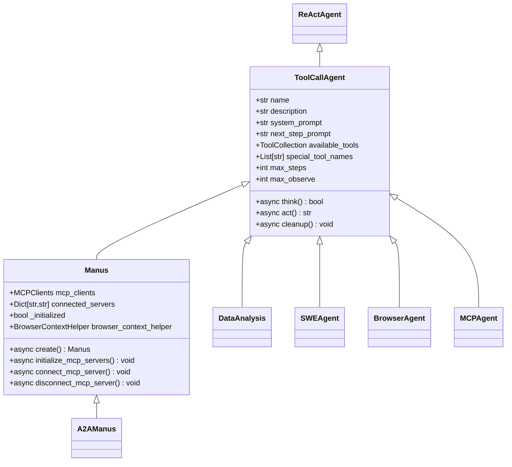
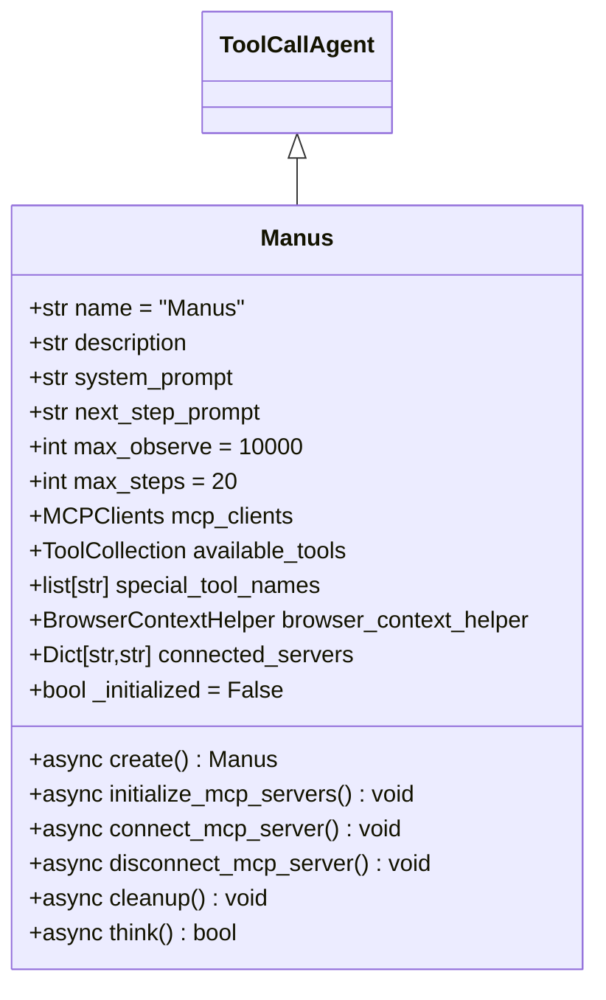
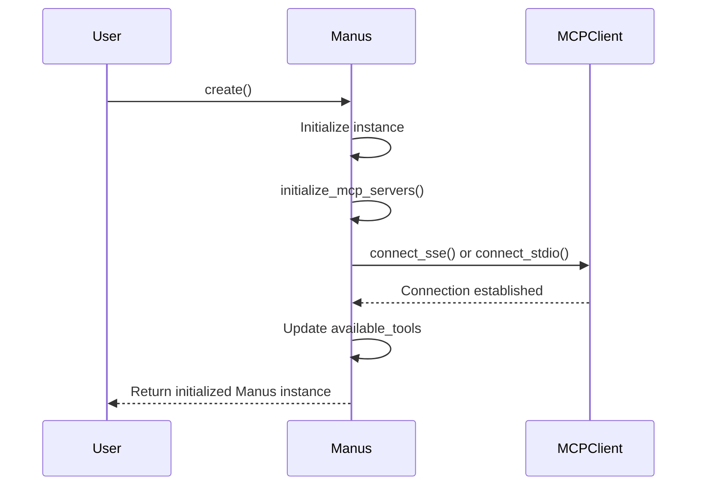
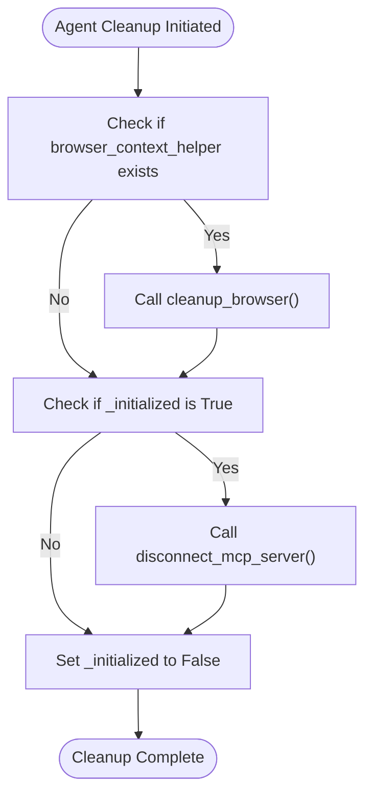
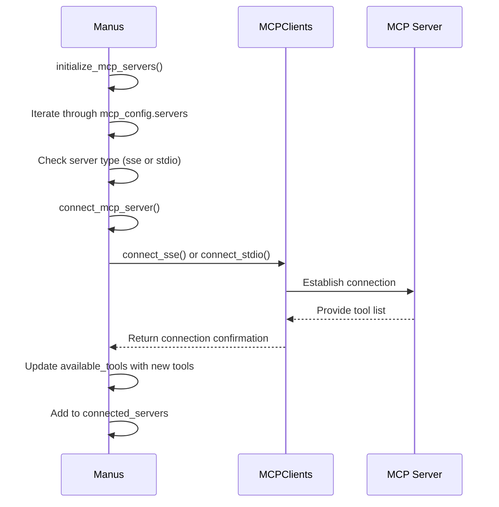
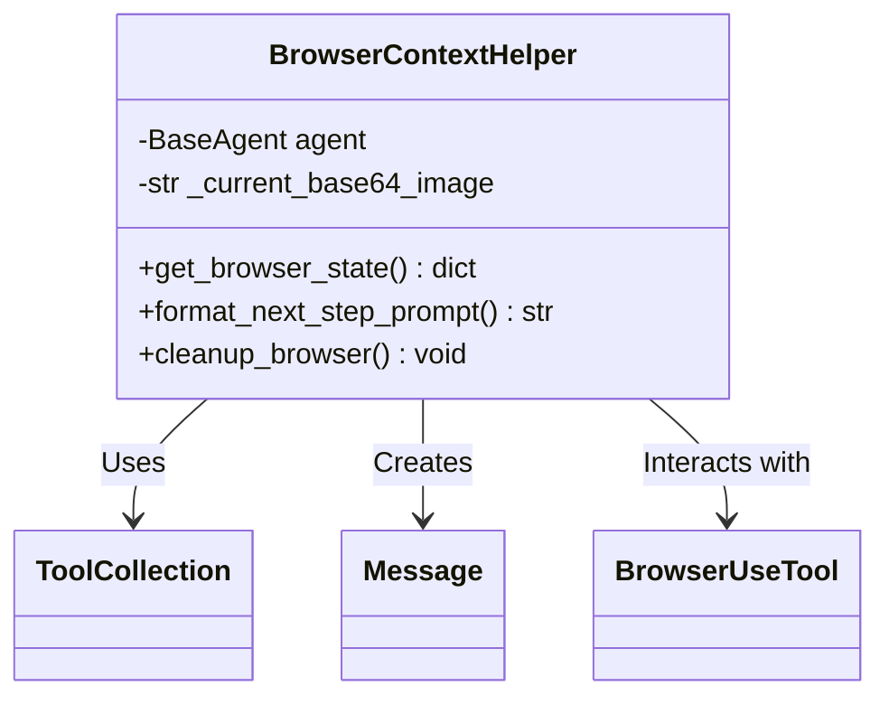
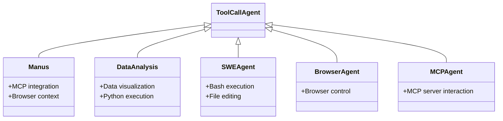

# Agent Architecture

<cite>
**Referenced Files in This Document**   
- [manus.py](file://app/agent/manus.py)
- [toolcall.py](file://app/agent/toolcall.py)
- [browser.py](file://app/agent/browser.py)
- [data_analysis.py](file://app/agent/data_analysis.py)
- [swe.py](file://app/agent/swe.py)
- [manus.py](file://app/prompt/manus.py)
</cite>

## Table of Contents
1. [Introduction](#introduction)
2. [Core Agent Hierarchy](#core-agent-hierarchy)
3. [Manus Class Architecture](#manus-class-architecture)
4. [Initialization and Lifecycle Management](#initialization-and-lifecycle-management)
5. [Decision-Making Process](#decision-making-process)
6. [Tool Orchestration and MCP Integration](#tool-orchestration-and-mcp-integration)
7. [Browser Context Integration](#browser-context-integration)
8. [Agent Type Relationships](#agent-type-relationships)
9. [Implementation Patterns and Best Practices](#implementation-patterns-and-best-practices)

## Introduction
The OpenManus agent architecture is built around a hierarchical design pattern where specialized agents inherit from base classes to provide specific capabilities. At the core of this architecture is the Manus class, which serves as a versatile general-purpose agent capable of solving various tasks through tool orchestration. This document details the architecture of the Manus agent, its relationship with the ToolCallAgent base class, and its integration with various tools and services.

**Section sources**
- [manus.py](file://app/agent/manus.py#L17-L164)
- [toolcall.py](file://app/agent/toolcall.py#L17-L249)

## Core Agent Hierarchy
The agent system follows a layered inheritance model where functionality is progressively specialized from base classes to concrete implementations. The hierarchy begins with the ReActAgent, which provides fundamental agent capabilities, and extends through ToolCallAgent to specialized agents like Manus.



**Diagram sources**
- [toolcall.py](file://app/agent/toolcall.py#L17-L249)
- [manus.py](file://app/agent/manus.py#L17-L164)
- [data_analysis.py](file://app/agent/data_analysis.py#L11-L36)
- [swe.py](file://app/agent/swe.py#L9-L23)
- [browser.py](file://app/agent/browser.py#L86-L128)
- [mcp.py](file://app/agent/mcp.py#L12-L184)
- [agent.py](file://protocol/a2a/app/agent.py#L14-L31)

## Manus Class Architecture
The Manus class represents the primary agent implementation in the OpenManus system, designed as a versatile general-purpose agent that can solve various tasks using multiple tools including MCP-based tools. It inherits from ToolCallAgent and extends its capabilities with additional functionality for MCP server integration and browser context management.

The Manus agent is configured with a comprehensive set of default tools through its available_tools field, which includes PythonExecute, BrowserUseTool, StrReplaceEditor, AskHuman, and Terminate. These tools provide the agent with capabilities for code execution, web browsing, text editing, human interaction, and task termination.



**Diagram sources**
- [manus.py](file://app/agent/manus.py#L17-L164)

**Section sources**
- [manus.py](file://app/agent/manus.py#L17-L164)
- [manus.py](file://app/agent/manus.py#L33-L41)
- [manus.py](file://app/agent/manus.py#L43-L44)

## Initialization and Lifecycle Management
The Manus agent employs a sophisticated initialization and lifecycle management system to ensure proper setup and resource cleanup. The agent's lifecycle is managed through a factory method pattern and comprehensive cleanup procedures.

### Factory Method Pattern
The Manus class implements a create() class method as a factory method to properly initialize instances. This asynchronous factory method handles the initialization of MCP servers and sets the agent's initialized state, ensuring that all required services are connected before the agent becomes operational.



**Diagram sources**
- [manus.py](file://app/agent/manus.py#L59-L64)
- [manus.py](file://app/agent/manus.py#L66-L88)
- [manus.py](file://app/agent/manus.py#L90-L111)

### Lifecycle Management
The Manus agent implements comprehensive lifecycle management through its cleanup() method, which ensures proper resource deallocation when the agent is no longer needed. The cleanup process handles both browser resources and MCP server connections, with state tracking to prevent redundant operations.



**Diagram sources**
- [manus.py](file://app/agent/manus.py#L130-L137)
- [manus.py](file://app/agent/manus.py#L113-L128)
- [browser.py](file://app/agent/browser.py#L80-L83)

**Section sources**
- [manus.py](file://app/agent/manus.py#L59-L64)
- [manus.py](file://app/agent/manus.py#L66-L88)
- [manus.py](file://app/agent/manus.py#L90-L111)
- [manus.py](file://app/agent/manus.py#L113-L128)
- [manus.py](file://app/agent/manus.py#L130-L137)

## Decision-Making Process
The Manus agent's decision-making process is centered around its think() method, which orchestrates the agent's cognitive workflow. This method extends the base functionality from ToolCallAgent with dynamic prompt adjustment based on context, particularly when browser interactions are involved.

### Think Method Workflow
The think() method follows a structured workflow that begins with initialization checks, followed by context analysis, prompt adjustment, and delegation to the parent class implementation. The method dynamically adjusts the next_step_prompt based on recent tool usage, particularly when browser interactions are detected.

```mermaid
flowchart TD
Start([think() called]) --> CheckInitialized["Check if _initialized"]
CheckInitialized --> |No| InitializeMCP["Call initialize_mcp_servers()"]
CheckInitialized --> |Yes| GetRecentMessages["Get last 3 messages"]
InitializeMCP --> SetInitialized["Set _initialized to True"]
SetInitialized --> GetRecentMessages
GetRecentMessages --> CheckBrowserUse["Check if BrowserUseTool was used"]
CheckBrowserUse --> |Yes| FormatBrowserPrompt["Call format_next_step_prompt()"]
CheckBrowserUse --> |No| StoreOriginalPrompt["Store original next_step_prompt"]
FormatBrowserPrompt --> StoreOriginalPrompt
StoreOriginalPrompt --> CallParentThink["Call super().think()"]
CallParentThink --> RestorePrompt["Restore original next_step_prompt"]
RestorePrompt --> ReturnResult["Return result"]
```

**Diagram sources**
- [manus.py](file://app/agent/manus.py#L139-L164)
- [browser.py](file://app/agent/browser.py#L46-L78)

**Section sources**
- [manus.py](file://app/agent/manus.py#L139-L164)

## Tool Orchestration and MCP Integration
The Manus agent excels at orchestrating tool usage through its available_tools collection and MCP client integration. This architecture allows the agent to leverage both local tools and remote MCP server capabilities seamlessly.

### MCP Server Integration
The Manus agent manages connections to MCP servers through its mcp_clients field and associated methods. The agent can connect to MCP servers using either SSE (Server-Sent Events) or stdio (standard input/output) transport mechanisms, with configuration driven by the mcp_config settings.



**Diagram sources**
- [manus.py](file://app/agent/manus.py#L66-L88)
- [manus.py](file://app/agent/manus.py#L90-L111)
- [manus.py](file://app/agent/manus.py#L113-L128)

### Tool Management
The agent maintains a dynamic tool collection that combines local tools with those provided by connected MCP servers. When connecting to an MCP server, only the new tools from that server are added to the available_tools collection, preserving the existing tool set while extending capabilities.

**Section sources**
- [manus.py](file://app/agent/manus.py#L33-L41)
- [manus.py](file://app/agent/manus.py#L30-L30)
- [manus.py](file://app/agent/manus.py#L90-L111)
- [manus.py](file://app/agent/manus.py#L113-L128)

## Browser Context Integration
The Manus agent integrates browser context through the BrowserContextHelper class, which provides dynamic prompt enhancement based on current browser state. This integration allows the agent to make informed decisions during web browsing tasks by incorporating real-time browser information into its decision-making process.

### BrowserContextHelper Functionality
The BrowserContextHelper class serves as an intermediary between the Manus agent and browser tools, providing methods to retrieve browser state and format context-aware prompts. It maintains a reference to the parent agent and can access browser tools through the agent's available_tools collection.



**Diagram sources**
- [browser.py](file://app/agent/browser.py#L18-L83)

### Dynamic Prompt Adjustment
When the agent detects browser tool usage in recent messages, it dynamically adjusts the next_step_prompt by calling the BrowserContextHelper's format_next_step_prompt() method. This method retrieves current browser state including URL, title, tab count, and content visibility, then formats this information into an enhanced prompt.

**Section sources**
- [manus.py](file://app/agent/manus.py#L139-L164)
- [browser.py](file://app/agent/browser.py#L18-L83)
- [browser.py](file://app/agent/browser.py#L46-L78)

## Agent Type Relationships
The OpenManus architecture features several specialized agent types that inherit from the ToolCallAgent base class, each designed for specific use cases. These agents share a common foundation while specializing in particular domains.

### DataAnalysisAgent
The DataAnalysis agent is specialized for data analysis tasks, featuring tools for Python execution, data visualization, and chart preparation. It inherits from ToolCallAgent and configures its available_tools collection with data-specific capabilities.

### SWEAgent
The SWEAgent (Software Engineering Agent) is designed for programming tasks, with tools for executing bash commands, file editing, and task termination. It represents a specialized agent for software development workflows.

### Inheritance Relationships
All specialized agents, including Manus, DataAnalysis, and SWEAgent, inherit from the ToolCallAgent base class, ensuring consistent behavior patterns while allowing for domain-specific customization.



**Diagram sources**
- [manus.py](file://app/agent/manus.py#L17-L164)
- [data_analysis.py](file://app/agent/data_analysis.py#L11-L36)
- [swe.py](file://app/agent/swe.py#L9-L23)
- [browser.py](file://app/agent/browser.py#L86-L128)
- [mcp.py](file://app/agent/mcp.py#L12-L184)

**Section sources**
- [data_analysis.py](file://app/agent/data_analysis.py#L11-L36)
- [swe.py](file://app/agent/swe.py#L9-L23)

## Implementation Patterns and Best Practices
The OpenManus agent architecture demonstrates several effective implementation patterns and best practices for agent development.

### Configuration and Initialization
The use of Pydantic Field with default_factory allows for flexible initialization of complex objects like ToolCollection and MCPClients. The model_validator decorator ensures synchronous initialization of components like BrowserContextHelper.

### State Management
The agent employs careful state management through the _initialized flag, which prevents redundant initialization and ensures proper cleanup sequencing. This pattern prevents race conditions and resource leaks during agent lifecycle events.

### Error Handling and Resilience
The architecture incorporates robust error handling, particularly in the cleanup methods, where exceptions during resource deallocation are caught and logged without preventing the completion of other cleanup tasks.

### Extension Points
The design provides clear extension points for custom agent development:
- Override think() method for custom decision logic
- Extend available_tools with domain-specific capabilities
- Implement custom initialization through create() factory method
- Add specialized cleanup procedures

These patterns enable developers to create custom agents that integrate seamlessly with the existing architecture while addressing specific use cases.

**Section sources**
- [manus.py](file://app/agent/manus.py#L17-L164)
- [toolcall.py](file://app/agent/toolcall.py#L17-L249)
- [browser.py](file://app/agent/browser.py#L18-L83)
- [data_analysis.py](file://app/agent/data_analysis.py#L11-L36)
- [swe.py](file://app/agent/swe.py#L9-L23)