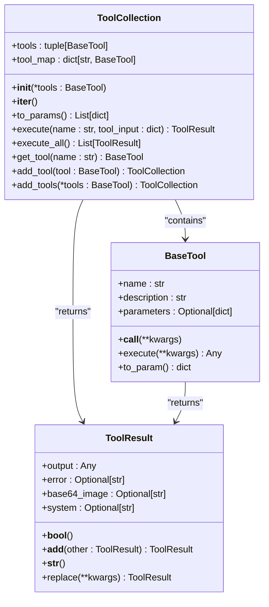
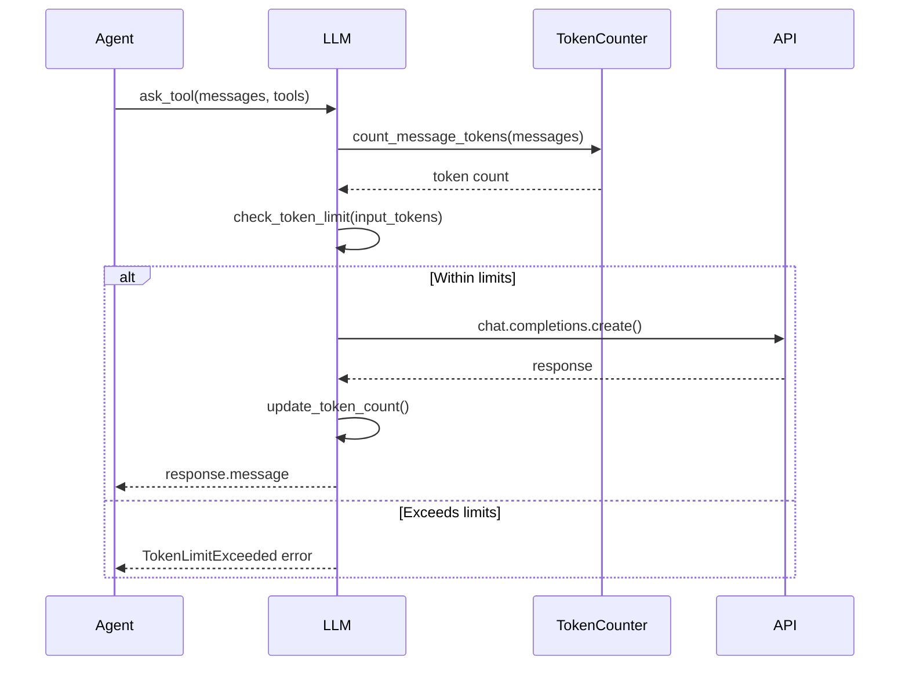
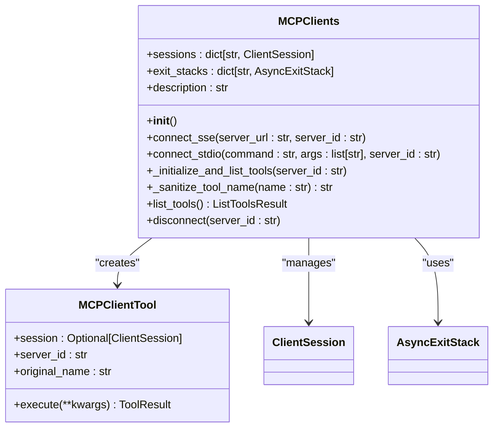

# Core Concepts

<cite>
**Referenced Files in This Document**   
- [app/agent/manus.py](file://app/agent/manus.py)
- [app/agent/toolcall.py](file://app/agent/toolcall.py)
- [app/tool/tool_collection.py](file://app/tool/tool_collection.py)
- [app/llm.py](file://app/llm.py)
- [app/tool/mcp.py](file://app/tool/mcp.py)
- [app/config.py](file://app/config.py)
</cite>

## Table of Contents
1. [Agent Architecture](#agent-architecture)
2. [Tool System](#tool-system)
3. [Memory Management](#memory-management)
4. [LLM Integration](#llm-integration)
5. [MCP Fundamentals](#mcp-fundamentals)
6. [Agent Decision-Making and Task Execution](#agent-decision-making-and-task-execution)
7. [Implementation Patterns and Best Practices](#implementation-patterns-and-best-practices)

## Agent Architecture

The OpenManus framework implements a hierarchical agent architecture centered around the Manus agent, which serves as a tool-calling orchestrator. The Manus agent inherits from the ToolCallAgent base class, establishing a foundation for tool-based interaction patterns. This agent architecture enables the Manus agent to solve diverse tasks by coordinating multiple capabilities through a structured decision-making process.

The Manus agent maintains several key components that define its operational capabilities. It includes a comprehensive set of general-purpose tools in its available_tools field, which contains PythonExecute, BrowserUseTool, StrReplaceEditor, AskHuman, and Terminate tools. These tools provide fundamental capabilities for code execution, web browsing, text manipulation, human interaction, and task termination. The agent also manages state through its state field, which tracks execution status across IDLE, RUNNING, FINISHED, and ERROR states.

The agent's behavior is guided by system and next-step prompts that shape its reasoning process. The system_prompt provides foundational instructions, while the next_step_prompt dynamically adapts based on context, such as when browser interactions are detected. The agent's execution is constrained by max_steps (set to 20) and max_observe (set to 10,000) parameters, which prevent infinite loops and excessive output observation.

**Section sources**
- [app/agent/manus.py](file://app/agent/manus.py#L17-L164)
- [app/agent/toolcall.py](file://app/agent/toolcall.py#L17-L249)

## Tool System

The tool system in OpenManus revolves around the ToolCollection class, which serves as a container and manager for executable tools. This system enables the dynamic registration, organization, and execution of various capabilities that agents can leverage during task execution. The ToolCollection class maintains tools in two data structures: a tuple of tools for iteration and a dictionary mapping tool names to tool instances for efficient lookup.

Tools are registered with the collection through the add_tool and add_tools methods, which incorporate new tools while checking for name conflicts. When a tool is added, it's stored in both the tools tuple and tool_map dictionary, enabling both sequential processing and direct access by name. The execute method provides the primary interface for tool invocation, accepting a tool name and input parameters, then returning a structured ToolResult.

The tool execution process follows a standardized pattern: the system validates the requested tool name against the tool_map, parses input arguments from JSON format, and invokes the tool's execute method. Special tools, identified through the special_tool_names list, receive additional handling that can affect agent state, such as terminating execution when the Terminate tool completes successfully.

**Diagram sources **
- [app/tool/tool_collection.py](file://app/tool/tool_collection.py#L8-L70)
- [app/tool/base.py](file://app/tool/base.py#L100-L181)

**Section sources**
- [app/tool/tool_collection.py](file://app/tool/tool_collection.py#L8-L70)
- [app/tool/base.py](file://app/tool/base.py#L100-L181)

## Memory Management

Memory management in OpenManus is implemented through a state tracking system that maintains conversation history and agent context. The Memory class serves as a container for Message objects, preserving the complete interaction history between the agent, user, and tools. This memory system enables agents to maintain context across multiple steps of execution, allowing for coherent and stateful interactions.

The memory system operates as a message queue, with new messages appended to the messages list. Each Message contains essential metadata including role (system, user, assistant, or tool), content, and optional fields like tool_call_id and base64_image for multimodal interactions. The Memory class provides methods for adding single or multiple messages, retrieving recent messages, and clearing the entire history.

Agents interact with memory through the update_memory method, which creates appropriately formatted messages based on role and content type. The system also implements duplicate detection to identify when an agent might be stuck in a loop, comparing recent assistant messages for identical content. When duplicate responses are detected beyond the duplicate_threshold (default: 2), the agent receives a prompt encouraging it to change strategies.

Conversation state is tightly integrated with agent execution through the messages property, which provides direct access to the underlying message list. This integration allows agents to incorporate their complete interaction history when generating responses, ensuring that decisions are informed by the full context of the conversation.

**Section sources**
- [app/agent/base.py](file://app/agent/base.py#L150-L196)
- [app/schema.py](file://app/schema.py#L100-L187)

## LLM Integration

LLM integration in OpenManus follows a structured pattern that handles model selection, token counting, and retry logic. The LLM class serves as a unified interface to various language model providers, supporting different API types including OpenAI, Azure, and AWS Bedrock. Model selection is configured through the llm property in the global config object, which allows for both default and named configuration profiles.

The integration includes comprehensive token counting functionality through the TokenCounter class, which calculates token usage for text, images, and tool calls. For text content, the system uses tiktoken to encode strings and count tokens. For images, it implements a detailed calculation method that accounts for resolution and detail level, with low-detail images consuming a fixed 85 tokens and high-detail images calculated based on scaled dimensions and 512px tiles.

Retry logic is implemented using the tenacity library, with exponential backoff and maximum attempt limits. The ask, ask_with_images, and ask_tool methods are decorated with retry logic that handles various error types including API errors, rate limits, and authentication issues. However, TokenLimitExceeded errors are specifically excluded from retry attempts, as they indicate a fundamental constraint that cannot be resolved through repetition.

The system also implements token limit monitoring through the check_token_limit method, which tracks cumulative input tokens against a configurable max_input_tokens threshold. When limits are approached or exceeded, the system generates appropriate error messages and terminates processing to prevent excessive API usage.

**Diagram sources **
- [app/llm.py](file://app/llm.py#L100-L766)
- [app/config.py](file://app/config.py#L200-L372)

**Section sources**
- [app/llm.py](file://app/llm.py#L100-L766)
- [app/config.py](file://app/config.py#L200-L372)

## MCP Fundamentals

The Model Context Protocol (MCP) enables remote tool access by establishing connections between agents and external tool servers. The MCPClients class, which inherits from ToolCollection, manages these connections and integrates remote tools into the local tool ecosystem. MCP supports two transport methods: SSE (Server-Sent Events) for HTTP-based communication and stdio for process-based communication.

When connecting to an MCP server, the system establishes a session and initializes communication through the connect_sse or connect_stdio methods. During initialization, the client retrieves the server's available tools via list_tools, then creates local proxy objects (MCPClientTool instances) for each remote tool. These proxies maintain references to the session and server_id, allowing them to route execution requests appropriately.

Remote tools are integrated into the local tool collection with names prefixed by "mcp_{server_id}_" to ensure uniqueness. The _sanitize_tool_name method processes tool names to comply with naming requirements, replacing invalid characters with underscores and truncating to 64 characters if necessary. This naming convention allows multiple servers to expose tools with the same base name without conflicts.

The MCP system maintains connection state through sessions and exit_stacks dictionaries, enabling proper cleanup when connections are terminated. The disconnect method handles graceful shutdown, closing communication channels and removing associated tools from the collection. This architecture allows agents to dynamically connect to and disconnect from multiple MCP servers during execution.

**Diagram sources **
- [app/tool/mcp.py](file://app/tool/mcp.py#L36-L193)
- [app/agent/manus.py](file://app/agent/manus.py#L30-L30)

**Section sources**
- [app/tool/mcp.py](file://app/tool/mcp.py#L36-L193)
- [app/agent/manus.py](file://app/agent/manus.py#L30-L30)

## Agent Decision-Making and Task Execution

Agent decision-making in OpenManus follows a structured think-act cycle that coordinates tool selection, execution, and state management. The process begins with the think method, which queries the LLM with the current conversation history, system prompt, and available tools to determine the next actions. The LLM responds with tool calls and/or content, which the agent processes to decide whether to proceed with tool execution or return a direct response.

When tool calls are present, the act method executes them sequentially through the execute_tool method. Each tool execution follows a consistent pattern: argument parsing, tool invocation through the ToolCollection's execute method, result processing, and memory update. The system handles special tools differently, potentially modifying agent state—for example, the Terminate tool sets the agent state to FINISHED, ending further execution.

The Manus agent enhances this basic pattern with context-aware adaptations. When browser interactions are detected in recent messages, it dynamically updates the next_step_prompt using the browser_context_helper to provide appropriate guidance for web navigation tasks. The agent also manages resource cleanup through its cleanup method, which terminates browser sessions and disconnects from MCP servers when execution completes.

Tool execution results are formatted as observations and added to memory as tool messages, maintaining the conversation context. The system includes robust error handling for various failure modes, including invalid tool names, JSON parsing errors, and tool execution exceptions. These errors are captured and returned as structured responses, allowing the agent to respond appropriately to failures.

**Section sources**
- [app/agent/manus.py](file://app/agent/manus.py#L139-L164)
- [app/agent/toolcall.py](file://app/agent/toolcall.py#L17-L249)

## Implementation Patterns and Best Practices

Several key implementation patterns emerge from the OpenManus architecture that serve as best practices for extending the system. The factory pattern is used in the Manus.create class method, which ensures proper initialization of MCP servers before returning a new instance. This pattern guarantees that agents are fully configured before use, preventing initialization-related errors.

The composition pattern is evident in how agents incorporate tool collections rather than inheriting tool functionality directly. This design allows for flexible tool configuration and dynamic modification during execution. The Manus agent, for example, can add and remove tools from its available_tools collection as MCP server connections change.

Error handling follows a consistent pattern of catching specific exceptions and converting them to structured responses. The execute_tool method demonstrates this by handling JSONDecodeError separately from general exceptions, providing more informative error messages. The system also distinguishes between retryable and non-retryable errors, with TokenLimitExceeded exceptions bypassing the retry mechanism.

For extending the system, developers should follow the pattern of creating new tool classes that inherit from BaseTool and implement the execute method. New agents should typically inherit from existing agent classes like ToolCallAgent or Manus, overriding specific methods to customize behavior. Configuration should be managed through the central config object, with new settings added to the appropriate configuration class.

Resource management follows the async context manager pattern, with cleanup methods ensuring proper disposal of resources like browser sessions and MCP connections. This pattern prevents resource leaks and ensures system stability during prolonged operation.

**Section sources**
- [app/agent/manus.py](file://app/agent/manus.py#L59-L64)
- [app/agent/toolcall.py](file://app/agent/toolcall.py#L17-L249)
- [app/tool/tool_collection.py](file://app/tool/tool_collection.py#L8-L70)