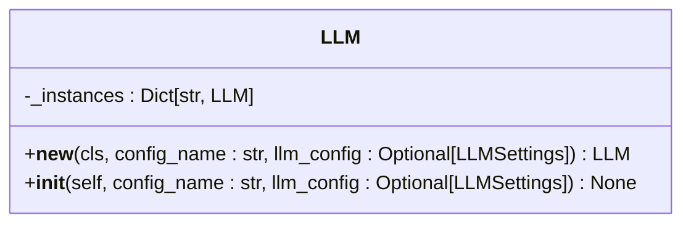
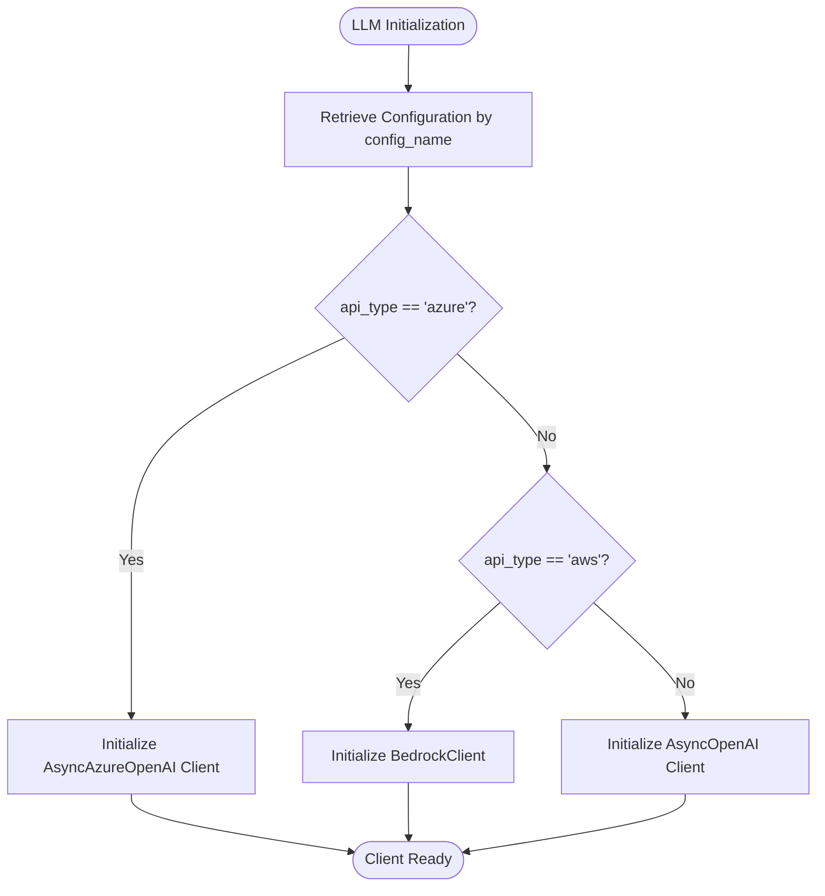
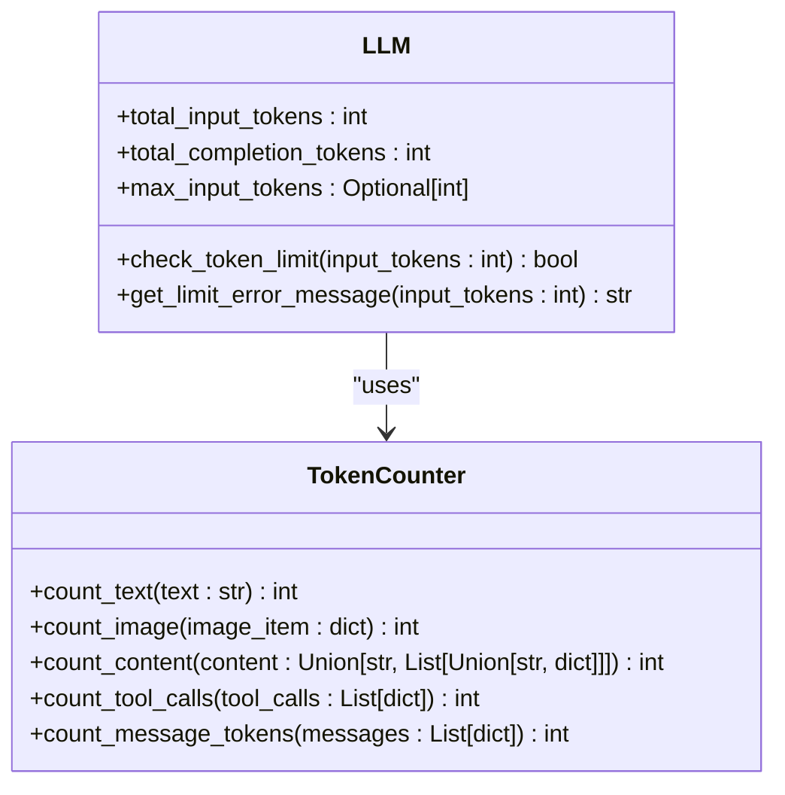
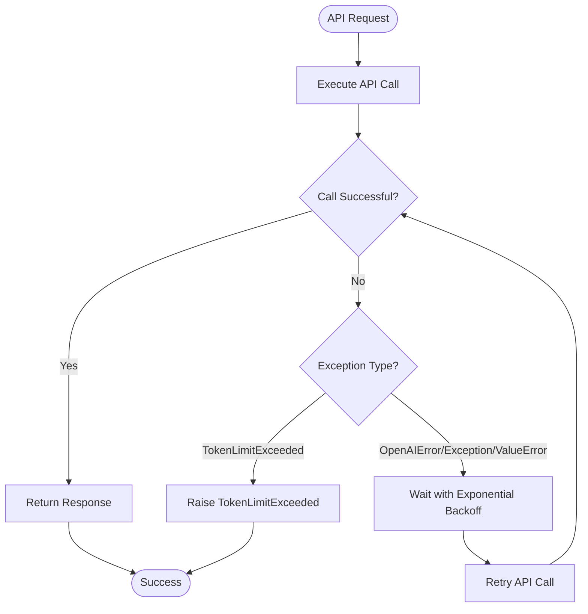
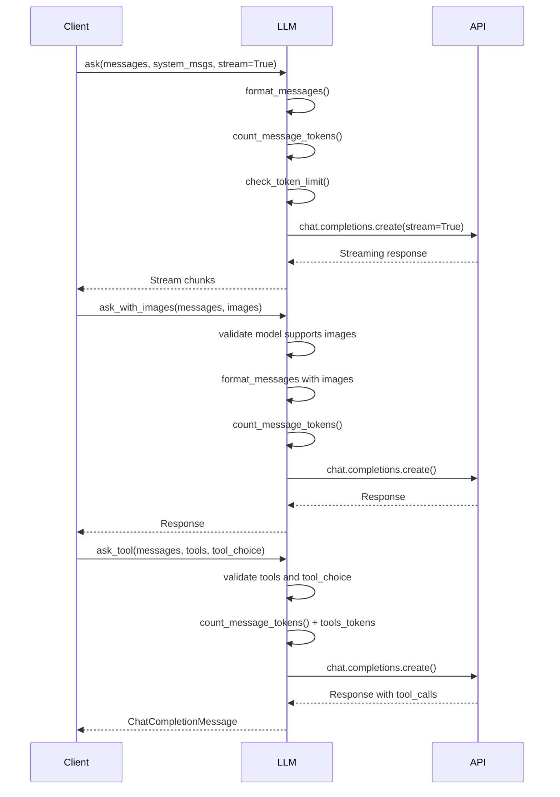
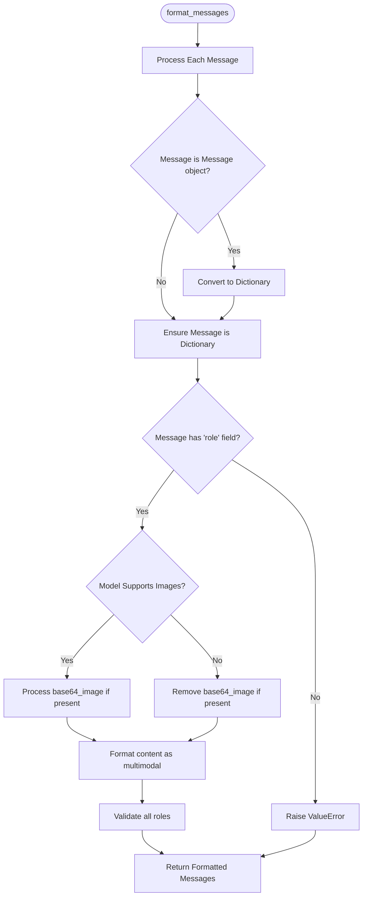
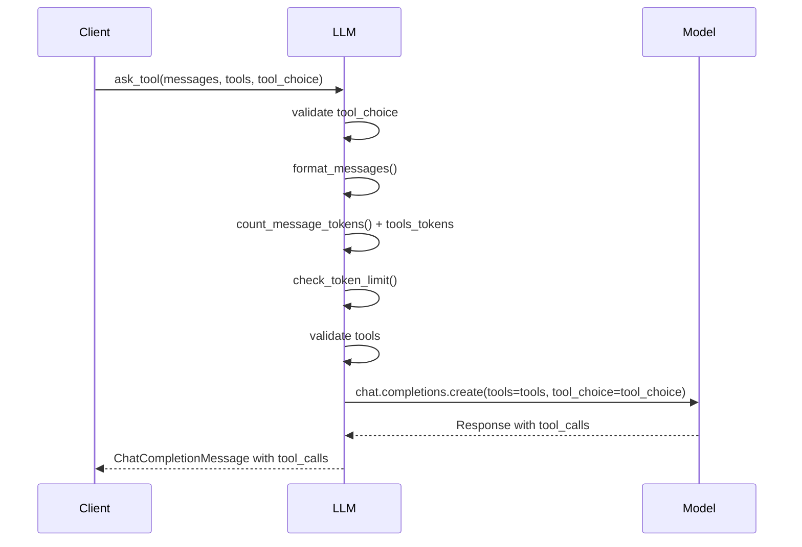

# LLM Integration

<cite>
**Referenced Files in This Document**   
- [app/llm.py](file://app/llm.py)
- [config/config.example.toml](file://config/config.example.toml)
- [app/agent/base.py](file://app/agent/base.py)
- [app/tool/chart_visualization/data_visualization.py](file://app/tool/chart_visualization/data_visualization.py)
- [app/tool/browser_use_tool.py](file://app/tool/browser_use_tool.py)
- [app/flow/planning.py](file://app/flow/planning.py)
</cite>

## Table of Contents
1. [Introduction](#introduction)
2. [LLM Class and Singleton Pattern](#llm-class-and-singleton-pattern)
3. [Configuration-Driven Initialization](#configuration-driven-initialization)
4. [Token Counting and Rate Limiting](#token-counting-and-rate-limiting)
5. [Retry Mechanism with Exponential Backoff](#retry-mechanism-with-exponential-backoff)
6. [Interaction Patterns via ask(), ask_with_images(), and ask_tool()](#interaction-patterns-via-ask-ask_with_images-and-ask_tool)
7. [Multimodal Input Handling with format_messages()](#multimodal-input-handling-with-format_messages)
8. [Tool Calling and API Integration](#tool-calling-and-api-integration)
9. [Performance Considerations and Error Handling](#performance-considerations-and-error-handling)
10. [Conclusion](#conclusion)

## Introduction
The OpenManus framework provides a robust integration layer for interacting with various Large Language Models (LLMs) through a unified interface. The core of this integration is the `LLM` class, which serves as the primary abstraction for managing communication with different LLM providers such as OpenAI, Azure, and AWS Bedrock. This document details the design and functionality of the LLM integration system, focusing on key aspects including instance management, configuration, token handling, retry mechanisms, and interaction patterns. The system is designed to be flexible, efficient, and resilient, enabling seamless interaction with language models while abstracting away provider-specific complexities.

## LLM Class and Singleton Pattern
The `LLM` class in OpenManus implements the singleton pattern through its `__new__` method to ensure efficient instance management. This design prevents the creation of multiple instances for the same configuration, thereby conserving resources and maintaining consistent state across the application. When a new `LLM` instance is requested with a specific configuration name, the class checks if an instance already exists in the `_instances` dictionary. If not, it creates a new instance, initializes it, and stores it in the dictionary. Subsequent requests for the same configuration return the existing instance. This approach ensures that each unique configuration has only one corresponding `LLM` instance throughout the application lifecycle, promoting resource efficiency and consistency.

**Diagram sources**
- [app/llm.py](file://app/llm.py#L174-L183)

**Section sources**
- [app/llm.py](file://app/llm.py#L173-L226)

## Configuration-Driven Initialization
The `LLM` class supports configuration-driven initialization, allowing it to interface with multiple LLM providers such as OpenAI, Azure, and AWS Bedrock. The initialization process begins by retrieving the appropriate configuration from the global `config` object based on the provided `config_name`. The configuration includes essential parameters such as the model name, API type, base URL, API key, and other provider-specific settings. Depending on the `api_type`, the class initializes the corresponding client—`AsyncAzureOpenAI` for Azure, `BedrockClient` for AWS, and `AsyncOpenAI` for other providers. This flexible initialization mechanism enables the system to seamlessly switch between different LLM providers by simply changing the configuration, without requiring modifications to the codebase.

**Diagram sources**
- [app/llm.py](file://app/llm.py#L185-L213)

**Section sources**
- [app/llm.py](file://app/llm.py#L185-L226)
- [config/config.example.toml](file://config/config.example.toml#L1-L106)

## Token Counting and Rate Limiting
The OpenManus LLM integration includes a comprehensive token counting and rate limiting system to prevent exceeding model context windows and manage API usage efficiently. The `TokenCounter` class is responsible for calculating token counts for various types of content, including text, images, and tool calls. For text, it uses the `tiktoken` library to encode the text and count tokens. For images, it calculates tokens based on detail level and dimensions, with different formulas for low, medium, and high detail images. The `LLM` class tracks cumulative input and completion tokens through `total_input_tokens` and `total_completion_tokens` attributes. The `check_token_limit()` method verifies whether adding new input would exceed the configured `max_input_tokens`, raising a `TokenLimitExceeded` exception if the limit would be surpassed.

**Diagram sources**
- [app/llm.py](file://app/llm.py#L44-L170)
- [app/llm.py](file://app/llm.py#L248-L253)

**Section sources**
- [app/llm.py](file://app/llm.py#L44-L170)
- [app/llm.py](file://app/llm.py#L248-L253)

## Retry Mechanism with Exponential Backoff
To handle API failures gracefully, the OpenManus LLM integration employs a retry mechanism with exponential backoff using the `tenacity` library. The `@retry` decorator is applied to the main interaction methods—`ask()`, `ask_with_images()`, and `ask_tool()`—configuring them to retry up to six times with a wait time that increases exponentially between attempts. The retry logic is triggered by specific exception types, including `OpenAIError`, general `Exception`, and `ValueError`, but explicitly excludes `TokenLimitExceeded` from retries. This ensures that transient issues such as network errors or rate limiting are handled automatically, while permanent errors like token limits are propagated immediately. The exponential backoff strategy helps prevent overwhelming the API during periods of high load or temporary unavailability.

**Diagram sources**
- [app/llm.py](file://app/llm.py#L360-L456)
- [app/llm.py](file://app/llm.py#L487-L634)
- [app/llm.py](file://app/llm.py#L643-L765)

**Section sources**
- [app/llm.py](file://app/llm.py#L360-L478)
- [app/llm.py](file://app/llm.py#L487-L634)
- [app/llm.py](file://app/llm.py#L643-L765)

## Interaction Patterns via ask(), ask_with_images(), and ask_tool()
The `LLM` class provides three primary methods for interacting with language models: `ask()`, `ask_with_images()`, and `ask_tool()`. The `ask()` method is used for standard text-based interactions, supporting both streaming and non-streaming responses. It formats messages, calculates token counts, checks limits, and handles the API call with retry logic. The `ask_with_images()` method extends this functionality to support multimodal inputs, allowing images to be attached to messages. It validates that the model supports images and processes the images according to the specified detail level. The `ask_tool()` method enables tool calling, allowing the LLM to invoke functions or tools as part of its response. It validates tool definitions, calculates token counts for tool descriptions, and returns the model's response with tool calls for further processing.

**Diagram sources**
- [app/llm.py](file://app/llm.py#L360-L478)
- [app/llm.py](file://app/llm.py#L487-L634)
- [app/llm.py](file://app/llm.py#L643-L765)

**Section sources**
- [app/llm.py](file://app/llm.py#L360-L478)
- [app/llm.py](file://app/llm.py#L487-L634)
- [app/llm.py](file://app/llm.py#L643-L765)

## Multimodal Input Handling with format_messages()
The `format_messages()` method in the `LLM` class handles multimodal inputs by converting messages into the OpenAI message format, supporting both text and image content. It processes messages that may be dictionaries or `Message` objects, ensuring they have the required fields. For messages containing base64-encoded images, it converts the content into a multimodal format with text and image_url elements. The method checks whether the target model supports images using the `MULTIMODAL_MODELS` list and processes images accordingly. If the model does not support images, it gracefully removes the base64_image field while preserving the text content. This flexible message formatting enables seamless integration of multimodal inputs across different models and providers.

**Diagram sources**
- [app/llm.py](file://app/llm.py#L266-L351)

**Section sources**
- [app/llm.py](file://app/llm.py#L266-L351)

## Tool Calling and API Integration
The `ask_tool()` method enables tool calling functionality, allowing the LLM to interact with external tools and APIs. It accepts a list of tool definitions, each specifying a function that the model can call. The method validates the tool_choice parameter and formats the messages, including system messages if provided. It calculates the token count for both messages and tool descriptions, ensuring the total does not exceed the input token limit. The API request includes the tools and tool_choice parameters, instructing the model to use the specified tools when generating a response. The response contains tool calls that can be executed by the client application. This mechanism supports various API types and enables the creation of complex workflows where the LLM can delegate tasks to specialized tools.

**Diagram sources**
- [app/llm.py](file://app/llm.py#L643-L765)

**Section sources**
- [app/llm.py](file://app/llm.py#L643-L765)

## Performance Considerations and Error Handling
The OpenManus LLM integration includes several performance and error handling features to ensure reliable operation. Token counting is optimized by using the `tiktoken` library for accurate token estimation, and the system tracks cumulative token usage to prevent exceeding limits. The retry mechanism with exponential backoff handles transient API failures, while specific error types are handled appropriately—authentication errors prompt API key checks, rate limit errors suggest increasing retry attempts, and other API errors are logged with details. The system also includes safeguards against infinite loops in agent workflows and provides clear error messages for debugging. Configuration options allow tuning of parameters such as temperature, max_tokens, and retry attempts to balance performance and reliability.

**Section sources**
- [app/llm.py](file://app/llm.py#L360-L478)
- [app/llm.py](file://app/llm.py#L487-L634)
- [app/llm.py](file://app/llm.py#L643-L765)

## Conclusion
The OpenManus LLM integration provides a comprehensive and flexible framework for interacting with various language models. Through the `LLM` class, it offers a unified interface that abstracts away provider-specific details, enabling seamless switching between different LLM providers. The singleton pattern ensures efficient instance management, while configuration-driven initialization supports multiple providers. Robust token counting and rate limiting prevent context window overflows, and the retry mechanism with exponential backoff handles API failures gracefully. The system supports various interaction patterns, including text-based queries, multimodal inputs with images, and tool calling for extended functionality. With its focus on performance, reliability, and ease of use, the OpenManus LLM integration enables developers to build sophisticated AI-powered applications with minimal overhead.