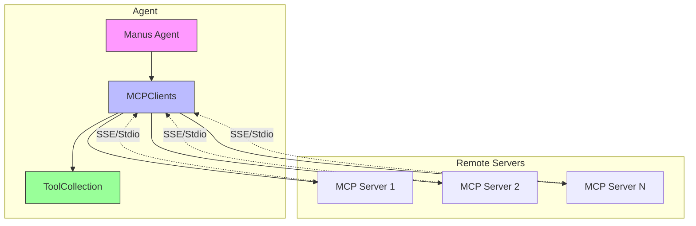
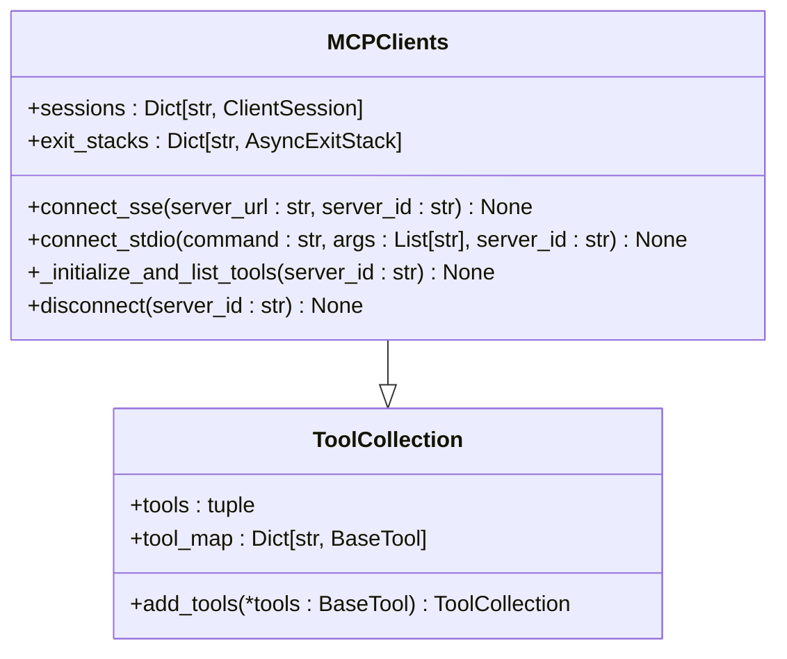
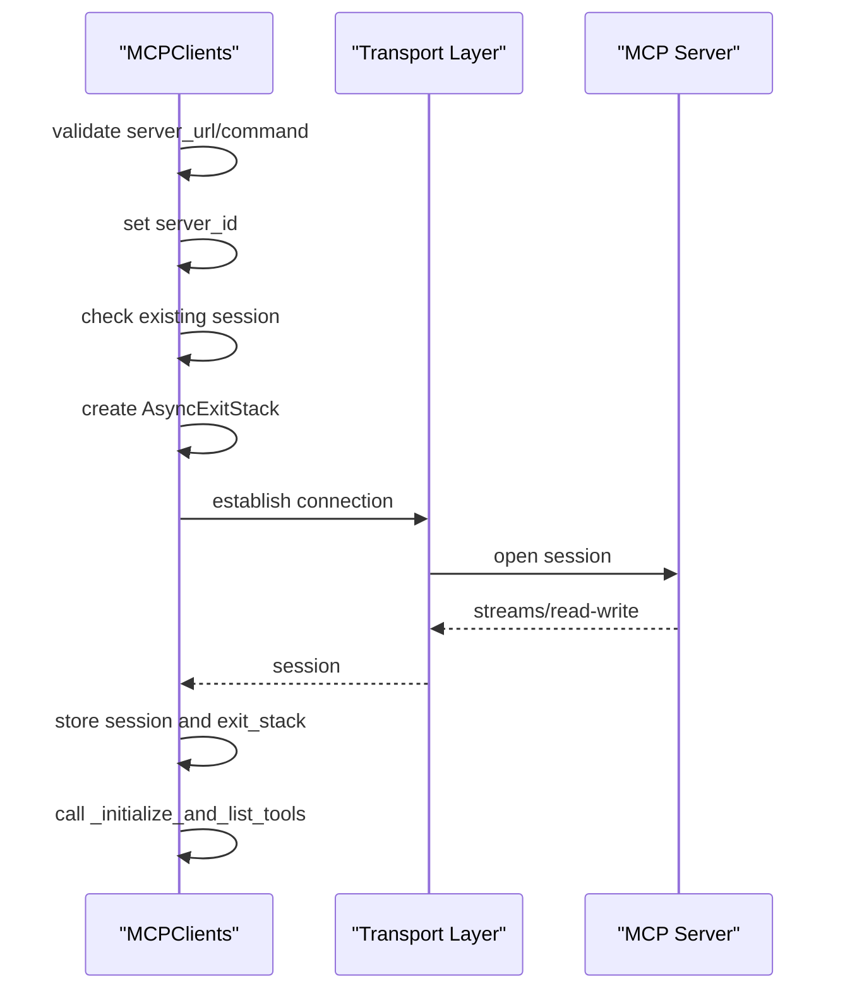
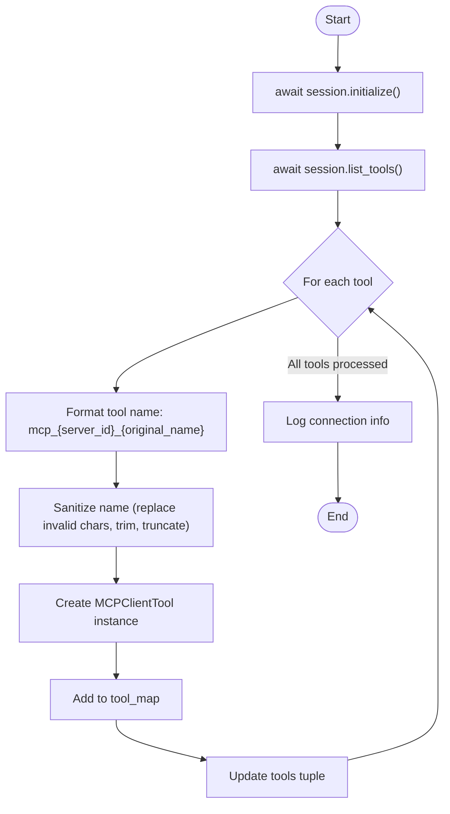
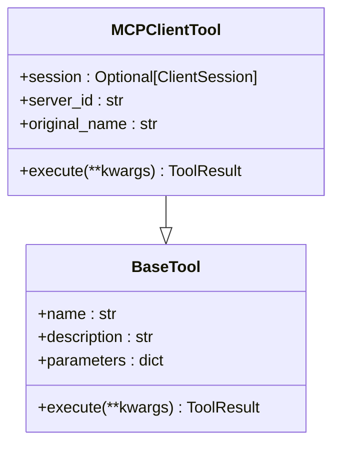
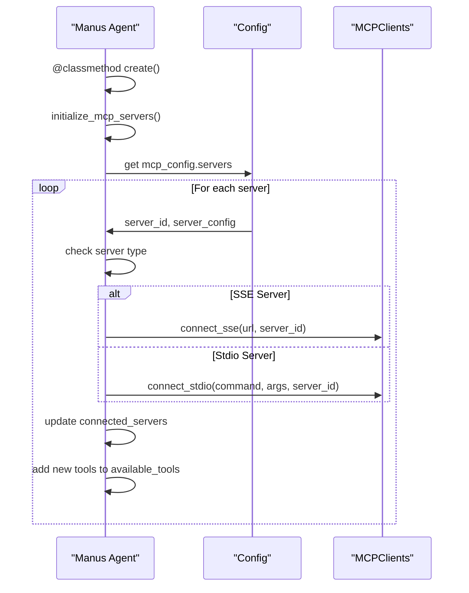
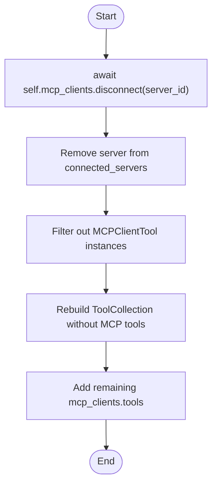

# MCP Protocol

<cite>
**Referenced Files in This Document**   
- [app/tool/mcp.py](file://app/tool/mcp.py)
- [app/agent/manus.py](file://app/agent/manus.py)
- [app/agent/sandbox_agent.py](file://app/agent/sandbox_agent.py)
- [app/mcp/server.py](file://app/mcp/server.py)
- [app/config.py](file://app/config.py)
- [config/config.example.toml](file://config/config.example.toml)
- [config/mcp.example.json](file://config/mcp.example.json)
</cite>

## Table of Contents
1. [Introduction](#introduction)
2. [Core Components](#core-components)
3. [Architecture Overview](#architecture-overview)
4. [Detailed Component Analysis](#detailed-component-analysis)
5. [Workflow from Configuration to Tool Availability](#workflow-from-configuration-to-tool-availability)
6. [Security Considerations and Error Handling](#security-considerations-and-error-handling)
7. [Best Practices for MCP Server Development](#best-practices-for-mcp-server-development)
8. [Conclusion](#conclusion)

## Introduction
The Model Context Protocol (MCP) in OpenManus enables agents to access remote tools through standardized communication channels. This document details the implementation of MCP clients, server integration, and tool management mechanisms that allow seamless interaction between local agents and external MCP servers. The system supports both SSE (Server-Sent Events) and stdio transports for flexible connectivity options.

## Core Components
The MCP implementation consists of key components that manage connections, tool discovery, and execution. The MCPClients class extends ToolCollection to handle multiple server connections, while MCPClientTool acts as a proxy for remote tool execution. The Manus agent integrates these components to provide a unified interface for both local and remote tools.

**Section sources**
- [app/tool/mcp.py](file://app/tool/mcp.py#L13-L193)
- [app/agent/manus.py](file://app/agent/manus.py#L17-L164)

## Architecture Overview

**Diagram sources**
- [app/tool/mcp.py](file://app/tool/mcp.py#L36-L193)
- [app/agent/manus.py](file://app/agent/manus.py#L30-L30)

## Detailed Component Analysis

### MCPClients Class Analysis
The MCPClients class extends ToolCollection to manage connections to multiple MCP servers. It maintains sessions and exit stacks for each connected server, ensuring proper resource management.

#### Connection Methods

**Diagram sources**
- [app/tool/mcp.py](file://app/tool/mcp.py#L36-L193)

#### connect_sse() and connect_stdio() Methods
The connect_sse() and connect_stdio() methods establish connections to MCP servers using different transport mechanisms. Both methods follow a consistent pattern: validate input parameters, ensure clean disconnection of existing sessions, create an AsyncExitStack for resource management, establish the connection, and initialize tool discovery.

**Diagram sources**
- [app/tool/mcp.py](file://app/tool/mcp.py#L49-L94)

#### _initialize_and_list_tools() Process
The _initialize_and_list_tools() method handles the discovery and registration of remote tools. It initializes the session, lists available tools, creates MCPClientTool instances with proper naming, and updates the tool collection.

**Diagram sources**
- [app/tool/mcp.py](file://app/tool/mcp.py#L96-L125)

### MCPClientTool Class Analysis
The MCPClientTool class represents a proxy for remote tools, handling execution through the MCP session.

**Diagram sources**
- [app/tool/mcp.py](file://app/tool/mcp.py#L13-L33)

#### Tool Name Formatting
Remote tools are registered with formatted names following the pattern: mcp_{server_id}_{original_name}. The _sanitize_tool_name() method ensures compliance with naming requirements by:
- Replacing invalid characters with underscores
- Removing consecutive underscores
- Trimming leading/trailing underscores
- Truncating to 64 characters if necessary

**Section sources**
- [app/tool/mcp.py](file://app/tool/mcp.py#L127-L144)

### Manus Agent Integration
The Manus agent integrates MCP functionality through the initialize_mcp_servers() method, which automatically connects to configured servers based on the MCP configuration.

**Diagram sources**
- [app/agent/manus.py](file://app/agent/manus.py#L66-L88)

#### disconnect_mcp_server() Method
The disconnect_mcp_server() method handles proper cleanup of resources when disconnecting from an MCP server. It removes the server's tools from the available tools collection and clears associated references.

**Diagram sources**
- [app/agent/manus.py](file://app/agent/manus.py#L113-L128)

## Workflow from Configuration to Tool Availability
The complete workflow from MCP server configuration to tool availability involves several steps:

1. Configuration in TOML/JSON files
2. Agent initialization
3. Server connection establishment
4. Tool discovery and registration
5. Tool availability in agent's tool collection

**Diagram sources**
- [config/config.example.toml](file://config/config.example.toml#L85-L105)
- [config/mcp.example.json](file://config/mcp.example.json#L1-L8)
- [app/config.py](file://app/config.py#L126-L159)

## Security Considerations and Error Handling
The MCP implementation includes several security and error handling mechanisms:

- Input validation for server URLs and commands
- Clean disconnection before new connections
- Proper resource cleanup using AsyncExitStack
- Error logging and warning messages
- Cancel scope error handling during disconnection

The system handles various error conditions including:
- Invalid server URLs or commands
- Session initialization failures
- Network connectivity issues
- Cancel scope errors during cleanup
- Tool execution exceptions

**Section sources**
- [app/tool/mcp.py](file://app/tool/mcp.py#L154-L193)

## Best Practices for MCP Server Development
When developing MCP servers, consider the following best practices:

1. Use clear and descriptive tool names
2. Provide comprehensive tool descriptions and parameter documentation
3. Implement proper error handling in tool execution
4. Follow consistent naming conventions
5. Ensure tool parameters are properly typed and documented
6. Test both SSE and stdio transport methods
7. Implement proper resource cleanup in server shutdown

The MCPServer implementation in app/mcp/server.py provides a reference implementation with standard tools like bash, browser, editor, and terminate.

**Section sources**
- [app/mcp/server.py](file://app/mcp/server.py#L1-L180)

## Conclusion
The MCP protocol implementation in OpenManus provides a robust framework for integrating remote tools into agent workflows. By extending ToolCollection with MCPClients and using MCPClientTool as a proxy, the system enables seamless access to external capabilities through standardized transports. The automatic initialization process, proper resource management, and comprehensive error handling make it suitable for production use. Developers should follow the established patterns for server development and adhere to the security considerations outlined in this document.