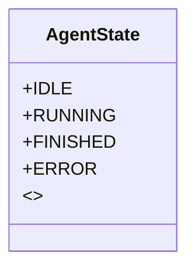
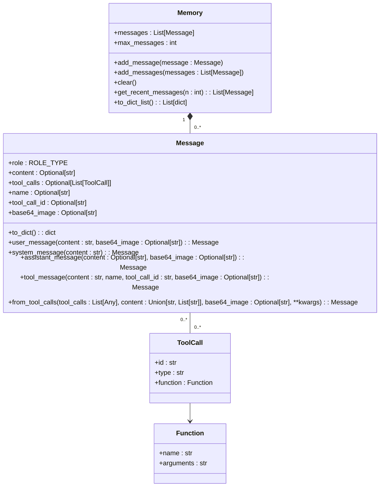
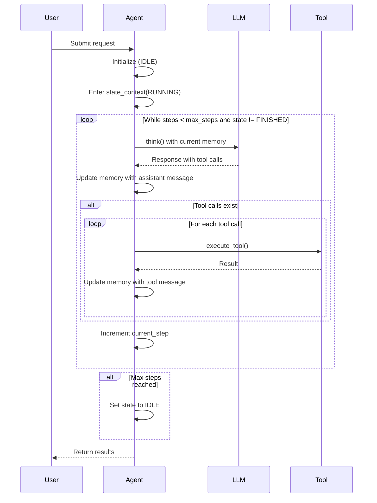

# Memory Management

<cite>
**Referenced Files in This Document**   
- [app/agent/manus.py](file://app/agent/manus.py)
- [app/agent/base.py](file://app/agent/base.py)
- [app/agent/toolcall.py](file://app/agent/toolcall.py)
- [app/schema.py](file://app/schema.py)
- [app/tool/browser_use_tool.py](file://app/tool/browser_use_tool.py)
</cite>

## Table of Contents
1. [Introduction](#introduction)
2. [Agent State Management](#agent-state-management)
3. [Memory Architecture](#memory-architecture)
4. [State Transitions and Execution Flow](#state-transitions-and-execution-flow)
5. [Memory-Driven Decision Making](#memory-driven-decision-making)
6. [Context Awareness and Tool Selection](#context-awareness-and-tool-selection)
7. [Best Practices for Memory Management](#best-practices-for-memory-management)
8. [Conclusion](#conclusion)

## Introduction
The OpenManus memory management system provides a robust framework for maintaining conversation history and tracking agent execution states. This documentation details how the system uses the AgentState enum to manage agent lifecycles and leverages message history to enable context-aware decision making. The memory system supports complex multi-step tasks by preserving context across interactions and enabling intelligent tool selection based on recent activity.

## Agent State Management

The AgentState enum defines the execution lifecycle of agents within the OpenManus system, providing clear state tracking and proper lifecycle management. The four states—IDLE, RUNNING, FINISHED, and ERROR—enable precise control over agent execution and facilitate error recovery.



**Diagram sources**
- [app/schema.py](file://app/schema.py#L31-L37)

**Section sources**
- [app/schema.py](file://app/schema.py#L31-L37)

## Memory Architecture

The memory system in OpenManus is built around the Memory class, which maintains a collection of Message objects representing the conversation history. This architecture enables persistent context across agent interactions and supports complex multi-step tasks by preserving the complete dialogue history.



**Diagram sources**
- [app/schema.py](file://app/schema.py#L158-L186)
- [app/schema.py](file://app/schema.py#L109-L157)

**Section sources**
- [app/schema.py](file://app/schema.py#L158-L186)

## State Transitions and Execution Flow

The agent execution flow follows a well-defined state transition pattern, with the run() method orchestrating the lifecycle from IDLE to RUNNING to either FINISHED or ERROR. The state_context context manager ensures safe state transitions and automatic error handling.



**Diagram sources**
- [app/agent/base.py](file://app/agent/base.py#L114-L196)
- [app/agent/toolcall.py](file://app/agent/toolcall.py#L38-L128)

**Section sources**
- [app/agent/base.py](file://app/agent/base.py#L114-L196)

## Memory-Driven Decision Making

The think() method in the Manus agent demonstrates how recent message history directly influences decision-making. By examining the last three messages in the conversation history, the agent can detect context-specific patterns and adjust its behavior accordingly.

```mermaid
flowchart TD
Start([think() method]) --> CheckInit["Check if initialized"]
CheckInit --> GetRecent["Get recent messages: memory.messages[-3:]"]
GetRecent --> CheckBrowser["Check for BrowserUseTool in recent tool calls"]
CheckBrowser --> |Browser in use| UpdatePrompt["Update next_step_prompt with browser context"]
CheckBrowser --> |No browser| Continue["Continue with original prompt"]
UpdatePrompt --> CallSuper["Call super().think()"]
Continue --> CallSuper
CallSuper --> RestorePrompt["Restore original prompt"]
RestorePrompt --> Return["Return result"]
```

**Diagram sources**
- [app/agent/manus.py](file://app/agent/manus.py#L139-L165)

**Section sources**
- [app/agent/manus.py](file://app/agent/manus.py#L139-L165)

## Context Awareness and Tool Selection

The memory system enables sophisticated context awareness by allowing agents to detect patterns in recent tool usage. The Manus agent specifically checks the last three messages to determine if browser-related tools are being used, which triggers context-specific prompt adjustments.

When the system detects that the BrowserUseTool has been called in recent messages, it dynamically updates the next_step_prompt to include browser-specific context. This allows the agent to provide more relevant responses when operating in a browser automation context. After processing, the original prompt is restored to maintain consistency across different execution contexts.

This pattern of examining recent message history (memory.messages[-3:]) to detect tool usage patterns can be extended to other tools as well, enabling the development of context-aware agents that adapt their behavior based on recent activities.

**Section sources**
- [app/agent/manus.py](file://app/agent/manus.py#L139-L165)
- [app/tool/browser_use_tool.py](file://app/tool/browser_use_tool.py)

## Best Practices for Memory Management

Effective memory management in OpenManus involves several key practices:

1. **Context Window Optimization**: The system automatically manages memory size through the max_messages parameter in the Memory class, preventing unbounded growth while preserving recent context.

2. **State Monitoring**: The AgentState enum provides clear visibility into agent execution status, enabling external systems to monitor progress and detect issues.

3. **Error Recovery**: The state_context context manager ensures that errors during execution result in proper state transitions to ERROR, with automatic restoration of previous states.

4. **Resource Cleanup**: The cleanup() method in ToolCallAgent ensures that resources used by tools are properly released when the agent completes execution.

5. **Duplicate Detection**: The is_stuck() method detects repetitive patterns in agent responses by analyzing message history, allowing the system to intervene when agents enter loops.

These practices ensure that agents maintain optimal performance while preserving the context needed for complex task execution.

**Section sources**
- [app/agent/base.py](file://app/agent/base.py#L169-L185)
- [app/agent/toolcall.py](file://app/agent/toolcall.py#L223-L237)

## Conclusion

The OpenManus memory management system provides a comprehensive framework for maintaining conversation history and tracking agent execution states. By combining the AgentState enum for lifecycle management with a robust memory architecture, the system enables context-aware agents that can perform complex multi-step tasks. The integration of recent message analysis into decision-making processes allows agents to adapt their behavior based on context, while best practices for memory management ensure optimal performance and resource utilization.