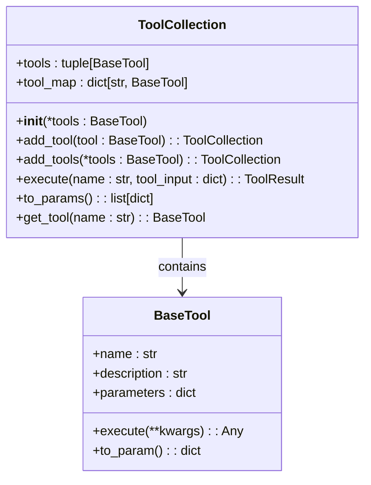
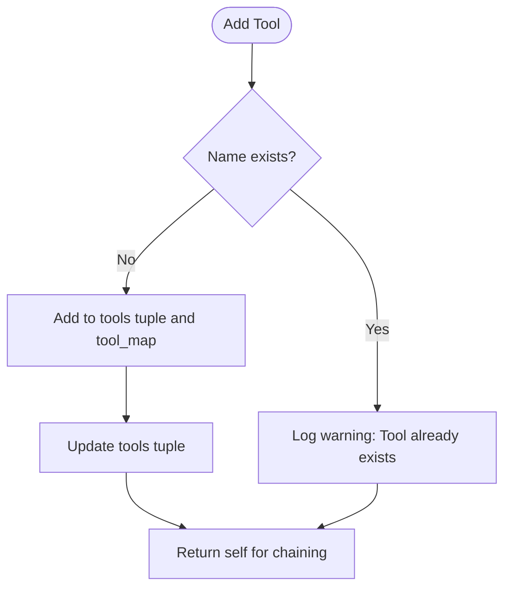
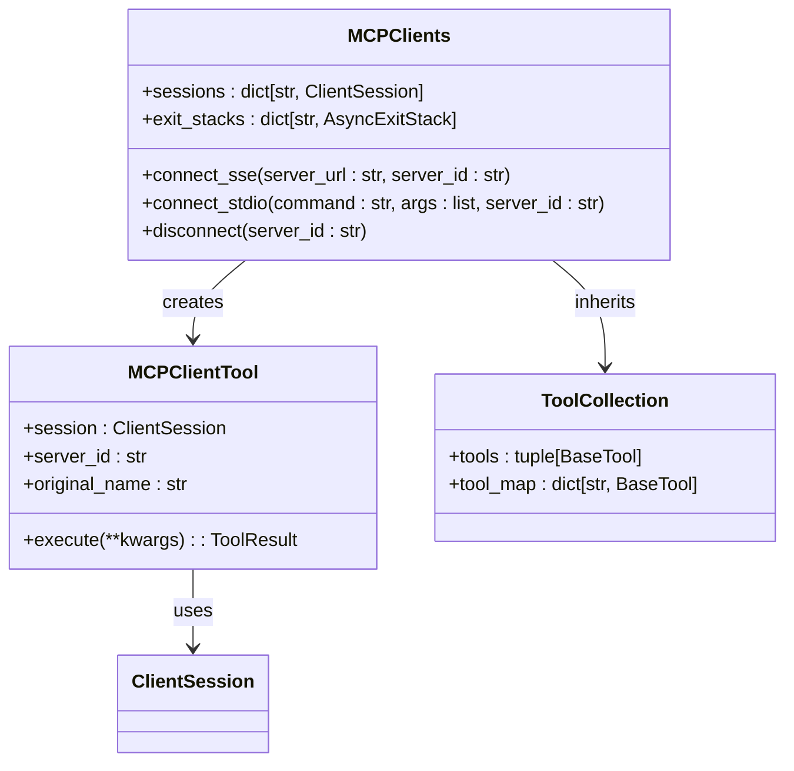
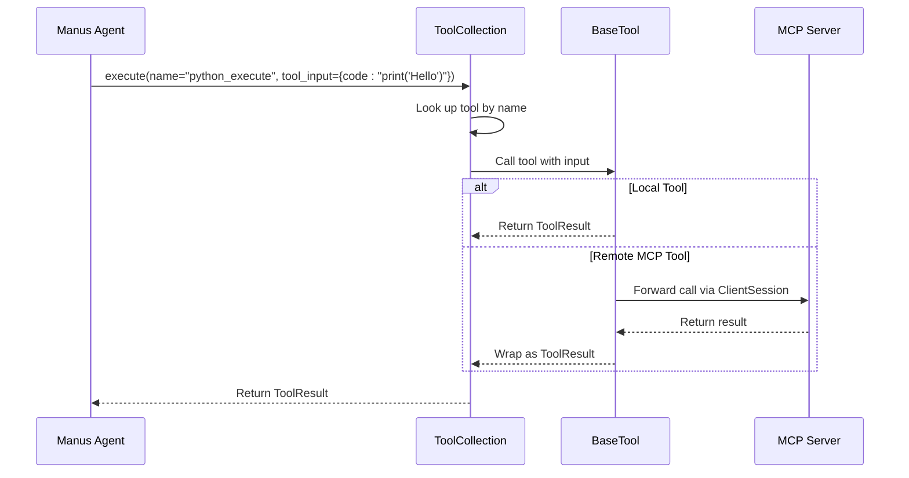
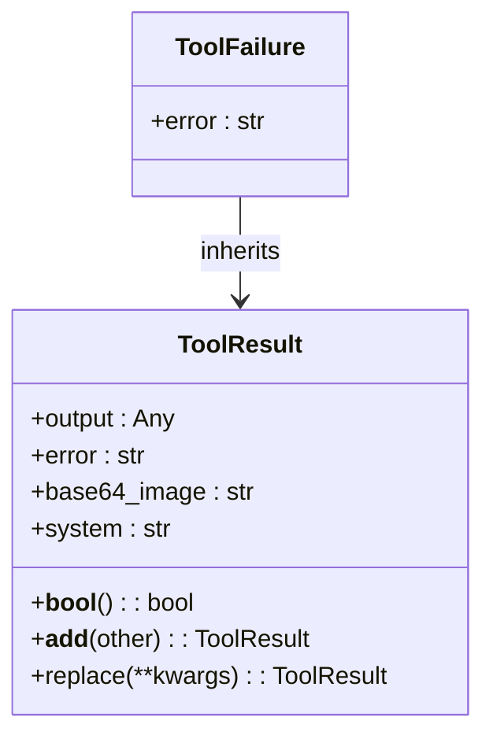

# Tool System

<cite>
**Referenced Files in This Document**   
- [tool_collection.py](file://app/tool/tool_collection.py)
- [mcp.py](file://app/tool/mcp.py)
- [manus.py](file://app/agent/manus.py)
- [python_execute.py](file://app/tool/python_execute.py)
- [browser_use_tool.py](file://app/tool/browser_use_tool.py)
- [base.py](file://app/tool/base.py)
</cite>

## Table of Contents
1. [Introduction](#introduction)
2. [ToolCollection Architecture](#toolcollection-architecture)
3. [Tool Registration and Management](#tool-registration-and-management)
4. [Local vs Remote Tools](#local-vs-remote-tools)
5. [Tool Execution Flow](#tool-execution-flow)
6. [Tool Result Handling](#tool-result-handling)
7. [Integration with LLMs](#integration-with-llms)
8. [Implementation Patterns](#implementation-patterns)

## Introduction
The OpenManus tool system centers around the ToolCollection class as the central registry for agent capabilities. This system enables agents to access both local Python-based tools and remote MCP (Model Context Protocol) tools through a unified interface. The ToolCollection class provides methods for adding, managing, and executing tools, while the MCPClients class extends this functionality to handle connections to external MCP servers. This architecture allows agents like Manus to dynamically incorporate new capabilities during runtime, combining built-in functionality with external services to accomplish complex tasks.

## ToolCollection Architecture

The ToolCollection class serves as the core registry for all tools available to an agent. It maintains two primary data structures: a tuple of tools and a dictionary mapping tool names to their instances. This dual structure enables both ordered iteration and O(1) name-based lookups.

**Diagram sources**
- [tool_collection.py](file://app/tool/tool_collection.py#L8-L70)
- [base.py](file://app/tool/base.py#L77-L172)

**Section sources**
- [tool_collection.py](file://app/tool/tool_collection.py#L8-L70)

## Tool Registration and Management

The ToolCollection class provides methods for dynamically registering tools at runtime. The `add_tool()` method adds a single tool to the collection, checking for name conflicts before insertion. If a tool with the same name already exists, it logs a warning and skips the addition to prevent overwriting existing functionality.

The `add_tools()` method allows batch registration of multiple tools by iterating through the provided tools and calling `add_tool()` for each one. This enables agents to register several capabilities simultaneously, such as when connecting to a new MCP server that exposes multiple tools.

**Section sources**
- [tool_collection.py](file://app/tool/tool_collection.py#L50-L70)

## Local vs Remote Tools

The OpenManus system distinguishes between local tools implemented directly in Python and remote tools accessed through MCP servers. Local tools like PythonExecute and BrowserUseTool are instantiated directly and added to the agent's available_tools collection during initialization.

**Diagram sources**
- [mcp.py](file://app/tool/mcp.py#L36-L193)
- [tool_collection.py](file://app/tool/tool_collection.py#L8-L70)

Remote MCP tools are managed through the MCPClients class, which extends ToolCollection. When connecting to an MCP server via SSE or stdio transport, the system initializes a session, lists available tools, and creates MCPClientTool instances for each remote tool. These proxy tools are named with the pattern "mcp_{server_id}_{original_name}" to ensure uniqueness across servers.

**Section sources**
- [mcp.py](file://app/tool/mcp.py#L36-L193)
- [manus.py](file://app/agent/manus.py#L30-L30)

## Tool Execution Flow

The tool execution process follows a standardized flow that handles both local and remote tools through the same interface. The `execute()` method in ToolCollection takes a tool name and input parameters, looks up the corresponding tool in the tool_map, and invokes it with the provided arguments.

**Diagram sources**
- [tool_collection.py](file://app/tool/tool_collection.py#L24-L34)
- [mcp.py](file://app/tool/mcp.py#L20-L33)

The Manus agent integrates both tool types through its available_tools field, which is initialized with local tools like PythonExecute and BrowserUseTool. When connecting to MCP servers configured in the system, the agent dynamically adds the remote tools to this collection, making them available for selection by the LLM.

**Section sources**
- [tool_collection.py](file://app/tool/tool_collection.py#L24-L34)
- [manus.py](file://app/agent/manus.py#L33-L41)

## Tool Result Handling

The system uses a standardized result pattern with ToolResult and ToolFailure classes to handle execution outcomes. ToolResult represents successful execution with optional output, error messages, base64-encoded images, and system messages. ToolFailure is a specialized ToolResult that indicates execution failure.

**Diagram sources**
- [base.py](file://app/tool/base.py#L37-L74)
- [base.py](file://app/tool/base.py#L179-L180)

When executing a tool, the system returns a ToolFailure if the tool name is not found in the collection. For successful execution, it returns a ToolResult containing the output. If the tool raises a ToolError during execution, this is caught and converted to a ToolFailure with the error message. This consistent error handling pattern ensures that all tool interactions follow the same outcome model, making it easier for agents to process results.

**Section sources**
- [tool_collection.py](file://app/tool/tool_collection.py#L24-L34)
- [base.py](file://app/tool/base.py#L37-L74)

## Integration with LLMs

Tools are exposed to LLMs through the `to_params()` method, which converts each tool into a function calling format that can be understood by language models. This method returns a list of dictionaries containing the tool's name, description, and parameter schema, following the OpenAI function calling specification.

The LLM uses this information to decide when and how to use available tools, generating tool calls with appropriate parameters based on the current task. The agent then executes these tool calls through the ToolCollection's execute method and returns the results to the LLM for further processing. This creates a collaborative workflow where the LLM orchestrates tool usage while the agent handles execution and result management.

**Section sources**
- [tool_collection.py](file://app/tool/tool_collection.py#L21-L22)
- [base.py](file://app/tool/base.py#L123-L136)

## Implementation Patterns

Common implementation patterns for tool development include inheriting from BaseTool, defining the tool's name, description, and parameter schema as class attributes, and implementing the execute method with appropriate error handling. Local tools like PythonExecute implement their functionality directly, while proxy tools like MCPClientTool forward execution to remote services.

The system supports various transport methods for MCP connections, including SSE (Server-Sent Events) and stdio, allowing flexibility in how external tools are integrated. The MCPClients class handles connection lifecycle management, including proper cleanup of resources when disconnecting from servers.

Tool names are sanitized to ensure compatibility with the system's requirements, replacing invalid characters with underscores and truncating to 64 characters if necessary. This prevents issues with tool name conflicts and ensures consistent behavior across different server configurations.

**Section sources**
- [python_execute.py](file://app/tool/python_execute.py#L8-L74)
- [browser_use_tool.py](file://app/tool/browser_use_tool.py#L38-L566)
- [mcp.py](file://app/tool/mcp.py#L127-L144)