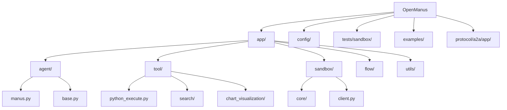
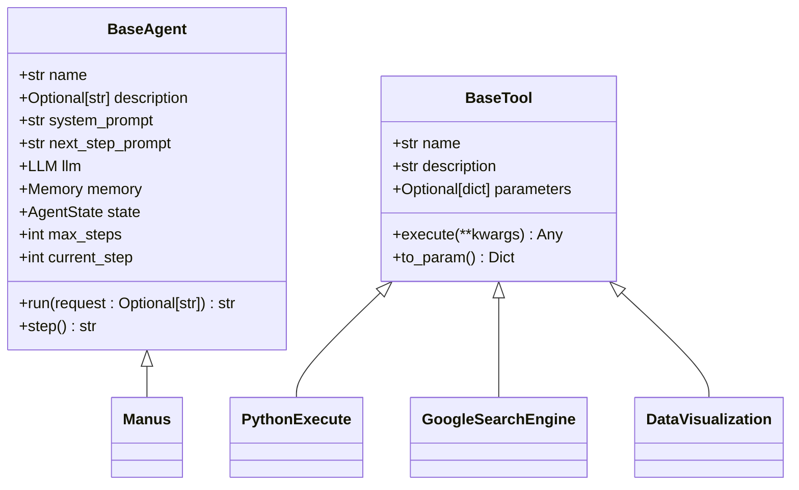
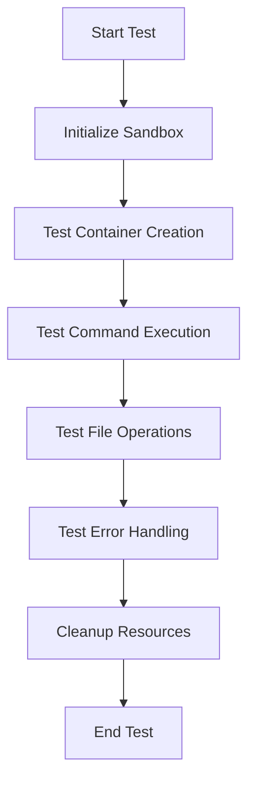
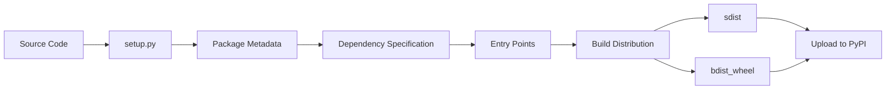
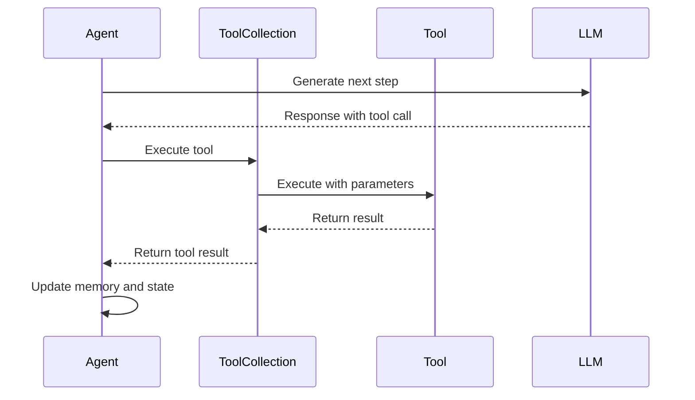

# Development Guide

<cite>
**Referenced Files in This Document**   
- [README.md](file://README.md)
- [setup.py](file://setup.py)
- [app/agent/base.py](file://app/agent/base.py)
- [app/tool/base.py](file://app/tool/base.py)
- [app/sandbox/core/sandbox.py](file://app/sandbox/core/sandbox.py)
- [app/config.py](file://app/config.py)
- [app/llm.py](file://app/llm.py)
- [app/tool/tool_collection.py](file://app/tool/tool_collection.py)
- [app/agent/manus.py](file://app/agent/manus.py)
- [app/tool/python_execute.py](file://app/tool/python_execute.py)
- [app/tool/file_operators.py](file://app/tool/file_operators.py)
- [app/tool/search/google_search.py](file://app/tool/search/google_search.py)
- [app/tool/chart_visualization/data_visualization.py](file://app/tool/chart_visualization/data_visualization.py)
- [app/sandbox/client.py](file://app/sandbox/client.py)
- [app/flow/planning.py](file://app/flow/planning.py)
- [tests/sandbox/test_client.py](file://tests/sandbox/test_client.py)
- [tests/sandbox/test_docker_terminal.py](file://tests/sandbox/test_docker_terminal.py)
- [tests/sandbox/test_sandbox.py](file://tests/sandbox/test_sandbox_manager.py)
</cite>

## Table of Contents
1. [Introduction](#introduction)
2. [Project Structure](#project-structure)
3. [Setting Up the Development Environment](#setting-up-the-development-environment)
4. [Coding Conventions and Best Practices](#coding-conventions-and-best-practices)
5. [Testing Strategies](#testing-strategies)
6. [Debugging Guidance](#debugging-guidance)
7. [Extending the Framework](#extending-the-framework)
8. [Build and Packaging Process](#build-and-packaging-process)
9. [Code Quality and Pre-Commit Hooks](#code-quality-and-pre-commit-hooks)
10. [Agent Behavior and Tool Interaction Debugging](#agent-behavior-and-tool-interaction-debugging)

## Introduction
OpenManus is a versatile agent framework designed to solve various tasks using multiple tools and protocols. This development guide provides comprehensive information for contributors, covering setup, testing, debugging, and extension of the framework. The guide is structured to accommodate both new contributors and experienced developers, offering accessible explanations while maintaining technical depth.

**Section sources**
- [README.md](file://README.md)

## Project Structure
The OpenManus project follows a modular structure with clearly defined components. The main application resides in the `app/` directory, which contains agents, tools, sandbox functionality, and utility modules. Configuration files are stored in the `config/` directory, while tests are located in `tests/sandbox/`. The project includes example use cases in the `examples/` directory and protocol implementations in the `protocol/a2a/app/` directory.



**Diagram sources**
- [app/agent/base.py](file://app/agent/base.py)
- [app/tool/base.py](file://app/tool/base.py)
- [app/sandbox/core/sandbox.py](file://app/sandbox/core/sandbox.py)

## Setting Up the Development Environment
To set up the development environment for OpenManus, first ensure Docker is installed and running, as the framework relies on Docker for sandbox execution. Clone the repository and install the required dependencies using pip:

```bash
git clone https://github.com/FoundationAgents/OpenManus.git
cd OpenManus
pip install -e .
```

Configuration is managed through TOML files in the `config/` directory. Copy the example configuration file to create your own:

```bash
cp config/config.example.toml config/config.toml
```

Edit the `config.toml` file to configure your LLM settings, including model name, API base URL, and API key. The framework supports various LLM providers through the `api_type` parameter (e.g., "azure", "openai", "ollama"). For MCP (Model Context Protocol) integration, configure the `mcp.json` file in the config directory to specify server connections.

**Section sources**
- [README.md](file://README.md)
- [setup.py](file://setup.py)
- [app/config.py](file://app/config.py)

## Coding Conventions and Best Practices
OpenManus follows Python best practices with a focus on type safety and maintainability. All code should use type hints and adhere to PEP 8 guidelines. The framework extensively uses Pydantic for data validation and model definition. When creating new components, inherit from the appropriate base classes and follow the established patterns.

For agent development, extend the `BaseAgent` class and implement the required abstract methods. Tools should inherit from `BaseTool` and define their parameters using Pydantic models. The framework uses async/await patterns extensively, so all I/O operations should be implemented asynchronously.



**Diagram sources**
- [app/agent/base.py](file://app/agent/base.py)
- [app/tool/base.py](file://app/tool/base.py)
- [app/agent/manus.py](file://app/agent/manus.py)
- [app/tool/python_execute.py](file://app/tool/python_execute.py)
- [app/tool/search/google_search.py](file://app/tool/search/google_search.py)
- [app/tool/chart_visualization/data_visualization.py](file://app/tool/chart_visualization/data_visualization.py)

## Testing Strategies
The testing framework for OpenManus focuses on unit testing critical components, particularly the sandbox functionality. Tests are located in the `tests/sandbox/` directory and use pytest for execution. The test suite includes tests for the sandbox client, terminal operations, and container management.

To run the tests, use the following command:

```bash
pytest tests/sandbox/
```

When writing new tests, follow the existing patterns in the test files. Test cases should cover both success and failure scenarios, including edge cases like network timeouts and resource limits. For sandbox-related functionality, use the `test_sandbox.py` file as a reference for testing container creation, command execution, and file operations.



**Diagram sources**
- [tests/sandbox/test_client.py](file://tests/sandbox/test_client.py)
- [tests/sandbox/test_docker_terminal.py](file://tests/sandbox/test_docker_terminal.py)
- [tests/sandbox/test_sandbox.py](file://tests/sandbox/test_sandbox.py)
- [tests/sandbox/test_sandbox_manager.py](file://tests/sandbox/test_sandbox_manager.py)

**Section sources**
- [tests/sandbox/test_client.py](file://tests/sandbox/test_client.py)
- [tests/sandbox/test_docker_terminal.py](file://tests/sandbox/test_docker_terminal.py)
- [tests/sandbox/test_sandbox.py](file://tests/sandbox/test_sandbox.py)
- [tests/sandbox/test_sandbox_manager.py](file://tests/sandbox/test_sandbox_manager.py)

## Debugging Guidance
Effective debugging in OpenManus requires understanding the framework's logging system and component interactions. The framework uses structlog for structured logging, with different output formats based on the environment mode (LOCAL vs. production). Set the `ENV_MODE` environment variable to "LOCAL" to enable console logging with color formatting.

When debugging agent behavior, examine the agent's memory and state transitions. The `BaseAgent` class maintains a memory store that records all messages exchanged during execution. Use the `update_memory` method to inspect the conversation flow and identify where the agent might be getting stuck.

For sandbox-related issues, verify Docker connectivity and resource allocation. Common problems include insufficient memory limits, network configuration issues, and file permission errors. The `DockerSandbox` class provides detailed error messages for container operations, which can help diagnose these issues.

**Section sources**
- [app/utils/logger.py](file://app/utils/logger.py)
- [app/agent/base.py](file://app/agent/base.py)
- [app/sandbox/core/sandbox.py](file://app/sandbox/core/sandbox.py)

## Extending the Framework
Extending OpenManus involves creating new agents, tools, or protocols. To create a new tool, inherit from `BaseTool` and implement the `execute` method. Define the tool's parameters using a Pydantic model in the `parameters` attribute. Register the tool with the appropriate agent by adding it to the agent's tool collection.

For new agents, extend the `BaseAgent` class and implement the `step` method to define the agent's behavior. The `Manus` agent serves as a comprehensive example of how to integrate multiple tools and handle complex workflows. When creating specialized agents, consider the existing agent hierarchy and reuse components where possible.

To implement new protocols, follow the MCP (Model Context Protocol) pattern established in the framework. MCP servers are configured in the `mcp.json` file and connected through the `MCPClients` class. New protocol implementations should provide a clear interface for tool registration and execution.

**Section sources**
- [app/agent/base.py](file://app/agent/base.py)
- [app/tool/base.py](file://app/tool/base.py)
- [app/agent/manus.py](file://app/agent/manus.py)
- [app/tool/tool_collection.py](file://app/tool/tool_collection.py)

## Build and Packaging Process
The build and packaging process for OpenManus is managed through setuptools, with configuration defined in `setup.py`. The package is distributed as a Python package and can be installed in development mode using pip. The `setup.py` file specifies dependencies, entry points, and package metadata.

To build the package, use the following commands:

```bash
python setup.py sdist bdist_wheel
```

The package includes an entry point that allows the application to be run as a command-line tool. The `openmanus` command is registered in the `entry_points` section of `setup.py` and points to the `main` function in the `main.py` file.



**Diagram sources**
- [setup.py](file://setup.py)

**Section sources**
- [setup.py](file://setup.py)

## Code Quality and Pre-Commit Hooks
OpenManus maintains code quality through a combination of static analysis tools and pre-commit hooks. The framework uses standard Python formatting tools like black and isort to ensure consistent code style. Type checking is performed using mypy to catch potential type-related errors.

Pre-commit hooks are configured to run formatting and linting tools before each commit. These hooks ensure that all code meets the project's quality standards before being committed to the repository. The hooks include checks for code formatting, import ordering, and basic syntax errors.

To set up pre-commit hooks, install pre-commit and run the installation command:

```bash
pip install pre-commit
pre-commit install
```

The configuration for pre-commit hooks is typically stored in a `.pre-commit-config.yaml` file, though this file is not present in the provided context. Contributors should ensure their development environment includes appropriate linting and formatting tools to maintain code quality.

**Section sources**
- [setup.py](file://setup.py)

## Agent Behavior and Tool Interaction Debugging
Debugging agent behavior and tool interactions requires a systematic approach to understanding the decision-making process and execution flow. The `BaseAgent` class includes mechanisms for detecting stuck states, where the agent repeatedly generates identical responses. When a stuck state is detected, the agent adds a prompt to encourage a change in strategy.

For tool interaction debugging, examine the tool execution chain and parameter passing. The `ToolCollection` class manages multiple tools and handles execution requests. When a tool fails, it returns a `ToolFailure` result that includes an error message. These failures are logged and can be used to diagnose issues with tool implementation or usage.

The framework's logging system provides detailed information about agent decisions, tool calls, and execution results. Use the structured logs to trace the agent's thought process and identify where expectations diverge from actual behavior. Pay particular attention to the `think` method in agent classes, which determines the next action based on the current state and memory.



**Diagram sources**
- [app/agent/base.py](file://app/agent/base.py)
- [app/tool/tool_collection.py](file://app/tool/tool_collection.py)
- [app/llm.py](file://app/llm.py)

**Section sources**
- [app/agent/base.py](file://app/agent/base.py)
- [app/tool/tool_collection.py](file://app/tool/tool_collection.py)
- [app/llm.py](file://app/llm.py)
- [app/tool/base.py](file://app/tool/base.py)