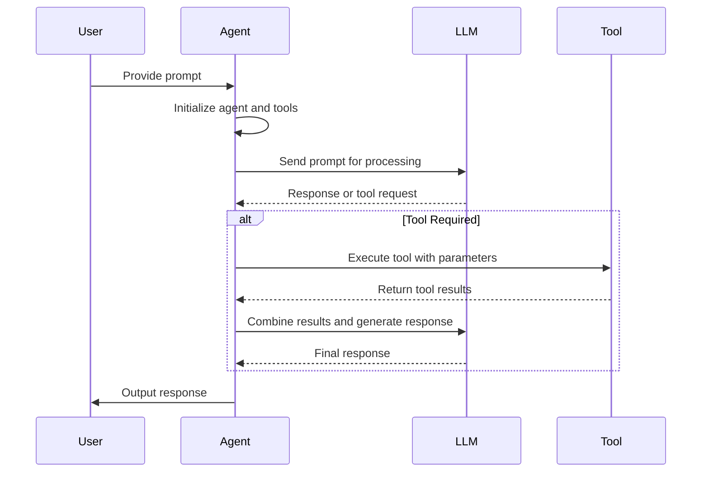

# Basic Examples

<cite>
**Referenced Files in This Document**   
- [main.py](file://main.py)
- [app/agent/manus.py](file://app/agent/manus.py)
- [app/tool/web_search.py](file://app/tool/web_search.py)
- [app/tool/file_operators.py](file://app/tool/file_operators.py)
- [app/llm.py](file://app/llm.py)
- [config/config.example.toml](file://config/config.example.toml)
- [README.md](file://README.md)
- [requirements.txt](file://requirements.txt)
</cite>

## Table of Contents
1. [Introduction](#introduction)
2. [Minimal Setup and First Run](#minimal-setup-and-first-run)
3. [Executing a Simple Prompt](#executing-a-simple-prompt)
4. [Customizing the Agent with Basic Tools](#customizing-the-agent-with-basic-tools)
5. [Agent-LLM-Tool Interaction Flow](#agent-llm-tool-interaction-flow)
6. [Common Beginner Issues and Troubleshooting](#common-beginner-issues-and-troubleshooting)
7. [Installation Verification and First-Run Validation](#installation-verification-and-first-run-validation)

## Introduction
This guide provides practical examples to help new users get started with OpenManus. It covers the minimal setup required to run the agent with default configurations using `python main.py`. The document includes step-by-step instructions for executing a simple prompt, such as "What is the capital of Japan?", and explains the expected output flow. It also demonstrates how to customize the agent with basic tools like web search and file operations, highlighting the interaction between the Manus agent, LLM, and tool execution in simple scenarios. Common beginner issues such as missing dependencies, configuration errors, and how to interpret basic logs are addressed, along with tips for verifying successful installation and first-run validation.

## Minimal Setup and First Run

To get started with OpenManus, follow these steps for minimal setup:

1. **Install Dependencies**: Use the recommended method with `uv` for faster installation and better dependency management:
   ```bash
   curl -LsSf https://astral.sh/uv/install.sh | sh
   git clone https://github.com/FoundationAgents/OpenManus.git
   cd OpenManus
   uv venv --python 3.12
   source .venv/bin/activate
   uv pip install -r requirements.txt
   ```

2. **Configure LLM Settings**: Copy the example configuration file and edit it with your API keys:
   ```bash
   cp config/config.example.toml config/config.toml
   ```
   Edit `config/config.toml` to add your API keys and customize settings, such as the LLM model and base URL.

3. **Run the Agent**: Execute the agent with the default configuration:
   ```bash
   python main.py
   ```

This will start the Manus agent, which can then process prompts using the configured LLM and available tools.

**Section sources**
- [README.md](file://README.md#L85-L138)
- [config/config.example.toml](file://config/config.example.toml#L0-L105)
- [main.py](file://main.py#L0-L36)

## Executing a Simple Prompt

To execute a simple prompt like "What is the capital of Japan?", follow these steps:

1. **Run the Agent**: Start the agent using `python main.py`.
2. **Input the Prompt**: When prompted, enter the question:
   ```
   Enter your prompt: What is the capital of Japan?
   ```
3. **Observe the Output**: The agent will process the request and provide a response. The expected output flow involves the agent using the LLM to generate a response based on its training data, as no external tools are required for this simple query.

The agent will log its processing steps, including a warning when it starts processing and an info message upon completion. If the prompt is empty, a warning will be logged, and the agent will exit.

**Section sources**
- [main.py](file://main.py#L0-L36)
- [app/agent/manus.py](file://app/agent/manus.py#L17-L164)

## Customizing the Agent with Basic Tools

OpenManus can be customized with basic tools such as web search and file operations. Here are examples of how to use these tools:

### Web Search Tool
The `web_search` tool allows the agent to search the web for real-time information. To use it, the agent can execute a search query:
```python
from app.tool.web_search import WebSearch

web_search = WebSearch()
search_response = asyncio.run(
    web_search.execute(
        query="capital of Japan",
        num_results=5,
        lang="en",
        country="us",
        fetch_content=False,
    )
)
print(search_response.to_tool_result())
```
This will return search results with URLs, titles, and descriptions, which the agent can use to provide a detailed response.

### File Operations Tool
The `file_operators` module provides interfaces for file operations in different environments. The agent can read from and write to files using the `LocalFileOperator` or `SandboxFileOperator` classes:
```python
from app.tool.file_operators import LocalFileOperator

file_operator = LocalFileOperator()
await file_operator.write_file("example.txt", "Hello, World!")
content = await file_operator.read_file("example.txt")
print(content)
```
This allows the agent to manage files locally or within a sandbox environment.

**Section sources**
- [app/tool/web_search.py](file://app/tool/web_search.py#L155-L407)
- [app/tool/file_operators.py](file://app/tool/file_operators.py#L15-L38)

## Agent-LLM-Tool Interaction Flow

The interaction between the Manus agent, LLM, and tool execution follows a specific flow:

1. **Prompt Input**: The user provides a prompt either via command line or interactive input.
2. **Agent Initialization**: The Manus agent is created and initialized, connecting to any configured MCP servers.
3. **LLM Processing**: The agent sends the prompt to the LLM, which processes it and generates a response or decides to use a tool.
4. **Tool Execution**: If a tool is required, the agent executes the appropriate tool (e.g., web search) and retrieves the results.
5. **Response Generation**: The agent combines the tool results with the LLM's processing to generate a final response.
6. **Output**: The response is logged and returned to the user.

This flow ensures that the agent can handle both simple queries and complex tasks requiring external data or file operations.



**Diagram sources**
- [main.py](file://main.py#L0-L36)
- [app/agent/manus.py](file://app/agent/manus.py#L17-L164)
- [app/tool/web_search.py](file://app/tool/web_search.py#L155-L407)

## Common Beginner Issues and Troubleshooting

### Missing Dependencies
Ensure all dependencies are installed correctly. If you encounter import errors, reinstall the dependencies:
```bash
uv pip install -r requirements.txt
```

### Configuration Errors
Verify that the `config.toml` file is correctly set up with valid API keys and model settings. Common issues include incorrect API keys or missing required fields.

### Interpreting Logs
The agent logs its activities using the `logger` module. Key log messages include:
- `Processing your request...`: Indicates the agent has started processing a prompt.
- `Request processing completed.`: Indicates successful completion.
- `Operation interrupted.`: Indicates the process was interrupted by the user.
- `Failed to connect to MCP server`: Indicates an issue with MCP server configuration.

Check the logs for warnings and errors to diagnose issues.

**Section sources**
- [README.md](file://README.md#L85-L138)
- [main.py](file://main.py#L0-L36)
- [app/agent/manus.py](file://app/agent/manus.py#L17-L164)

## Installation Verification and First-Run Validation

To verify a successful installation and validate the first run:

1. **Check Dependencies**: Ensure all packages listed in `requirements.txt` are installed.
2. **Run a Test Prompt**: Execute a simple prompt like "What is the capital of Japan?" and verify the response.
3. **Check Logs**: Confirm that the agent logs indicate successful processing without errors.
4. **Test Tool Execution**: Use a tool like `web_search` to ensure external tools are functioning correctly.

Following these steps will confirm that OpenManus is correctly installed and ready for use.

**Section sources**
- [requirements.txt](file://requirements.txt#L0-L42)
- [main.py](file://main.py#L0-L36)
- [README.md](file://README.md#L85-L138)