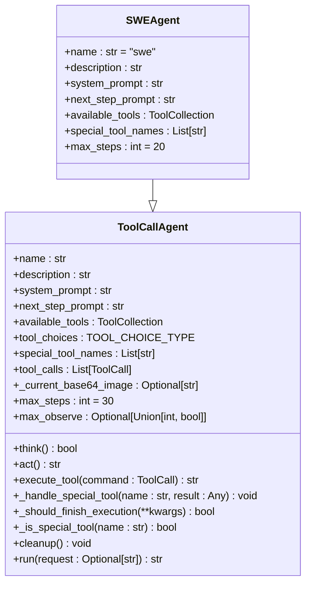
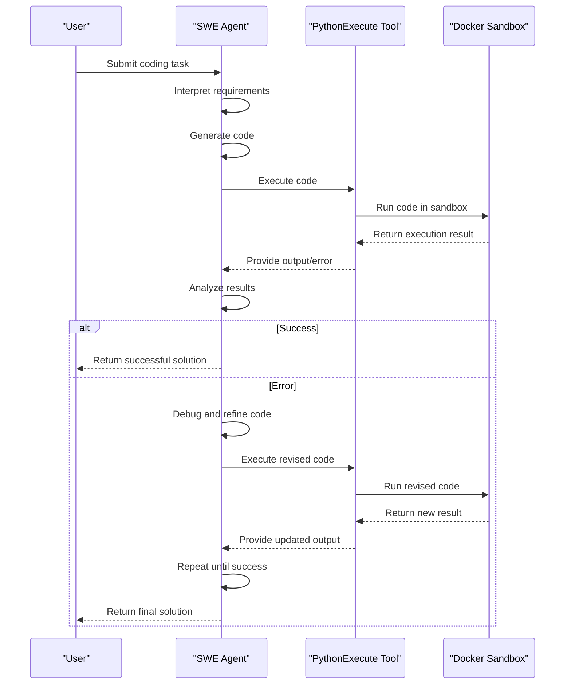
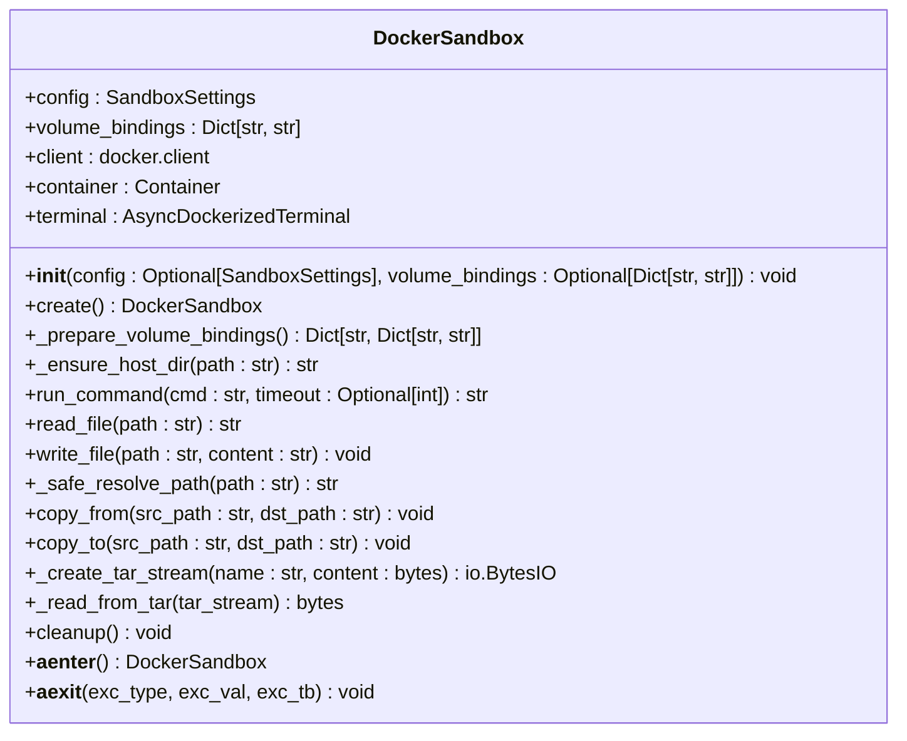
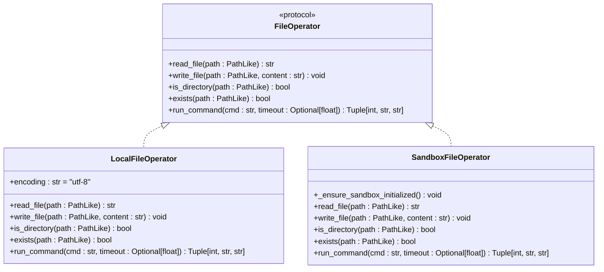
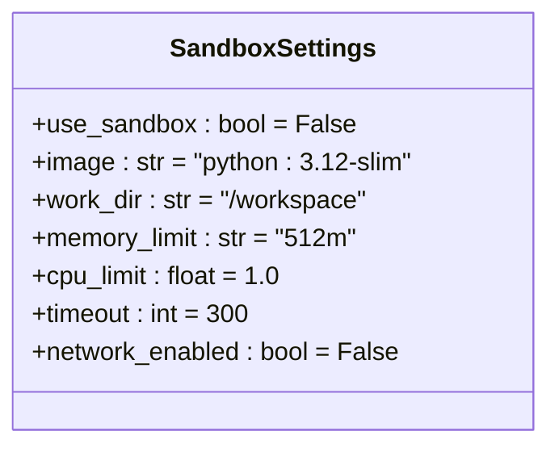

# Code Generation

<cite>
**Referenced Files in This Document**   
- [swe.py](file://app/agent/swe.py)
- [python_execute.py](file://app/tool/python_execute.py)
- [sandbox.py](file://app/sandbox/core/sandbox.py)
- [file_operators.py](file://app/tool/file_operators.py)
- [config.py](file://app/config.py)
- [bash.py](file://app/tool/bash.py)
- [swe.py](file://app/prompt/swe.py)
</cite>

## Table of Contents
1. [Introduction](#introduction)
2. [SWE Agent Architecture](#swe-agent-architecture)
3. [Code Execution Workflow](#code-execution-workflow)
4. [Sandbox Environment](#sandbox-environment)
5. [File Operations](#file-operations)
6. [Configuration Settings](#configuration-settings)
7. [Security and Resource Management](#security-and-resource-management)
8. [Practical Example: Sorting Algorithm Implementation](#practical-example-sorting-algorithm-implementation)
9. [Best Practices for Prompt Design](#best-practices-for-prompt-design)
10. [Conclusion](#conclusion)

## Introduction
The SWE (Software Engineer) Agent in OpenManus is an autonomous AI programmer designed to solve coding tasks through natural language interaction and direct computer interaction. This document details how the agent interprets requirements, generates code, executes it in a secure sandbox environment, and iteratively debugs based on test results or error feedback. The agent follows a structured workflow that includes receiving coding tasks, writing code, executing it via python_execute.py, analyzing errors, and refining solutions until completion.

**Section sources**
- [swe.py](file://app/agent/swe.py#L9-L23)

## SWE Agent Architecture
The SWEAgent class inherits from ToolCallAgent and implements the SWEAgent paradigm for executing code and natural conversations. It operates as an autonomous AI programmer that interacts directly with the computer to solve tasks. The agent has a maximum step limit of 20 and utilizes specific tools including Bash, StrReplaceEditor, and Terminate. The system prompt guides the agent's behavior in the command line interface with a special file editor that shows a limited number of lines at a time.

**Diagram sources **
- [swe.py](file://app/agent/swe.py#L9-L23)
- [toolcall.py](file://app/agent/toolcall.py#L17-L249)

**Section sources**
- [swe.py](file://app/agent/swe.py#L9-L23)
- [toolcall.py](file://app/agent/toolcall.py#L17-L249)

## Code Execution Workflow
The SWE Agent follows a systematic workflow for code generation and debugging. When receiving a coding task, the agent first interprets the natural language requirements and plans its approach. It then generates code using the available tools and executes it in a secure environment. The execution process involves calling the python_execute tool with the generated code, which runs in an isolated sandbox with timeout and safety restrictions. After execution, the agent analyzes the output or error messages and iteratively refines the solution until the task is completed successfully.

**Diagram sources **
- [swe.py](file://app/agent/swe.py#L9-L23)
- [python_execute.py](file://app/tool/python_execute.py#L8-L74)
- [sandbox.py](file://app/sandbox/core/sandbox.py#L17-L461)

**Section sources**
- [swe.py](file://app/agent/swe.py#L9-L23)
- [python_execute.py](file://app/tool/python_execute.py#L8-L74)

## Sandbox Environment
The DockerSandbox class provides a containerized execution environment with resource limits, file operations, and command execution capabilities. It ensures secure code execution by isolating the process in a Docker container with configurable memory and CPU limits. The sandbox prevents path traversal attempts and restricts network access by default. Each sandbox instance is created with a unique container name and runs with specific resource constraints defined in the SandboxSettings configuration.

**Diagram sources **
- [sandbox.py](file://app/sandbox/core/sandbox.py#L17-L461)

**Section sources**
- [sandbox.py](file://app/sandbox/core/sandbox.py#L17-L461)

## File Operations
The file operations in OpenManus are handled through the FileOperator interface, which provides methods for reading, writing, and checking file existence in both local and sandbox environments. The LocalFileOperator implements these operations for the local filesystem, while the SandboxFileOperator handles operations within the sandbox environment. Both implementations ensure proper error handling and provide consistent interfaces for file manipulation across different execution contexts.

**Diagram sources **
- [file_operators.py](file://app/tool/file_operators.py#L0-L158)

**Section sources**
- [file_operators.py](file://app/tool/file_operators.py#L0-L158)

## Configuration Settings
The SandboxSettings class defines the configuration for the execution sandbox, including whether to use the sandbox, the base Docker image, working directory, memory and CPU limits, command timeout, and network access permissions. These settings can be customized in the configuration file to meet specific security and performance requirements. The default configuration uses a Python 3.12-slim image with 512MB memory limit, 1.0 CPU limit, 300-second timeout, and disabled network access for enhanced security.

**Diagram sources **
- [config.py](file://app/config.py#L93-L104)

**Section sources**
- [config.py](file://app/config.py#L93-L104)

## Security and Resource Management
The SWE Agent implements multiple security and resource management mechanisms to ensure safe code execution. The PythonExecute tool uses multiprocessing with a timeout parameter to prevent infinite loops and limit execution time. The sandbox environment enforces memory and CPU limits through Docker configuration. Path traversal is prevented by the _safe_resolve_path method, which validates container paths. Network access is disabled by default in the sandbox configuration to prevent unauthorized external connections. Additionally, the agent monitors execution results and can terminate processes that exceed resource limits or exhibit problematic behavior.

**Section sources**
- [python_execute.py](file://app/tool/python_execute.py#L8-L74)
- [sandbox.py](file://app/sandbox/core/sandbox.py#L17-L461)
- [config.py](file://app/config.py#L93-L104)

## Practical Example: Sorting Algorithm Implementation
To demonstrate the SWE Agent's capabilities, consider implementing a sorting algorithm. The agent would receive a natural language request to "implement a quicksort algorithm in Python." It would generate the appropriate code, execute it in the sandbox environment, and verify the results. If errors occur, such as incorrect sorting logic or runtime exceptions, the agent would analyze the error messages, debug the code, and refine the implementation until it produces correct results. This iterative process showcases the agent's ability to interpret requirements, generate functional code, and systematically resolve issues through automated testing and debugging.

**Section sources**
- [swe.py](file://app/agent/swe.py#L9-L23)
- [python_execute.py](file://app/tool/python_execute.py#L8-L74)

## Best Practices for Prompt Design
Effective prompt design is crucial for maximizing code quality and debugging efficiency with the SWE Agent. Prompts should be clear, specific, and include all necessary context for the task. They should specify the desired programming language, required functionality, input/output formats, and any constraints or requirements. Including examples of expected behavior can help guide the agent toward correct solutions. For debugging tasks, providing detailed error messages and context about the failure can enable more targeted fixes. Well-crafted prompts reduce ambiguity and help the agent generate higher-quality code on the first attempt, minimizing the need for iterative refinement.

**Section sources**
- [swe.py](file://app/prompt/swe.py#L0-L22)

## Conclusion
The SWE Agent in OpenManus provides a robust framework for autonomous code generation and debugging through natural language interaction. By combining sophisticated agent architecture with secure sandbox execution and comprehensive file operations, it enables reliable and safe code development. The integration of configuration settings allows for customization of security and resource parameters to meet specific requirements. Through iterative refinement based on execution results, the agent can successfully complete complex programming tasks while maintaining high standards of code quality and system security.