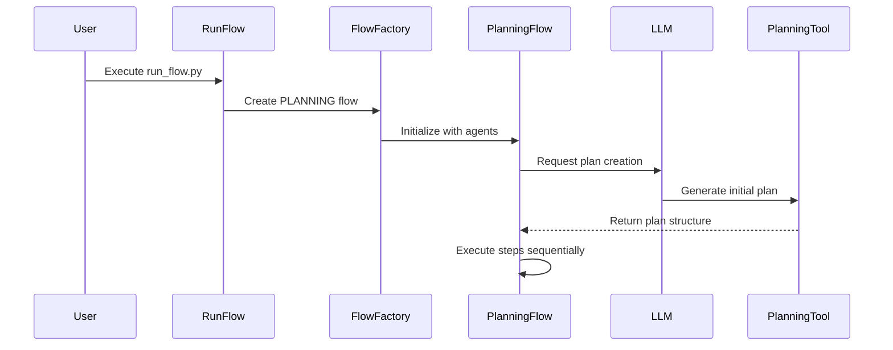
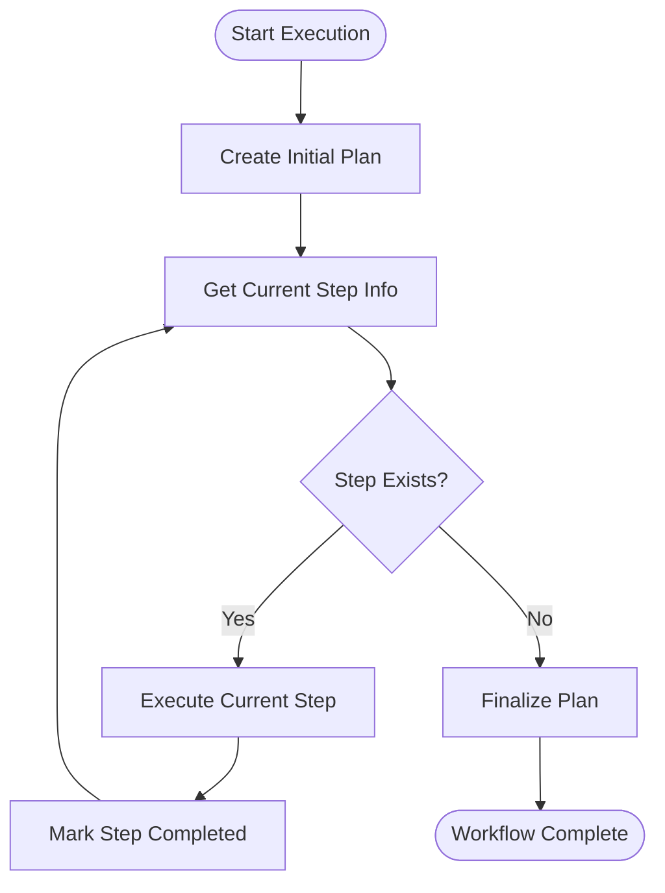
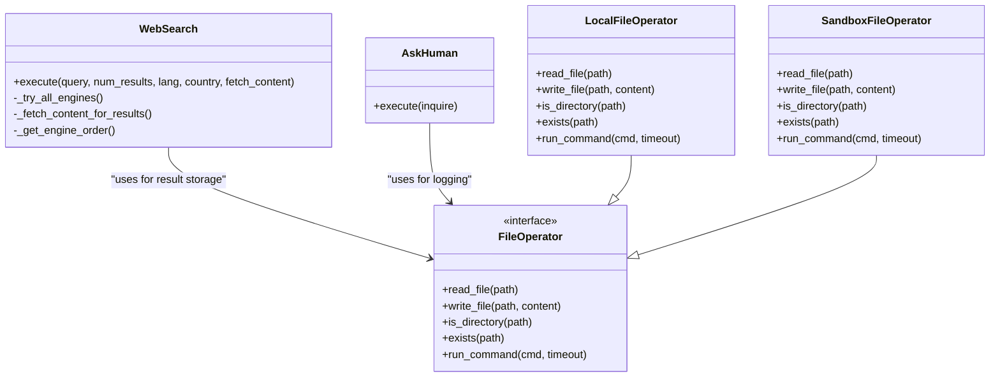
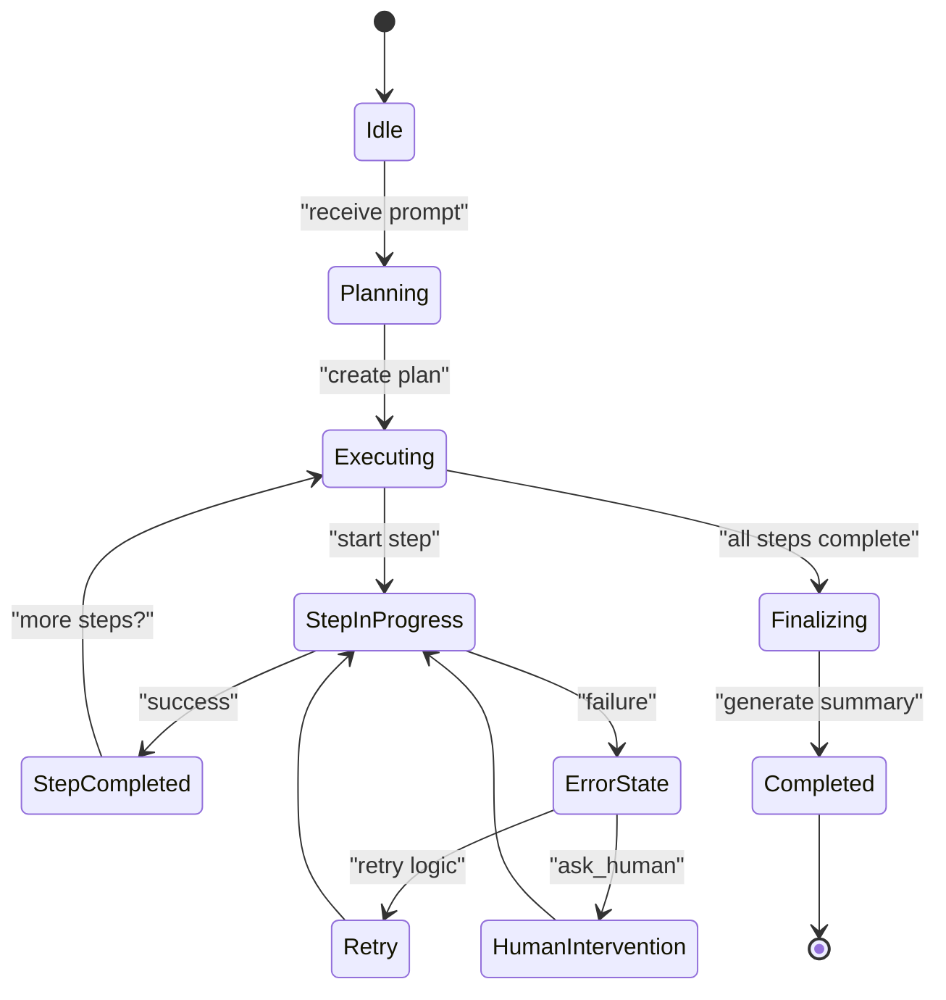

# Complex Workflows

<cite>
**Referenced Files in This Document**   
- [run_flow.py](file://run_flow.py)
- [planning.py](file://app/flow/planning.py)
- [japan_travel_guide_instructions.txt](file://examples/use_case/japan-travel-plan/japan_travel_guide_instructions.txt)
- [file_operators.py](file://app/tool/file_operators.py)
- [ask_human.py](file://app/tool/ask_human.py)
- [manus.py](file://app/agent/manus.py)
- [config.example.toml](file://config/config.example.toml)
</cite>

## Table of Contents
1. [Introduction](#introduction)
2. [Workflow Execution Command](#workflow-execution-command)
3. [Flow System Architecture](#flow-system-architecture)
4. [Agent Orchestration and Decision-Making](#agent-orchestration-and-decision-making)
5. [Tool Integration and Coordination](#tool-integration-and-coordination)
6. [Multi-Format Output Generation](#multi-format-output-generation)
7. [Configuration and Customization](#configuration-and-customization)
8. [State Management and Error Recovery](#state-management-and-error-recovery)
9. [Performance Optimization](#performance-optimization)

## Introduction
This document details the complex workflow implementation in OpenManus for creating a comprehensive Japan travel plan. The system demonstrates advanced orchestration capabilities by coordinating multiple tools and agents to research destinations, compile itineraries, and generate multi-format travel handbooks. The workflow showcases the agent's ability to break down high-level goals into actionable steps, manage state across long-running processes, and produce outputs optimized for different use cases.

**Section sources**
- [japan_travel_guide_instructions.txt](file://examples/use_case/japan-travel-plan/japan_travel_guide_instructions.txt)

## Workflow Execution Command
To execute the Japan travel plan workflow, users run the following command:

```bash
python run_flow.py
```

When prompted, input the travel planning request as specified in the use case documentation. The system processes the request with a 60-minute timeout, providing progress updates and final results through the logging system. The execution begins by creating an initial plan based on the user's prompt and proceeds through each step until completion.

**Section sources**
- [run_flow.py](file://run_flow.py#L0-L52)

## Flow System Architecture
The Flow system in OpenManus coordinates multi-step tasks through the PlanningFlow class, which extends the BaseFlow abstraction. The system uses run_flow.py as the entry point to initialize agents and create a planning flow instance. The PlanningFlow manages the entire lifecycle of task execution, from initial plan creation to final summarization.

The architecture follows a structured execution pattern where each step is processed sequentially. The flow maintains an active plan ID and tracks the current step index, ensuring proper state management throughout the workflow. The system creates an initial plan by leveraging the LLM with the PlanningTool, which generates actionable steps to accomplish the requested task.



**Diagram sources**
- [run_flow.py](file://run_flow.py#L0-L52)
- [planning.py](file://app/flow/planning.py#L44-L441)

**Section sources**
- [run_flow.py](file://run_flow.py#L0-L52)
- [planning.py](file://app/flow/planning.py#L44-L441)

## Agent Orchestration and Decision-Making
The Manus agent serves as the primary executor in the Japan travel plan workflow, orchestrating various tools to accomplish the planning task. The agent's decision-making process begins with the creation of an initial plan through the _create_initial_plan method, which uses the LLM to generate a structured sequence of steps.

The PlanningFlow's _get_current_step_info method identifies the first non-completed step by parsing the current plan and extracting step type information from text patterns like [SEARCH] or [CODE]. This enables the system to route steps to appropriate executors based on their type. The get_executor method selects the appropriate agent for each step, prioritizing agents that match the step type when specified.

During execution, the _execute_step method prepares context for the agent with current plan status and creates a prompt that focuses the agent on the specific step being processed. This ensures that each step is executed with full awareness of the overall plan progress and context.



**Diagram sources**
- [planning.py](file://app/flow/planning.py#L44-L441)

**Section sources**
- [planning.py](file://app/flow/planning.py#L44-L441)

## Tool Integration and Coordination
The Japan travel plan workflow integrates multiple tools to accomplish its objectives, including web search, browser automation, file operations, and human interaction. The WebSearch tool enables the agent to research destinations by querying search engines like Google, with fallback mechanisms to alternative engines if needed.

The file_operators.py module provides both local and sandboxed file operations, allowing the agent to read and write files necessary for the travel handbook. The SandboxFileOperator enables secure file operations within an isolated environment, while the LocalFileOperator handles operations on the host system.

Human interaction is facilitated through the AskHuman tool, which allows the agent to request input when needed. This is particularly valuable for subjective decisions in travel planning, such as preference confirmation or personalization details.



**Diagram sources**
- [web_search.py](file://app/tool/web_search.py#L0-L418)
- [file_operators.py](file://app/tool/file_operators.py#L0-L158)
- [ask_human.py](file://app/tool/ask_human.py#L0-L21)

**Section sources**
- [web_search.py](file://app/tool/web_search.py#L0-L418)
- [file_operators.py](file://app/tool/file_operators.py#L0-L158)
- [ask_human.py](file://app/tool/ask_human.py#L0-L21)

## Multi-Format Output Generation
The Japan travel plan workflow generates three distinct output formats to accommodate different use cases during the trip. These outputs are specified in the japan_travel_guide_instructions.txt file and include:

1. **Digital Version** (japan_travel_handbook.html): A comprehensive guide optimized for desktop viewing with detailed itineraries, hotel recommendations, and budget breakdowns.

2. **Print-Friendly Version** (japan_travel_handbook_print.html): A condensed version with printer-friendly formatting, quick reference tables, and essential information for physical reference.

3. **Mobile-Optimized Version** (japan_travel_handbook_mobile.html): A responsive design with touch-friendly interface, collapsible sections, dark mode support, and quick access emergency buttons.

The system coordinates the generation of these formats by first creating a comprehensive digital version and then transforming it into print-friendly and mobile-optimized variants. Each format contains the same core information but is structured differently for optimal use in specific situations.

**Section sources**
- [japan_travel_guide_instructions.txt](file://examples/use_case/japan-travel-plan/japan_travel_guide_instructions.txt)

## Configuration and Customization
The workflow behavior is influenced by configuration settings in the config.example.toml file, which allows users to customize various aspects of the system. Key configuration options include LLM settings (model, API endpoint, temperature), search engine preferences, and sandbox parameters.

Users can customize templates and output formats by modifying the configuration files or extending the system with additional tools. The MCP (Model Context Protocol) configuration enables integration with external servers, expanding the agent's capabilities. The runflow configuration allows for the inclusion of additional agents, such as the DataAnalysis agent, to handle specialized tasks.

The system supports different LLM providers through configurable API types, including Anthropic, Amazon Bedrock, Azure OpenAI, and Ollama, allowing users to select their preferred model provider.

**Section sources**
- [config.example.toml](file://config/config.example.toml#L0-L105)

## State Management and Error Recovery
The PlanningFlow implements robust state management to handle long-running workflows and ensure persistence across execution steps. The system maintains plan state in memory through the PlanningTool's plans dictionary, tracking step statuses, notes, and completion progress.

Error recovery mechanisms include retry logic for search operations, timeout handling for the entire workflow (60 minutes), and fallback strategies when primary tools fail. The _mark_step_completed method includes error handling that updates step status directly in storage if the planning tool execution fails, ensuring state consistency even when individual operations encounter issues.

The system also implements stuck state detection in the BaseAgent class, which monitors for duplicate responses and prompts the agent to change strategies when loops are detected. This prevents infinite loops and encourages exploration of alternative approaches.



**Diagram sources**
- [planning.py](file://app/flow/planning.py#L44-L441)
- [base.py](file://app/agent/base.py#L0-L196)

**Section sources**
- [planning.py](file://app/flow/planning.py#L44-L441)
- [base.py](file://app/agent/base.py#L0-L196)

## Performance Optimization
The system incorporates several performance optimizations for multi-phase tasks. The PlanningFlow uses asynchronous execution throughout, allowing for non-blocking operations and efficient resource utilization. The web search functionality includes content fetching with configurable limits (100KB max) to prevent excessive resource consumption.

The workflow implements caching mechanisms through the PlanningTool, which stores plans in memory and provides quick access to current status. The system also optimizes LLM usage by focusing each step on specific tasks rather than reprocessing the entire plan context.

For long-running workflows, the system provides progress tracking through the _generate_plan_text_from_storage method, which displays completion percentages and status summaries. This allows users to monitor progress and estimate remaining execution time.

**Section sources**
- [planning.py](file://app/flow/planning.py#L44-L441)
- [web_search.py](file://app/tool/web_search.py#L0-L418)