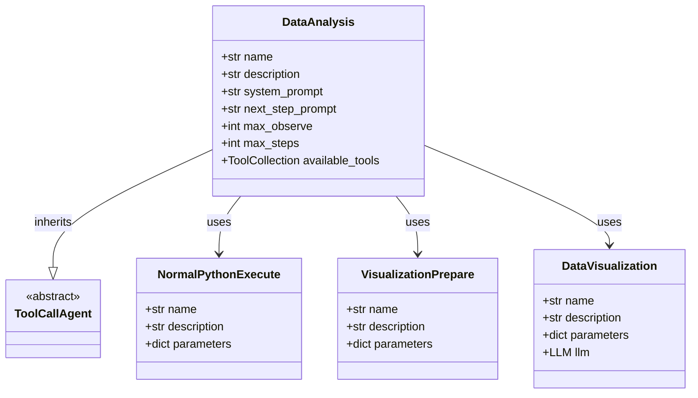
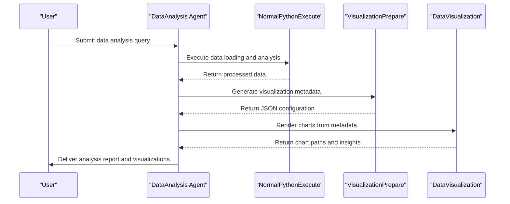
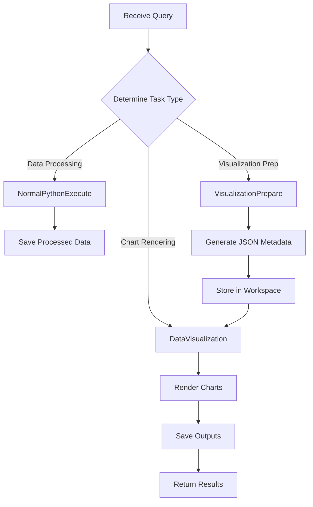
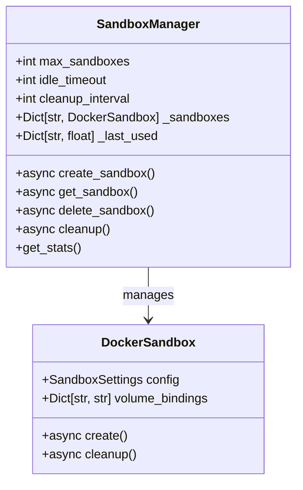

# Data Analysis

<cite>
**Referenced Files in This Document**   
- [data_analysis.py](file://app/agent/data_analysis.py)
- [python_execute.py](file://app/tool/chart_visualization/python_execute.py)
- [chart_prepare.py](file://app/tool/chart_visualization/chart_prepare.py)
- [data_visualization.py](file://app/tool/chart_visualization/data_visualization.py)
- [visualization.py](file://app/prompt/visualization.py)
- [manager.py](file://app/sandbox/core/manager.py)
- [chart_demo.py](file://app/tool/chart_visualization/test/chart_demo.py)
</cite>

## Table of Contents
1. [Introduction](#introduction)
2. [Data Analysis Agent Architecture](#data-analysis-agent-architecture)
3. [Workflow Overview](#workflow-overview)
4. [Tool Orchestration](#tool-orchestration)
5. [Practical Example](#practical-example)
6. [Configuration Requirements](#configuration-requirements)
7. [Sandbox Environment Management](#sandbox-environment-management)
8. [Performance Considerations](#performance-considerations)
9. [Common Challenges and Best Practices](#common-challenges-and-best-practices)
10. [Conclusion](#conclusion)

## Introduction
The Data Analysis Agent in OpenManus is designed to process datasets, generate insights, and create visualizations through a structured workflow. Leveraging the chart_visualization tool suite, the agent performs data analysis within a sandboxed Python environment. This document details the agent's architecture, workflow, and implementation specifics for handling data-related queries from ingestion to visualization delivery.

**Section sources**
- [data_analysis.py](file://app/agent/data_analysis.py#L1-L37)
- [visualization.py](file://app/prompt/visualization.py#L1-L10)

## Data Analysis Agent Architecture
The DataAnalysis class extends ToolCallAgent with specialized capabilities for data processing and visualization. It incorporates a comprehensive tool collection including NormalPythonExecute for code execution, VisualizationPrepare for chart metadata generation, DataVisualization for rendering charts, and Terminate for task completion. The agent operates with configurable limits on observation length (15,000 characters) and maximum steps (20), ensuring controlled execution of analytical tasks.

**Diagram sources**
- [data_analysis.py](file://app/agent/data_analysis.py#L1-L37)

**Section sources**
- [data_analysis.py](file://app/agent/data_analysis.py#L1-L37)

## Workflow Overview
The data analysis workflow follows a sequential process from query reception to result delivery. When a data-related query is received, the agent first uses NormalPythonExecute to load and analyze the dataset. Then, VisualizationPrepare processes the data to generate metadata for visualization. Finally, DataVisualization renders the charts based on this metadata. The system prompt guides the agent to break down problems and select appropriate tools step by step, ensuring systematic analysis.

**Diagram sources**
- [data_analysis.py](file://app/agent/data_analysis.py#L1-L37)
- [python_execute.py](file://app/tool/chart_visualization/python_execute.py#L1-L36)
- [chart_prepare.py](file://app/tool/chart_visualization/chart_prepare.py#L1-L38)
- [data_visualization.py](file://app/tool/chart_visualization/data_visualization.py#L1-L263)

## Tool Orchestration
The agent orchestrates three primary tools for data analysis tasks. NormalPythonExecute handles general data processing with safety restrictions and timeout protection. VisualizationPrepare generates JSON metadata containing CSV file paths and chart descriptions. DataVisualization consumes this metadata to produce visual outputs in PNG or HTML format. The tool selection follows the NEXT_STEP_PROMPT guidance, where each step involves selecting the most appropriate tool and explaining execution results before proceeding.

**Diagram sources**
- [data_analysis.py](file://app/agent/data_analysis.py#L1-L37)
- [python_execute.py](file://app/tool/chart_visualization/python_execute.py#L1-L36)
- [chart_prepare.py](file://app/tool/chart_visualization/chart_prepare.py#L1-L38)
- [data_visualization.py](file://app/tool/chart_visualization/data_visualization.py#L1-L263)

**Section sources**
- [data_analysis.py](file://app/agent/data_analysis.py#L1-L37)
- [python_execute.py](file://app/tool/chart_visualization/python_execute.py#L1-L36)
- [chart_prepare.py](file://app/tool/chart_visualization/chart_prepare.py#L1-L38)
- [data_visualization.py](file://app/tool/chart_visualization/data_visualization.py#L1-L263)

## Practical Example
A practical example demonstrates the agent loading a CSV file, performing statistical analysis, and generating visualizations. Using the chart_demo.py test file, the agent processes sales data across different regions and products. The workflow begins with data loading using pandas, followed by statistical summary generation, and concludes with chart rendering through the VMind library. The final output includes interactive HTML charts and PNG images saved in the workspace's visualization directory.

**Section sources**
- [chart_demo.py](file://app/tool/chart_visualization/test/chart_demo.py#L1-L190)

## Configuration Requirements
To enable the data analysis functionality, several configuration requirements must be met. The python_execute tool must be enabled in the agent's tool collection. The sandbox environment requires Node.js 18+ and npm for executing the TypeScript visualization backend. Dependencies are installed via npm install in the chart_visualization directory. The workspace root directory must be properly configured in the system settings to ensure correct file path resolution during execution.

**Section sources**
- [data_analysis.py](file://app/agent/data_analysis.py#L1-L37)
- [visualization.py](file://app/prompt/visualization.py#L1-L10)

## Sandbox Environment Management
The sandbox environment is managed by the SandboxManager class, which handles Docker container lifecycle. The manager ensures Docker images are available, creates sandbox instances with volume bindings, and maintains concurrency control through asyncio locks. Sandboxes are automatically cleaned up after an idle timeout of 3600 seconds, with a cleanup interval of 300 seconds. The manager supports up to 100 concurrent sandboxes and provides statistics on resource usage.

**Diagram sources**
- [manager.py](file://app/sandbox/core/manager.py#L1-L313)

**Section sources**
- [manager.py](file://app/sandbox/core/manager.py#L1-L313)

## Performance Considerations
Performance optimization focuses on efficient data processing and resource management. The agent limits execution time to 5 seconds per code block to prevent long-running operations. Large datasets are processed in chunks when necessary, and memory usage is monitored through the sandbox's resource constraints. The asynchronous architecture allows concurrent processing of multiple visualization tasks, improving throughput. Caching mechanisms are employed for frequently accessed data to reduce redundant computations.

**Section sources**
- [python_execute.py](file://app/tool/chart_visualization/python_execute.py#L1-L36)
- [data_visualization.py](file://app/tool/chart_visualization/data_visualization.py#L1-L263)
- [manager.py](file://app/sandbox/core/manager.py#L1-L313)

## Common Challenges and Best Practices
Common challenges include handling large datasets, managing dependencies in the sandbox, and ensuring visualization rendering. Best practices recommend preprocessing large datasets before visualization, explicitly declaring all required Python packages, and validating chart specifications before rendering. Error handling should include retry mechanisms for transient failures and graceful degradation when visualization generation fails. Regular monitoring of sandbox resources helps prevent memory exhaustion during intensive analysis tasks.

**Section sources**
- [data_visualization.py](file://app/tool/chart_visualization/data_visualization.py#L1-L263)
- [python_execute.py](file://app/tool/chart_visualization/python_execute.py#L1-L36)
- [manager.py](file://app/sandbox/core/manager.py#L1-L313)

## Conclusion
The Data Analysis Agent in OpenManus provides a robust framework for processing datasets and generating visualizations through a well-structured workflow. By leveraging the chart_visualization tool suite within a sandboxed environment, the agent ensures safe and efficient data analysis. The architecture supports complex analytical tasks while maintaining system stability through resource constraints and automated cleanup mechanisms. This comprehensive approach enables reliable data insights generation for various use cases.