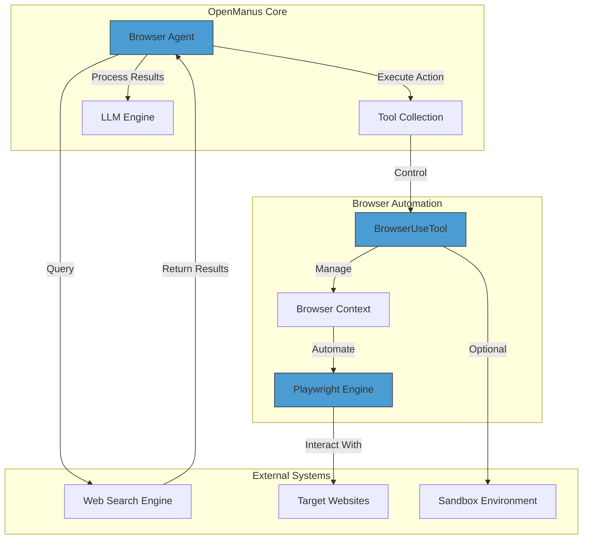
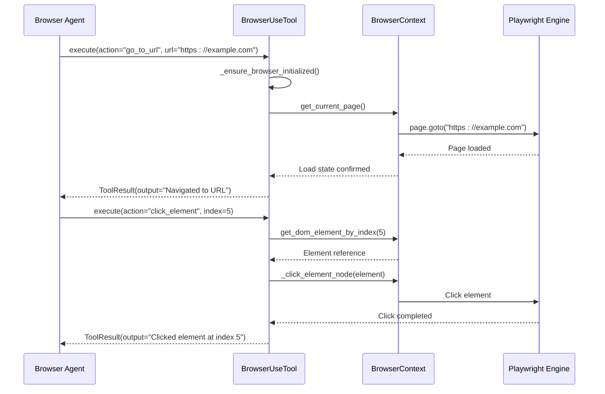
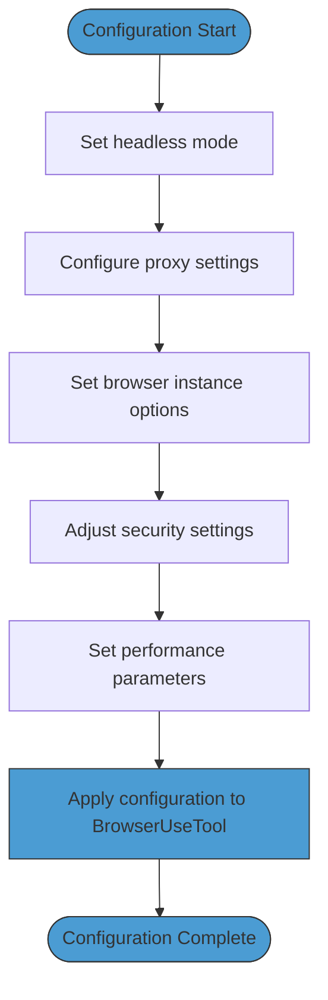

# Web Automation

<cite>
**Referenced Files in This Document**   
- [browser_use_tool.py](file://app/tool/browser_use_tool.py)
- [browser.py](file://app/agent/browser.py)
- [config.py](file://app/config.py)
- [config.example.toml](file://config/config.example.toml)
- [web_search.py](file://app/tool/web_search.py)
- [japan_travel_guide_instructions.txt](file://examples/use_case/japan-travel-plan/japan_travel_guide_instructions.txt)
</cite>

## Table of Contents
1. [Introduction](#introduction)
2. [Architecture Overview](#architecture-overview)
3. [Browser Agent and Tool Integration](#browser-agent-and-tool-integration)
4. [Core Web Automation Capabilities](#core-web-automation-capabilities)
5. [Japan Travel Plan Use Case](#japan-travel-plan-use-case)
6. [Configuration and Execution Settings](#configuration-and-execution-settings)
7. [Content Extraction and Data Processing](#content-extraction-and-data-processing)
8. [Error Handling and Troubleshooting](#error-handling-and-troubleshooting)
9. [Performance Optimization](#performance-optimization)
10. [Conclusion](#conclusion)

## Introduction
OpenManus provides a sophisticated web automation framework through its Browser Agent, which leverages the Playwright-based browser_use_tool to enable intelligent web interaction. This system allows autonomous agents to browse websites, extract information, fill forms, and perform complex navigation tasks. The architecture integrates browser automation with AI decision-making, enabling the agent to research, analyze, and synthesize information from multiple web sources. This documentation details how the system works, its integration points, configuration options, and practical applications, with a focus on real-world use cases like travel planning research.

## Architecture Overview

**Diagram sources**
- [browser.py](file://app/agent/browser.py#L86-L128)
- [browser_use_tool.py](file://app/tool/browser_use_tool.py#L100-L567)

**Section sources**
- [browser.py](file://app/agent/browser.py#L0-L128)
- [browser_use_tool.py](file://app/tool/browser_use_tool.py#L0-L567)

## Browser Agent and Tool Integration

The Browser Agent in OpenManus serves as an intelligent interface between the AI decision engine and web browsers. It utilizes the BrowserUseTool to execute browser automation commands through Playwright, maintaining persistent browser sessions that preserve state across multiple interactions. The agent follows a structured workflow: it first assesses the current browser state, then determines the appropriate action based on its objectives, executes the action through the tool, and processes the results for further decision-making.

The integration between the Browser Agent and browser_use_tool is facilitated through a well-defined tool interface that exposes various browser actions as callable methods. When the agent needs to interact with a website, it calls the appropriate method on the BrowserUseTool, passing the required parameters. The tool then translates these high-level commands into low-level Playwright operations, executing them within the browser context. This abstraction layer allows the agent to focus on strategic decision-making while the tool handles the technical details of browser automation.

**Diagram sources**
- [browser.py](file://app/agent/browser.py#L86-L128)
- [browser_use_tool.py](file://app/tool/browser_use_tool.py#L206-L567)

**Section sources**
- [browser.py](file://app/agent/browser.py#L0-L128)
- [browser_use_tool.py](file://app/tool/browser_use_tool.py#L0-L567)

## Core Web Automation Capabilities

The browser_use_tool provides a comprehensive set of capabilities for web automation, organized into several functional categories. These capabilities enable the Browser Agent to perform complex web interactions that mimic human browsing behavior.

### Navigation and Browsing
The tool supports various navigation actions including going to specific URLs, navigating back in history, refreshing pages, and performing web searches. The `go_to_url` action allows direct navigation to any web address, while `web_search` combines search functionality with automatic navigation to the top result. This enables the agent to discover new information sources dynamically during its research process.

### Element Interaction
For interacting with page elements, the tool provides methods to click elements by index, input text into form fields, select options from dropdowns, and send keyboard commands. Elements are identified by indices that correspond to interactive elements visible in the current browser state, allowing the agent to reference specific UI components without needing to parse complex selectors.

### Scrolling and Viewport Management
The tool includes scrolling capabilities that allow the agent to navigate through long pages. It can scroll up or down by a specified pixel amount, or scroll to specific text content. This is particularly useful for accessing content that is initially outside the viewport or for triggering lazy-loaded content on modern websites.

### Tab Management
Multi-tab browsing is supported through actions that allow opening new tabs, switching between existing tabs, and closing tabs. This enables the agent to maintain multiple research threads simultaneously, such as comparing information across different websites or keeping reference materials open while navigating to new sources.

### Content Extraction
One of the most powerful capabilities is content extraction, where the agent can request specific information from a page based on a goal. The `extract_content` action uses an LLM to analyze the page content and extract relevant information according to the specified goal, returning structured data that can be further processed or stored.

**Section sources**
- [browser_use_tool.py](file://app/tool/browser_use_tool.py#L0-L567)

## Japan Travel Plan Use Case

The Japan travel plan example demonstrates how the Browser Agent can conduct comprehensive research by crawling multiple websites to gather information about hotels, transportation options, and tourist attractions. This use case illustrates the agent's ability to aggregate data from diverse sources and synthesize it into a coherent travel plan.

The research process begins with the agent using the `web_search` action to find relevant information sources about travel in Japan. It queries search engines for topics like "best hotels in Tokyo," "Japan rail pass options," and "top tourist attractions in Kyoto." For each search, the agent navigates to the most relevant result and uses the `extract_content` action to gather specific information based on predefined goals.

For hotel research, the agent visits multiple travel booking sites and extracts data on accommodations, including prices, amenities, and guest reviews. It systematically compares options across different platforms, normalizing the data for consistent comparison. For transportation planning, the agent researches train schedules, pass options, and fare structures, extracting key details about travel times and costs between major destinations.

The agent also researches tourist attractions by visiting official tourism websites and travel blogs, extracting information about opening hours, admission fees, and visitor tips. It can follow links to related content, such as restaurant recommendations near popular attractions, creating a comprehensive network of interconnected information.

Throughout this process, the agent maintains multiple browser tabs to keep track of different research threads, switching between them as needed. It uses scrolling and pagination actions to access all relevant content on each page, ensuring comprehensive data collection. The extracted information is structured and stored for later synthesis into a complete travel itinerary.

**Section sources**
- [japan_travel_guide_instructions.txt](file://examples/use_case/japan-travel-plan/japan_travel_guide_instructions.txt)
- [browser_use_tool.py](file://app/tool/browser_use_tool.py#L0-L567)

## Configuration and Execution Settings

Web automation in OpenManus can be configured through the configuration system, which allows customization of browser behavior and execution parameters. These settings are defined in the configuration files and provide control over various aspects of the automation process.

### Headless Execution
The browser can be configured to run in headless mode, where the browser interface is not displayed. This is controlled by the `headless` parameter in the browser configuration. Headless mode is typically used in production environments or when running automated tasks without user supervision, as it consumes fewer system resources and can run faster. For debugging or development purposes, headless mode can be disabled to allow visual monitoring of the automation process.

### Proxy Configuration
The system supports proxy configuration, allowing the browser to route traffic through specified proxy servers. This is useful for accessing region-restricted content or for anonymizing requests. Proxy settings include the server address, port, and optional authentication credentials. These can be configured in the browser settings section of the configuration file.

### Browser Instance Configuration
The automation system can connect to existing browser instances through WebSocket (WSS) or Chrome DevTools Protocol (CDP) URLs. This allows the agent to control a regular browser session, which can be useful for maintaining login sessions or accessing browser profiles with specific settings and extensions.

### Performance and Security Settings
Additional configuration options include extra Chromium arguments for fine-tuning browser behavior, the ability to disable security features for testing purposes, and the option to specify a custom Chrome instance path. These settings provide advanced control over the browser environment to accommodate specific automation requirements.

**Diagram sources**
- [config.py](file://app/config.py#L68-L94)
- [config.example.toml](file://config/config.example.toml#L0-L105)

**Section sources**
- [config.py](file://app/config.py#L0-L372)
- [config.example.toml](file://config/config.example.toml#L0-L105)

## Content Extraction and Data Processing

The content extraction capabilities in OpenManus represent a sophisticated approach to web data harvesting, combining browser automation with AI-powered information processing. The `extract_content` action is central to this process, enabling the agent to retrieve structured information from web pages based on specific goals.

When the agent requests content extraction, the system first captures the current page content and converts it to Markdown format for easier processing. It then constructs a prompt for the LLM that includes the extraction goal and a portion of the page content, limited by the `max_content_length` configuration parameter. The LLM is instructed to extract relevant information and return it in a structured JSON format according to a predefined schema.

This approach allows for intelligent content extraction that goes beyond simple text scraping. The LLM can understand the context of the information, identify relevant data points, and organize them according to the specified goal. For example, when extracting hotel information, the LLM can identify and structure data such as room types, prices, amenities, and guest ratings, even when this information is presented in different formats across various websites.

The system also supports web search integration, where the `web_search` action not only returns search results but can optionally fetch and extract content from the top results. This creates a seamless research workflow where the agent can discover new information sources and immediately extract relevant data without additional steps.

For handling dynamic content, the system waits for pages to fully load before extracting content, ensuring that JavaScript-generated content is included in the extraction process. The agent can also use scrolling and interaction actions to reveal hidden content before extraction, making it capable of handling modern, interactive websites.

**Section sources**
- [browser_use_tool.py](file://app/tool/browser_use_tool.py#L0-L567)
- [web_search.py](file://app/tool/web_search.py#L0-L418)

## Error Handling and Troubleshooting

The web automation system in OpenManus includes comprehensive error handling mechanisms to ensure reliable operation in the face of common web automation challenges. These mechanisms address issues such as network problems, element not found errors, and unexpected page states.

### Common Issues and Solutions
**CAPTCHAs**: When encountering CAPTCHAs, the system may be unable to proceed automatically. In such cases, the agent can be configured to notify a human operator for intervention or to attempt alternative approaches, such as using different IP addresses through proxy rotation.

**Rate Limiting**: To avoid triggering rate limiting mechanisms, the system includes built-in delays between requests and can be configured with retry logic. The `wait` action allows the agent to introduce pauses between operations, mimicking human browsing patterns and reducing the likelihood of being blocked.

**JavaScript-Heavy Sites**: For sites with complex JavaScript interactions, the system waits for pages to fully load and can execute custom JavaScript when necessary. The `execute_javascript` method allows running arbitrary JavaScript in the page context, enabling interaction with elements that are not directly accessible through standard Playwright methods.

**Session Persistence**: The browser context maintains session state across multiple actions, preserving cookies and local storage. This allows the agent to stay logged into websites and maintain user preferences throughout a research session.

### Error Recovery Strategies
The system implements several error recovery strategies:
- **Retry Logic**: For transient errors like network timeouts, the system can automatically retry failed operations after a delay.
- **Alternative Approaches**: When a specific interaction method fails, the agent can attempt alternative approaches, such as using different selectors or interaction methods.
- **State Verification**: After each action, the system verifies the expected state change, allowing it to detect and respond to unexpected outcomes.
- **Graceful Degradation**: When certain capabilities are unavailable, the system can fall back to simpler methods or notify the user of limitations.

**Section sources**
- [browser_use_tool.py](file://app/tool/browser_use_tool.py#L0-L567)
- [web_search.py](file://app/tool/web_search.py#L0-L418)

## Performance Optimization

To ensure efficient and reliable web automation, several performance optimization techniques can be applied when using the Browser Agent and browser_use_tool.

### Resource Management
Proper resource management is crucial for maintaining system performance during extended automation sessions. The system automatically cleans up browser resources when the tool is destroyed, but it's recommended to explicitly call the `cleanup` method when browser operations are complete. This ensures that browser processes are terminated and system resources are freed.

### Parallel Operations
While the current implementation uses a lock to ensure thread safety during browser operations, careful planning of the automation workflow can minimize bottlenecks. For example, the agent can perform multiple research tasks in separate tabs rather than sequentially visiting different sites, reducing overall execution time.

### Configuration Tuning
Several configuration parameters can be tuned for optimal performance:
- **max_content_length**: Adjusting this parameter controls how much page content is sent to the LLM for processing, balancing information completeness with processing speed and cost.
- **headless mode**: Running in headless mode typically improves performance by reducing graphical rendering overhead.
- **browser_window_size**: Configuring an appropriate window size can affect how content is rendered and loaded, potentially improving extraction accuracy.

### Caching Strategies
Implementing caching strategies can significantly improve performance when researching topics that require visiting the same information sources multiple times. While the current system doesn't include built-in caching, the persistent browser session naturally caches resources like images and scripts, reducing load times for revisited pages.

**Section sources**
- [browser_use_tool.py](file://app/tool/browser_use_tool.py#L0-L567)
- [config.py](file://app/config.py#L0-L372)

## Conclusion
OpenManus provides a powerful web automation framework through its Browser Agent and browser_use_tool, enabling sophisticated web interaction and research capabilities. By combining Playwright-based browser automation with AI decision-making, the system can perform complex tasks like researching travel information across multiple websites, extracting structured data, and synthesizing comprehensive reports. The integration between the agent, sandbox environment, and browser tools creates a robust platform for automated web interactions, with extensive configuration options for different use cases and environments. With proper error handling and performance optimization, this system can reliably automate a wide range of web-based tasks, from simple data extraction to comprehensive research projects.