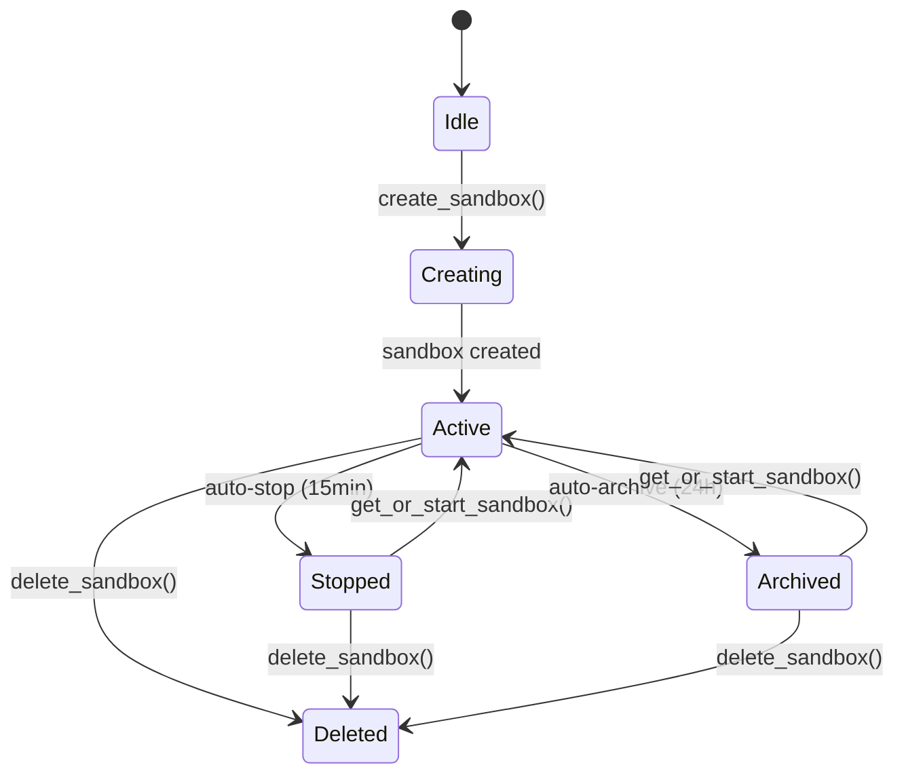
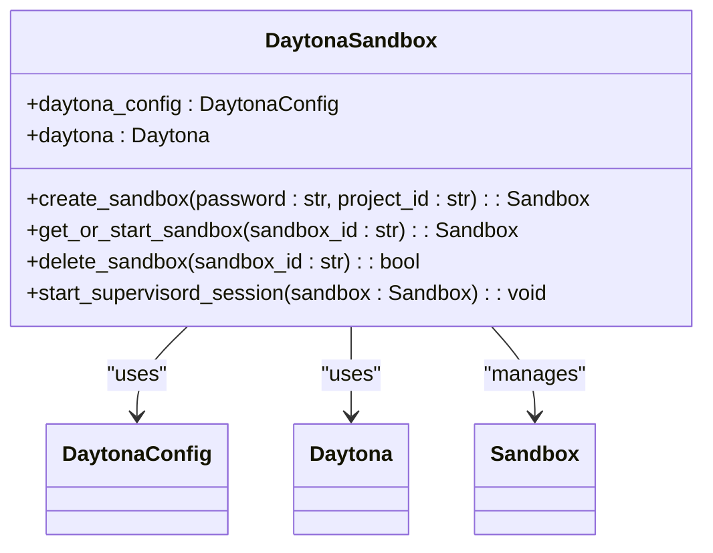
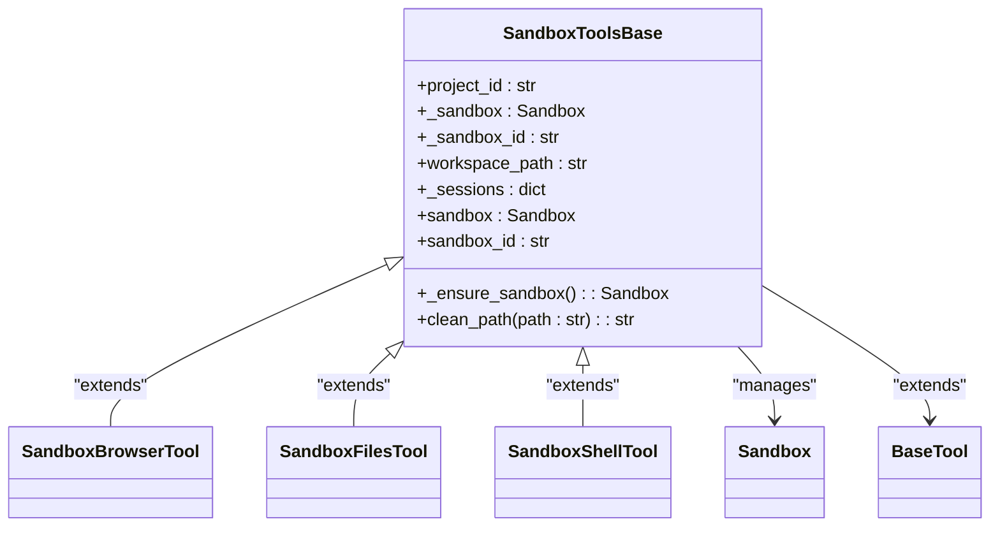
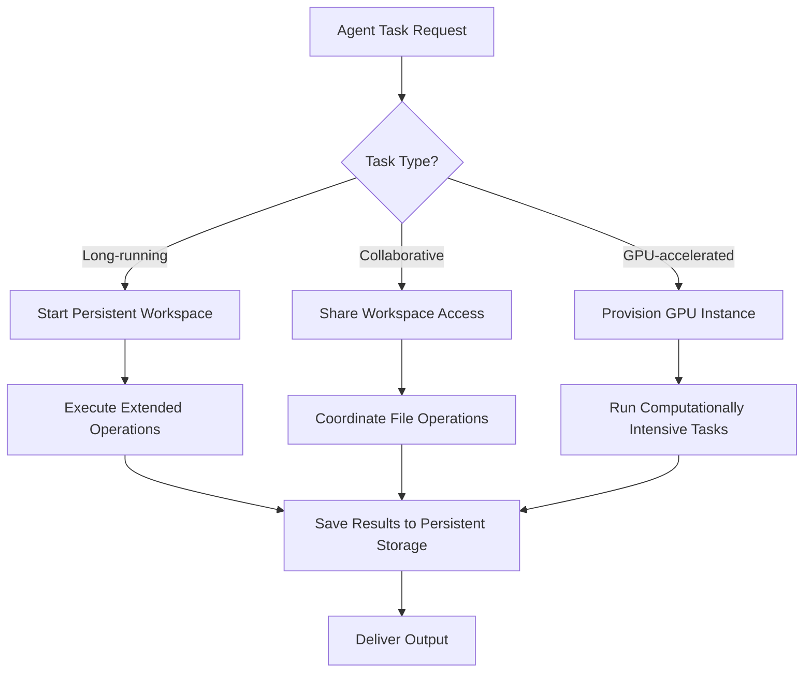
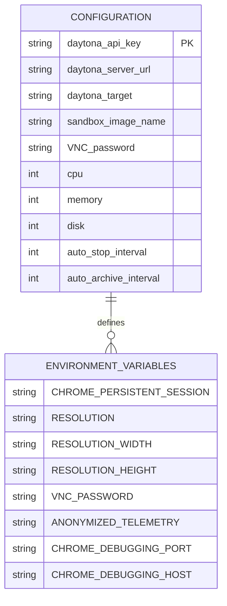

# Daytona Integration

<cite>
**Referenced Files in This Document**   
- [sandbox.py](file://app/daytona/sandbox.py)
- [tool_base.py](file://app/daytona/tool_base.py)
- [config.py](file://app/config.py)
- [config.example-daytona.toml](file://config/config.example-daytona.toml)
- [sb_browser_tool.py](file://app/tool/sandbox/sb_browser_tool.py)
- [sb_files_tool.py](file://app/tool/sandbox/sb_files_tool.py)
- [sb_shell_tool.py](file://app/tool/sandbox/sb_shell_tool.py)
- [README.md](file://app/daytona/README.md)
</cite>

## Table of Contents
1. [Introduction](#introduction)
2. [Daytona Workspace Management](#daytona-workspace-management)
3. [DaytonaSandbox Class Implementation](#daytonasandbox-class-implementation)
4. [Tool Base Implementation](#tool-base-implementation)
5. [Use Cases and Applications](#use-cases-and-applications)
6. [Configuration Parameters](#configuration-parameters)
7. [Network and Cost Considerations](#network-and-cost-considerations)
8. [Conclusion](#conclusion)

## Introduction
The Daytona integration in OpenManus enables cloud-based workspace management for agent execution, providing persistent storage, remote development environment provisioning, and browser visualization capabilities. This integration allows agents to leverage cloud resources for enhanced computational power and persistent state management across sessions. The system utilizes Daytona's API to manage cloud workspaces, with VNC connections enabling browser-based visualization of agent activities. The integration supports various use cases including long-running tasks, collaborative development, and GPU-accelerated workloads, making it suitable for complex agent operations that require substantial computational resources.

## Daytona Workspace Management
Daytona provides cloud-based workspace management that enables persistent storage and remote development environment provisioning for agent execution. The system creates isolated sandboxes that maintain state between sessions, allowing agents to resume work from where they left off. Each workspace is provisioned with specific resources including 2 CPU cores, 4GB of memory, and 5GB of disk space, as defined in the sandbox creation parameters. Workspaces can be in various states including active, stopped, or archived, with the system automatically handling state transitions based on usage patterns.

The workspace management system implements auto-stop and auto-archive intervals to optimize resource utilization and cost. Workspaces automatically stop after 15 minutes of inactivity and archive after 24 hours, preserving state while minimizing running costs. When a workspace is accessed again, it automatically restarts and restores its previous state. This lifecycle management ensures efficient resource usage while maintaining the persistence required for agent operations.

**Diagram sources**
- [sandbox.py](file://app/daytona/sandbox.py#L101-L146)
- [sandbox.py](file://app/daytona/sandbox.py#L44-L76)

**Section sources**
- [sandbox.py](file://app/daytona/sandbox.py#L101-L146)
- [sandbox.py](file://app/daytona/sandbox.py#L44-L76)

## DaytonaSandbox Class Implementation
The DaytonaSandbox class interfaces with the Daytona API to manage cloud workspaces and handle VNC connections for browser visualization. This implementation provides methods for creating, retrieving, starting, and deleting sandboxes, with comprehensive error handling and logging throughout. The class initializes with configuration parameters from the environment, including API key, server URL, and target region, establishing a connection to the Daytona service.

The implementation includes key methods such as `create_sandbox()` which provisions new workspaces with predefined configurations including environment variables for browser settings, VNC password, and display resolution. The `get_or_start_sandbox()` method handles workspace state management, automatically starting stopped or archived workspaces when accessed. The `start_supervisord_session()` function ensures that essential services are running within the sandbox by executing supervisord, which manages background processes in the environment.

**Diagram sources**
- [sandbox.py](file://app/daytona/sandbox.py#L0-L165)

**Section sources**
- [sandbox.py](file://app/daytona/sandbox.py#L0-L165)

## Tool Base Implementation
The tool_base.py implementation provides the foundation for executing commands within Daytona-managed environments through the SandboxToolsBase class. This base class extends BaseTool and implements project-based sandbox access, managing the lifecycle of sandbox instances and providing utilities for path cleaning and session management. The class maintains a reference to the sandbox instance and handles the initialization process, including printing VNC and website URLs when a new sandbox is created.

The implementation includes the `_ensure_sandbox()` method which guarantees a valid sandbox instance is available, creating a new one if necessary or starting an existing stopped instance. The class also manages session state through the `_sessions` dictionary, tracking tmux sessions for command execution. The `clean_path()` method normalizes file paths to be relative to the workspace directory, ensuring consistent file operations across different tools.

**Diagram sources**
- [tool_base.py](file://app/daytona/tool_base.py#L49-L137)
- [sb_browser_tool.py](file://app/tool/sandbox/sb_browser_tool.py#L35-L449)
- [sb_files_tool.py](file://app/tool/sandbox/sb_files_tool.py#L27-L360)
- [sb_shell_tool.py](file://app/tool/sandbox/sb_shell_tool.py#L20-L418)

**Section sources**
- [tool_base.py](file://app/daytona/tool_base.py#L49-L137)

## Use Cases and Applications
The Daytona integration supports several key use cases that leverage cloud workspaces for enhanced agent capabilities. For long-running tasks, the system enables agents to execute extended operations such as data processing pipelines, model training, or web scraping that would be impractical in ephemeral environments. The persistent storage allows these tasks to continue across multiple sessions, with the ability to checkpoint progress and resume from failure points.

For collaborative development, multiple agents can access the same workspace to work on shared projects, with file operations synchronized through the shared filesystem. This enables pair programming scenarios where agents can build upon each other's work, review code changes, and coordinate complex development tasks. The integration also supports GPU-accelerated workloads by providing access to cloud instances with specialized hardware, enabling computationally intensive tasks like deep learning model inference or 3D rendering.

The system demonstrates these capabilities through real-world examples such as creating a travel guide by scraping web content, where the agent uses the sb_browser_use tool to navigate websites, extract information, and save results as HTML files in the workspace. The VNC connection allows monitoring of the agent's browser interactions, while the persistent storage ensures the generated content remains available for subsequent processing or delivery.

**Diagram sources**
- [sb_browser_tool.py](file://app/tool/sandbox/sb_browser_tool.py#L35-L449)
- [sb_files_tool.py](file://app/tool/sandbox/sb_files_tool.py#L27-L360)
- [sb_shell_tool.py](file://app/tool/sandbox/sb_shell_tool.py#L20-L418)

**Section sources**
- [sb_browser_tool.py](file://app/tool/sandbox/sb_browser_tool.py#L35-L449)
- [sb_files_tool.py](file://app/tool/sandbox/sb_files_tool.py#L27-L360)
- [sb_shell_tool.py](file://app/tool/sandbox/sb_shell_tool.py#L20-L418)

## Configuration Parameters
The Daytona integration is configured through parameters defined in the config.example-daytona.toml file, which specifies the connection details and workspace settings. Key configuration parameters include the Daytona API key, server URL, and target region (US or EU), which authenticate and route requests to the appropriate Daytona infrastructure. The sandbox_image_name parameter specifies the Docker image used for workspaces, with the default whitezxj/sandbox:0.1.0 image preconfigured with necessary tools and services.

Additional configuration options include the VNC_password for accessing the workspace via VNC, which defaults to "123456" if not specified. The sandbox creation parameters define the computational resources allocated to each workspace, including CPU (2 cores), memory (4GB), and disk (5GB). The auto_stop_interval (15 minutes) and auto_archive_interval (24 hours) parameters control the workspace lifecycle, automatically stopping and archiving inactive workspaces to optimize costs.

The environment variables configured during sandbox creation include settings for browser resolution (1024x768x24), Chrome persistent sessions, and VNC access, ensuring a consistent environment for agent operations. These parameters can be customized in the configuration file to meet specific requirements for different use cases or performance needs.

**Diagram sources**
- [config.example-daytona.toml](file://config/config.example-daytona.toml#L97-L113)
- [sandbox.py](file://app/daytona/sandbox.py#L101-L146)

**Section sources**
- [config.example-daytona.toml](file://config/config.example-daytona.toml#L97-L113)
- [sandbox.py](file://app/daytona/sandbox.py#L101-L146)

## Network and Cost Considerations
When using cloud workspaces, network latency and cost management are critical considerations that impact performance and operational expenses. The system addresses network latency through the use of regional endpoints (US or EU) to minimize round-trip times, and by optimizing the communication between the agent and the cloud workspace. For browser-based interactions, the VNC connection provides real-time visualization but may introduce latency depending on the user's internet connection and the distance to the Daytona server.

Cost management is implemented through automated workspace lifecycle policies, including auto-stop after 15 minutes of inactivity and auto-archive after 24 hours. This ensures that resources are not consumed unnecessarily when workspaces are not actively being used. The system also provides failover strategies by maintaining persistent storage even when workspaces are stopped or archived, allowing agents to resume operations without data loss.

Resource allocation is optimized by provisioning workspaces with appropriate CPU, memory, and disk specifications based on the expected workload. For GPU-accelerated tasks, the system can be configured to use instances with specialized hardware, though this increases costs. Monitoring and logging features help track resource usage and identify optimization opportunities, while the ability to delete workspaces explicitly allows for immediate cost reduction when work is completed.

**Section sources**
- [sandbox.py](file://app/daytona/sandbox.py#L101-L146)
- [config.example-daytona.toml](file://config/config.example-daytona.toml#L97-L113)

## Conclusion
The Daytona integration in OpenManus provides a robust framework for cloud-based workspace management, enabling agents to leverage persistent storage and enhanced computational resources for complex tasks. By integrating with the Daytona API, the system offers reliable workspace provisioning, state management, and browser visualization through VNC connections. The implementation supports diverse use cases including long-running operations, collaborative development, and GPU-accelerated workloads, making it suitable for advanced agent applications.

The architecture balances performance, cost, and reliability through automated lifecycle management, configurable resource allocation, and comprehensive error handling. The tool_base.py implementation provides a solid foundation for extending functionality, while the configuration system allows for customization to meet specific requirements. As agent workloads continue to grow in complexity, the Daytona integration offers a scalable solution for executing demanding tasks in secure, isolated cloud environments.