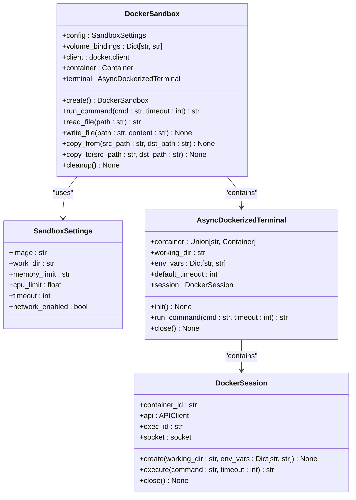
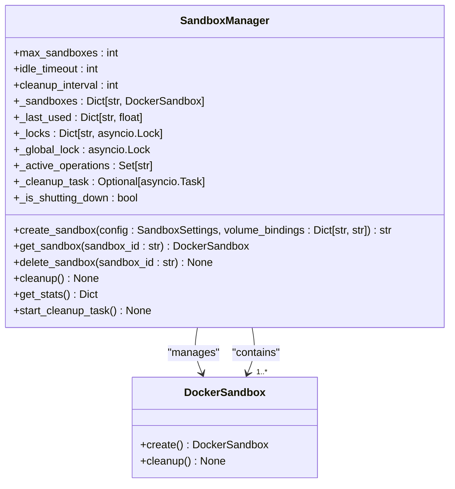
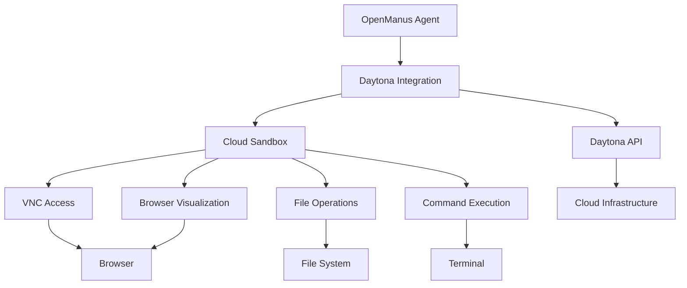
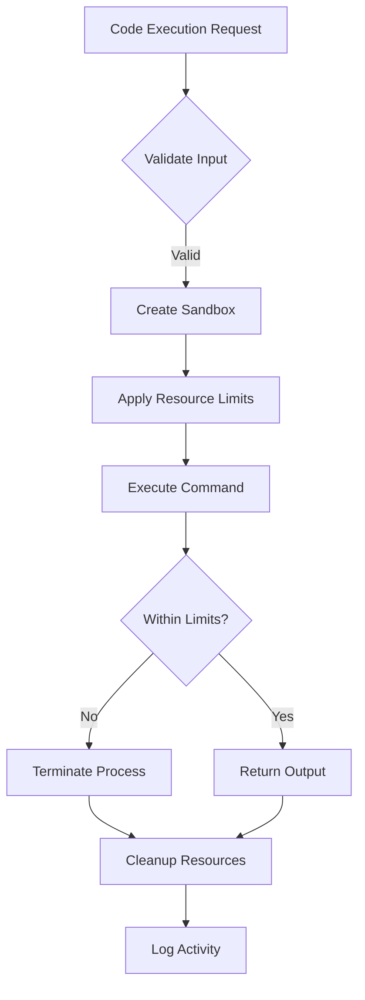
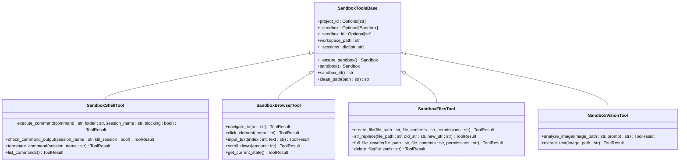
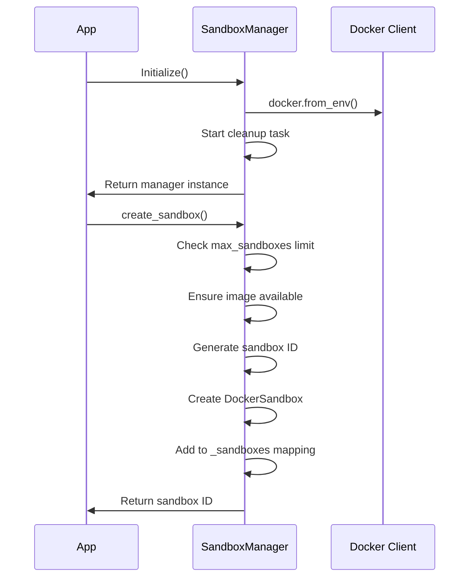
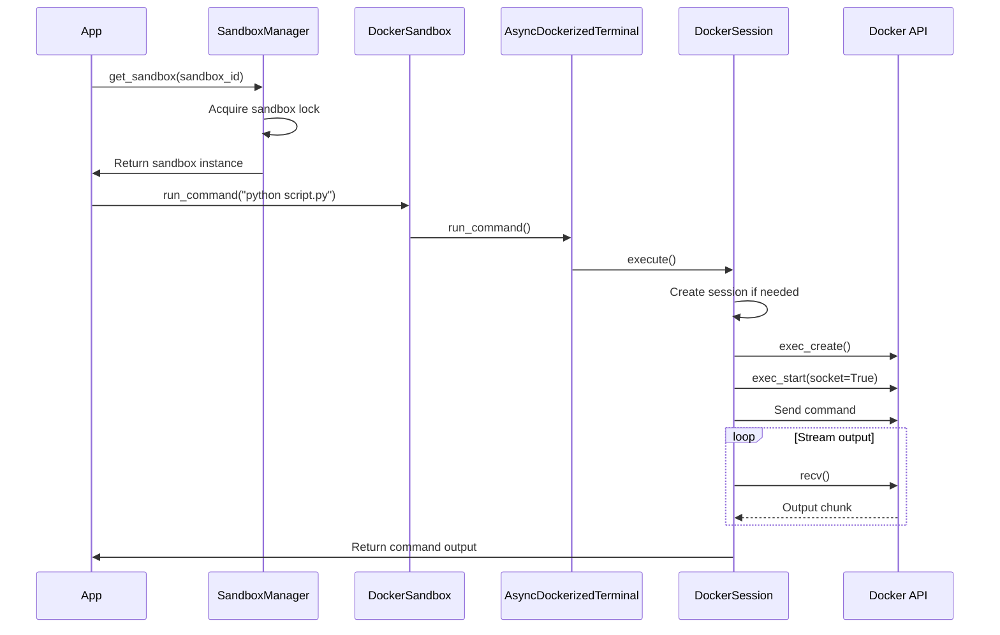
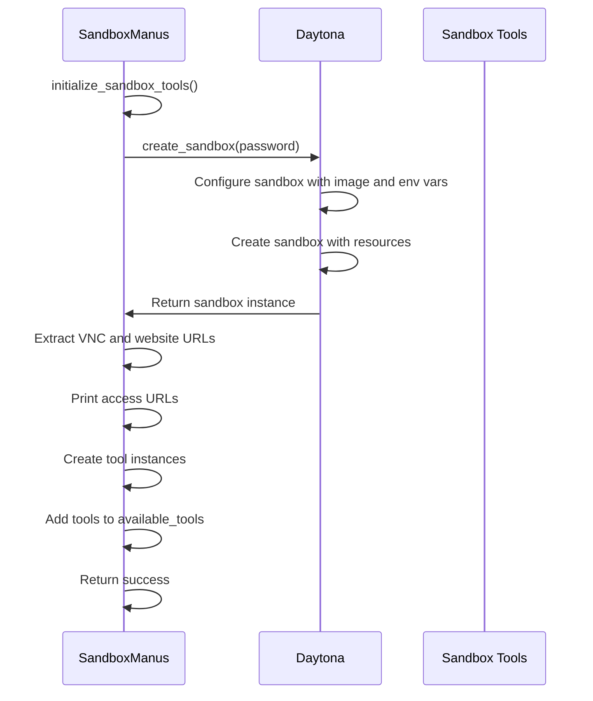

# Execution Environment

<cite>
**Referenced Files in This Document**   
- [DockerSandbox](file://app/sandbox/core/sandbox.py)
- [SandboxManager](file://app/sandbox/core/manager.py)
- [AsyncDockerizedTerminal](file://app/sandbox/core/terminal.py)
- [create_sandbox](file://app/daytona/sandbox.py)
- [SandboxShellTool](file://app/tool/sandbox/sb_shell_tool.py)
- [SandboxBrowserTool](file://app/tool/sandbox/sb_browser_tool.py)
- [SandboxFilesTool](file://app/tool/sandbox/sb_files_tool.py)
- [SandboxVisionTool](file://app/tool/sandbox/sb_vision_tool.py)
- [SandboxToolsBase](file://app/daytona/tool_base.py)
- [config.example-daytona.toml](file://config/config.example-daytona.toml)
- [sandbox_main.py](file://sandbox_main.py)
</cite>

## Table of Contents
1. [Introduction](#introduction)
2. [Sandbox Architecture](#sandbox-architecture)
3. [Sandbox Manager](#sandbox-manager)
4. [Terminal Interface](#terminal-interface)
5. [Daytona Integration](#daytona-integration)
6. [Security Measures](#security-measures)
7. [Configuration Options](#configuration-options)
8. [Tool Integration](#tool-integration)
9. [Performance and Monitoring](#performance-and-monitoring)
10. [Examples](#examples)

## Introduction

The OpenManus execution environment provides a secure, isolated platform for running untrusted code through containerized sandboxing. Built on Docker technology, this environment enables safe code execution with comprehensive resource management, isolation, and monitoring capabilities. The system integrates with Daytona for cloud-based sandboxing, offering browser visualization through VNC access and robust tool integration for various development tasks. This documentation details the architecture, components, security measures, and configuration options that make up this execution environment.

**Section sources**
- [DockerSandbox](file://app/sandbox/core/sandbox.py)
- [SandboxManager](file://app/sandbox/core/manager.py)

## Sandbox Architecture

The sandbox system in OpenManus is built around Docker containers, providing isolated execution environments for running untrusted code safely. The core component is the `DockerSandbox` class, which manages individual container instances with strict resource constraints and security controls.



**Diagram sources**
- [DockerSandbox](file://app/sandbox/core/sandbox.py)
- [SandboxSettings](file://app/config.py)
- [AsyncDockerizedTerminal](file://app/sandbox/core/terminal.py)
- [DockerSession](file://app/sandbox/core/terminal.py)

The `DockerSandbox` class encapsulates a Docker container with specific configuration parameters including image, working directory, memory and CPU limits, execution timeout, and network access permissions. When a sandbox is created, it initializes a container with the specified image and configures resource limits through Docker's host configuration. The container runs with a persistent process (`tail -f /dev/null`) to keep it alive for command execution.

Each sandbox instance provides file operations through methods like `read_file`, `write_file`, `copy_from`, and `copy_to`, which handle file transfers between the host and container using Docker's archive functionality. The sandbox ensures path safety by resolving paths relative to the configured working directory and preventing directory traversal attacks.

**Section sources**
- [DockerSandbox](file://app/sandbox/core/sandbox.py)
- [SandboxSettings](file://app/config.py)

## Sandbox Manager

The `SandboxManager` class is responsible for managing multiple sandbox instances, handling their lifecycle, resource allocation, and automatic cleanup. It provides a centralized control point for creating, retrieving, and destroying sandboxes while enforcing system-wide limits.



**Diagram sources**
- [SandboxManager](file://app/sandbox/core/manager.py)
- [DockerSandbox](file://app/sandbox/core/sandbox.py)

The manager maintains several key attributes:
- `max_sandboxes`: Maximum number of concurrent sandboxes allowed
- `idle_timeout`: Time in seconds after which idle sandboxes are automatically cleaned up
- `cleanup_interval`: Frequency of cleanup checks in seconds
- `_sandboxes`: Dictionary mapping sandbox IDs to active instances
- `_last_used`: Tracking of last access time for each sandbox
- `_locks`: Per-sandbox locks for concurrency control
- `_global_lock`: Global lock for critical operations

When creating a new sandbox, the manager first checks if the maximum count has been reached. It then ensures the required Docker image is available, either by pulling it from a registry or using a local copy. The manager assigns a unique ID to each sandbox and maintains references to the instances in its internal mappings.

The manager implements automatic cleanup of idle sandboxes through a background task that periodically checks for sandboxes exceeding the idle timeout. It also provides graceful shutdown capabilities through the `cleanup()` method, which stops all running sandboxes and releases resources. The `get_stats()` method exposes operational metrics for monitoring purposes.

**Section sources**
- [SandboxManager](file://app/sandbox/core/manager.py)

## Terminal Interface

The terminal interface in OpenManus enables command execution within sandboxed environments through the `AsyncDockerizedTerminal` and `DockerSession` classes. This interface provides interactive shell access to containers with timeout control and proper resource cleanup.

```mermaid
sequenceDiagram
participant Client
participant Terminal as AsyncDockerizedTerminal
participant Session as DockerSession
participant Docker as Docker API
Client->>Terminal : run_command("ls -la")
Terminal->>Terminal : init() if needed
Terminal->>Session : execute("ls -la")
Session->>Session : create() if needed
Session->>Docker : exec_create()
Docker-->>Session : exec_id
Session->>Docker : exec_start(socket=True)
Docker-->>Session : socket connection
Session->>Docker : send command
loop Read output
Session->>Docker : recv()
Docker-->>Session : output chunk
alt Output contains prompt
Session->>Client : Return cleaned output
break
end
end
Session->>Docker : close socket
```

**Diagram sources**
- [AsyncDockerizedTerminal](file://app/sandbox/core/terminal.py)
- [DockerSession](file://app/sandbox/core/terminal.py)

The `AsyncDockerizedTerminal` class serves as the main interface for command execution, initializing a `DockerSession` that manages the actual Docker exec operations. When a command is executed, the system creates an interactive bash session within the container with a simplified prompt and disabled command history.

The terminal implementation includes several security measures:
- Command sanitization to prevent shell injection attacks
- Detection of dangerous commands like `rm -rf /` or `mkfs`
- Timeout enforcement for long-running commands
- Proper cleanup of exec instances and sockets

Commands are executed through Docker's exec API, which creates a new process in the running container. The output is streamed back through a socket connection and processed to remove prompt markers and control characters. The implementation handles both blocking and non-blocking command execution with appropriate timeout handling.

**Section sources**
- [AsyncDockerizedTerminal](file://app/sandbox/core/terminal.py)
- [DockerSession](file://app/sandbox/core/terminal.py)

## Daytona Integration

OpenManus integrates with Daytona to provide cloud-based sandboxing capabilities, enabling persistent workspaces with browser visualization and advanced tooling. The integration is facilitated through the `create_sandbox` function and `SandboxToolsBase` class.



**Diagram sources**
- [create_sandbox](file://app/daytona/sandbox.py)
- [SandboxToolsBase](file://app/daytona/tool_base.py)

The Daytona integration provides several key capabilities:
- **Workspace Management**: Creation and management of persistent cloud workspaces with labeled identifiers
- **Session Handling**: Management of interactive sessions within sandboxes using tmux for process persistence
- **VNC Access**: Browser-based visualization of sandbox environments through VNC protocol
- **Service Orchestration**: Automatic startup of supervisord to manage background services

When a sandbox is created through Daytona, it is configured with specific environment variables for browser automation, including VNC password, screen resolution, and Chrome debugging settings. The sandbox automatically starts supervisord to manage background processes, ensuring services remain available throughout the session.

The integration also provides preview links for accessing the sandbox through VNC (port 6080) and web applications (port 8080), which are displayed to users for direct access. These links enable real-time monitoring of browser automation tasks and web application development.

**Section sources**
- [create_sandbox](file://app/daytona/sandbox.py)
- [SandboxToolsBase](file://app/daytona/tool_base.py)

## Security Measures

The OpenManus execution environment implements multiple layers of security to ensure safe code execution and prevent system compromise. These measures include code isolation, resource limits, network restrictions, and input validation.

### Code Isolation
Each sandbox runs in a separate Docker container, providing strong process and filesystem isolation. The containers are configured with:
- Restricted working directories to prevent unauthorized file access
- Path resolution that prevents directory traversal attacks
- Volume bindings that limit host filesystem exposure

### Resource Limits
The system enforces strict resource constraints to prevent denial-of-service attacks:
- Memory limits configured through Docker's `mem_limit` parameter
- CPU quotas that limit processing time allocation
- Execution timeouts that terminate long-running commands
- Maximum sandbox count that prevents resource exhaustion



**Diagram sources**
- [DockerSandbox](file://app/sandbox/core/sandbox.py)
- [SandboxSettings](file://app/config.py)

### Network Restrictions
By default, sandboxes are created with network isolation (`network_mode="none"`), preventing external network access. When network access is required, it can be explicitly enabled through configuration, but still operates within Docker's network sandboxing.

### Input Validation
The system implements multiple input validation mechanisms:
- Command sanitization in the terminal interface to prevent shell injection
- Path validation to prevent directory traversal
- Detection of dangerous commands like system modification operations
- Environment variable filtering

These security measures work together to create a robust execution environment that can safely handle untrusted code while maintaining system stability and security.

**Section sources**
- [DockerSandbox](file://app/sandbox/core/sandbox.py)
- [AsyncDockerizedTerminal](file://app/sandbox/core/terminal.py)
- [SandboxSettings](file://app/config.py)

## Configuration Options

The sandbox environment in OpenManus offers extensive configuration options for customizing sandbox images, entrypoints, and resource constraints. These configurations can be set through environment variables or configuration files.

### Sandbox Configuration
The primary configuration is defined in the `SandboxSettings` class, which includes the following parameters:

| Configuration Option | Default Value | Description |
|----------------------|-------------|-------------|
| image | python:3.12-slim | Docker image to use for the sandbox |
| work_dir | /workspace | Working directory inside the container |
| memory_limit | 1g | Maximum memory allocation for the container |
| cpu_limit | 2.0 | CPU quota as a fraction of total CPU time |
| timeout | 300 | Command execution timeout in seconds |
| network_enabled | true | Whether to enable network access |

These settings can be customized in the configuration file (config.toml) under the `[sandbox]` section. For Daytona integration, additional configuration options are available:

| Daytona Configuration | Default Value | Description |
|----------------------|-------------|-------------|
| sandbox_image_name | whitezxj/sandbox:0.1.0 | Cloud sandbox image |
| sandbox_entrypoint | /usr/bin/supervisord -n -c /etc/supervisor/conf.d/supervisord.conf | Command to start sandbox services |
| VNC_password | 123456 | Password for VNC access to the sandbox |
| daytona_api_key | | API key for Daytona service |
| daytona_server_url | https://app.daytona.io/api | Daytona API endpoint |
| daytona_target | us | Geographic region for sandbox deployment |

### Runtime Configuration
Configuration can also be applied at runtime through the `create_sandbox` function parameters:
- `password`: VNC password for browser visualization
- `project_id`: Label for the sandbox instance
- `resources`: CPU, memory, and disk allocation
- `auto_stop_interval`: Time before automatic sandbox stop
- `auto_archive_interval`: Time before automatic sandbox archiving

These configuration options provide flexibility in tailoring the execution environment to specific use cases, from lightweight code evaluation to complex development workflows with persistent state.

**Section sources**
- [config.example-daytona.toml](file://config/config.example-daytona.toml)
- [SandboxSettings](file://app/config.py)
- [create_sandbox](file://app/daytona/sandbox.py)

## Tool Integration

OpenManus provides a comprehensive set of tools that integrate with the sandbox environment, enabling various development and automation tasks. These tools are implemented as specialized classes that extend the `SandboxToolsBase` class.



**Diagram sources**
- [SandboxToolsBase](file://app/daytona/tool_base.py)
- [SandboxShellTool](file://app/tool/sandbox/sb_shell_tool.py)
- [SandboxBrowserTool](file://app/tool/sandbox/sb_browser_tool.py)
- [SandboxFilesTool](file://app/tool/sandbox/sb_files_tool.py)
- [SandboxVisionTool](file://app/tool/sandbox/sb_vision_tool.py)

### Shell Tool
The `SandboxShellTool` provides command execution capabilities within the sandbox, using tmux sessions to maintain state between commands. It supports:
- Executing shell commands in specified directories
- Non-blocking execution for long-running processes
- Checking output of running commands
- Terminating specific command sessions
- Listing active command sessions

### Browser Tool
The `SandboxBrowserTool` enables browser automation within the sandbox environment, allowing:
- Navigating to URLs
- Clicking elements by index
- Inputting text into form fields
- Scrolling through pages
- Managing browser tabs
- Extracting content from web pages

### Files Tool
The `SandboxFilesTool` manages file operations in the sandbox workspace:
- Creating new files with specified content
- Replacing text within existing files
- Completely rewriting file contents
- Deleting files
- Reading file contents

### Vision Tool
The `SandboxVisionTool` provides image analysis capabilities:
- Analyzing images with AI models
- Extracting text from images
- Processing visual content

These tools are initialized and managed by the `SandboxManus` agent, which coordinates their use in completing various tasks. The tools automatically handle sandbox lifecycle management, ensuring the sandbox is available and properly configured before executing operations.

**Section sources**
- [SandboxShellTool](file://app/tool/sandbox/sb_shell_tool.py)
- [SandboxBrowserTool](file://app/tool/sandbox/sb_browser_tool.py)
- [SandboxFilesTool](file://app/tool/sandbox/sb_files_tool.py)
- [SandboxVisionTool](file://app/tool/sandbox/sb_vision_tool.py)
- [SandboxToolsBase](file://app/daytona/tool_base.py)

## Performance and Monitoring

The OpenManus execution environment includes comprehensive performance considerations, debugging techniques, and monitoring approaches to ensure efficient and reliable sandboxed operations.

### Performance Considerations
The system is designed with several performance optimizations:
- **Resource Efficiency**: Sandboxes are created with minimal base images and only necessary dependencies
- **Connection Pooling**: The `SandboxManager` maintains references to active sandboxes to avoid repeated creation overhead
- **Asynchronous Operations**: All sandbox operations use async/await patterns to prevent blocking the main thread
- **Batched Cleanup**: Multiple sandboxes are cleaned up concurrently during shutdown

### Monitoring Approaches
The system provides several monitoring capabilities:
- **Statistics Collection**: The `SandboxManager.get_stats()` method exposes key metrics including total sandboxes, active operations, and configuration limits
- **Logging**: Comprehensive logging at various levels (info, warning, error) for tracking sandbox lifecycle events
- **Resource Tracking**: Monitoring of sandbox usage through last-used timestamps and active operation tracking

### Debugging Techniques
Several debugging approaches are available:
- **VNC Visualization**: Real-time browser access to cloud sandboxes for visual debugging
- **Command Output**: Detailed output from shell commands for troubleshooting
- **Error Handling**: Structured exception handling with specific error types like `SandboxTimeoutError` and `SandboxResourceError`
- **Cleanup Diagnostics**: Warning messages during cleanup operations to identify potential issues

The system also implements automatic recovery mechanisms:
- **Idle Cleanup**: Sandboxes that remain idle beyond the configured timeout are automatically terminated
- **Graceful Shutdown**: The manager ensures proper cleanup of all resources during shutdown
- **Error Recovery**: Failed operations trigger cleanup of partially created resources to prevent leaks

These performance and monitoring features ensure that the execution environment remains stable and responsive even under heavy load or when handling complex tasks.

**Section sources**
- [SandboxManager](file://app/sandbox/core/manager.py)
- [DockerSandbox](file://app/sandbox/core/sandbox.py)
- [SandboxToolsBase](file://app/daytona/tool_base.py)

## Examples

The following examples demonstrate how sandboxed execution is initiated and managed in OpenManus.

### Creating a Sandbox Manager


**Diagram sources**
- [SandboxManager](file://app/sandbox/core/manager.py)

### Executing Commands in a Sandbox


**Diagram sources**
- [DockerSandbox](file://app/sandbox/core/sandbox.py)
- [AsyncDockerizedTerminal](file://app/sandbox/core/terminal.py)

### Initializing Sandbox Tools


**Diagram sources**
- [SandboxManus](file://app/agent/sandbox_agent.py)
- [create_sandbox](file://app/daytona/sandbox.py)

These examples illustrate the typical workflow for using the sandbox environment, from initialization to command execution and tool integration. The system's design ensures that sandboxes are properly managed throughout their lifecycle, with appropriate resource allocation and cleanup.

**Section sources**
- [SandboxManager](file://app/sandbox/core/manager.py)
- [DockerSandbox](file://app/sandbox/core/sandbox.py)
- [SandboxManus](file://app/agent/sandbox_agent.py)
- [create_sandbox](file://app/daytona/sandbox.py)