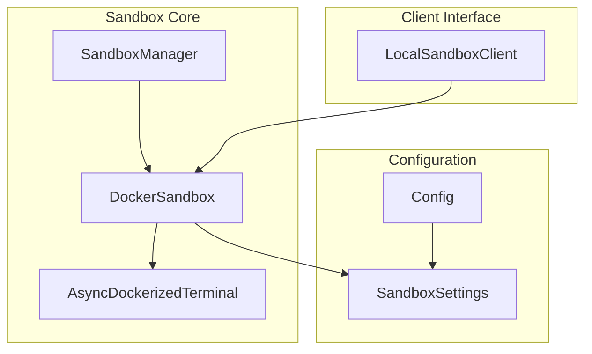
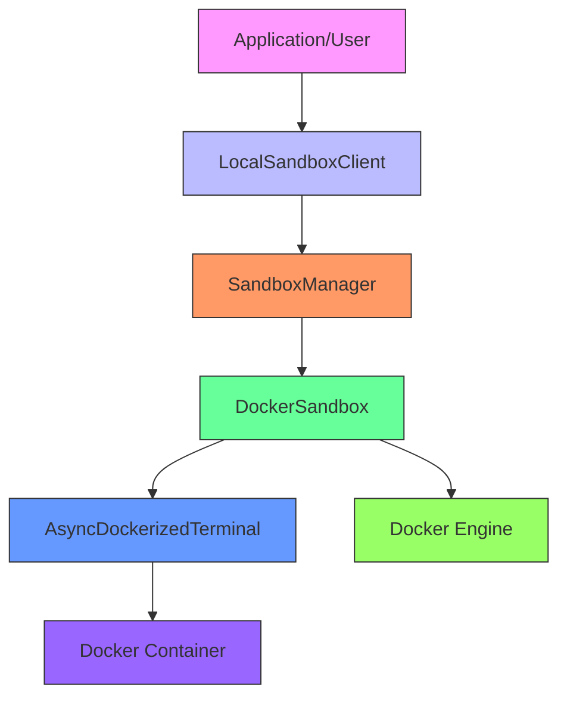
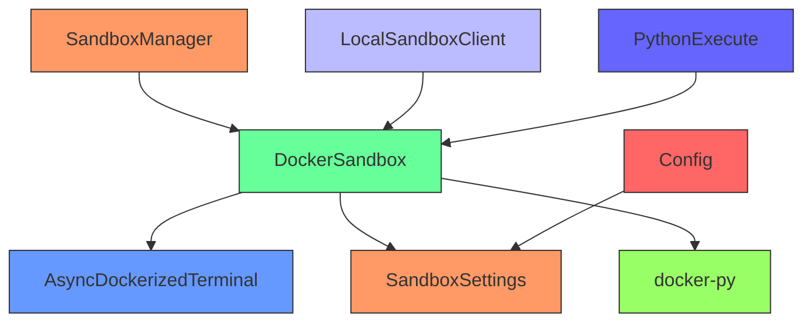

# Sandbox System

<cite>
**Referenced Files in This Document**   
- [DockerSandbox](file://app/sandbox/core/sandbox.py)
- [SandboxManager](file://app/sandbox/core/manager.py)
- [AsyncDockerizedTerminal](file://app/sandbox/core/terminal.py)
- [SandboxSettings](file://app/config.py)
- [LocalSandboxClient](file://app/sandbox/client.py)
</cite>

## Table of Contents
1. [Introduction](#introduction)
2. [Project Structure](#project-structure)
3. [Core Components](#core-components)
4. [Architecture Overview](#architecture-overview)
5. [Detailed Component Analysis](#detailed-component-analysis)
6. [Dependency Analysis](#dependency-analysis)
7. [Performance Considerations](#performance-considerations)
8. [Troubleshooting Guide](#troubleshooting-guide)
9. [Conclusion](#conclusion)

## Introduction
The Sandbox System in OpenManus provides a secure, isolated environment for executing code through Docker containerization. This system enables safe execution of potentially untrusted code by leveraging container isolation, resource constraints, and network restrictions. The architecture is designed to support concurrent execution environments while maintaining strict security boundaries and efficient resource management.

## Project Structure
The sandbox implementation is organized within the `app/sandbox` directory with a clear separation of concerns:
- `core/`: Contains the core sandbox implementation including Docker integration, terminal interface, and lifecycle management
- `client.py`: Provides a client interface for interacting with sandbox environments
- `exceptions.py`: Defines custom exception types for sandbox operations

The system integrates with configuration management through `app/config.py` which defines the `SandboxSettings` model used to configure sandbox behavior.



**Diagram sources**
- [app/sandbox/core/sandbox.py](file://app/sandbox/core/sandbox.py)
- [app/sandbox/core/manager.py](file://app/sandbox/core/manager.py)
- [app/sandbox/core/terminal.py](file://app/sandbox/core/terminal.py)
- [app/config.py](file://app/config.py)
- [app/sandbox/client.py](file://app/sandbox/client.py)

**Section sources**
- [app/sandbox/core/sandbox.py](file://app/sandbox/core/sandbox.py)
- [app/sandbox/core/manager.py](file://app/sandbox/core/manager.py)
- [app/sandbox/client.py](file://app/sandbox/client.py)

## Core Components
The Sandbox System consists of three primary components that work together to provide secure code execution:
1. **DockerSandbox**: Manages individual container lifecycle and provides file and command execution operations
2. **SandboxManager**: Orchestrates multiple sandbox instances with resource allocation and automatic cleanup
3. **AsyncDockerizedTerminal**: Handles interactive shell command execution within containers

These components work in concert to provide a robust execution environment that isolates code execution while maintaining performance and security.

**Section sources**
- [app/sandbox/core/sandbox.py](file://app/sandbox/core/sandbox.py)
- [app/sandbox/core/manager.py](file://app/sandbox/core/manager.py)
- [app/sandbox/core/terminal.py](file://app/sandbox/core/terminal.py)

## Architecture Overview
The Sandbox System follows a layered architecture where each component has a specific responsibility:



The architecture enables secure code execution by:
- Isolating each execution environment in a separate Docker container
- Enforcing resource limits on CPU and memory usage
- Providing network isolation when required
- Implementing automatic cleanup of idle sandboxes
- Managing concurrent access through async locks

**Diagram sources**
- [app/sandbox/client.py](file://app/sandbox/client.py)
- [app/sandbox/core/manager.py](file://app/sandbox/core/manager.py)
- [app/sandbox/core/sandbox.py](file://app/sandbox/core/sandbox.py)
- [app/sandbox/core/terminal.py](file://app/sandbox/core/terminal.py)

## Detailed Component Analysis

### DockerSandbox Analysis
The `DockerSandbox` class is responsible for managing the lifecycle of individual Docker containers used for code execution.

```mermaid
classDiagram
class DockerSandbox {
+config : SandboxSettings
+volume_bindings : Dict[str, str]
+client : docker.DockerClient
+container : Container
+terminal : AsyncDockerizedTerminal
+__init__(config : Optional[SandboxSettings], volume_bindings : Optional[Dict[str, str]])
+create() DockerSandbox
+run_command(cmd : str, timeout : Optional[int]) str
+read_file(path : str) str
+write_file(path : str, content : str) None
+copy_from(src_path : str, dst_path : str) None
+copy_to(src_path : str, dst_path : str) None
+cleanup() None
}
DockerSandbox --> SandboxSettings : "uses"
DockerSandbox --> AsyncDockerizedTerminal : "uses"
DockerSandbox --> "docker.Client" : "uses"
```

**Diagram sources**
- [app/sandbox/core/sandbox.py](file://app/sandbox/core/sandbox.py#L17-L461)
- [app/config.py](file://app/config.py#L93-L104)

**Section sources**
- [app/sandbox/core/sandbox.py](file://app/sandbox/core/sandbox.py#L17-L461)

#### Container Creation and Configuration
The `create()` method initializes a Docker container with specific security and resource constraints:
- Memory limit configured via `mem_limit`
- CPU quota based on `cpu_limit` parameter
- Network mode set to "none" when `network_enabled` is false
- Working directory set to `/workspace` by default
- Volume bindings for host-container file sharing

The container runs with a persistent process (`tail -f /dev/null`) to keep it alive while allowing command execution through the terminal interface.

#### File Operations
The sandbox provides comprehensive file operations:
- `write_file()`: Writes content to container files using tar archive uploads
- `read_file()`: Reads file content through Docker's get_archive API
- `copy_from()`: Copies files from container to host system
- `copy_to()`: Copies files from host system to container

All file operations include path validation to prevent directory traversal attacks through the `_safe_resolve_path()` method.

### SandboxManager Analysis
The `SandboxManager` class orchestrates multiple sandbox instances and manages resource allocation.

```mermaid
classDiagram
class SandboxManager {
+max_sandboxes : int
+idle_timeout : int
+cleanup_interval : int
+_sandboxes : Dict[str, DockerSandbox]
+_last_used : Dict[str, float]
+_locks : Dict[str, asyncio.Lock]
+_global_lock : asyncio.Lock
+_active_operations : Set[str]
+__init__(max_sandboxes : int, idle_timeout : int, cleanup_interval : int)
+create_sandbox(config : Optional[SandboxSettings], volume_bindings : Optional[Dict[str, str]]) str
+get_sandbox(sandbox_id : str) DockerSandbox
+delete_sandbox(sandbox_id : str) None
+cleanup() None
+get_stats() Dict
}
SandboxManager --> DockerSandbox : "manages"
SandboxManager --> "asyncio.Lock" : "uses"
```

**Diagram sources**
- [app/sandbox/core/manager.py](file://app/sandbox/core/manager.py#L13-L312)

**Section sources**
- [app/sandbox/core/manager.py](file://app/sandbox/core/manager.py#L13-L312)

#### Resource Management
The manager enforces resource limits through:
- `max_sandboxes`: Maximum number of concurrent sandboxes
- Automatic cleanup of idle sandboxes after `idle_timeout` seconds
- Concurrency control using asyncio locks per sandbox
- Global lock for critical operations

#### Lifecycle Orchestration
The manager handles sandbox lifecycle through:
- `create_sandbox()`: Creates new sandbox instances with automatic image pulling
- `get_sandbox()`: Retrieves existing sandbox with concurrency control
- `delete_sandbox()`: Removes sandbox instances and cleans up resources
- Automatic cleanup task that runs at `cleanup_interval` intervals

### Terminal Interface Analysis
The `AsyncDockerizedTerminal` provides interactive command execution within containers.

```mermaid
classDiagram
class AsyncDockerizedTerminal {
+client : docker.DockerClient
+container : Container
+working_dir : str
+env_vars : Dict[str, str]
+default_timeout : int
+session : DockerSession
+__init__(container : Union[str, Container], working_dir : str, env_vars : Optional[Dict[str, str]], default_timeout : int)
+init() None
+run_command(cmd : str, timeout : Optional[int]) str
+close() None
}
class DockerSession {
+api : APIClient
+container_id : str
+exec_id : str
+socket : socket
+create(working_dir : str, env_vars : Dict[str, str]) None
+close() None
+execute(command : str, timeout : Optional[int]) str
}
AsyncDockerizedTerminal --> DockerSession : "uses"
AsyncDockerizedTerminal --> "docker.Client" : "uses"
DockerSession --> "docker.APIClient" : "uses"
```

**Diagram sources**
- [app/sandbox/core/terminal.py](file://app/sandbox/core/terminal.py#L250-L345)

**Section sources**
- [app/sandbox/core/terminal.py](file://app/sandbox/core/terminal.py#L250-L345)

#### Command Execution Flow
The terminal interface follows this execution flow:
1. Initialize session with bash shell in specified working directory
2. Send commands through the Docker exec API
3. Capture output streams (stdout/stderr)
4. Return cleaned output without prompt markers
5. Handle timeouts through asyncio.wait_for()

#### Security Features
The terminal implementation includes security measures:
- Command sanitization to prevent shell injection
- Restricted environment variables
- Timeout enforcement for all commands
- Proper session cleanup including socket shutdown

## Dependency Analysis
The Sandbox System has the following dependencies:



**Diagram sources**
- [app/sandbox/core/sandbox.py](file://app/sandbox/core/sandbox.py)
- [app/sandbox/core/manager.py](file://app/sandbox/core/manager.py)
- [app/sandbox/core/terminal.py](file://app/sandbox/core/terminal.py)
- [app/config.py](file://app/config.py)
- [app/sandbox/client.py](file://app/sandbox/client.py)

**Section sources**
- [app/sandbox/core/sandbox.py](file://app/sandbox/core/sandbox.py)
- [app/sandbox/core/manager.py](file://app/sandbox/core/manager.py)
- [app/sandbox/core/terminal.py](file://app/sandbox/core/terminal.py)
- [app/config.py](file://app/config.py)
- [app/sandbox/client.py](file://app/sandbox/client.py)

Key dependencies include:
- **docker-py**: Primary Docker API client for container management
- **Pydantic**: Used for configuration model validation
- **asyncio**: Enables asynchronous operations for concurrent sandbox management
- **tarfile**: Used for file transfer between host and container

## Performance Considerations
The Sandbox System balances security and performance through several design choices:

### Containerization Overhead
- **Startup Time**: Container creation includes image pulling (if not cached) and initialization
- **Memory Usage**: Each container has memory overhead beyond the configured limit
- **CPU Overhead**: Docker daemon and container runtime consume system resources

### Optimization Strategies
- **Image Caching**: The `ensure_image()` method prevents repeated image pulls
- **Connection Reuse**: Terminal sessions maintain persistent connections for multiple commands
- **Concurrent Operations**: Manager supports concurrent sandbox operations through asyncio
- **Automatic Cleanup**: Idle sandboxes are automatically removed to free resources

### Configuration Impact
Performance can be tuned through configuration parameters:
- `cpu_limit`: Controls CPU allocation (1.0 = 100% of one CPU core)
- `memory_limit`: Sets memory constraints (e.g., "512m", "1g")
- `idle_timeout`: Determines how long inactive sandboxes persist
- `cleanup_interval`: Frequency of cleanup checks

## Troubleshooting Guide
Common issues and their solutions:

**Section sources**
- [app/sandbox/core/sandbox.py](file://app/sandbox/core/sandbox.py)
- [app/sandbox/core/manager.py](file://app/sandbox/core/manager.py)
- [app/sandbox/core/terminal.py](file://app/sandbox/core/terminal.py)
- [app/sandbox/core/exceptions.py](file://app/sandbox/core/exceptions.py)

### Common Errors
- **Image Pull Failures**: Ensure Docker daemon is running and internet connectivity exists
- **Permission Denied**: Verify Docker socket access and user permissions
- **Timeout Errors**: Increase timeout values or optimize code execution
- **File Not Found**: Check path resolution and working directory configuration

### Debugging Techniques
1. Enable verbose logging in the application
2. Check Docker daemon logs for container creation issues
3. Verify image availability with `docker images` command
4. Monitor resource usage during execution
5. Use the `get_stats()` method to monitor sandbox manager state

### Monitoring
The system provides monitoring capabilities through:
- `get_stats()` method on SandboxManager
- Logging of sandbox creation and cleanup operations
- Exception handling with detailed error messages
- Configuration validation during initialization

## Conclusion
The Sandbox System in OpenManus provides a robust, secure environment for executing code through Docker containerization. By leveraging the DockerSandbox class for container lifecycle management, the SandboxManager for resource orchestration, and the AsyncDockerizedTerminal for command execution, the system delivers a comprehensive solution for isolated code execution. Security is prioritized through network isolation, resource limits, and path validation, while performance is maintained through efficient resource management and connection reuse. The modular architecture allows for easy integration and extension, making it suitable for various use cases requiring secure code execution.