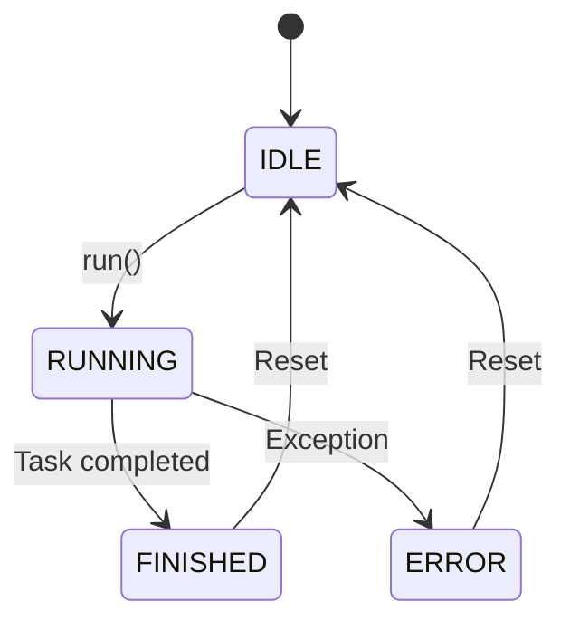
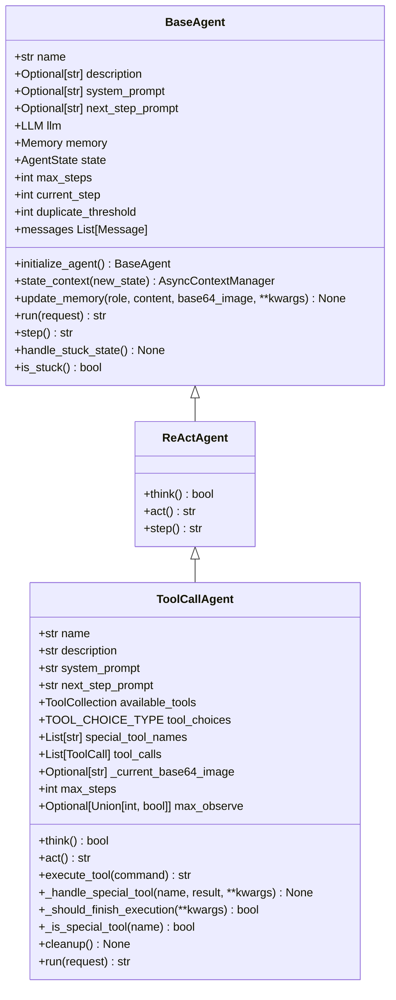
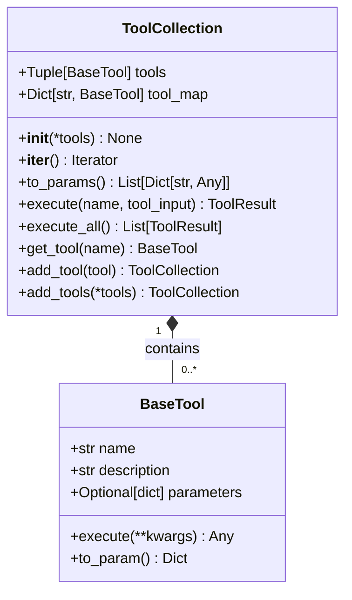

# Agent API

<cite>
**Referenced Files in This Document**   
- [manus.py](file://app/agent/manus.py)
- [toolcall.py](file://app/agent/toolcall.py)
- [base.py](file://app/agent/base.py)
- [tool_collection.py](file://app/tool/tool_collection.py)
- [mcp.py](file://app/tool/mcp.py)
- [schema.py](file://app/schema.py)
</cite>

## Table of Contents
1. [Introduction](#introduction)
2. [Agent Lifecycle and State Management](#agent-lifecycle-and-state-management)
3. [Core Agent Classes](#core-agent-classes)
4. [Manus Class API](#manus-class-api)
5. [Tool Integration and Management](#tool-integration-and-management)
6. [Asynchronous Execution Patterns](#asynchronous-execution-patterns)
7. [Error Handling and Cleanup](#error-handling-and-cleanup)
8. [Extending the Base Agent](#extending-the-base-agent)
9. [Code Examples](#code-examples)

## Introduction
The Agent system in OpenManus provides a comprehensive framework for creating intelligent agents capable of executing complex tasks through tool integration and LLM coordination. The Manus class serves as the primary agent implementation, offering a versatile general-purpose agent with support for both local and MCP (Model Context Protocol) tools. This documentation details the API for the Agent system, focusing on the Manus class and its interactions with the broader agent ecosystem.

**Section sources**
- [manus.py](file://app/agent/manus.py#L17-L164)

## Agent Lifecycle and State Management
The agent lifecycle is managed through a well-defined state machine that ensures proper initialization, execution, and cleanup. Agents transition through several states during their lifetime, including IDLE, RUNNING, FINISHED, and ERROR. The BaseAgent class provides the foundational state management through the AgentState enum, which defines these execution states.

Agents begin in the IDLE state and transition to RUNNING when the run() method is called. The execution loop continues until either the task is completed (transitioning to FINISHED) or an error occurs (transitioning to ERROR). The state transitions are managed safely through the state_context context manager, which ensures that the agent reverts to its previous state in case of exceptions.

The agent's execution is controlled by several parameters, including max_steps (maximum number of steps before termination) and current_step (tracking the current step in execution). The system also includes mechanisms to detect and handle stuck states by monitoring for duplicate responses and adjusting the strategy accordingly.



**Diagram sources**
- [base.py](file://app/agent/base.py#L19-L36)
- [schema.py](file://app/schema.py#L31-L37)

**Section sources**
- [base.py](file://app/agent/base.py#L12-L195)
- [schema.py](file://app/schema.py#L31-L37)

## Core Agent Classes
The agent system is built on a hierarchical class structure that provides increasing levels of functionality. At the base of this hierarchy is the BaseAgent class, which defines the core agent interface and provides foundational functionality for state transitions, memory management, and step-based execution.

Building upon BaseAgent is the ReActAgent class, which implements the ReAct (Reason + Act) pattern by defining the think() and act() methods. This pattern separates the reasoning process from action execution, allowing for more sophisticated decision-making.

The ToolCallAgent class extends ReActAgent to provide specialized functionality for handling tool and function calls. It manages tool selection, execution, and result processing, serving as the direct parent class for Manus. This layered architecture allows for code reuse and clear separation of concerns across different agent capabilities.



**Diagram sources**
- [base.py](file://app/agent/base.py#L12-L195)
- [react.py](file://app/agent/react.py#L10-L37)
- [toolcall.py](file://app/agent/toolcall.py#L17-L249)

**Section sources**
- [base.py](file://app/agent/base.py#L12-L195)
- [react.py](file://app/agent/react.py#L10-L37)
- [toolcall.py](file://app/agent/toolcall.py#L17-L249)

## Manus Class API
The Manus class is the primary agent implementation in OpenManus, designed as a versatile general-purpose agent with support for both local and MCP tools. It inherits from ToolCallAgent and extends its functionality with additional capabilities for MCP server integration and browser context management.

### create()
The create() method is a factory method that creates and properly initializes a Manus instance. It handles the asynchronous initialization of MCP servers and sets the internal _initialized flag to True. This method should be used instead of direct instantiation to ensure proper setup.

**Section sources**
- [manus.py](file://app/agent/manus.py#L62-L64)

### think()
The think() method processes the current state and decides on the next actions with appropriate context. It first checks if initialization is needed, then determines if browser context should be included in the prompt based on recent tool usage. The method temporarily modifies the next_step_prompt if browser interaction is detected, then delegates to the parent class's think() method for the actual reasoning process.

**Section sources**
- [manus.py](file://app/agent/manus.py#L130-L147)

### step()
The step() method is inherited from ReActAgent and executes a single step in the agent's workflow by calling think() followed by act(). This two-phase approach separates reasoning from action execution, allowing for more sophisticated decision-making processes.

**Section sources**
- [react.py](file://app/agent/react.py#L35-L37)

### cleanup()
The cleanup() method performs resource cleanup for the Manus agent. It handles browser cleanup through the browser_context_helper and disconnects from all MCP servers if the agent was initialized. This method is automatically called when the agent completes execution through the run() method's finally block.

**Section sources**
- [manus.py](file://app/agent/manus.py#L115-L128)

## Tool Integration and Management
The agent system provides robust tool integration and management capabilities through the ToolCollection class and MCP (Model Context Protocol) support. Tools are organized in collections that can be dynamically modified during agent execution.

### ToolCollection
The ToolCollection class manages a collection of tools, providing methods to add, retrieve, and execute tools. It maintains both a tuple of tools and a dictionary mapping tool names to tool instances for efficient lookup. The class provides methods to execute individual tools or all tools in the collection, with proper error handling.



**Diagram sources**
- [tool_collection.py](file://app/tool/tool_collection.py#L8-L70)
- [base.py](file://app/tool/base.py#L120-L181)

**Section sources**
- [tool_collection.py](file://app/tool/tool_collection.py#L8-L70)

### MCP Integration
Manus agents support integration with MCP servers through the MCPClients class, which manages connections to multiple MCP servers and their available tools. The agent can connect to servers using either SSE (Server-Sent Events) or stdio transport. When a server is connected, its tools are automatically added to the agent's available_tools collection with names prefixed by "mcp_serverId_".

The initialize_mcp_servers() method automatically connects to configured MCP servers based on the configuration, while connect_mcp_server() and disconnect_mcp_server() provide fine-grained control over individual server connections.

**Section sources**
- [manus.py](file://app/agent/manus.py#L66-L88)
- [mcp.py](file://app/tool/mcp.py#L36-L193)

## Asynchronous Execution Patterns
The agent system is designed with asynchronous execution in mind, leveraging Python's async/await syntax for non-blocking operations. The primary execution pattern follows a run-loop model where the agent processes tasks through a series of think-act cycles until completion.

The run() method serves as the main entry point, orchestrating the agent's execution loop. It first validates that the agent is in the IDLE state, then processes any initial request by adding it to memory. The method then enters a loop that continues until either the maximum number of steps is reached or the agent state transitions to FINISHED.

Within the loop, each iteration calls the step() method, which in turn calls think() to determine the next actions and act() to execute them. This pattern allows for efficient resource utilization and enables the agent to handle long-running tasks without blocking the event loop.

**Section sources**
- [base.py](file://app/agent/base.py#L115-L153)
- [toolcall.py](file://app/agent/toolcall.py#L240-L249)

## Error Handling and Cleanup
The agent system implements comprehensive error handling and cleanup mechanisms to ensure reliable operation and proper resource management. Errors are handled at multiple levels, from individual tool execution to the overall agent lifecycle.

During tool execution, the execute_tool() method in ToolCallAgent includes robust error handling for JSON parsing errors and general exceptions. If a tool call fails, the error is logged and returned as part of the observation, allowing the agent to continue execution rather than terminating abruptly.

The cleanup() method is a critical component of the agent's lifecycle, ensuring that resources are properly released when the agent completes execution. This method is automatically called through the run() method's finally block, guaranteeing execution even if an exception occurs. The cleanup process includes disconnecting from MCP servers, closing browser contexts, and releasing any other allocated resources.

The system also includes mechanisms to handle token limit errors through the TokenLimitExceeded exception, which is raised when the input token limit is exceeded. This allows the agent to gracefully handle cases where the conversation history becomes too large.

**Section sources**
- [toolcall.py](file://app/agent/toolcall.py#L17-L249)
- [manus.py](file://app/agent/manus.py#L115-L128)

## Extending the Base Agent
The agent system is designed to be extensible, allowing developers to create custom agent behaviors by subclassing the base classes. The hierarchical architecture provides multiple extension points depending on the desired level of customization.

For simple modifications to existing behavior, developers can override specific methods in the Manus class, such as think() or act(). For more significant changes, creating a new class that inherits from ToolCallAgent or ReActAgent allows for complete control over the agent's reasoning and action patterns.

When extending the base agent, developers should pay particular attention to the state management system and ensure that state transitions are handled correctly. The state_context context manager should be used when making state changes to ensure proper exception handling and state restoration.

Custom tools can be integrated by creating classes that inherit from BaseTool and implementing the execute() method. These tools can then be added to an agent's available_tools collection either through configuration or programmatically during execution.

**Section sources**
- [manus.py](file://app/agent/manus.py#L17-L164)
- [toolcall.py](file://app/agent/toolcall.py#L17-L249)

## Code Examples
The following examples demonstrate common usage patterns for the Manus agent:

### Basic Agent Initialization
```python
# Create and initialize a Manus agent with default configuration
agent = await Manus.create()
```

### Custom Configuration
```python
# Create a Manus agent with custom parameters
agent = await Manus.create(
    max_steps=50,
    max_observe=20000
)
```

### Executing a Task
```python
# Run the agent with an initial request
result = await agent.run("Research the best travel destinations in Japan")
```

### Handling Tool Calls
```python
# The agent automatically handles tool calls during execution
# Tools are selected based on the LLM's response and executed sequentially
# Results are added to memory for context in subsequent steps
```

### Cleanup
```python
# Cleanup is automatically handled when run() completes
# Manual cleanup can be performed if needed
await agent.cleanup()
```

**Section sources**
- [manus.py](file://app/agent/manus.py#L62-L64)
- [toolcall.py](file://app/agent/toolcall.py#L240-L249)