# CLI Interface

<cite>
**Referenced Files in This Document**   
- [main.py](file://main.py)
- [run_mcp.py](file://run_mcp.py)
- [run_flow.py](file://run_flow.py)
- [sandbox_main.py](file://sandbox_main.py)
- [run_mcp_server.py](file://run_mcp_server.py)
- [app/config.py](file://app/config.py)
- [config/config.example.toml](file://config/config.example.toml)
- [config/mcp.example.json](file://config/mcp.example.json)
- [app/mcp/server.py](file://app/mcp/server.py)
- [app/utils/logger.py](file://app/utils/logger.py)
</cite>

## Table of Contents
1. [Introduction](#introduction)
2. [Core Entry Points Overview](#core-entry-points-overview)
3. [Standard Agent Execution: main.py](#standard-agent-execution-mainpy)
4. [MCP-Enabled Operation: run_mcp.py](#mcp-enabled-operation-run_mcppy)
5. [Multi-Agent Flows: run_flow.py](#multi-agent-flows-run_flowpy)
6. [Sandboxed Execution: sandbox_main.py](#sandboxed-execution-sandbox_mainpy)
7. [MCP Server Hosting: run_mcp_server.py](#mcp-server-hosting-run_mcp_serverpy)
8. [Configuration System](#configuration-system)
9. [Argument Parsing and Execution Modes](#argument-parsing-and-execution-modes)
10. [Logging and Debugging](#logging-and-debugging)
11. [Extending the CLI](#extending-the-cli)
12. [Usage Examples](#usage-examples)

## Introduction
The OpenManus CLI provides multiple entry points for different execution scenarios, ranging from standard agent invocation to complex multi-agent workflows and MCP (Model Context Protocol) integration. This document details the command-line interface, configuration system, and operational modes for each main script in the OpenManus framework. The CLI is designed to support flexible deployment patterns, including interactive sessions, single-prompt execution, and server-based operation, while maintaining consistent configuration and logging behavior across all entry points.

## Core Entry Points Overview
OpenManus exposes five primary executable scripts, each serving a distinct purpose in the agent execution ecosystem:
- **main.py**: Standard agent execution with minimal configuration
- **run_mcp.py**: MCP-enabled agent operation with interactive and programmatic modes
- **run_flow.py**: Multi-agent workflow execution with configurable agent composition
- **sandbox_main.py**: Sandboxed agent execution with isolated environment
- **run_mcp_server.py**: MCP server hosting for tool exposure and agent integration

These entry points share common patterns in argument parsing, configuration loading, and error handling, while providing specialized functionality for their respective use cases.

**Section sources**
- [main.py](file://main.py#L1-L37)
- [run_mcp.py](file://run_mcp.py#L1-L117)
- [run_flow.py](file://run_flow.py#L1-L53)
- [sandbox_main.py](file://sandbox_main.py#L1-L37)
- [run_mcp_server.py](file://run_mcp_server.py#L1-L12)

## Standard Agent Execution: main.py
The `main.py` script provides the most basic entry point for executing the Manus agent. It accepts a single optional `--prompt` argument and otherwise operates in interactive mode, prompting the user for input. The script initializes the Manus agent asynchronously, processes the provided or interactive prompt, and ensures proper cleanup of resources upon completion. This entry point is designed for straightforward agent invocation without additional configuration or specialized execution environments.


**Diagram sources**
- [main.py](file://main.py#L1-L37)

**Section sources**
- [main.py](file://main.py#L1-L37)

## MCP-Enabled Operation: run_mcp.py
The `run_mcp.py` script enables MCP (Model Context Protocol) integration, allowing the agent to communicate with external MCP servers or local MCP processes. It supports multiple connection types (stdio, sse) and execution modes (interactive, single-prompt, default). The script uses a runner pattern with the `MCPRunner` class to manage agent lifecycle and connection configuration. Key features include:
- Connection type selection via `--connection` argument
- SSE server URL specification with `--server-url`
- Interactive mode with `--interactive` flag
- Single-prompt execution with `--prompt`
- Automatic configuration loading from the central config system

The MCP agent connects to a server specified in the configuration or via command-line arguments, enabling rich tool integration and extended capabilities beyond the standard agent.

```mermaid
flowchart TD
Start([run_mcp.py Execution]) --> ParseArgs["Parse Command Line Arguments"]
ParseArgs --> Initialize["Initialize MCPRunner"]
Initialize --> CheckMode{"Execution Mode?"}
CheckMode --> |Interactive| Interactive["Run Interactive Mode"]
CheckMode --> |Single Prompt| SinglePrompt["Run Single Prompt"]
CheckMode --> |Default| Default["Run Default Mode"]
Interactive --> Loop{"User Input ≠ exit?"}
Loop --> |Yes| Execute["Execute Agent with Input"]
Loop --> |No| Cleanup["Cleanup Resources"]
SinglePrompt --> Execute
Default --> GetInput["Get User Input"]
GetInput --> Execute
Execute --> Output["Display Agent Response"]
Output --> Cleanup
Cleanup --> End([Exit])
```



**Diagram sources**
- [run_mcp.py](file://run_mcp.py#L1-L117)

**Section sources**
- [run_mcp.py](file://run_mcp.py#L1-L117)

## Multi-Agent Flows: run_flow.py
The `run_flow.py` script orchestrates multi-agent workflows through the FlowFactory pattern. It initializes a planning flow with configurable agents, currently supporting the Manus agent and optionally the DataAnalysis agent based on configuration. The script implements a 60-minute timeout for flow execution and provides detailed timing information in the logs. Unlike other entry points, it does not support command-line arguments for prompt input, relying solely on interactive input. The flow execution is managed by the FlowFactory, which creates the appropriate flow type (currently only PLANNING) with the configured agents.

**Section sources**
- [run_flow.py](file://run_flow.py#L1-L53)

## Sandboxed Execution: sandbox_main.py
The `sandbox_main.py` script provides isolated execution of the Manus agent within a sandboxed environment. It shares the same argument structure as `main.py` with the `--prompt` option but uses the `SandboxManus` agent class instead of the standard Manus agent. This entry point enables secure execution of agent tasks with resource constraints and optional network isolation, as configured in the central configuration system. The sandbox environment is managed by the SandboxSettings configuration, which controls container parameters such as image, memory limit, CPU limit, and network access.

**Section sources**
- [sandbox_main.py](file://sandbox_main.py#L1-L37)

## MCP Server Hosting: run_mcp_server.py
The `run_mcp_server.py` script serves as a lightweight entry point for launching the OpenManus MCP server. It imports the `MCPServer` class and `parse_args` function from `app.mcp.server`, parses command-line arguments for transport type, and initializes the server with the specified transport (default: stdio). This script acts as a shortcut to avoid import issues and provides a clean interface for server execution. The actual server implementation, including tool registration and management, resides in `app/mcp/server.py`.


**Diagram sources**
- [run_mcp_server.py](file://run_mcp_server.py#L1-L12)
- [app/mcp/server.py](file://app/mcp/server.py#L1-L181)

**Section sources**
- [run_mcp_server.py](file://run_mcp_server.py#L1-L12)

## Configuration System
OpenManus uses a hierarchical configuration system based on TOML and JSON files, with automatic loading and fallback mechanisms. The configuration is managed by the `Config` class in `app/config.py`, which implements a singleton pattern for global access. Key components include:

### Configuration Loading Order
1. `config/config.toml` - Primary configuration file
2. `config/config.example.toml` - Fallback if config.toml doesn't exist
3. Environment-specific overrides via environment variables

### Configuration Structure


**Diagram sources**
- [app/config.py](file://app/config.py#L1-L373)

**Section sources**
- [app/config.py](file://app/config.py#L1-L373)
- [config/config.example.toml](file://config/config.example.toml#L1-L106)

## Argument Parsing and Execution Modes
All OpenManus entry points use Python's argparse module for command-line argument parsing, with consistent patterns across scripts. The argument parsing logic is typically contained in a `parse_args()` function or directly in the main execution block.

### Argument Parsing Workflow


Each script implements its own set of arguments based on its functionality:
- `main.py` and `sandbox_main.py`: Simple `--prompt` argument
- `run_mcp.py`: Comprehensive arguments for connection type, server URL, and execution mode
- `run_mcp_server.py`: Transport type selection
- `run_flow.py`: No command-line arguments, fully interactive

The execution mode is determined by the presence or absence of specific arguments, with fallback to interactive mode when no arguments are provided.

**Section sources**
- [main.py](file://main.py#L1-L37)
- [run_mcp.py](file://run_mcp.py#L1-L117)
- [run_mcp_server.py](file://run_mcp_server.py#L1-L12)

## Logging and Debugging
OpenManus uses structlog for structured logging with different output formats based on the environment mode. The logger configuration in `app/utils/logger.py` determines whether logs are output in JSON format or as human-readable console output based on the `ENV_MODE` environment variable.

### Logging Configuration


When `ENV_MODE` is set to "local", the logger uses `ConsoleRenderer` for human-readable output. In other environments, it uses `JSONRenderer` for structured logging. All entry points use the same logger instance, ensuring consistent log output across the application. Error reporting includes exception traceback information when available, and critical errors result in non-zero exit codes.

**Diagram sources**
- [app/utils/logger.py](file://app/utils/logger.py#L1-L33)

**Section sources**
- [app/utils/logger.py](file://app/utils/logger.py#L1-L33)

## Extending the CLI
The OpenManus CLI can be extended by creating new entry point scripts that follow the established patterns. New commands should:
1. Use argparse for consistent argument parsing
2. Leverage the central config system for configuration
3. Use the shared logger for consistent logging
4. Implement proper async cleanup in finally blocks
5. Follow the same error handling patterns

Custom entry points can be created by importing the appropriate agent classes and configuring them with specific parameters or workflows. The modular design of the agent system allows for easy composition of new execution scenarios without modifying existing code.

**Section sources**
- [main.py](file://main.py#L1-L37)
- [run_mcp.py](file://run_mcp.py#L1-L117)

## Usage Examples
The following examples demonstrate common usage patterns for the OpenManus CLI entry points:

### Standard Agent Execution
```bash
# Interactive mode
python main.py

# With prompt argument
python main.py --prompt "Analyze the current market trends"
```

### MCP-Enabled Operation
```bash
# Interactive mode with stdio connection (default)
python run_mcp.py --interactive

# Single prompt with SSE connection
python run_mcp.py --connection sse --server-url http://localhost:8000/sse --prompt "Generate a report"

# Default mode with stdio connection
python run_mcp.py
```

### Multi-Agent Flows
```bash
# Interactive execution (no arguments supported)
python run_flow.py
```

### Sandboxed Execution
```bash
# Interactive mode
python sandbox_main.py

# With prompt argument
python sandbox_main.py --prompt "Process sensitive data securely"
```

### MCP Server Hosting
```bash
# Start server with stdio transport (default)
python run_mcp_server.py

# Start server with specific transport
python run_mcp_server.py --transport stdio
```

**Section sources**
- [main.py](file://main.py#L1-L37)
- [run_mcp.py](file://run_mcp.py#L1-L117)
- [run_flow.py](file://run_flow.py#L1-L53)
- [sandbox_main.py](file://sandbox_main.py#L1-L37)
- [run_mcp_server.py](file://run_mcp_server.py#L1-L12)