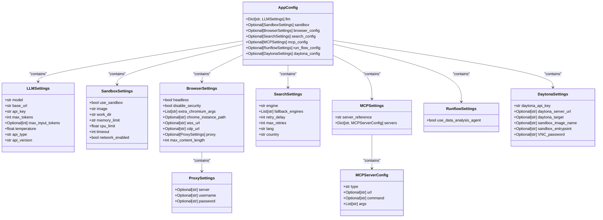
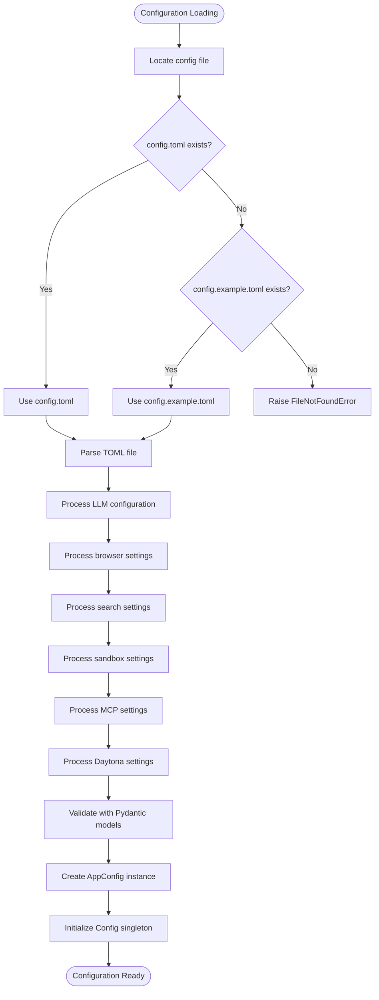
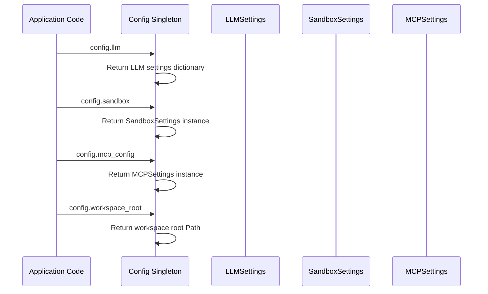

# Configuration API

<cite>
**Referenced Files in This Document**   
- [app/config.py](file://app/config.py)
- [config/config.example.toml](file://config/config.example.toml)
- [config/mcp.example.json](file://config/mcp.example.json)
- [app/agent/data_analysis.py](file://app/agent/data_analysis.py)
- [app/agent/manus.py](file://app/agent/manus.py)
- [app/agent/sandbox_agent.py](file://app/agent/sandbox_agent.py)
- [app/daytona/sandbox.py](file://app/daytona/sandbox.py)
</cite>

## Table of Contents
1. [Introduction](#introduction)
2. [Configuration Model Structure](#configuration-model-structure)
3. [Configuration Loading Process](#configuration-loading-process)
4. [LLM Configuration](#llm-configuration)
5. [Sandbox Settings](#sandbox-settings)
6. [MCP Server Configuration](#mcp-server-configuration)
7. [Browser and Search Configuration](#browser-and-search-configuration)
8. [Daytona Integration Settings](#daytona-integration-settings)
9. [Accessing Configuration Values](#accessing-configuration-values)
10. [Configuration Precedence and Validation](#configuration-precedence-and-validation)
11. [Extending the Config Model](#extending-the-config-model)

## Introduction
The Configuration API in OpenManus provides a centralized, global access point for application settings through the singleton `Config` class. This system enables consistent configuration management across the application, supporting various components including LLM providers, sandbox environments, MCP servers, and tool-specific options. The configuration system leverages Pydantic for data validation, TOML for configuration files, and environment variable integration to create a flexible and robust settings framework.

**Section sources**
- [app/config.py](file://app/config.py#L196-L368)

## Configuration Model Structure
The configuration system is built on a hierarchical Pydantic model structure that validates and organizes settings into distinct categories. At the core is the `AppConfig` model that aggregates various configuration sections, each defined as a separate Pydantic model.



**Diagram sources**
- [app/config.py](file://app/config.py#L18-L193)
- [app/config.py](file://app/config.py#L173-L193)

**Section sources**
- [app/config.py](file://app/config.py#L18-L193)
- [app/config.py](file://app/config.py#L173-L193)

## Configuration Loading Process
The configuration loading process follows a systematic approach to locate and parse configuration files. The system first attempts to load `config.toml` from the config directory, falling back to `config.example.toml` if the primary file is not found. The loading process involves parsing the TOML file, processing environment variables, and validating the configuration against the Pydantic models.



**Diagram sources**
- [app/config.py](file://app/config.py#L217-L230)
- [app/config.py](file://app/config.py#L232-L328)

**Section sources**
- [app/config.py](file://app/config.py#L217-L328)

## LLM Configuration
The LLM configuration section manages settings for language model providers, supporting multiple providers through a flexible configuration structure. The system allows for both default settings and provider-specific overrides, enabling different configurations for various LLM services.

```mermaid
classDiagram
class LLMSettings {
+str model
+str base_url
+str api_key
+int max_tokens
+Optional[int] max_input_tokens
+float temperature
+str api_type
+str api_version
}
LLMSettings : model : The LLM model to use
LLMSettings : base_url : API endpoint URL
LLMSettings : api_key : Your API key
LLMSettings : max_tokens : Maximum number of tokens in the response
LLMSettings : temperature : Controls randomness
LLMSettings : api_type : Provider type (Azure, OpenAI, Ollama, etc.)
LLMSettings : api_version : API version for Azure OpenAI
```

The configuration supports various LLM providers including Anthropic, AWS Bedrock, Azure OpenAI, and Ollama, with provider-specific settings that can be configured through environment variables or directly in the TOML file.

**Section sources**
- [app/config.py](file://app/config.py#L18-L29)
- [config/config.example.toml](file://config/config.example.toml#L1-L40)

## Sandbox Settings
The sandbox configuration provides settings for the execution environment where code is run securely. This includes container settings, resource limits, and network configuration to ensure safe execution of potentially untrusted code.

```mermaid
classDiagram
class SandboxSettings {
+bool use_sandbox
+str image
+str work_dir
+str memory_limit
+float cpu_limit
+int timeout
+bool network_enabled
}
SandboxSettings : use_sandbox : Whether to use the sandbox
SandboxSettings : image : Base container image
SandboxSettings : work_dir : Container working directory
SandboxSettings : memory_limit : Memory limit (e.g., "512m", "1g")
SandboxSettings : cpu_limit : CPU limit (number of cores)
SandboxSettings : timeout : Default command timeout in seconds
SandboxSettings : network_enabled : Whether network access is allowed
```

The sandbox settings are used by the Daytona integration to create isolated execution environments for agent tasks, with configurable resource limits to prevent resource exhaustion.

**Section sources**
- [app/config.py](file://app/config.py#L93-L104)
- [app/daytona/sandbox.py](file://app/daytona/sandbox.py#L137-L165)

## MCP Server Configuration
The MCP (Model Context Protocol) server configuration manages connections to external tool servers that provide additional capabilities to the agents. The configuration supports both SSE (Server-Sent Events) and stdio (standard input/output) connection types, allowing integration with various external services.

```mermaid
classDiagram
class MCPSettings {
+str server_reference
+Dict[str, MCPServerConfig] servers
}
class MCPServerConfig {
+str type
+Optional[str] url
+Optional[str] command
+List[str] args
}
MCPSettings --> MCPServerConfig : "contains"
MCPServerConfig : type : Connection type (sse or stdio)
MCPServerConfig : url : Server URL for SSE connections
MCPServerConfig : command : Command for stdio connections
MCPServerConfig : args : Arguments for stdio command
```

MCP server configurations are loaded from a separate JSON file (`mcp.json` or `mcp.example.json`), allowing for dynamic server management without modifying the main configuration.

**Diagram sources**
- [app/config.py](file://app/config.py#L126-L134)
- [app/config.py](file://app/config.py#L137-L170)

**Section sources**
- [app/config.py](file://app/config.py#L126-L170)
- [config/mcp.example.json](file://config/mcp.example.json#L1-L8)

## Browser and Search Configuration
The browser and search configurations provide settings for web interaction and information retrieval capabilities. These settings enable the agents to browse the web, interact with browser-based tools, and perform search operations.

```mermaid
classDiagram
class BrowserSettings {
+bool headless
+bool disable_security
+List[str] extra_chromium_args
+Optional[str] chrome_instance_path
+Optional[str] wss_url
+Optional[str] cdp_url
+Optional[ProxySettings] proxy
+int max_content_length
}
class ProxySettings {
+Optional[str] server
+Optional[str] username
+Optional[str] password
}
class SearchSettings {
+str engine
+List[str] fallback_engines
+int retry_delay
+int max_retries
+str lang
+str country
}
BrowserSettings --> ProxySettings : "contains"
BrowserSettings : headless : Run browser in headless mode
BrowserSettings : disable_security : Disable browser security features
BrowserSettings : extra_chromium_args : Extra arguments for the browser
BrowserSettings : chrome_instance_path : Path to Chrome instance
BrowserSettings : wss_url : WebSocket URL for browser connection
BrowserSettings : cdp_url : CDP URL for browser connection
BrowserSettings : proxy : Proxy settings for browser
BrowserSettings : max_content_length : Maximum content length
SearchSettings : engine : Primary search engine
SearchSettings : fallback_engines : Fallback engines when primary fails
SearchSettings : retry_delay : Delay before retrying after failures
SearchSettings : max_retries : Maximum retry attempts
SearchSettings : lang : Language for search results
SearchSettings : country : Country for search results
```

These configurations are used by agents like Manus and SandboxManus to interact with web content and retrieve information from search engines.

**Section sources**
- [app/config.py](file://app/config.py#L68-L90)
- [app/config.py](file://app/config.py#L38-L59)
- [config/config.example.toml](file://config/config.example.toml#L78-L105)

## Daytona Integration Settings
The Daytona settings configure the integration with the Daytona platform for managing sandbox environments. This includes API credentials, server endpoints, and sandbox image specifications.

```mermaid
classDiagram
class DaytonaSettings {
+str daytona_api_key
+Optional[str] daytona_server_url
+Optional[str] daytona_target
+Optional[str] sandbox_image_name
+Optional[str] sandbox_entrypoint
+Optional[str] VNC_password
}
DaytonaSettings : daytona_api_key : API key for Daytona
DaytonaSettings : daytona_server_url : Daytona server URL
DaytonaSettings : daytona_target : Target region (us or eu)
DaytonaSettings : sandbox_image_name : Docker image for sandbox
DaytonaSettings : sandbox_entrypoint : Entrypoint command
DaytonaSettings : VNC_password : Password for VNC access
```

These settings are critical for the SandboxManus agent to create and manage sandbox environments through the Daytona API.

**Section sources**
- [app/config.py](file://app/config.py#L107-L123)
- [app/daytona/sandbox.py](file://app/daytona/sandbox.py#L13-L35)

## Accessing Configuration Values
Configuration values are accessed through the global `config` instance, which implements the singleton pattern to ensure consistent access across the application. Various properties provide access to different configuration sections.



The Config class provides properties for accessing all configuration sections, including `llm`, `sandbox`, `mcp_config`, `browser_config`, `search_config`, `run_flow_config`, and `daytona`. These properties return the corresponding configuration objects, enabling type-safe access to settings.

**Diagram sources**
- [app/config.py](file://app/config.py#L331-L368)

**Section sources**
- [app/config.py](file://app/config.py#L331-L368)
- [app/agent/manus.py](file://app/agent/manus.py#L68-L85)
- [app/agent/sandbox_agent.py](file://app/agent/sandbox_agent.py#L114-L131)

## Configuration Precedence and Validation
The configuration system follows a specific precedence order and implements comprehensive validation to ensure configuration integrity. The system uses Pydantic's validation capabilities to enforce type safety and data constraints.

Configuration precedence follows this order:
1. Environment variables (highest precedence)
2. Configuration file values
3. Default values defined in Pydantic models (lowest precedence)

The validation process occurs at multiple levels:
- Field-level validation through Pydantic Field constraints
- Model-level validation through Pydantic validators
- Configuration loading validation through the `_load_initial_config` method
- Runtime validation when accessing configuration values

Error handling is implemented to provide meaningful error messages when invalid configurations are detected, such as missing required fields or invalid data types.

**Section sources**
- [app/config.py](file://app/config.py#L232-L328)
- [app/config.py](file://app/config.py#L148-L170)

## Extending the Config Model
The Config model can be extended to support custom features by adding new configuration sections or modifying existing ones. To extend the model, new Pydantic models should be defined for the additional settings, and the `AppConfig` model should be updated to include the new configuration section.

When extending the configuration model, consider the following best practices:
- Use descriptive field names and clear documentation
- Provide sensible default values
- Implement appropriate validation constraints
- Maintain backward compatibility
- Document new configuration options in example files

The modular design of the configuration system makes it easy to add new features without disrupting existing functionality.

**Section sources**
- [app/config.py](file://app/config.py#L173-L193)
- [config/config.example.toml](file://config/config.example.toml#L1-L105)