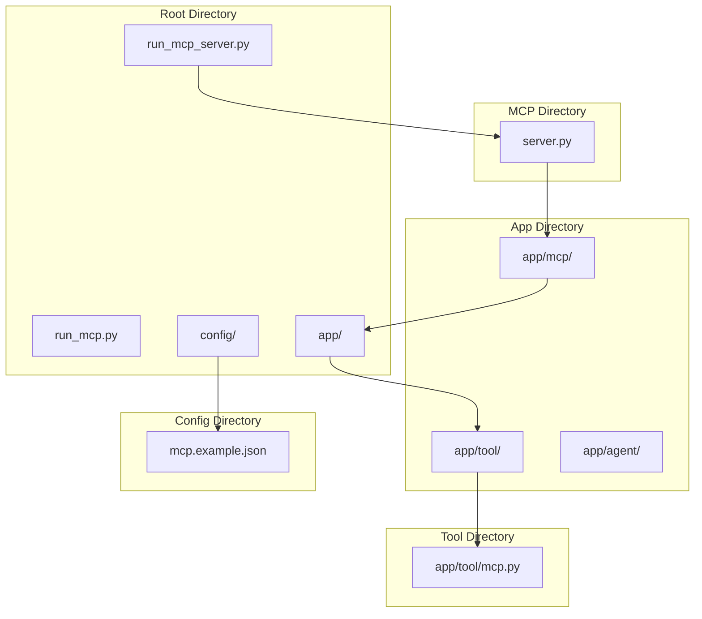
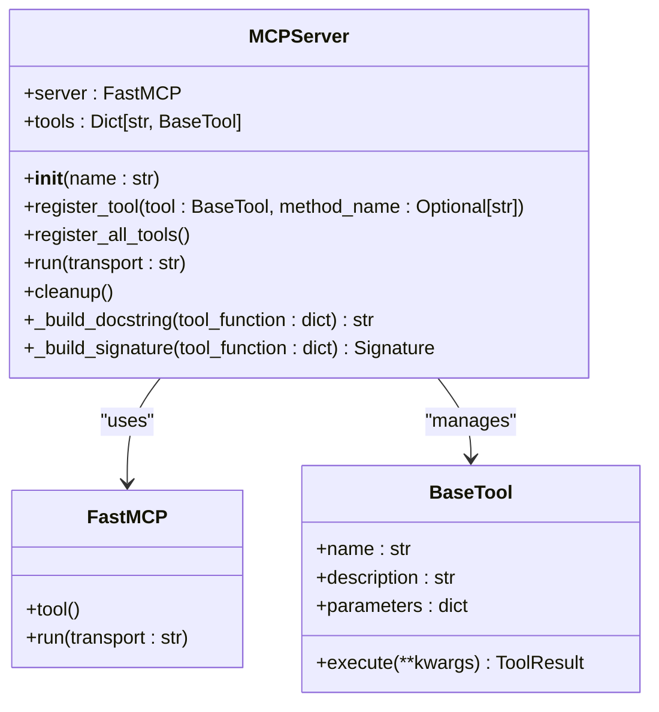
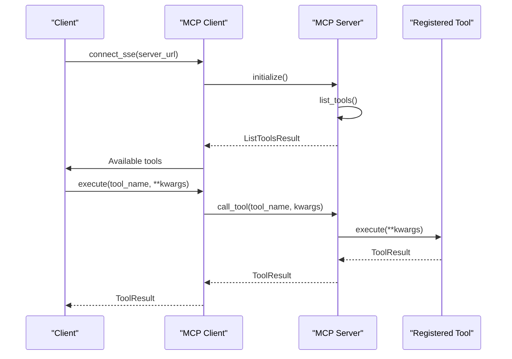
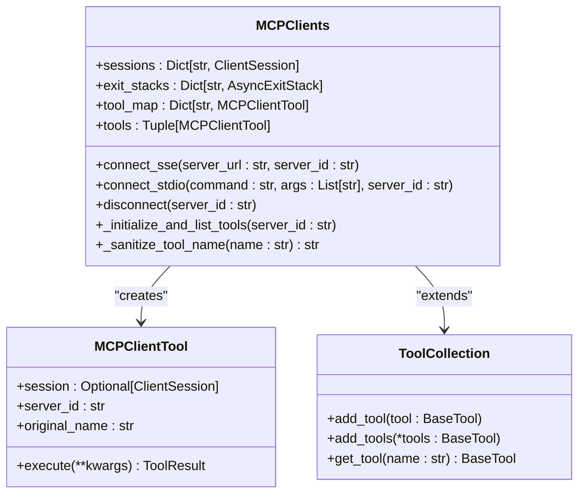
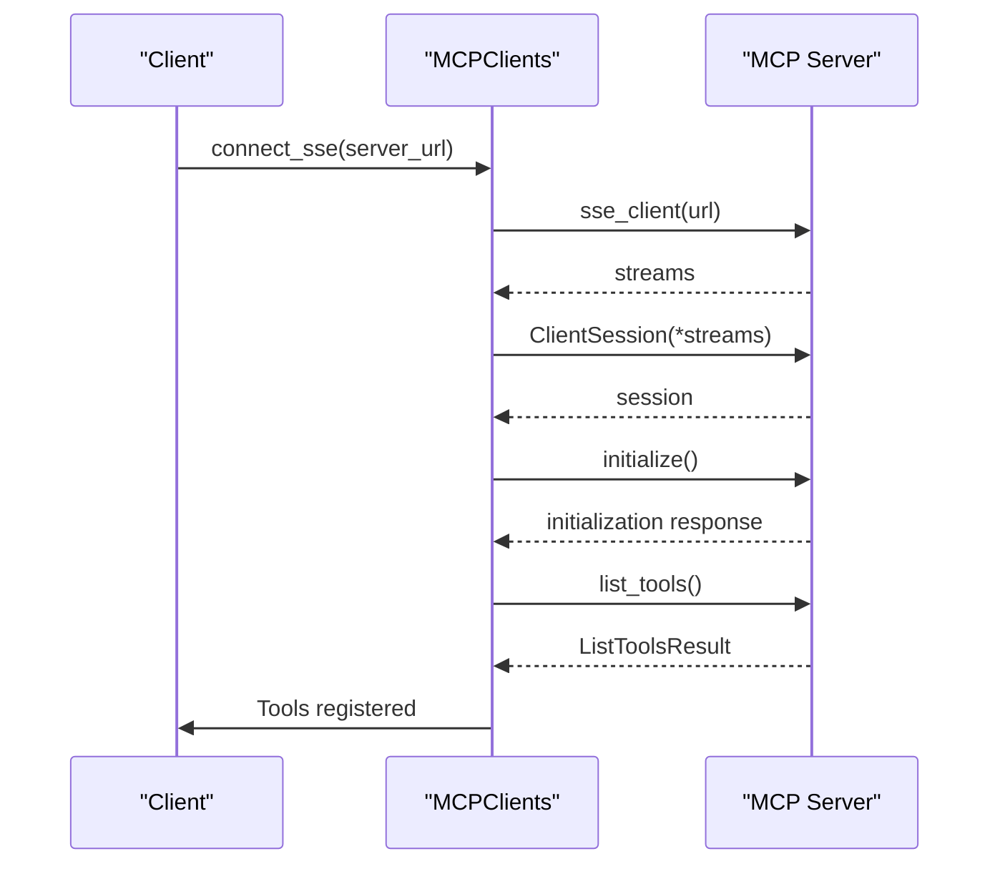
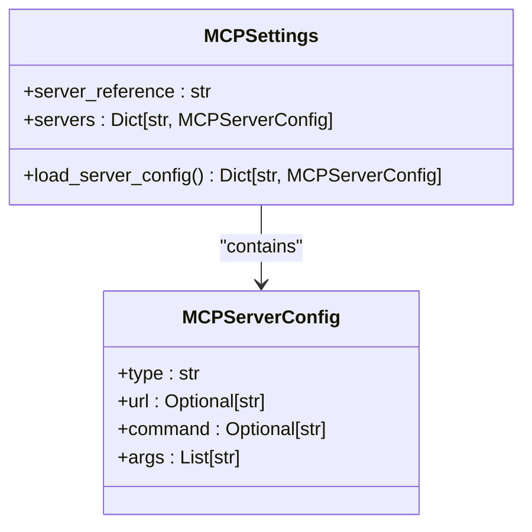
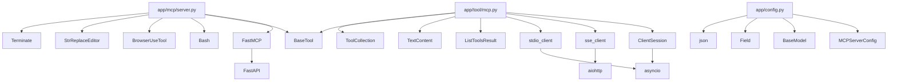

# MCP API

<cite>
**Referenced Files in This Document**   
- [app/mcp/server.py](file://app/mcp/server.py)
- [app/tool/mcp.py](file://app/tool/mcp.py)
- [run_mcp_server.py](file://run_mcp_server.py)
- [app/config.py](file://app/config.py)
- [config/mcp.example.json](file://config/mcp.example.json)
</cite>

## Table of Contents
1. [Introduction](#introduction)
2. [Project Structure](#project-structure)
3. [Core Components](#core-components)
4. [Architecture Overview](#architecture-overview)
5. [Detailed Component Analysis](#detailed-component-analysis)
6. [Dependency Analysis](#dependency-analysis)
7. [Performance Considerations](#performance-considerations)
8. [Troubleshooting Guide](#troubleshooting-guide)
9. [Conclusion](#conclusion)

## Introduction
This document provides comprehensive API documentation for the Model Context Protocol (MCP) implementation in OpenManus. It details the MCP server endpoints, including `/mcp/v1/server-info` and `/mcp/v1/subscribe` for Server-Sent Events (SSE) streaming, with request/response schemas, authentication methods, and error codes. The document explains the server implementation using FastAPI and SSE for real-time tool invocation, and covers the MCP client functionality in `app/tool/mcp.py` for connecting to remote tools. It includes examples of starting the MCP server via `run_mcp_server.py`, registering tools, and handling incoming requests. The document also addresses protocol versioning, compatibility considerations, and integration with the A2A protocol, providing client implementation guidelines and troubleshooting tips for connection issues and message serialization errors.

## Project Structure
The OpenManus project is organized into several key directories, each serving a specific purpose in the MCP implementation. The `app/mcp/` directory contains the server implementation, while `app/tool/` houses the client-side tools and utilities. Configuration files are located in the `config/` directory, and the root directory includes scripts for running the server and client.



**Diagram sources**
- [run_mcp_server.py](file://run_mcp_server.py)
- [app/mcp/server.py](file://app/mcp/server.py)
- [app/tool/mcp.py](file://app/tool/mcp.py)
- [config/mcp.example.json](file://config/mcp.example.json)

**Section sources**
- [run_mcp_server.py](file://run_mcp_server.py)
- [app/mcp/server.py](file://app/mcp/server.py)
- [app/tool/mcp.py](file://app/tool/mcp.py)
- [config/mcp.example.json](file://config/mcp.example.json)

## Core Components
The core components of the MCP implementation in OpenManus include the MCP server, the MCP client, and the configuration system. The MCP server is responsible for exposing tools via the Model Context Protocol, while the MCP client connects to these servers and manages the available tools. The configuration system allows for flexible setup of multiple MCP servers with different connection types.

**Section sources**
- [app/mcp/server.py](file://app/mcp/server.py)
- [app/tool/mcp.py](file://app/tool/mcp.py)
- [app/config.py](file://app/config.py)

## Architecture Overview
The MCP architecture in OpenManus is designed to facilitate real-time tool invocation through a server-client model. The server exposes endpoints for server information and SSE streaming, while the client connects to these endpoints to access and execute tools. The architecture supports both SSE and stdio transport methods, allowing for flexible deployment options.

```mermaid
graph TD
Client[Client Application]
MCPClient[MCP Client]
MCPServer[MCP Server]
Tools[Registered Tools]
Client --> MCPClient
MCPClient --> MCPServer
MCPServer --> Tools
subgraph "MCP Server"
MCPServer
Tools
end
subgraph "Client"
Client
MCPClient
end
```

**Diagram sources**
- [app/mcp/server.py](file://app/mcp/server.py)
- [app/tool/mcp.py](file://app/tool/mcp.py)

## Detailed Component Analysis
### MCP Server Analysis
The MCP server is implemented in `app/mcp/server.py` and is responsible for managing tool registration and handling incoming requests. It uses the FastMCP library to create a FastAPI-based server that exposes endpoints for server information and SSE streaming.

#### For Object-Oriented Components:


**Diagram sources**
- [app/mcp/server.py](file://app/mcp/server.py#L23-L159)

#### For API/Service Components:


**Diagram sources**
- [app/mcp/server.py](file://app/mcp/server.py#L36-L75)
- [app/tool/mcp.py](file://app/tool/mcp.py#L49-L68)

### MCP Client Analysis
The MCP client is implemented in `app/tool/mcp.py` and is responsible for connecting to MCP servers and managing the available tools. It supports both SSE and stdio transport methods and provides a unified interface for tool execution.

#### For Object-Oriented Components:


**Diagram sources**
- [app/tool/mcp.py](file://app/tool/mcp.py#L36-L193)

#### For API/Service Components:


**Diagram sources**
- [app/tool/mcp.py](file://app/tool/mcp.py#L49-L68)

### Configuration Analysis
The MCP configuration is managed through the `MCPSettings` class in `app/config.py`, which loads server configurations from a JSON file. The configuration supports multiple servers with different connection types (SSE or stdio).

#### For Object-Oriented Components:


**Diagram sources**
- [app/config.py](file://app/config.py#L126-L159)

## Dependency Analysis
The MCP implementation in OpenManus has several key dependencies that enable its functionality. The server relies on the FastMCP library for creating the FastAPI-based server, while the client uses the mcp library for SSE and stdio connections. The configuration system depends on Pydantic for data validation and JSON parsing.



**Diagram sources**
- [app/mcp/server.py](file://app/mcp/server.py)
- [app/tool/mcp.py](file://app/tool/mcp.py)
- [app/config.py](file://app/config.py)

**Section sources**
- [app/mcp/server.py](file://app/mcp/server.py)
- [app/tool/mcp.py](file://app/tool/mcp.py)
- [app/config.py](file://app/config.py)

## Performance Considerations
The MCP implementation in OpenManus is designed with performance in mind. The use of SSE for real-time communication allows for efficient, low-latency tool invocation. The server is built on FastAPI, which is known for its high performance and scalability. The client uses asynchronous programming to handle multiple connections and tool executions concurrently.

The configuration system is optimized for quick loading and parsing of server configurations, minimizing startup time. The tool registration process is streamlined to reduce overhead, and the use of Pydantic for data validation ensures that input and output schemas are handled efficiently.

## Troubleshooting Guide
When working with the MCP implementation in OpenManus, several common issues may arise. This section provides guidance on troubleshooting connection issues, message serialization errors, and other common problems.

### Connection Issues
- **Ensure the MCP server is running**: Verify that the MCP server is started using `run_mcp_server.py` and is listening on the correct port.
- **Check the server URL**: Ensure that the server URL in the configuration file matches the actual server address.
- **Verify network connectivity**: Confirm that the client can reach the server over the network.

### Message Serialization Errors
- **Check JSON schema compliance**: Ensure that tool input and output schemas comply with the JSON schema defined in the tool registration.
- **Validate data types**: Make sure that the data types used in tool parameters match the expected types in the schema.
- **Handle special characters**: Be cautious with special characters in tool parameters, as they may need to be escaped or encoded.

### Configuration Issues
- **Validate the configuration file**: Ensure that the `mcp.json` file is correctly formatted and contains valid server configurations.
- **Check environment variables**: Verify that any required environment variables are set and accessible to the application.

**Section sources**
- [app/mcp/server.py](file://app/mcp/server.py)
- [app/tool/mcp.py](file://app/tool/mcp.py)
- [config/mcp.example.json](file://config/mcp.example.json)

## Conclusion
The MCP implementation in OpenManus provides a robust and flexible framework for real-time tool invocation through a server-client model. The use of FastAPI and SSE enables efficient, low-latency communication, while the configuration system allows for flexible deployment options. The client implementation provides a unified interface for accessing and executing tools, making it easy to integrate with various applications. By following the guidelines and best practices outlined in this document, developers can effectively use and extend the MCP implementation to meet their specific needs.