# Sandbox API

<cite>
**Referenced Files in This Document**   
- [DockerSandbox](file://app/sandbox/core/sandbox.py)
- [SandboxManager](file://app/sandbox/core/manager.py)
- [SandboxSettings](file://app/config.py)
- [LocalSandboxClient](file://app/sandbox/client.py)
- [SandboxError](file://app/sandbox/core/exceptions.py)
</cite>

## Table of Contents
1. [Introduction](#introduction)
2. [Sandbox Class Interface](#sandbox-class-interface)
3. [SandboxManager Lifecycle Management](#sandboxmanager-lifecycle-management)
4. [Client-Server Interaction Model](#client-server-interaction-model)
5. [Docker-Based Isolation Mechanism](#docker-based-isolation-mechanism)
6. [Configuration and Settings](#configuration-and-settings)
7. [Usage Examples](#usage-examples)
8. [Error Handling](#error-handling)
9. [Integration with Daytona Workspaces](#integration-with-daytona-workspaces)

## Introduction
The Sandbox system in OpenManus provides a secure, isolated environment for executing untrusted code with controlled resource usage. Built on Docker containerization technology, the system enables safe execution of code while maintaining strict boundaries for security and resource management. The API offers comprehensive control over container lifecycle, file operations, command execution, and resource configuration. This documentation details the core components, configuration options, and usage patterns for integrating the sandbox system into applications.

## Sandbox Class Interface

The DockerSandbox class provides the core interface for containerized execution environments with resource limits and isolation capabilities. It supports four primary operations: start (via create), execute (via run_command), copy_file (via copy_to and copy_from), and stop (via cleanup).

### start() - Container Creation and Initialization
The `create()` method initializes and starts a sandbox container with specified configuration. It handles Docker container creation, resource allocation, and terminal initialization for command execution.

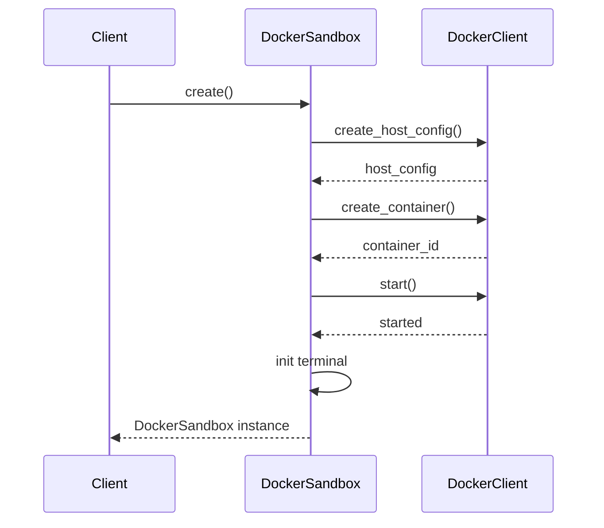

**Diagram sources**
- [sandbox.py](file://app/sandbox/core/sandbox.py#L48-L102)

**Section sources**
- [sandbox.py](file://app/sandbox/core/sandbox.py#L48-L102)

### execute() - Command Execution
The `run_command()` method executes shell commands within the sandbox environment, providing output as a string. It uses an asynchronous terminal interface with configurable timeouts.

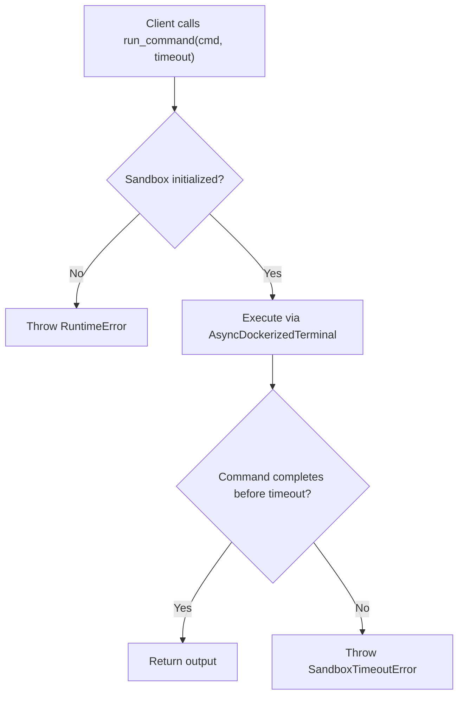

**Diagram sources**
- [sandbox.py](file://app/sandbox/core/sandbox.py#L139-L163)

**Section sources**
- [sandbox.py](file://app/sandbox/core/sandbox.py#L139-L163)

### copy_file() - File Transfer Operations
The sandbox provides bidirectional file transfer capabilities through `copy_to()` and `copy_from()` methods, enabling secure data exchange between host and container.

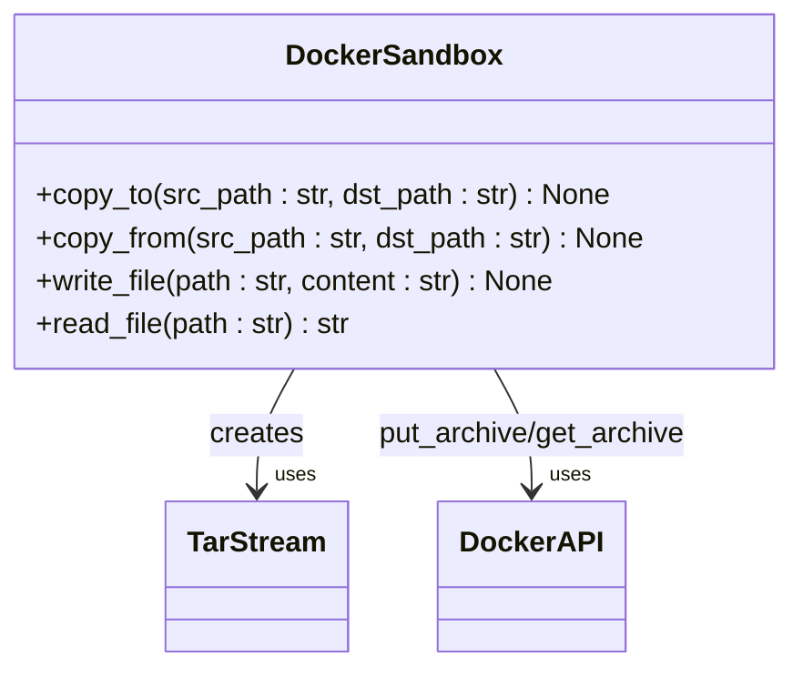

**Diagram sources**
- [sandbox.py](file://app/sandbox/core/sandbox.py#L314-L393)

**Section sources**
- [sandbox.py](file://app/sandbox/core/sandbox.py#L314-L393)

### stop() - Container Termination
The `cleanup()` method safely terminates the sandbox, stopping and removing the container while cleaning up associated resources.

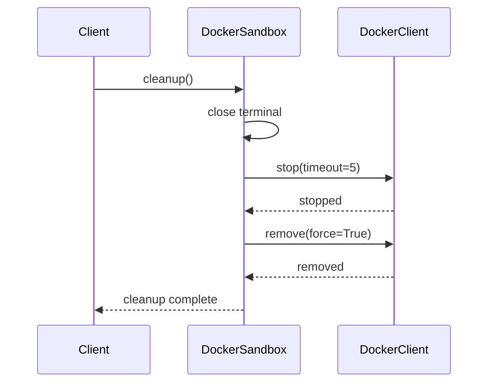

**Diagram sources**
- [sandbox.py](file://app/sandbox/core/sandbox.py#L424-L453)

**Section sources**
- [sandbox.py](file://app/sandbox/core/sandbox.py#L424-L453)

## SandboxManager Lifecycle Management

The SandboxManager class provides centralized control over multiple sandbox instances, handling creation, monitoring, and automatic cleanup of sandbox resources.

### Lifecycle Operations
The manager implements a comprehensive lifecycle management system with automatic cleanup of idle sandboxes and concurrent access control.

```mermaid
classDiagram
class SandboxManager {
+create_sandbox(config : SandboxSettings) str
+get_sandbox(sandbox_id : str) DockerSandbox
+delete_sandbox(sandbox_id : str) None
+cleanup() None
+get_stats() Dict
}
class DockerSandbox {
+create() DockerSandbox
+cleanup() None
}
SandboxManager --> "1..*" DockerSandbox : manages
SandboxManager --> "DockerClient" : interacts with
```

**Diagram sources**
- [manager.py](file://app/sandbox/core/manager.py#L13-L312)

**Section sources**
- [manager.py](file://app/sandbox/core/manager.py#L13-L312)

### Automatic Cleanup Mechanism
The manager includes an automatic cleanup system that monitors sandbox idle time and removes inactive instances to conserve resources.

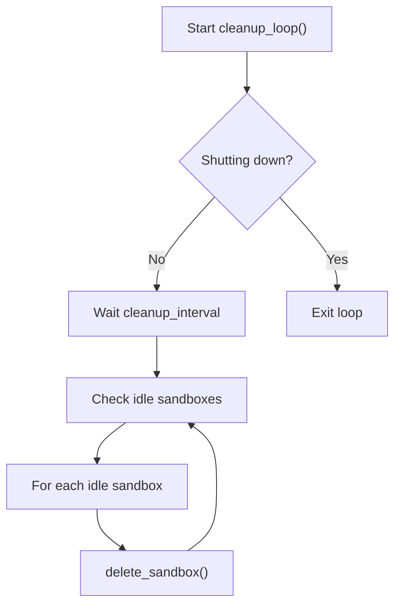

**Diagram sources**
- [manager.py](file://app/sandbox/core/manager.py#L173-L184)

**Section sources**
- [manager.py](file://app/sandbox/core/manager.py#L173-L184)

## Client-Server Interaction Model

The sandbox system implements a client-server architecture through the LocalSandboxClient class, providing a clean interface for interacting with sandbox environments.

### Client Interface
The client abstraction layer simplifies interaction with the sandbox system while maintaining separation between interface and implementation.

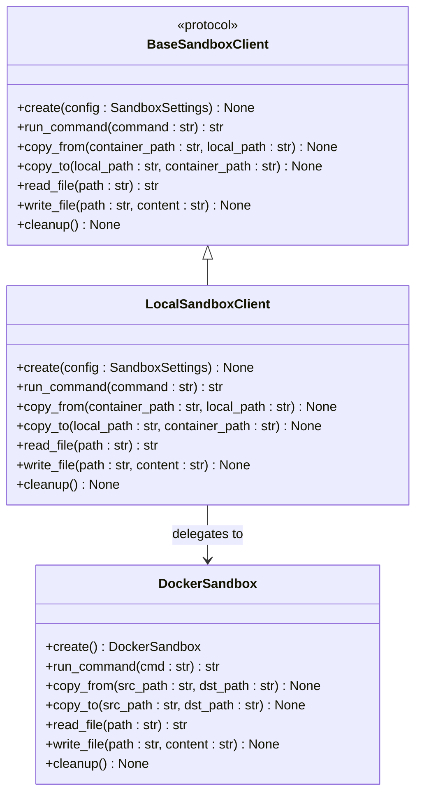

**Diagram sources**
- [client.py](file://app/sandbox/client.py#L49-L82)

**Section sources**
- [client.py](file://app/sandbox/client.py#L49-L82)

### Interaction Flow
The client-server interaction follows a consistent pattern for all operations, ensuring proper initialization and error handling.

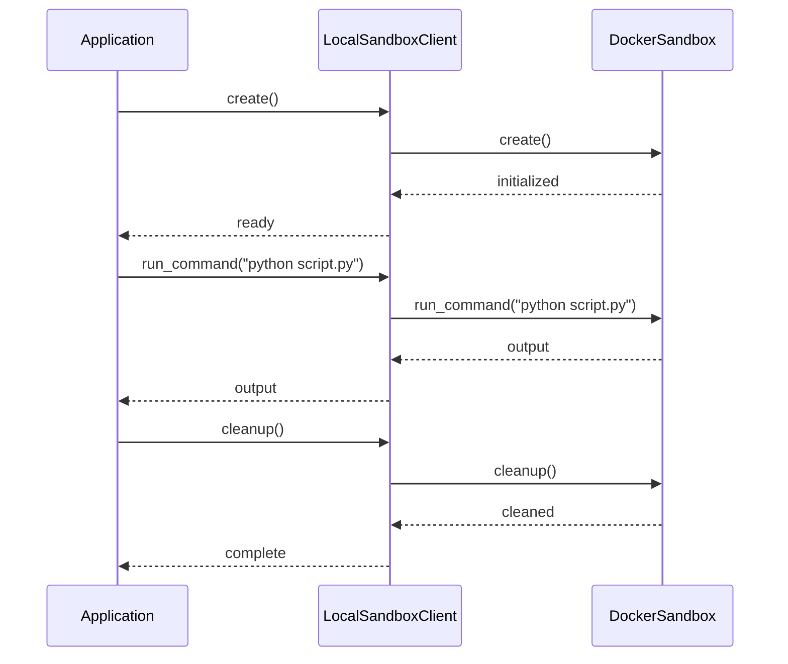

**Diagram sources**
- [client.py](file://app/sandbox/client.py#L92-L188)

**Section sources**
- [client.py](file://app/sandbox/client.py#L92-L188)

## Docker-Based Isolation Mechanism

The sandbox system leverages Docker containerization to provide secure isolation for code execution, with comprehensive resource controls and security boundaries.

### Container Configuration
The system configures Docker containers with specific resource limits and security settings to prevent resource exhaustion and unauthorized access.

```mermaid
classDiagram
class DockerSandbox {
-config : SandboxSettings
-client : DockerClient
-container : Container
-terminal : AsyncDockerizedTerminal
}
class SandboxSettings {
+image : str
+work_dir : str
+memory_limit : str
+cpu_limit : float
+timeout : int
+network_enabled : bool
}
class AsyncDockerizedTerminal {
-session : DockerSession
-container : Container
-working_dir : str
}
DockerSandbox --> SandboxSettings : uses
DockerSandbox --> AsyncDockerizedTerminal : uses
DockerSandbox --> "Docker API" : communicates with
```

**Diagram sources**
- [sandbox.py](file://app/sandbox/core/sandbox.py#L31-L46)
- [config.py](file://app/config.py#L93-L104)

**Section sources**
- [sandbox.py](file://app/sandbox/core/sandbox.py#L31-L46)
- [config.py](file://app/config.py#L93-L104)

### Volume Mounting
The system implements secure volume mounting to enable file sharing between host and container while preventing path traversal attacks.

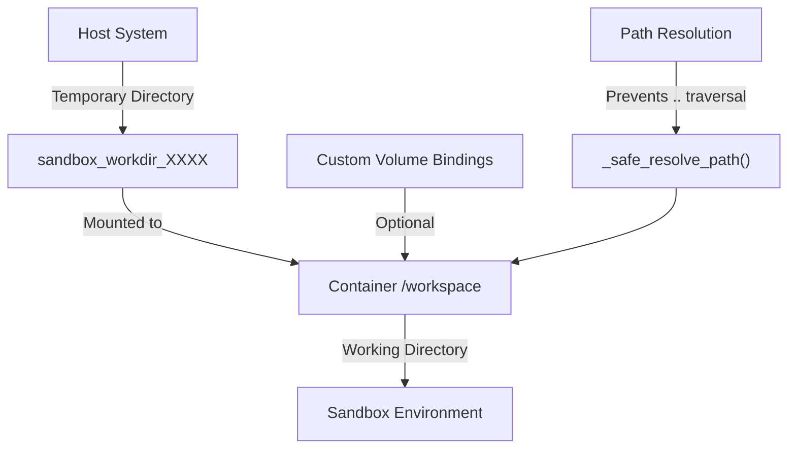

**Diagram sources**
- [sandbox.py](file://app/sandbox/core/sandbox.py#L104-L120)
- [sandbox.py](file://app/sandbox/core/sandbox.py#L231-L252)

**Section sources**
- [sandbox.py](file://app/sandbox/core/sandbox.py#L104-L120)
- [sandbox.py](file://app/sandbox/core/sandbox.py#L231-L252)

### Security Boundaries
The sandbox enforces multiple security boundaries to prevent container escape and unauthorized system access.

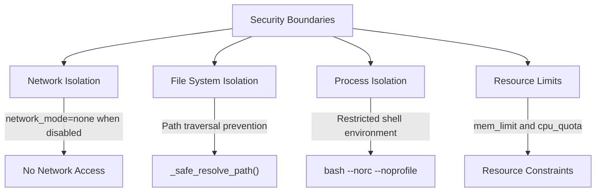

**Diagram sources**
- [sandbox.py](file://app/sandbox/core/sandbox.py#L48-L102)
- [sandbox.py](file://app/sandbox/core/sandbox.py#L231-L252)

**Section sources**
- [sandbox.py](file://app/sandbox/core/sandbox.py#L48-L102)
- [sandbox.py](file://app/sandbox/core/sandbox.py#L231-L252)

## Configuration and Settings

The sandbox system is configured through the SandboxSettings class, which defines all container parameters and resource limits.

### SandboxSettings Configuration
The SandboxSettings class provides comprehensive configuration options for container behavior and resource allocation.

| Parameter | Default Value | Description |
|---------|-------------|-------------|
| use_sandbox | False | Whether to use the sandbox environment |
| image | python:3.12-slim | Base Docker image for the container |
| work_dir | /workspace | Working directory inside the container |
| memory_limit | 512m | Memory limit for the container |
| cpu_limit | 1.0 | CPU limit (as fraction of available CPU) |
| timeout | 300 | Default command timeout in seconds |
| network_enabled | False | Whether network access is allowed |

**Section sources**
- [config.py](file://app/config.py#L93-L104)

### Resource Configuration
Resource limits are applied at container creation time through Docker host configuration.

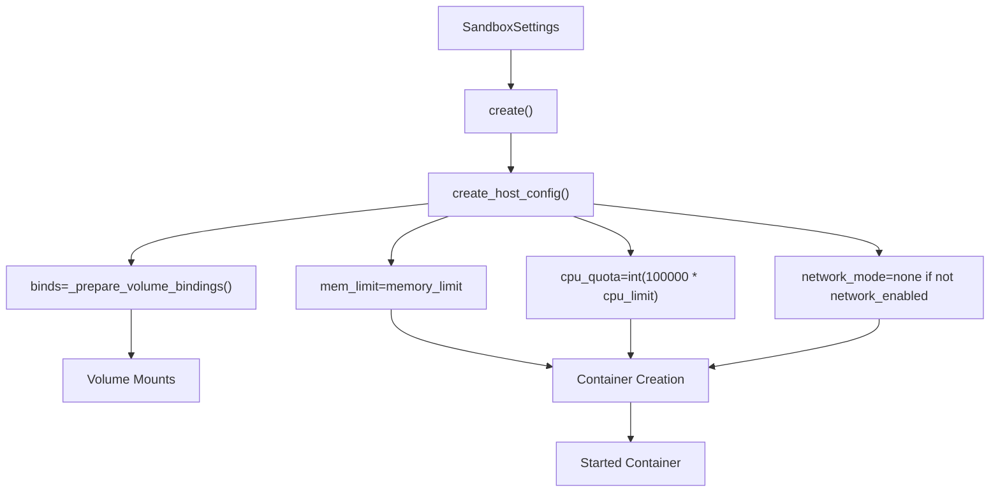

**Diagram sources**
- [sandbox.py](file://app/sandbox/core/sandbox.py#L48-L102)

**Section sources**
- [sandbox.py](file://app/sandbox/core/sandbox.py#L48-L102)

## Usage Examples

### Executing Python Code
The sandbox can execute Python code with full package access and file system operations.

```python
# Create sandbox client
client = create_sandbox_client()

# Configure sandbox with Python environment
config = SandboxSettings(
    image="python:3.12-slim",
    work_dir="/workspace",
    memory_limit="1g",
    cpu_limit=0.5,
    timeout=600,
    network_enabled=True
)

# Initialize sandbox
await client.create(config)

# Write Python script
python_code = """
import numpy as np
import pandas as pd

# Create sample data
data = np.random.randn(100, 3)
df = pd.DataFrame(data, columns=['A', 'B', 'C'])

# Save to CSV
df.to_csv('data.csv', index=False)
print(f"Created dataset with {len(df)} rows")
"""

await client.write_file("/workspace/script.py", python_code)

# Execute script
output = await client.run_command("python3 script.py")
print(output)

# Retrieve generated file
await client.copy_from("/workspace/data.csv", "./data.csv")

# Cleanup
await client.cleanup()
```

**Section sources**
- [client.py](file://app/sandbox/client.py#L109-L124)
- [sandbox.py](file://app/sandbox/core/sandbox.py#L197-L229)

### Transferring Files
The system supports bidirectional file transfer between host and container.

```python
# Copy file to container
await client.copy_to("./local_data.csv", "/workspace/data.csv")

# Read file content directly
content = await client.read_file("/workspace/data.csv")
print(f"File size: {len(content)} characters")

# Write processed data back
processed_content = content.upper()  # Example processing
await client.write_file("/workspace/processed.txt", processed_content)

# Copy processed file to host
await client.copy_from("/workspace/processed.txt", "./processed.txt")
```

**Section sources**
- [client.py](file://app/sandbox/client.py#L140-L152)
- [client.py](file://app/sandbox/client.py#L154-L168)

### Managing Container Resources
Resource usage can be monitored and controlled through configuration.

```python
# Create resource-constrained sandbox
limited_config = SandboxSettings(
    image="python:3.12-slim",
    memory_limit="256m",  # Limited memory
    cpu_limit=0.2,       # Limited CPU
    timeout=120          # Short timeout
)

await client.create(limited_config)

# Monitor resource usage through Docker API
container = client.sandbox.container
stats = container.stats(stream=False)
memory_usage = stats['memory_stats']['usage']
cpu_usage = stats['cpu_stats']['cpu_usage']['total_usage']

print(f"Memory usage: {memory_usage} bytes")
print(f"CPU usage: {cpu_usage} units")
```

**Section sources**
- [sandbox.py](file://app/sandbox/core/sandbox.py#L45-L45)
- [client.py](file://app/sandbox/client.py#L90-L90)

## Error Handling

The sandbox system implements comprehensive error handling for various failure scenarios.

### Error Types
The system defines specific exception types for different error conditions.

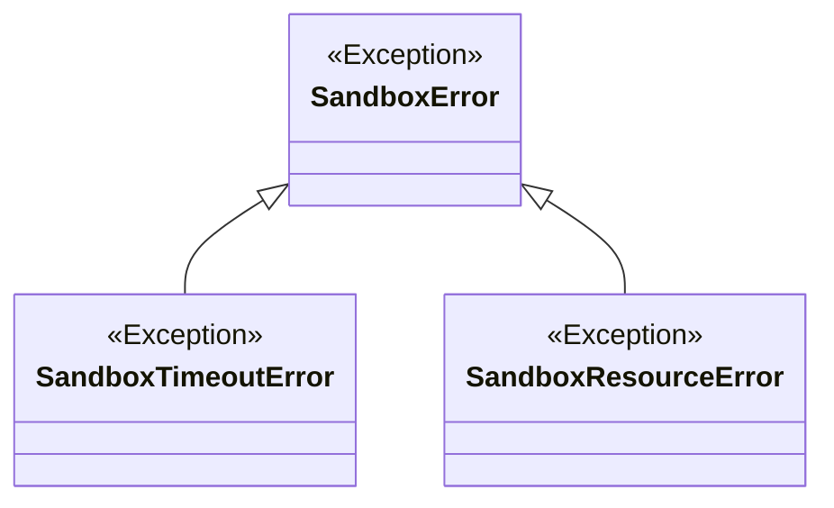

**Diagram sources**
- [exceptions.py](file://app/sandbox/core/exceptions.py#L7-L16)

**Section sources**
- [exceptions.py](file://app/sandbox/core/exceptions.py#L7-L16)

### Common Error Conditions
The system handles various error conditions with appropriate responses.

| Error Condition | Exception Type | Handling Strategy |
|----------------|----------------|-------------------|
| Container startup failure | RuntimeError | Cleanup resources and re-throw |
| Execution timeout | SandboxTimeoutError | Terminate command and return error |
| Resource exhaustion | SandboxResourceError | Prevent container creation |
| File not found | FileNotFoundError | Return appropriate error |
| Path traversal attempt | ValueError | Reject unsafe paths |
| Network access denied | RuntimeError | Block network operations |

**Section sources**
- [sandbox.py](file://app/sandbox/core/sandbox.py#L48-L102)
- [sandbox.py](file://app/sandbox/core/sandbox.py#L139-L163)
- [sandbox.py](file://app/sandbox/core/sandbox.py#L231-L252)

### Error Handling Examples
```python
# Handle container startup failures
try:
    await client.create(config)
except RuntimeError as e:
    print(f"Failed to create sandbox: {e}")
    # Retry with different configuration or image
    config.image = "python:3.11-slim"
    await client.create(config)

# Handle execution timeouts
try:
    output = await client.run_command("long_running_process.sh", timeout=30)
except SandboxTimeoutError as e:
    print(f"Command timed out: {e}")
    # Handle timeout appropriately

# Handle file operations
try:
    content = await client.read_file("/workspace/nonexistent.txt")
except FileNotFoundError as e:
    print(f"File not found: {e}")
    # Create file or handle missing file
```

**Section sources**
- [sandbox.py](file://app/sandbox/core/sandbox.py#L165-L195)
- [sandbox.py](file://app/sandbox/core/sandbox.py#L139-L163)

## Integration with Daytona Workspaces

The sandbox system can be integrated with Daytona workspaces for cloud-based development environments.

### Configuration
Daytona settings are configured through the DaytonaSettings class in the configuration system.

```python
# Configuration in config.toml
[daytona]
daytona_api_key = "your-api-key"
daytona_server_url = "https://app.daytona.io/api"
daytona_target = "us"
sandbox_image_name = "whitezxj/sandbox:0.1.0"
VNC_password = "123456"
```

**Section sources**
- [config.py](file://app/config.py#L130-L138)

### Integration Workflow
The integration follows a specific workflow for creating and managing Daytona-based sandboxes.

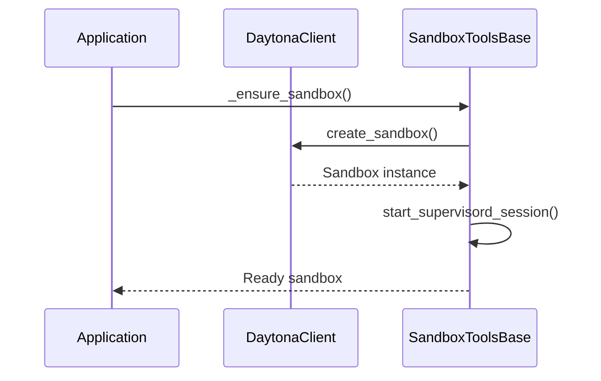

**Diagram sources**
- [tool_base.py](file://app/daytona/tool_base.py#L75-L100)

**Section sources**
- [tool_base.py](file://app/daytona/tool_base.py#L75-L100)

### Usage Example
```python
# Initialize Daytona-based sandbox
from app.daytona.sandbox import create_sandbox
from app.daytona.tool_base import SandboxToolsBase

# Create sandbox with Daytona
sandbox = create_sandbox(password="secure_password", project_id="my-project")

# Access sandbox through tools base
tools_base = SandboxToolsBase()
tools_base._sandbox = sandbox
await tools_base._ensure_sandbox()

# Use sandbox for operations
print(f"Sandbox URL: {sandbox.get_preview_link(8080)}")
```

**Section sources**
- [sandbox.py](file://app/daytona/sandbox.py#L100-L130)
- [tool_base.py](file://app/daytona/tool_base.py#L75-L100)