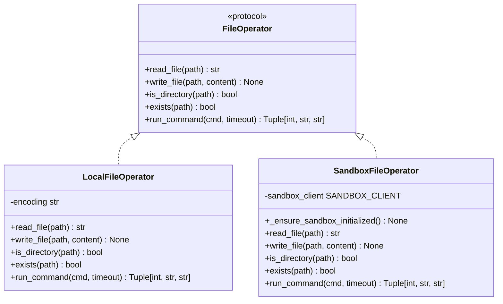

# Tool API

<cite>
**Referenced Files in This Document**   
- [base.py](file://app/tool/base.py)
- [tool_collection.py](file://app/tool/tool_collection.py)
- [python_execute.py](file://app/tool/python_execute.py)
- [browser_use_tool.py](file://app/tool/browser_use_tool.py)
- [file_operators.py](file://app/tool/file_operators.py)
- [web_search.py](file://app/tool/web_search.py)
</cite>

## Table of Contents
1. [Introduction](#introduction)
2. [Core Tool Interface](#core-tool-interface)
3. [Tool Collection Management](#tool-collection-management)
4. [Key Tool Implementations](#key-tool-implementations)
5. [Execution Patterns and Integration](#execution-patterns-and-integration)
6. [Security and Sandboxing](#security-and-sandboxing)
7. [Conclusion](#conclusion)

## Introduction
The Tool system in OpenManus provides a comprehensive framework for executing various operations through a standardized interface. This documentation details the base Tool class interface, the ToolCollection for managing tool registration and discovery, and key tool implementations including PythonExecute, BrowserUseTool, FileOperators, and WebSearch. The system supports asynchronous execution, timeout handling, and sandboxing considerations for secure tool execution.

## Core Tool Interface

The foundation of the Tool system is built upon the BaseTool class, which defines a standardized interface for all tools. This interface ensures consistent behavior across different tool implementations and provides essential methods for tool execution and schema management.

The BaseTool class inherits from both ABC (Abstract Base Class) and BaseModel, combining abstract method definitions with Pydantic model validation capabilities. It requires all concrete tool implementations to provide an `execute` method that handles the actual tool functionality. The interface also includes `invoke()` (implemented via `__call__`), `validate_args()`, and `get_schema()` (implemented via `to_param()`) methods to standardize tool invocation and parameter handling.

ToolResult serves as the standardized response format, capable of representing both successful outputs and error conditions. It includes fields for output data, error messages, base64-encoded images, and system messages, providing a comprehensive response structure that can handle various tool output types.

**Section sources**
- [base.py](file://app/tool/base.py#L8-L181)

## Tool Collection Management

The ToolCollection class provides a centralized mechanism for managing multiple tools within the OpenManus system. It acts as a registry and execution coordinator for all available tools, enabling efficient tool discovery and invocation.

The collection maintains tools in both a tuple (`tools`) and a dictionary (`tool_map`) for optimal performance. The dictionary structure allows O(1) lookup by tool name, while the tuple preserves insertion order for sequential operations. When initialized, the ToolCollection accepts variable arguments of BaseTool instances and automatically maps them by name for quick retrieval.

Key functionality includes:
- Single tool execution via the `execute` method, which takes a tool name and input parameters
- Sequential execution of all registered tools through `execute_all`
- Tool retrieval via `get_tool` by name
- Dynamic tool registration with `add_tool` and `add_tools` methods

The execute method implements error handling through try-except blocks, converting ToolError exceptions into ToolFailure responses while capturing successful executions in ToolResult objects. This ensures consistent error reporting across all tools in the collection.

**Section sources**
- [tool_collection.py](file://app/tool/tool_collection.py#L8-L70)

## Key Tool Implementations

### PythonExecute Tool

The PythonExecute tool enables secure execution of Python code with timeout protection and safety restrictions. It operates in a separate process to prevent memory leaks and ensure proper resource cleanup.

The tool accepts a code string parameter and executes it in a restricted environment with controlled global variables. Execution occurs in a multiprocessing process with a configurable timeout (default: 5 seconds). If execution exceeds the timeout, the process is terminated to prevent hanging operations.

Security measures include:
- Isolated execution environment with limited built-in functions
- Output capture through StringIO to prevent direct stdout manipulation
- Process-level isolation to contain potential security issues

The tool captures both successful outputs and exceptions, returning them in a structured dictionary format with observation and success status fields.

**Section sources**
- [python_execute.py](file://app/tool/python_execute.py#L8-L74)

### BrowserUseTool

The BrowserUseTool provides comprehensive browser automation capabilities using Playwright-based technology. It maintains persistent browser sessions across multiple calls, allowing for complex multi-step interactions with web pages.

The tool supports a wide range of actions through its action parameter, including:
- Navigation (go_to_url, go_back, refresh)
- Element interaction (click_element, input_text)
- Scrolling (scroll_down, scroll_up, scroll_to_text)
- Content extraction (extract_content)
- Tab management (switch_tab, open_tab, close_tab)
- Web search functionality

Each action has specific parameter requirements defined in the tool's dependencies configuration. The tool maintains state through its context and browser attributes, ensuring continuity between operations. It also includes screenshot capabilities for visual feedback and debugging.

**Section sources**
- [browser_use_tool.py](file://app/tool/browser_use_tool.py#L38-L456)

### FileOperators

The FileOperators module provides a unified interface for file system interactions with support for both local and sandboxed environments. It implements the FileOperator protocol with two concrete implementations: LocalFileOperator and SandboxFileOperator.

Key capabilities include:
- Reading and writing files with specified encoding
- Directory existence and type checking
- Shell command execution with timeout handling
- Cross-platform path handling

The SandboxFileOperator integrates with the OpenManus sandbox system, routing file operations through a secure client interface. Both implementations include comprehensive error handling and timeout protection for long-running operations.



**Diagram sources**
- [file_operators.py](file://app/tool/file_operators.py#L0-L158)

### WebSearch Tool

The WebSearch tool provides multi-engine search capabilities with automatic fallback between different search providers. It supports Google, Baidu, DuckDuckGo, and Bing search engines, attempting queries in a configurable order.

Key features include:
- Configurable search engine priority and fallback sequence
- Automatic retry logic with exponential backoff
- Content fetching from search result pages
- Structured result formatting with metadata

The tool implements a resilient search strategy, trying each engine in sequence and falling back to alternatives if the primary engine fails. It can optionally fetch full content from result pages for deeper analysis. Results are returned in a structured SearchResponse format that inherits from ToolResult, providing both human-readable output and structured data access.

```mermaid
sequenceDiagram
participant User
participant WebSearch
participant SearchEngine
participant ContentFetcher
User->>WebSearch : execute(query, num_results, fetch_content)
WebSearch->>WebSearch : Determine engine order
loop For each engine in order
WebSearch->>SearchEngine : perform_search(query)
alt Search successful
SearchEngine-->>WebSearch : Return results
WebSearch->>WebSearch : Transform to SearchResult
alt fetch_content=True
WebSearch->>ContentFetcher : fetch_content(url)
ContentFetcher-->>WebSearch : Page content
end
WebSearch-->>User : Return SearchResponse
break
end
end
alt All engines failed
WebSearch-->>User : Return error response
end
```

**Diagram sources**
- [web_search.py](file://app/tool/web_search.py#L155-L407)

## Execution Patterns and Integration

Tools in OpenManus are designed to integrate seamlessly with agent systems through standardized invocation patterns. The ToolCollection serves as the primary interface between agents and individual tools, providing a unified execution API.

Asynchronous execution is supported throughout the system, with all execute methods implemented as async functions. This allows for non-blocking operations and efficient resource utilization, particularly important for I/O-bound operations like web requests and file operations.

Timeout handling is implemented at multiple levels:
- PythonExecute uses process-level timeouts
- FileOperators include command execution timeouts
- WebSearch implements retry mechanisms with configurable delays
- BrowserUseTool operations have implicit Playwright timeouts

Error handling follows a consistent pattern across all tools, with exceptions caught and converted to ToolFailure responses containing descriptive error messages. This standardized error reporting enables agents to handle failures uniformly regardless of the underlying tool.

## Security and Sandboxing

The Tool system incorporates multiple security layers to protect the host environment:
- PythonExecute runs code in isolated processes with restricted globals
- FileOperations can route through sandboxed environments
- BrowserUseTool operates in dedicated browser contexts
- All tools implement input validation and parameter checking

The sandboxing architecture allows tools to operate in isolated environments when required, with the SandboxFileOperator and related sandbox tools providing secure execution contexts. This separation ensures that potentially risky operations are contained and cannot affect the main system.

## Conclusion

The Tool API in OpenManus provides a robust, extensible framework for executing various operations through a standardized interface. The system balances flexibility with security, enabling powerful functionality while maintaining appropriate safeguards. The modular design allows for easy addition of new tools while ensuring consistent behavior across the entire tool ecosystem.