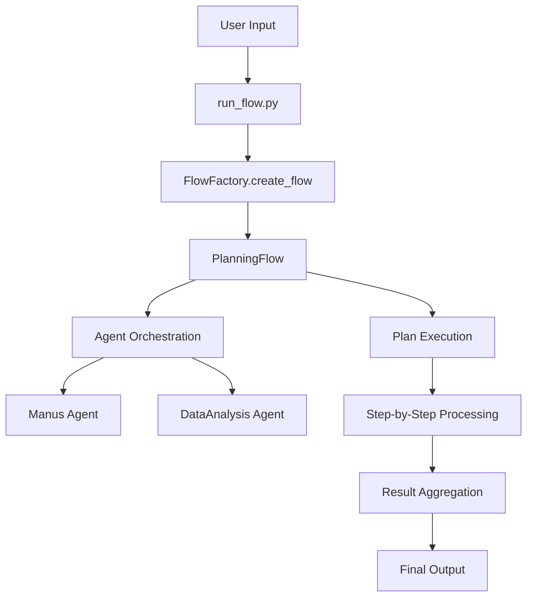
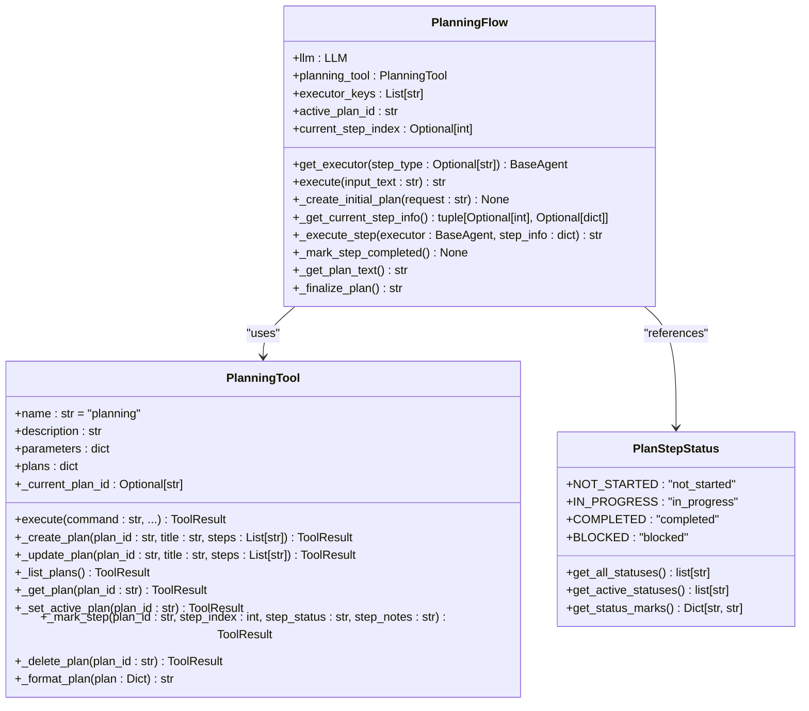
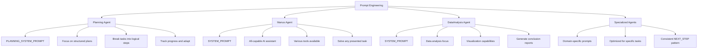
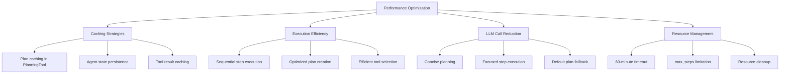
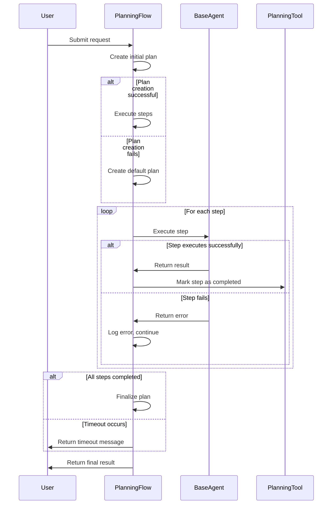
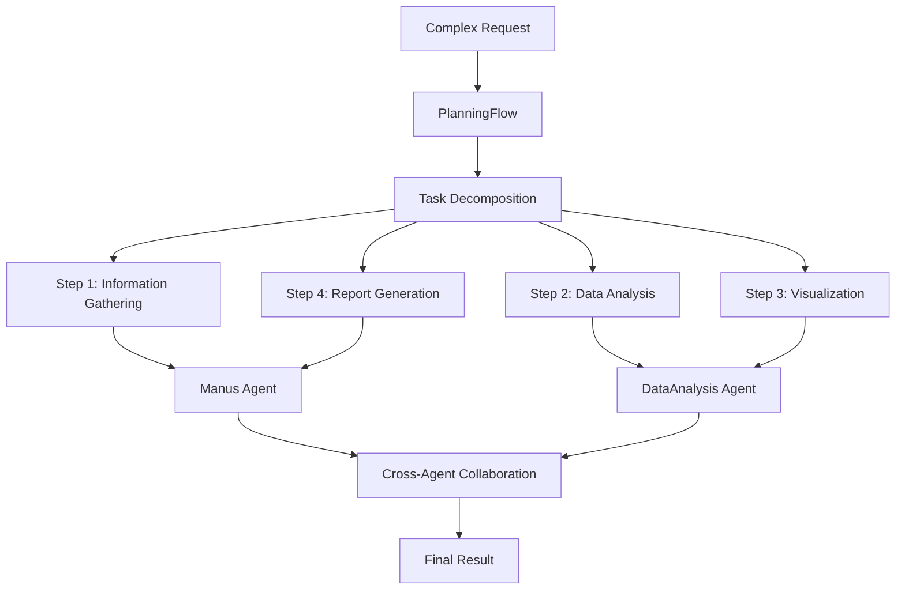

# Advanced Features

<cite>
**Referenced Files in This Document**   
- [run_flow.py](file://run_flow.py)
- [app/flow/base.py](file://app/flow/base.py)
- [app/flow/planning.py](file://app/flow/planning.py)
- [app/flow/flow_factory.py](file://app/flow/flow_factory.py)
- [app/prompt/planning.py](file://app/prompt/planning.py)
- [app/prompt/manus.py](file://app/prompt/manus.py)
- [app/prompt/visualization.py](file://app/prompt/visualization.py)
- [app/tool/planning.py](file://app/tool/planning.py)
- [app/agent/manus.py](file://app/agent/manus.py)
- [app/agent/data_analysis.py](file://app/agent/data_analysis.py)
</cite>

## Table of Contents
1. [Multi-Agent Workflows](#multi-agent-workflows)
2. [Planning Strategies](#planning-strategies)
3. [Custom Prompt Engineering](#custom-prompt-engineering)
4. [Performance Optimization Techniques](#performance-optimization-techniques)
5. [Error Handling and Recovery](#error-handling-and-recovery)
6. [Advanced Use Cases](#advanced-use-cases)
7. [Best Practices](#best-practices)

## Multi-Agent Workflows

The OpenManus framework orchestrates complex multi-agent workflows through the `run_flow.py` entry point and the `app/flow` components. The system enables coordinated execution among specialized agents to solve complex tasks through structured planning and delegation.

The workflow begins in `run_flow.py`, which initializes the flow execution environment and creates agent instances based on configuration. The `FlowFactory` class in `app/flow/flow_factory.py` serves as the central mechanism for creating different types of flows, currently supporting the `PLANNING` flow type. This factory pattern allows for extensible flow creation while maintaining consistent initialization patterns.

The `PlanningFlow` class in `app/flow/planning.py` manages the execution lifecycle, coordinating between multiple agents to accomplish complex tasks. Agents are registered with unique keys, allowing the flow to route specific steps to appropriate specialists. For example, the Manus agent handles general tasks while the DataAnalysis agent specializes in data processing workflows.

**Diagram sources**
- [run_flow.py](file://run_flow.py)
- [app/flow/flow_factory.py](file://app/flow/flow_factory.py)
- [app/flow/planning.py](file://app/flow/planning.py)

**Section sources**
- [run_flow.py](file://run_flow.py)
- [app/flow/flow_factory.py](file://app/flow/flow_factory.py)
- [app/flow/planning.py](file://app/flow/planning.py)

## Planning Strategies

The planning system in `app/flow/planning.py` implements a sophisticated task decomposition strategy that breaks complex requests into manageable steps. The `PlanningFlow` class uses the `PlanningTool` to create, manage, and track progress on multi-step plans.

When a request is received, the system creates an initial plan by leveraging the LLM's capabilities through the `planning` tool. The planning process considers the available agents and their capabilities, as specified in the `executor_keys` parameter. The system generates a concise, actionable plan focused on key milestones rather than detailed sub-steps, optimizing for clarity and efficiency.

Each plan consists of steps with defined statuses: NOT_STARTED, IN_PROGRESS, COMPLETED, or BLOCKED. The system tracks progress through these states, automatically updating the status as steps are executed. The `_get_current_step_info` method identifies the first non-completed step, ensuring sequential execution while allowing for status tracking and progress monitoring.

The planning system supports agent selection based on step type, allowing specific agents to be assigned to particular tasks. When creating steps, the system can specify agent names using the format '[agent_name]' to direct execution to the appropriate specialist. This enables optimized routing of tasks to the most capable agent for each specific step.

**Diagram sources**
- [app/flow/planning.py](file://app/flow/planning.py)
- [app/tool/planning.py](file://app/tool/planning.py)

**Section sources**
- [app/flow/planning.py](file://app/flow/planning.py)

## Custom Prompt Engineering

OpenManus employs sophisticated prompt engineering strategies across its agent ecosystem to influence behavior and optimize performance. Each agent type has specialized prompts defined in the `app/prompt/` module, allowing for tailored interactions based on the agent's capabilities and responsibilities.

The `PLANNING_SYSTEM_PROMPT` in `app/prompt/planning.py` defines the role of the planning agent as an expert tasked with solving problems efficiently through structured plans. The prompt emphasizes analyzing requests, creating actionable plans, executing steps with available tools, tracking progress, and adapting plans when necessary. It specifically instructs the agent to break tasks into logical steps with clear outcomes while avoiding excessive detail or sub-steps.

For general-purpose agents like Manus, the `SYSTEM_PROMPT` in `app/prompt/manus.py` positions the agent as an all-capable AI assistant aimed at solving any task presented by the user. The prompt highlights the availability of various tools for programming, information retrieval, file processing, web browsing, and human interaction, establishing the agent's broad capabilities.

Specialized agents have domain-specific prompts that guide their behavior. For example, the DataAnalysis agent uses prompts from `app/prompt/visualization.py` that emphasize data analysis and visualization tasks, with specific instructions to generate analysis conclusion reports at the end of processing.

The `NEXT_STEP_PROMPT` pattern is used consistently across agents to guide the selection of appropriate tools and actions. These prompts encourage proactive tool selection, clear explanation of execution results, and suggestion of next steps, creating a coherent decision-making framework across the agent ecosystem.

**Diagram sources**
- [app/prompt/planning.py](file://app/prompt/planning.py)
- [app/prompt/manus.py](file://app/prompt/manus.py)
- [app/prompt/visualization.py](file://app/prompt/visualization.py)

**Section sources**
- [app/prompt/planning.py](file://app/prompt/planning.py)
- [app/prompt/manus.py](file://app/prompt/manus.py)
- [app/prompt/visualization.py](file://app/prompt/visualization.py)

## Performance Optimization Techniques

OpenManus implements several performance optimization techniques to enhance efficiency and reduce resource consumption during complex task execution. These optimizations focus on caching, execution efficiency, and LLM call reduction.

The system employs a timeout mechanism in `run_flow.py` with a 60-minute timeout for the entire execution, preventing indefinite processing of complex requests. This timeout is implemented using `asyncio.wait_for`, ensuring that resources are not consumed indefinitely by potentially problematic requests.

The planning system in `app/flow/planning.py` optimizes execution by creating concise, actionable plans that focus on key milestones rather than detailed sub-steps. This approach reduces cognitive load on the LLM and minimizes the number of required interactions. The system also implements a fallback mechanism, creating a default plan if the initial planning attempt fails, ensuring robustness without excessive retry attempts.

Agent execution is optimized through the use of appropriate tool selection and step-by-step processing. The `PlanningFlow` class executes steps sequentially, but each step can leverage multiple tools as needed. This balanced approach prevents overwhelming the system with parallel operations while still allowing for efficient task completion.

The agent framework includes built-in limits on execution steps through the `max_steps` parameter, preventing infinite loops and resource exhaustion. For example, the Manus agent has a `max_steps` limit of 20, while the DataAnalysis agent has a limit of 20 steps, providing a safety mechanism against runaway execution.

**Diagram sources**
- [run_flow.py](file://run_flow.py)
- [app/flow/planning.py](file://app/flow/planning.py)
- [app/agent/manus.py](file://app/agent/manus.py)
- [app/agent/data_analysis.py](file://app/agent/data_analysis.py)

**Section sources**
- [run_flow.py](file://run_flow.py)
- [app/flow/planning.py](file://app/flow/planning.py)

## Error Handling and Recovery

The OpenManus framework implements comprehensive error handling and recovery mechanisms to ensure robust operation during complex task execution. These mechanisms span multiple levels of the system, from individual agents to the overall flow orchestration.

At the agent level, the `BaseAgent` class includes a `state_context` context manager that ensures safe state transitions. If an exception occurs during execution, the agent transitions to the ERROR state, preserving the integrity of the overall system state. The `run` method in `app/agent/base.py` includes exception handling that ensures proper cleanup of resources even when errors occur.

The planning system in `app/flow/planning.py` includes multiple layers of error handling. The main `execute` method is wrapped in a try-except block that logs errors and returns a failure message, preventing unhandled exceptions from terminating the entire process. Individual step execution is also wrapped in try-except blocks, allowing the system to continue processing even if individual steps fail.

The `PlanningTool` class implements defensive programming practices, validating inputs and handling edge cases gracefully. For example, when marking a step as completed, the system includes fallback mechanisms to update step status directly in storage if the primary update method fails. This ensures that progress is tracked even when individual operations encounter issues.

The system also includes timeout handling in `run_flow.py`, with a 60-minute timeout for the entire execution. When a timeout occurs, the system provides a user-friendly message suggesting simpler requests, rather than failing silently or crashing.

**Diagram sources**
- [app/flow/planning.py](file://app/flow/planning.py)
- [app/agent/base.py](file://app/agent/base.py)
- [app/tool/planning.py](file://app/tool/planning.py)
- [run_flow.py](file://run_flow.py)

**Section sources**
- [app/flow/planning.py](file://app/flow/planning.py)
- [app/agent/base.py](file://app/agent/base.py)

## Advanced Use Cases

OpenManus supports advanced use cases including autonomous task chains and cross-agent collaboration through its sophisticated flow orchestration system. These capabilities enable the framework to handle complex, multi-step tasks that require coordination between specialized agents.

Autonomous task chains are implemented through the planning system in `app/flow/planning.py`, where complex requests are decomposed into sequential steps that can be executed by different agents. The system maintains context across steps, allowing for progressive refinement of solutions. For example, a request might first be processed by the Manus agent for general understanding, then delegated to the DataAnalysis agent for specific data processing, and finally returned to the Manus agent for final synthesis.

Cross-agent collaboration is facilitated by the `FlowFactory` and `PlanningFlow` classes, which allow multiple agents to be registered and orchestrated within a single execution flow. Agents can be assigned to specific types of tasks based on their capabilities, with the planning system routing steps to the appropriate specialist. This enables efficient division of labor, where each agent focuses on tasks within its area of expertise.

The system supports dynamic agent configuration, allowing agents to be added or removed based on the requirements of the current task. In `run_flow.py`, the DataAnalysis agent is conditionally included based on configuration, demonstrating how the system can adapt its capabilities to the specific needs of a request.

**Diagram sources**
- [run_flow.py](file://run_flow.py)
- [app/flow/planning.py](file://app/flow/planning.py)
- [app/agent/manus.py](file://app/agent/manus.py)
- [app/agent/data_analysis.py](file://app/agent/data_analysis.py)

**Section sources**
- [run_flow.py](file://run_flow.py)
- [app/flow/planning.py](file://app/flow/planning.py)

## Best Practices

To effectively scale and maintain complex agent systems in OpenManus, several best practices should be followed. These practices ensure reliability, performance, and maintainability of the agent ecosystem.

When designing agents, follow the principle of specialization, creating agents with focused capabilities rather than general-purpose agents that attempt to do everything. This approach improves performance and makes the system more maintainable. The existing separation between the Manus agent for general tasks and the DataAnalysis agent for data processing exemplifies this principle.

Implement comprehensive error handling at multiple levels of the system. Use the `state_context` context manager for safe state transitions, wrap critical operations in try-except blocks, and provide meaningful error messages that aid in debugging. The planning system's fallback to default plans when initial planning fails demonstrates robust error recovery.

Optimize performance by limiting the scope of individual steps and avoiding unnecessary LLM calls. Create concise plans that focus on key milestones rather than detailed sub-steps, and use appropriate timeouts to prevent resource exhaustion. The 60-minute timeout in `run_flow.py` and the `max_steps` limitation in agents provide essential safeguards.

Ensure proper resource management by implementing cleanup methods that release resources when agents are no longer needed. The `cleanup` method in the Manus agent demonstrates this practice by properly closing browser contexts and disconnecting from MCP servers.

Maintain clear separation of concerns between components. Keep planning logic in the `PlanningFlow` class, agent-specific behavior in individual agent classes, and tool functionality in the `app/tool` module. This modular design makes the system easier to understand, test, and extend.

```mermaid
flowchart TD
A["Best Practices"] --> B["Specialization"]
A --> C["Error Handling"]
A --> D["Performance Optimization"]
A --> E["Resource Management"]
A --> F["Separation of Concerns"]
B --> G["Create focused agents"]
B --> H["Assign tasks by capability"]
B --> I["Use executor_keys for routing"]
C --> J["Use state_context"]
C --> K["Implement try-except blocks"]
C --> L["Provide fallback mechanisms"]
D --> M["Limit step scope"]
D --> N["Use appropriate timeouts"]
D --> O["Set max_steps limits"]
E --> P["Implement cleanup methods"]
E --> Q["Release resources promptly"]
E --> R["Handle interruptions gracefully"]
F --> S["Keep planning in PlanningFlow"]
F --> T["Keep agent logic in agents"]
F --> U["Keep tools in app/tool"]
```

**Diagram sources**
- [app/flow/planning.py](file://app/flow/planning.py)
- [app/agent/base.py](file://app/agent/base.py)
- [app/agent/manus.py](file://app/agent/manus.py)
- [app/tool/planning.py](file://app/tool/planning.py)
- [run_flow.py](file://run_flow.py)

**Section sources**
- [app/flow/planning.py](file://app/flow/planning.py)
- [app/agent/base.py](file://app/agent/base.py)
- [run_flow.py](file://run_flow.py)