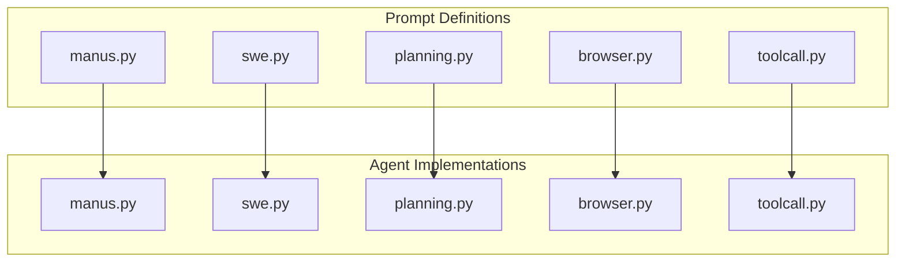
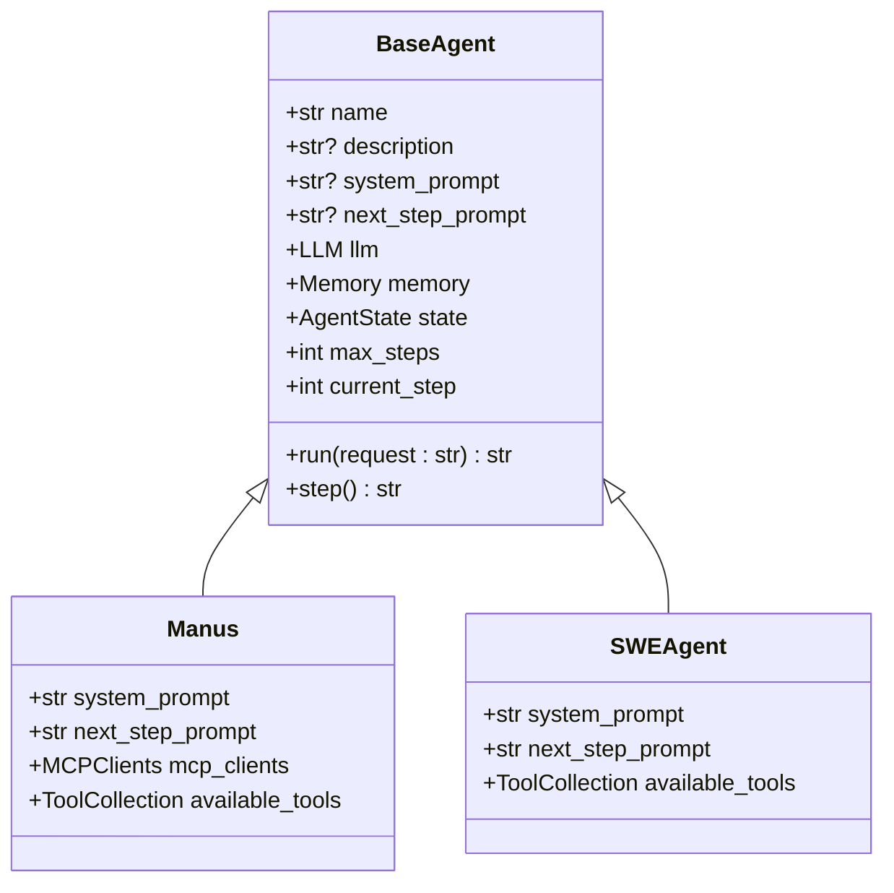
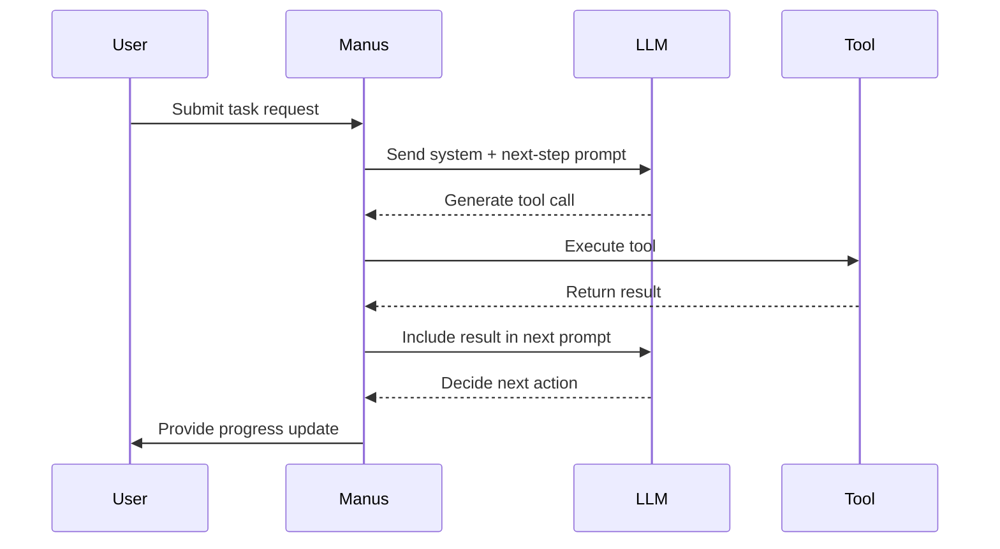
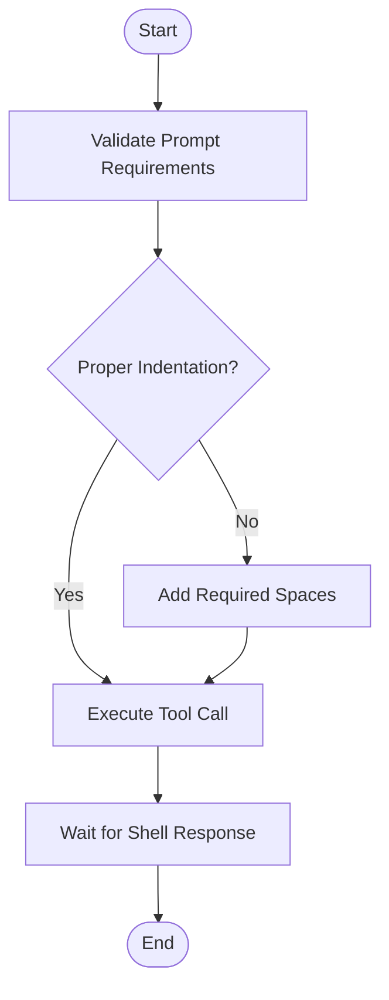
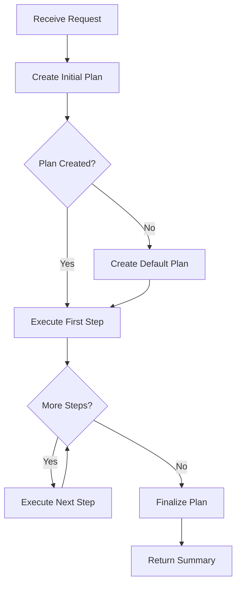
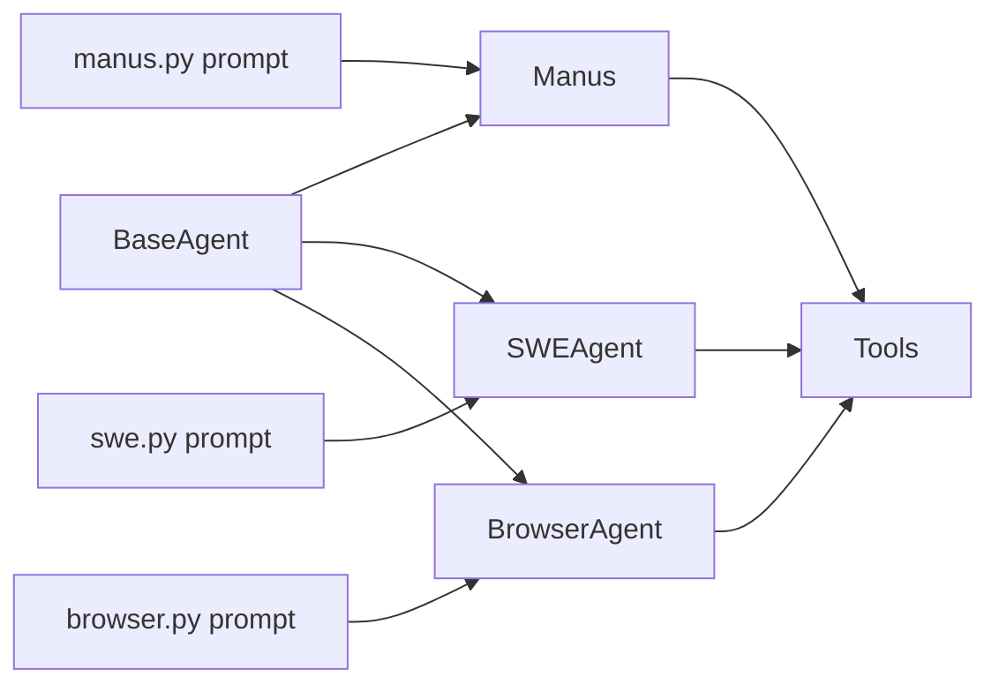

# Custom Prompt Engineering

<cite>
**Referenced Files in This Document**   
- [manus.py](file://app/agent/manus.py)
- [swe.py](file://app/agent/swe.py)
- [planning.py](file://app/agent/planning.py)
- [browser.py](file://app/agent/browser.py)
- [toolcall.py](file://app/agent/toolcall.py)
- [manus_prompt.py](file://app/prompt/manus.py)
- [swe_prompt.py](file://app/prompt/swe.py)
- [planning_prompt.py](file://app/prompt/planning.py)
- [browser_prompt.py](file://app/prompt/browser.py)
- [toolcall_prompt.py](file://app/prompt/toolcall.py)
</cite>

## Table of Contents
1. [Introduction](#introduction)
2. [Project Structure](#project-structure)
3. [Core Components](#core-components)
4. [Architecture Overview](#architecture-overview)
5. [Detailed Component Analysis](#detailed-component-analysis)
6. [Dependency Analysis](#dependency-analysis)
7. [Performance Considerations](#performance-considerations)
8. [Troubleshooting Guide](#troubleshooting-guide)
9. [Conclusion](#conclusion)

## Introduction
This document provides a comprehensive guide to custom prompt engineering within the OpenManus framework. It details how structured prompts define agent behavior, influence LLM interactions, and shape task execution across various agent types such as `manus`, `swe`, and `planning`. The document explains the role of prompt templates in guiding tool selection, reasoning patterns, and output formatting. It also covers best practices for designing effective prompts, extending default behaviors, and validating prompt performance through iterative refinement.

## Project Structure
The OpenManus project organizes its prompt engineering logic within two primary directories: `app/prompt/` for prompt definitions and `app/agent/` for agent implementations. Each agent type has a corresponding prompt module that defines its system and next-step instructions. This separation enables modular customization of agent behavior without altering core logic.

**Diagram sources**
- [app/prompt/manus.py](file://app/prompt/manus.py)
- [app/prompt/swe.py](file://app/prompt/swe.py)
- [app/prompt/planning.py](file://app/prompt/planning.py)
- [app/prompt/browser.py](file://app/prompt/browser.py)
- [app/prompt/toolcall.py](file://app/prompt/toolcall.py)
- [app/agent/manus.py](file://app/agent/manus.py)
- [app/agent/swe.py](file://app/agent/swe.py)
- [app/agent/planning.py](file://app/agent/planning.py)
- [app/agent/browser.py](file://app/agent/browser.py)
- [app/agent/toolcall.py](file://app/agent/toolcall.py)

**Section sources**
- [app/prompt/](file://app/prompt/)
- [app/agent/](file://app/agent/)

## Core Components
The core components of OpenManus's prompt engineering system are the prompt modules located in `app/prompt/`. These modules define the `SYSTEM_PROMPT` and `NEXT_STEP_PROMPT` variables that shape agent behavior. Each agent class in `app/agent/` inherits from `BaseAgent` and references its corresponding prompt module to initialize its `system_prompt` and `next_step_prompt` attributes. This design allows for flexible configuration of agent behavior through prompt customization.

**Section sources**
- [app/prompt/manus.py](file://app/prompt/manus.py#L1-L10)
- [app/agent/manus.py](file://app/agent/manus.py#L20-L25)
- [app/prompt/swe.py](file://app/prompt/swe.py#L1-L22)
- [app/agent/swe.py](file://app/agent/swe.py#L15-L20)

## Architecture Overview
OpenManus employs a modular architecture where agents are configured with specific prompts that dictate their interaction patterns with the LLM. The `BaseAgent` class provides a foundation for all agents, handling state management, memory, and execution loops. Subclasses like `Manus` and `SWEAgent` specialize this behavior by injecting prompts that align with their intended use cases—general task solving and autonomous programming, respectively.

**Diagram sources**
- [app/agent/base.py](file://app/agent/base.py#L15-L195)
- [app/agent/manus.py](file://app/agent/manus.py#L20-L25)
- [app/agent/swe.py](file://app/agent/swe.py#L15-L20)

## Detailed Component Analysis

### Manus Agent Analysis
The `Manus` agent is designed as a general-purpose assistant capable of handling diverse tasks using multiple tools. Its behavior is shaped by the `SYSTEM_PROMPT` and `NEXT_STEP_PROMPT` defined in `app/prompt/manus.py`. The system prompt establishes the agent's identity as an all-capable AI assistant with access to various tools, while the next-step prompt guides proactive tool selection and step-by-step problem solving.

**Diagram sources**
- [app/prompt/manus.py](file://app/prompt/manus.py#L1-L10)
- [app/agent/manus.py](file://app/agent/manus.py#L20-L25)

**Section sources**
- [app/prompt/manus.py](file://app/prompt/manus.py#L1-L10)
- [app/agent/manus.py](file://app/agent/manus.py#L1-L165)

### SWE Agent Analysis
The `SWEAgent` specializes in autonomous software engineering tasks. Its prompt structure enforces strict adherence to command-line interactions and proper code indentation. The system prompt emphasizes single tool calls per response and prohibits interactive session commands, ensuring predictable execution flow.

**Diagram sources**
- [app/prompt/swe.py](file://app/prompt/swe.py#L1-L22)
- [app/agent/swe.py](file://app/agent/swe.py#L15-L20)

**Section sources**
- [app/prompt/swe.py](file://app/prompt/swe.py#L1-L22)
- [app/agent/swe.py](file://app/agent/swe.py#L1-L25)

### Planning Agent Analysis
The planning agent uses structured prompts to create and execute task plans. It generates a plan using the `planning` tool and executes steps sequentially. The prompt guides the agent to assess plan sufficiency, execute immediate steps, or finalize the task when complete.

**Diagram sources**
- [app/prompt/planning.py](file://app/prompt/planning.py#L1-L27)
- [app/flow/planning.py](file://app/flow/planning.py#L76-L108)

**Section sources**
- [app/prompt/planning.py](file://app/prompt/planning.py#L1-L27)
- [app/flow/planning.py](file://app/flow/planning.py#L1-L442)

## Dependency Analysis
The prompt engineering system in OpenManus exhibits a clear dependency hierarchy. Agent classes depend on prompt modules for behavioral configuration, while prompt modules remain independent of agent logic. This separation allows for easy customization and extension of agent behavior without modifying core classes.

**Diagram sources**
- [app/agent/base.py](file://app/agent/base.py#L15-L195)
- [app/prompt/manus.py](file://app/prompt/manus.py)
- [app/prompt/swe.py](file://app/prompt/swe.py)
- [app/prompt/browser.py](file://app/prompt/browser.py)
- [app/agent/manus.py](file://app/agent/manus.py)
- [app/agent/swe.py](file://app/agent/swe.py)
- [app/agent/browser.py](file://app/agent/browser.py)

**Section sources**
- [app/agent/base.py](file://app/agent/base.py#L1-L196)
- [app/prompt/](file://app/prompt/)
- [app/agent/](file://app/agent/)

## Performance Considerations
Prompt design significantly impacts agent performance. Well-structured prompts reduce hallucinations and improve task completion rates. The use of clear, concise instructions with explicit formatting requirements ensures consistent LLM responses. Additionally, avoiding overly complex prompts helps maintain fast inference times and reduces token usage.

## Troubleshooting Guide
Common issues in prompt engineering include ambiguous instructions leading to inconsistent behavior and improper formatting causing tool call failures. To resolve these, ensure prompts are specific about expected actions and output formats. Test prompts iteratively with real-world scenarios to identify edge cases. Use logging to monitor agent decisions and refine prompts based on observed behavior.

**Section sources**
- [app/agent/base.py](file://app/agent/base.py#L155-L195)
- [app/agent/manus.py](file://app/agent/manus.py#L155-L165)

## Conclusion
Custom prompt engineering is central to defining agent behavior in OpenManus. By structuring prompts effectively, developers can guide LLM interactions to achieve reliable task execution. The modular design allows for easy customization and extension, enabling specialized agents for different use cases. Following best practices in prompt design—clarity, context preservation, and iterative validation—ensures robust and predictable agent performance.