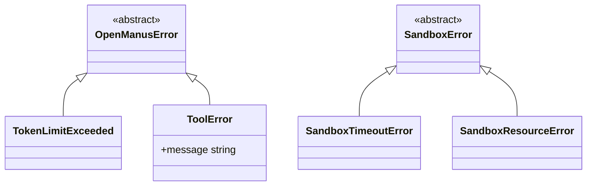

# Error Handling and Recovery

<cite>
**Referenced Files in This Document**   
- [run_flow.py](file://run_flow.py)
- [run_mcp.py](file://run_mcp.py)
- [app/exceptions.py](file://app/exceptions.py)
- [app/sandbox/core/exceptions.py](file://app/sandbox/core/exceptions.py)
- [app/utils/logger.py](file://app/utils/logger.py)
</cite>

## Table of Contents
1. [Introduction](#introduction)
2. [Exception Handling in Execution Scripts](#exception-handling-in-execution-scripts)
3. [Error Logging and Diagnostic Visibility](#error-logging-and-diagnostic-visibility)
4. [Resource Cleanup and Session Termination](#resource-cleanup-and-session-termination)
5. [Exception Hierarchies and Custom Error Types](#exception-hierarchies-and-custom-error-types)
6. [Error Recovery Patterns](#error-recovery-patterns)
7. [Extending Error Handling for Custom Tools](#extending-error-handling-for-custom-tools)
8. [Production-Ready Error Management Strategies](#production-ready-error-management-strategies)

## Introduction
OpenManus implements a robust error handling and recovery system to ensure reliable operation during agent execution, tool invocation, and sandboxed operations. The framework captures various exception types, logs diagnostic information, and ensures proper resource cleanup upon termination. This document details the mechanisms used across `run_flow.py` and `run_mcp.py`, the structured exception hierarchies defined in the application, and recommended practices for extending error resilience in custom integrations.

## Exception Handling in Execution Scripts

The primary entry points `run_flow.py` and `run_mcp.py` implement comprehensive exception handling to manage both expected and unexpected failures during agent execution.

In `run_flow.py`, a nested try-except block structure handles three key exception types:
- `KeyboardInterrupt`: Gracefully captures user-initiated interruptions (e.g., Ctrl+C), logging an informational message and exiting cleanly.
- `asyncio.TimeoutError`: Catches execution timeouts set at the flow level (60-minute limit), providing user feedback and preventing indefinite hangs.
- Generic `Exception`: Acts as a catch-all for unforeseen errors, logging the full traceback for debugging.

Similarly, `run_mcp.py` employs a top-level try-except-finally block within the `run_mcp()` function that handles:
- `KeyboardInterrupt`: Logs interruption events and exits gracefully.
- Generic `Exception`: Captures any unhandled errors during MCP agent initialization or execution, logs them with full stack traces using `exc_info=True`, and terminates with a non-zero exit code.

These patterns ensure that execution does not crash unexpectedly and provides meaningful feedback to users and operators.

**Section sources**
- [run_flow.py](file://run_flow.py#L0-L52)
- [run_mcp.py](file://run_mcp.py#L100-L115)

## Error Logging and Diagnostic Visibility

OpenManus uses structured logging via `structlog` to provide detailed diagnostic visibility across all components. The logger is configured to output contextual information including timestamps, file names, line numbers, and function names.

Different log levels are used strategically:
- `logger.warning`: Indicates non-critical issues such as empty prompts or processing start notifications.
- `logger.error`: Records exceptional conditions, including timeout events and unhandled exceptions, often with full stack traces.
- `logger.info`: Tracks normal operational milestones like successful connections or session completion.

For example, when a flow execution times out, both `logger.error` and `logger.info` are used in sequence to first record the failure and then provide user-facing guidance. This layered approach enables both debugging and user communication.

**Section sources**
- [run_flow.py](file://run_flow.py#L0-L52)
- [run_mcp.py](file://run_mcp.py#L100-L115)
- [app/utils/logger.py](file://app/utils/logger.py#L0-L32)

## Resource Cleanup and Session Termination

The cleanup protocol ensures that all resources are properly released even in the event of errors. This is implemented through the `MCPRunner.cleanup()` method in `run_mcp.py`, which is called in the `finally` block of the main execution loop.

`MCPRunner.cleanup()` performs the following steps:
1. Invokes `self.agent.cleanup()` to disconnect from MCP servers and terminate active sessions.
2. Logs a confirmation message indicating session end.

The agent-level cleanup is further implemented in `MCPAgent.cleanup()`, which disconnects all active MCP client sessions and logs the closure event. This two-tiered cleanup ensures that network connections, subprocesses, and other resources are not left dangling after execution ends—whether due to success, error, or interruption.

**Section sources**
- [run_mcp.py](file://run_mcp.py#L62-L65)
- [app/agent/mcp.py](file://app/agent/mcp.py#L166-L184)

## Exception Hierarchies and Custom Error Types

OpenManus defines a structured exception hierarchy to categorize and handle different types of errors appropriately.

The base exception classes are defined in `app/exceptions.py`:
- `OpenManusError`: Base class for all application-specific exceptions.
- `TokenLimitExceeded`: Subclass of `OpenManusError` raised when LLM token limits are exceeded.
- `ToolError`: General exception for tool execution failures.

Additionally, sandbox-specific exceptions are defined in `app/sandbox/core/exceptions.py`:
- `SandboxError`: Base class for sandbox-related issues.
- `SandboxTimeoutError`: Raised when sandbox operations exceed their time limits.
- `SandboxResourceError`: Indicates resource allocation or access problems within the sandbox.

This hierarchical design allows for precise exception handling—code can catch specific error types (e.g., timeout vs. resource) while still allowing higher-level handlers to manage broader categories.

**Diagram sources**
- [app/exceptions.py](file://app/exceptions.py#L0-L12)
- [app/sandbox/core/exceptions.py](file://app/sandbox/core/exceptions.py#L0-L17)

**Section sources**
- [app/exceptions.py](file://app/exceptions.py#L0-L12)
- [app/sandbox/core/exceptions.py](file://app/sandbox/core/exceptions.py#L0-L17)

## Error Recovery Patterns

OpenManus supports several error recovery patterns to enhance system resilience:

1. **Retry Mechanisms for LLM Calls**: While not explicitly shown in the provided code, the exception hierarchy (e.g., `TokenLimitExceeded`) enables implementing retry logic with backoff or prompt truncation strategies when calling LLMs.

2. **Graceful Agent Session Termination**: The use of `finally` blocks in agent execution (e.g., in `MCPAgent.run()`) ensures that cleanup occurs even if an error occurs during processing, preventing resource leaks.

3. **Interactive Mode Resilience**: In `run_mcp.py`, the interactive mode wraps individual user requests in try-except blocks (implied by agent design), allowing one failed request to be handled without terminating the entire session.

4. **Connection Reinitialization**: Failed MCP server connections are logged but do not halt execution, enabling retry attempts or fallback to alternative servers.

These patterns collectively ensure that transient failures do not result in permanent service disruption.

**Section sources**
- [run_mcp.py](file://run_mcp.py#L47-L49)
- [app/agent/mcp.py](file://app/agent/mcp.py#L166-L184)

## Extending Error Handling for Custom Tools

When developing custom tools or integrations, developers should follow OpenManus conventions for consistent error handling:

1. **Raise Appropriate Exceptions**: Use existing exception types (e.g., `ToolError`) or extend them for domain-specific errors.
2. **Implement Cleanup Methods**: Ensure tools release resources (files, network connections) via context managers or explicit cleanup calls.
3. **Log at Appropriate Levels**: Use `logger.warning` for recoverable issues and `logger.error` for critical failures.
4. **Preserve Stack Traces**: When catching and re-raising exceptions, use `exc_info=True` to maintain diagnostic data.
5. **Handle Timeouts Gracefully**: For long-running operations, implement timeout logic and raise `SandboxTimeoutError` when appropriate.

For example, a custom tool should wrap execution in a try-except block and translate low-level exceptions into meaningful `ToolError` instances for the agent to handle.

**Section sources**
- [app/exceptions.py](file://app/exceptions.py#L0-L12)
- [app/sandbox/core/exceptions.py](file://app/sandbox/core/exceptions.py#L0-L17)
- [app/utils/logger.py](file://app/utils/logger.py#L0-L32)

## Production-Ready Error Management Strategies

To ensure robust operation in production environments, the following strategies are recommended:

1. **Structured Logging with Context**: Leverage `structlog`'s context merging to attach request IDs, session data, or user information to log entries for better traceability.

2. **Centralized Error Monitoring**: Integrate with external monitoring tools by configuring log handlers to forward `logger.error` entries to services like Sentry or Datadog.

3. **Circuit Breakers for External Services**: Implement circuit breaker patterns around MCP server connections to prevent cascading failures during outages.

4. **Health Checks and Liveness Probes**: Expose endpoints that validate agent and sandbox health, enabling orchestration platforms to restart unhealthy instances.

5. **Rate Limiting and Retry Budgets**: Enforce limits on retry attempts for failed LLM calls to prevent infinite loops or excessive resource consumption.

6. **Graceful Degradation**: Design agents to continue operating in reduced capacity when certain tools or servers are unavailable, using fallback strategies or cached responses.

These practices build upon OpenManus's existing error handling foundation to create a resilient, observable, and maintainable system in production settings.

**Section sources**
- [run_flow.py](file://run_flow.py#L0-L52)
- [run_mcp.py](file://run_mcp.py#L0-L115)
- [app/utils/logger.py](file://app/utils/logger.py#L0-L32)