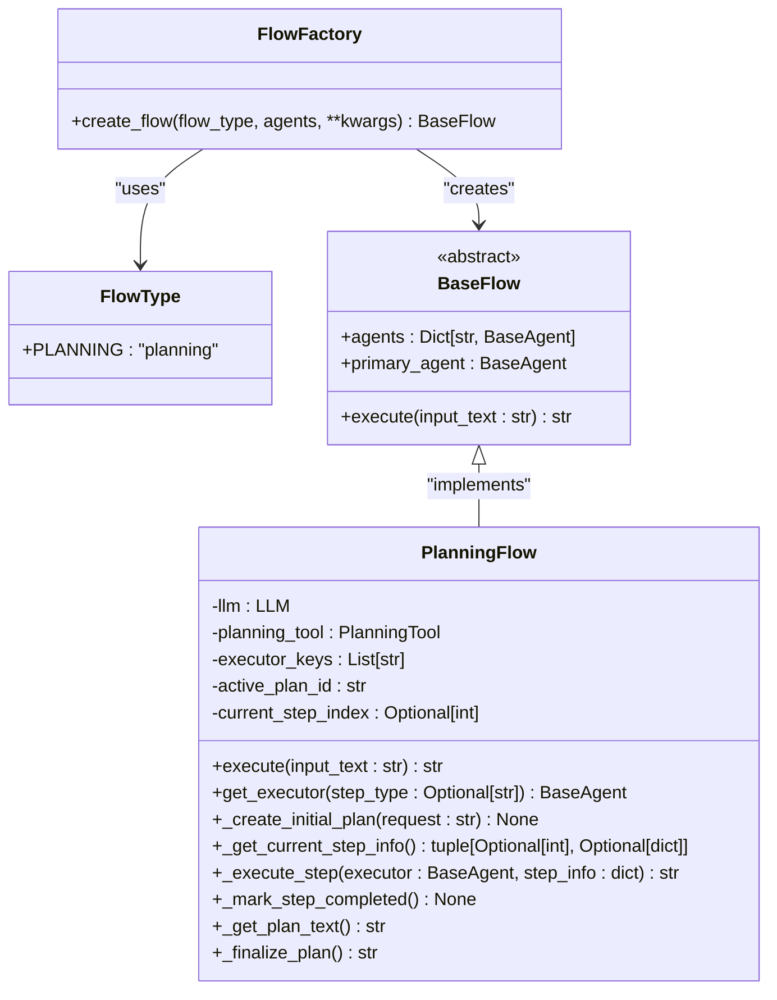
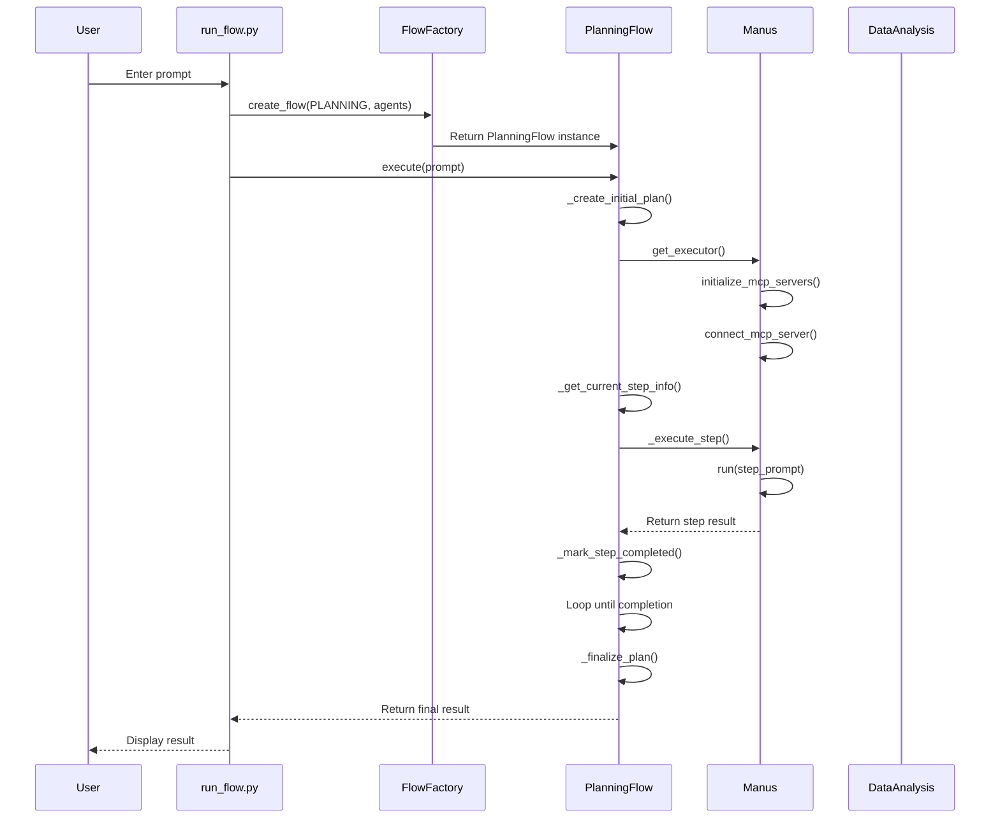
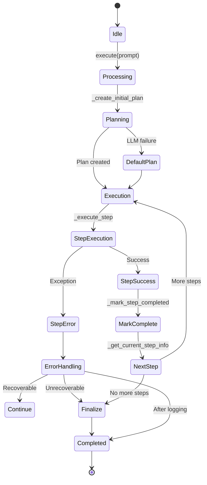

# Multi-Agent Workflows

<cite>
**Referenced Files in This Document**   
- [run_flow.py](file://run_flow.py)
- [app/flow/planning.py](file://app/flow/planning.py)
- [app/flow/flow_factory.py](file://app/flow/flow_factory.py)
- [app/agent/manus.py](file://app/agent/manus.py)
- [app/agent/data_analysis.py](file://app/agent/data_analysis.py)
- [config/config.example.toml](file://config/config.example.toml)
</cite>

## Table of Contents
1. [Introduction](#introduction)
2. [Orchestration with run_flow.py](#orchestration-with-run_flowpy)
3. [FlowFactory and FlowType.PLANNING](#flowfactory-and-flowtypeplanning)
4. [Agent Registration and Lifecycle Management](#agent-registration-and-lifecycle-management)
5. [Task Decomposition and Execution Flow](#task-decomposition-and-execution-flow)
6. [Data Flow Between Agents and Controller](#data-flow-between-agents-and-controller)
7. [Configuration and Agent Availability](#configuration-and-agent-availability)
8. [Error Handling and Timeout Recovery](#error-handling-and-timeout-recovery)
9. [Practical Example: Complex Task Distribution](#practical-example-complex-task-distribution)
10. [Best Practices for Scalable Multi-Agent Systems](#best-practices-for-scalable-multi-agent-systems)

## Introduction
OpenManus implements a sophisticated multi-agent workflow system that enables coordinated execution of complex tasks through specialized agents. The architecture centers around a flow-based orchestration model where a central controller delegates work to domain-specific agents such as Manus (general-purpose) and DataAnalysis (specialized for data tasks). This document details the mechanisms behind agent coordination, task decomposition, execution lifecycle management, and configuration options that enable robust multi-agent workflows.

## Orchestration with run_flow.py
The `run_flow.py` script serves as the primary entry point for executing multi-agent workflows in OpenManus. It initializes the agent ecosystem by creating instances of available agents and configuring them based on runtime settings. The script establishes a primary Manus agent by default and conditionally includes the DataAnalysis agent when enabled in configuration. Using asyncio, it processes user input prompts and routes them through a flow controller with a 3600-second timeout limit to prevent indefinite execution. The orchestration follows an event-driven pattern where the main loop awaits completion of the flow execution or handles interruption signals gracefully.

**Section sources**
- [run_flow.py](file://run_flow.py#L1-L52)

## FlowFactory and FlowType.PLANNING
The `FlowFactory` class provides a creational design pattern implementation for instantiating different types of workflow flows. Currently, it supports the `FlowType.PLANNING` strategy, which maps to the `PlanningFlow` class responsible for task decomposition and agent coordination. The factory pattern allows for future extensibility with additional flow types while maintaining a consistent interface for flow creation. When `create_flow()` is called with `FlowType.PLANNING`, it returns a configured `PlanningFlow` instance that manages the entire lifecycle of plan creation, step execution, and finalization.



**Diagram sources**
- [app/flow/flow_factory.py](file://app/flow/flow_factory.py#L12-L29)
- [app/flow/planning.py](file://app/flow/planning.py#L44-L441)

**Section sources**
- [app/flow/flow_factory.py](file://app/flow/flow_factory.py#L1-L30)
- [app/flow/planning.py](file://app/flow/planning.py#L1-L442)

## Agent Registration and Lifecycle Management
Agents in OpenManus are registered with the flow controller through a dictionary-based agent registry that maps agent names to their instances. The `Manus` agent serves as the default primary agent with broad capabilities including browser interaction, Python execution, and human-in-the-loop operations. The `DataAnalysis` agent specializes in data processing tasks with tools for statistical analysis and visualization. Both agents follow an asynchronous initialization pattern where resources like MCP (Model Context Protocol) servers are connected during startup. The lifecycle includes proper cleanup methods to release browser contexts and disconnect from external services when the agent is no longer needed.



**Diagram sources**
- [run_flow.py](file://run_flow.py#L1-L52)
- [app/flow/planning.py](file://app/flow/planning.py#L44-L441)
- [app/agent/manus.py](file://app/agent/manus.py#L17-L164)
- [app/agent/data_analysis.py](file://app/agent/data_analysis.py#L11-L36)

**Section sources**
- [app/agent/manus.py](file://app/agent/manus.py#L1-L165)
- [app/agent/data_analysis.py](file://app/agent/data_analysis.py#L1-L37)

## Task Decomposition and Execution Flow
The `PlanningFlow` implements a structured approach to task decomposition through its `_create_initial_plan()` method, which leverages the LLM to generate a step-by-step plan from the user prompt. The planning process considers available agents and their capabilities, incorporating agent-specific instructions when multiple executors are present. Each plan consists of discrete steps with associated metadata including status tracking (not started, in progress, completed, blocked). The execution engine processes steps sequentially, dynamically assigning them to appropriate agents based on step type or using the primary agent as fallback. After each step completion, the plan status is updated and shared with subsequent agents to maintain context awareness.

```mermaid
flowchart TD
A[User Prompt] --> B{_create_initial_plan}
B --> C[LLM with PlanningTool]
C --> D{Plan Created?}
D --> |Yes| E[Store Plan in PlanningTool]
D --> |No| F[Create Default Plan]
F --> E
E --> G{_get_current_step_info}
G --> H{Active Step?}
H --> |Yes| I[Get Executor Agent]
I --> J[_execute_step]
J --> K[Prepare Context with Plan Status]
K --> L[Agent.run(step_prompt)]
L --> M{Success?}
M --> |Yes| N[_mark_step_completed]
M --> |No| O[Return Error]
N --> G
H --> |No| P[_finalize_plan]
P --> Q[Generate Summary]
Q --> R[Return Final Result]
```

**Diagram sources**
- [app/flow/planning.py](file://app/flow/planning.py#L44-L441)

**Section sources**
- [app/flow/planning.py](file://app/flow/planning.py#L1-L442)

## Data Flow Between Agents and Controller
Data flows bidirectionally between agents and the central flow controller through a well-defined messaging protocol. The controller maintains the global plan state in the `PlanningTool` storage, which persists across agent invocations. Before executing each step, the controller retrieves the current plan status and injects it into the agent's context via the step prompt. Agents operate with limited visibility, focusing only on their assigned step while the controller maintains overall progress. Tool call results are returned to the controller, which updates the plan status and determines the next action. This separation of concerns ensures that agents remain specialized while the controller handles coordination and state management.

**Section sources**
- [app/flow/planning.py](file://app/flow/planning.py#L1-L442)

## Configuration and Agent Availability
Agent availability is controlled through the `config.run_flow_config.use_data_analysis_agent` setting in the configuration system. By default, only the Manus agent is activated, but setting `use_data_analysis_agent = true` in the configuration file enables the DataAnalysis agent for specialized tasks. The configuration system uses TOML format with example files provided for different deployment scenarios. This modular approach allows users to customize agent availability based on their specific use cases and resource constraints without modifying code. The configuration also supports MCP server definitions that extend agent capabilities through external tool providers.

**Section sources**
- [run_flow.py](file://run_flow.py#L1-L52)
- [config/config.example.toml](file://config/config.example.toml#L1-L105)

## Error Handling and Timeout Recovery
The multi-agent workflow incorporates comprehensive error handling at multiple levels. The top-level `run_flow.py` script implements a 3600-second timeout using `asyncio.wait_for()`, ensuring that runaway processes are terminated gracefully. Within the `PlanningFlow`, exceptions during plan creation or step execution are caught and converted to user-friendly error messages. The system distinguishes between transient errors (handled through retry mechanisms in underlying tools) and fatal errors (propagated to the user). The `Manus` agent includes cleanup logic in its `cleanup()` method to release resources even when execution is interrupted. The flow controller also provides fallback mechanisms, such as creating default plans when LLM-based planning fails.



**Diagram sources**
- [run_flow.py](file://run_flow.py#L1-L52)
- [app/flow/planning.py](file://app/flow/planning.py#L44-L441)

**Section sources**
- [run_flow.py](file://run_flow.py#L1-L52)
- [app/flow/planning.py](file://app/flow/planning.py#L1-L442)

## Practical Example: Complex Task Distribution
Consider a complex task like "Analyze sales data from Q1 2025, create visualizations, and prepare a presentation with recommendations." The workflow would proceed as follows: The `PlanningFlow` creates an initial plan with steps for data loading, analysis, visualization, and report generation. The first step might be assigned to the DataAnalysis agent due to its specialized tools for data processing. After completing the analysis, the plan status shows progress, and the next visualization step is executed by the same agent. If a step requires web research about market trends, the controller assigns it to the Manus agent with browser capabilities. Throughout this process, the central controller maintains the overall timeline while agents focus on their specific contributions, demonstrating effective task distribution across specialized capabilities.

**Section sources**
- [app/flow/planning.py](file://app/flow/planning.py#L1-L442)
- [app/agent/manus.py](file://app/agent/manus.py#L1-L165)
- [app/agent/data_analysis.py](file://app/agent/data_analysis.py#L1-L37)

## Best Practices for Scalable Multi-Agent Systems
To design scalable multi-agent systems in OpenManus, consider the following best practices: First, clearly define agent responsibilities to minimize overlap and reduce resource contention. Second, use the configuration system to enable only necessary agents for a given task to conserve computational resources. Third, implement proper timeout values that balance thoroughness with responsiveness. Fourth, design prompts and system messages that guide agents to focus on their specific steps without attempting to solve the entire problem. Fifth, monitor plan complexity to avoid creating too many granular steps that increase coordination overhead. Finally, leverage the MCP integration to extend agent capabilities without increasing the core agent footprint, allowing for dynamic capability expansion based on task requirements.