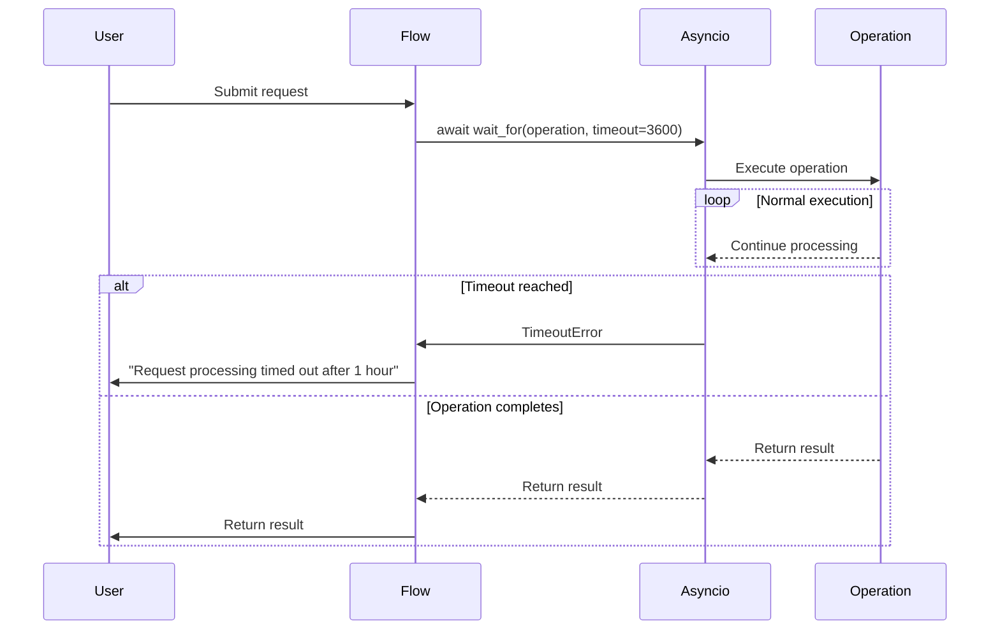

# Performance Optimization

<cite>
**Referenced Files in This Document**   
- [run_flow.py](file://run_flow.py)
- [config.py](file://app/config.py)
- [toolcall.py](file://app/agent/toolcall.py)
- [manager.py](file://app/sandbox/core/manager.py)
- [llm.py](file://app/llm.py)
</cite>

## Table of Contents
1. [Asynchronous Execution](#asynchronous-execution)
2. [Timeout Management](#timeout-management)
3. [LLM Call Efficiency](#llm-call-efficiency)
4. [Sandbox Initialization and Caching](#sandbox-initialization-and-caching)
5. [Configuration-Driven Performance Tuning](#configuration-driven-performance-tuning)
6. [Profiling and Monitoring](#profiling-and-monitoring)
7. [Optimization Examples](#optimization-examples)
8. [Bottleneck Avoidance](#bottleneck-avoidance)

## Asynchronous Execution

OpenManus leverages asyncio for asynchronous execution across agent workflows and tool calls, enabling non-blocking operations and improved throughput. The framework uses async/await patterns throughout its architecture to handle concurrent operations efficiently. Agent workflows are designed as asynchronous coroutines that can yield control during I/O-bound operations, allowing other tasks to proceed. Tool calls are executed asynchronously through the ToolCallAgent's act() method, which processes multiple tool calls in sequence while maintaining non-blocking behavior. The LLM interactions are implemented with async clients from the OpenAI library, ensuring that API calls don't block the event loop. This asynchronous design allows OpenManus to handle multiple agent interactions, tool executions, and external API calls concurrently, significantly improving overall system responsiveness and resource utilization.

**Section sources**
- [run_flow.py](file://run_flow.py#L1-L52)
- [toolcall.py](file://app/agent/toolcall.py#L38-L163)

## Timeout Management

The system implements comprehensive timeout management to prevent hanging operations, with a 3600-second (1 hour) timeout configured in run_flow.py for the entire execution flow. This timeout is enforced using asyncio.wait_for() when executing the flow, ensuring that requests don't run indefinitely. The timeout mechanism is critical for maintaining system stability and resource availability, particularly in production environments where long-running operations could consume excessive resources. When the timeout threshold is reached, the system gracefully handles the asyncio.TimeoutError exception, logging an appropriate error message and providing user feedback about the timeout. This approach prevents resource leaks and ensures predictable system behavior even when processing complex or problematic requests. The one-hour timeout represents a balance between allowing sufficient time for complex operations while preventing indefinite execution that could impact system performance.



**Diagram sources**
- [run_flow.py](file://run_flow.py#L1-L52)

**Section sources**
- [run_flow.py](file://run_flow.py#L1-L52)

## LLM Call Efficiency

OpenManus implements several strategies to optimize LLM call efficiency. The system uses prompt optimization techniques, including structured prompt templates defined in the prompt module, to ensure clear and effective communication with the LLM. Response parsing is handled efficiently through the LLM class's ask_tool method, which processes tool calls and responses in a standardized format. The framework includes token counting and limit checking via the TokenCounter class, which calculates token usage for messages, tool calls, and images to prevent exceeding model limits. For multimodal models, the system optimizes image processing by calculating appropriate token counts based on image dimensions and detail levels. The LLM class also implements retry logic with exponential backoff for handling transient API errors, improving reliability without unnecessary repeated calls. Streaming responses are supported to provide immediate feedback to users while the full response is being generated.

**Section sources**
- [llm.py](file://app/llm.py#L173-L765)
- [toolcall.py](file://app/agent/toolcall.py#L38-L163)

## Sandbox Initialization and Caching

The sandbox initialization process is optimized through the SandboxManager class, which handles the lifecycle of Docker sandbox instances. The manager implements connection pooling by maintaining a collection of reusable sandbox instances, reducing the overhead of creating new containers for each operation. The system uses automatic cleanup mechanisms with configurable idle timeouts (default 3600 seconds) to remove unused sandboxes and free resources. The manager maintains a cache of active sandboxes and their usage patterns, allowing for efficient resource allocation. When a new sandbox is needed, the manager checks for available images and pulls them if necessary, caching the images to avoid repeated downloads. The system also implements volume bindings and resource limits (memory, CPU) to ensure consistent performance and prevent resource exhaustion. This caching and pooling approach significantly reduces the initialization overhead for sandboxed operations.

```mermaid
classDiagram
class SandboxManager {
+int max_sandboxes
+int idle_timeout
+int cleanup_interval
-Dict[str, DockerSandbox] _sandboxes
-Dict[str, float] _last_used
-Dict[str, asyncio.Lock] _locks
+create_sandbox(config) str
+get_sandbox(sandbox_id) DockerSandbox
+delete_sandbox(sandbox_id) None
+cleanup() None
+start_cleanup_task() None
}
class DockerSandbox {
+SandboxSettings config
+create() None
+cleanup() None
}
SandboxManager --> DockerSandbox : "manages"
SandboxManager --> "asyncio.Lock" : "uses"
SandboxManager --> "docker.client" : "uses"
```

**Diagram sources**
- [manager.py](file://app/sandbox/core/manager.py#L13-L312)

**Section sources**
- [manager.py](file://app/sandbox/core/manager.py#L13-L312)

## Configuration-Driven Performance Tuning

Performance tuning in OpenManus is primarily driven by configuration settings in config.py, which provides extensive options for optimizing system behavior. The AppConfig class exposes various performance-related parameters that can be adjusted based on specific requirements and constraints. Key configurable aspects include LLM settings (max_tokens, temperature), sandbox resource limits (memory_limit, cpu_limit), search engine configurations (max_retries, retry_delay), and browser settings (headless mode, extra arguments). The singleton Config class ensures consistent access to these settings throughout the application, enabling centralized performance tuning. Configuration options allow users to balance performance, cost, and reliability based on their specific use cases. For example, the max_input_tokens parameter in LLMSettings enables control over token usage, while the timeout setting in SandboxSettings governs command execution duration. These configuration-driven options provide flexibility in optimizing the system for different deployment scenarios and performance requirements.

**Section sources**
- [config.py](file://app/config.py#L0-L372)

## Profiling and Monitoring

The system includes built-in profiling capabilities through elapsed_time measurement in run_flow.py, which tracks the duration of request processing from start to completion. This timing information is logged at the INFO level, providing visibility into performance characteristics and helping identify potential bottlenecks. The LLM class implements comprehensive token usage tracking, logging both input and completion token counts for each API call. This information helps monitor API usage patterns and optimize prompt engineering. The SandboxManager provides statistics through its get_stats() method, exposing metrics such as total sandboxes, active operations, and resource limits. Error logging is implemented throughout the system using structured logging, capturing exceptions and performance-related issues for analysis. These profiling and monitoring capabilities enable continuous performance evaluation and optimization, allowing developers and operators to understand system behavior and make informed tuning decisions.

**Section sources**
- [run_flow.py](file://run_flow.py#L1-L52)
- [llm.py](file://app/llm.py#L173-L765)
- [manager.py](file://app/sandbox/core/manager.py#L299-L312)

## Optimization Examples

OpenManus demonstrates several optimization patterns that enhance performance. The framework implements parallel tool execution through its asynchronous design, allowing multiple operations to proceed concurrently when appropriate. Connection pooling is evident in the SandboxManager, which maintains a pool of reusable sandbox instances to reduce initialization overhead. The system employs efficient memory handling through careful management of message histories and tool call results, limiting the size of observations with the max_observe parameter in agent classes. The LLM class implements token counting and limit checking to prevent excessive API usage and associated costs. The retry mechanism with exponential backoff in LLM methods improves reliability while avoiding overwhelming external APIs with rapid repeated requests. The cleanup() methods in agent classes ensure proper resource deallocation, preventing memory leaks. These optimization examples collectively contribute to a high-performance system capable of handling complex workflows efficiently.

**Section sources**
- [toolcall.py](file://app/agent/toolcall.py#L228-L242)
- [llm.py](file://app/llm.py#L173-L765)
- [manager.py](file://app/sandbox/core/manager.py#L205-L241)

## Bottleneck Avoidance

To avoid bottlenecks in high-throughput scenarios, OpenManus implements several preventive measures. The system limits concurrent operations through the SandboxManager's max_sandboxes parameter, preventing resource exhaustion from excessive parallel sandbox creation. The idle_timeout mechanism automatically cleans up unused sandboxes, freeing resources for new operations. The LLM's token limit checking prevents individual requests from consuming disproportionate resources. The framework handles errors gracefully, with specific exception handling for TokenLimitExceeded and timeout conditions, ensuring that failed operations don't block system resources. The use of asynchronous programming throughout the codebase prevents blocking operations from affecting overall system responsiveness. The cleanup() methods in agent classes ensure proper resource deallocation, even when errors occur. These bottleneck avoidance strategies enable OpenManus to maintain stable performance under varying loads and prevent single operations from negatively impacting overall system availability.

**Section sources**
- [run_flow.py](file://run_flow.py#L1-L52)
- [manager.py](file://app/sandbox/core/manager.py#L186-L203)
- [llm.py](file://app/llm.py#L248-L253)